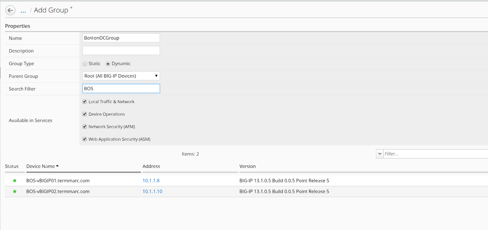

Lab 3.1: Create a device group on BIG-IQ
----------------------------------------

.. note:: Estimated time to complete: **5 minutes**

.. include:: /accesslab.rst

Tasks
^^^^^
In this lab, we are going to create a group of all of the devices in our Boston data center and 
schedule a nightly backup that archives a copy off to our archive for DR purposes.

First, we need to create the group for our backup schedule to reference. We have two options in BIG-IQ: 
   - **static groups**, where devices are added and removed manually
   - **dynamic groups**, where devices are selected from a source group based on filter criteria
   
In this lab, the devices have BOS in the name to indicate that they are in the Boston data center. 
This makes the dynamic group the logical choice.

1. Login as **david** in BIG-IQ and navigate to **Devices > Device Groups**. 

2. Click Create to create a new device group.

+-----------------+---------------------------------+
| Name            | ``BostonDCGroup``               |
+-----------------+---------------------------------+
| Group Type      | ``Dynamic``                     |
+-----------------+---------------------------------+
| Parent Group    | ``Root (All BIG-IP Devices)``   |
+-----------------+---------------------------------+
| Search Filter   | ``BOS``                         |
+-----------------+---------------------------------+

Click the **Save & Close**.