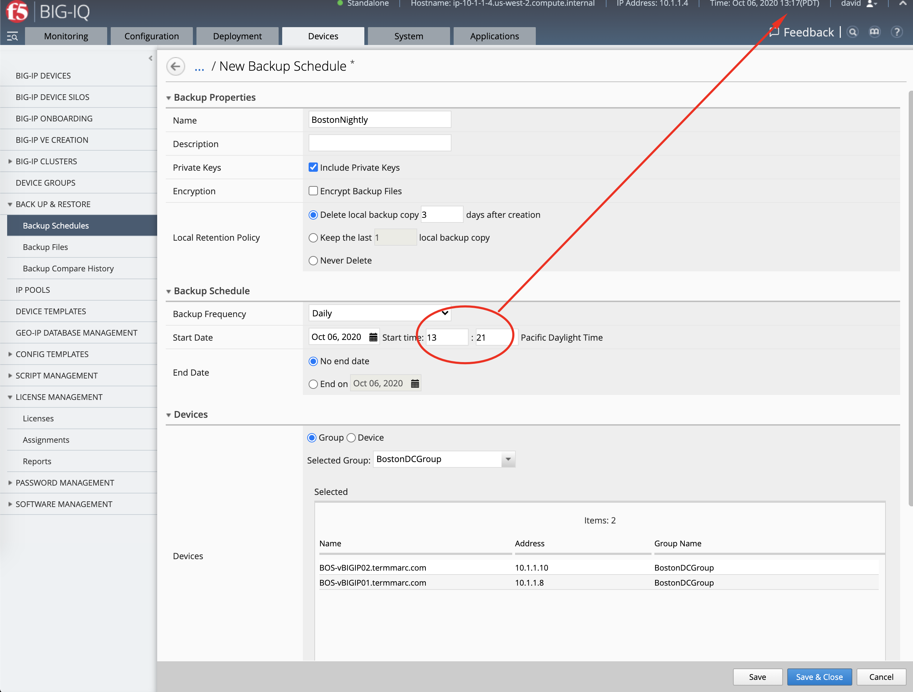
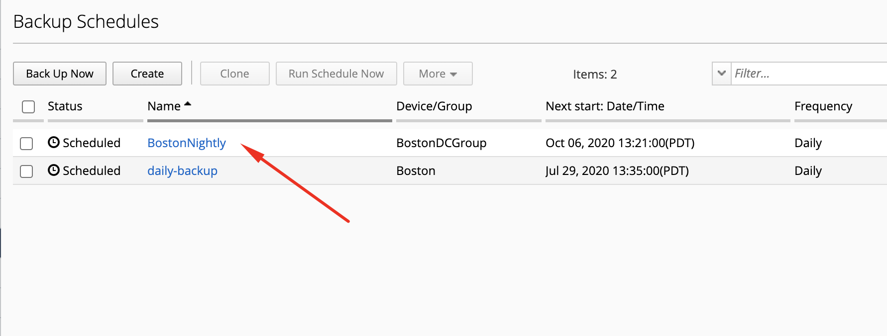
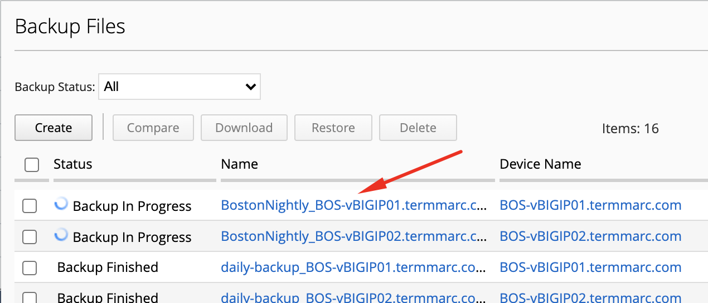

Lab 3.2: Create a schedule backup on BIG-IQ
-------------------------------------------

.. note:: Estimated time to complete: **5 minutes**

.. include:: /accesslab.rst

Tasks
^^^^^
Now, we can create our backup schedule that references this dynamic group.

1. Click on the **Back Up & Restore > Backup Schedules** on the left-hand menu

2. Click the Create button and fill out the Backup Schedule details. Make sure you pick a start time in the next 5 minutes.

+--------------------------+------------------------------------------------------+
| Name                     | ``BostonNightly``                                    |
+--------------------------+------------------------------------------------------+
| Local Retention Policy   | ``Delete local backup copy 3 days after creation``   |
+--------------------------+------------------------------------------------------+
| Backup Frequency         | ``Daily``                                            |
+--------------------------+------------------------------------------------------+
| Start Time               | *Today's date and time in the next 5min*             |
+--------------------------+------------------------------------------------------+

Under *Devices*, select the **Groups radio button** and select from the drop-down **BostonDCGroup**

Note that it is possible to transfer the backups to an external location (see *Backup Archive section*).

Click **Save & Close** to save the scheduled backup job.

3. Navigate under **Back Up & Restore > Backup Files**, wait few minutes the backup job starts.

