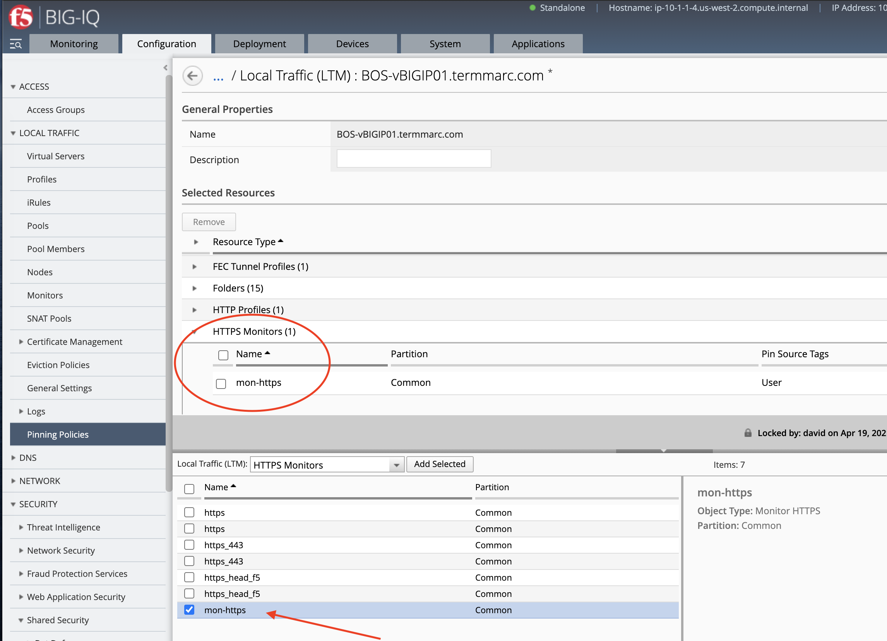
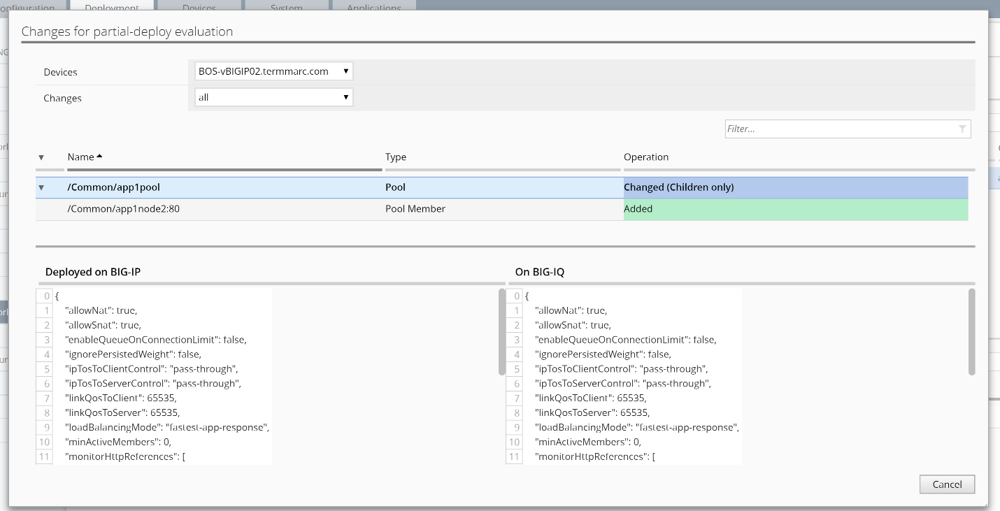
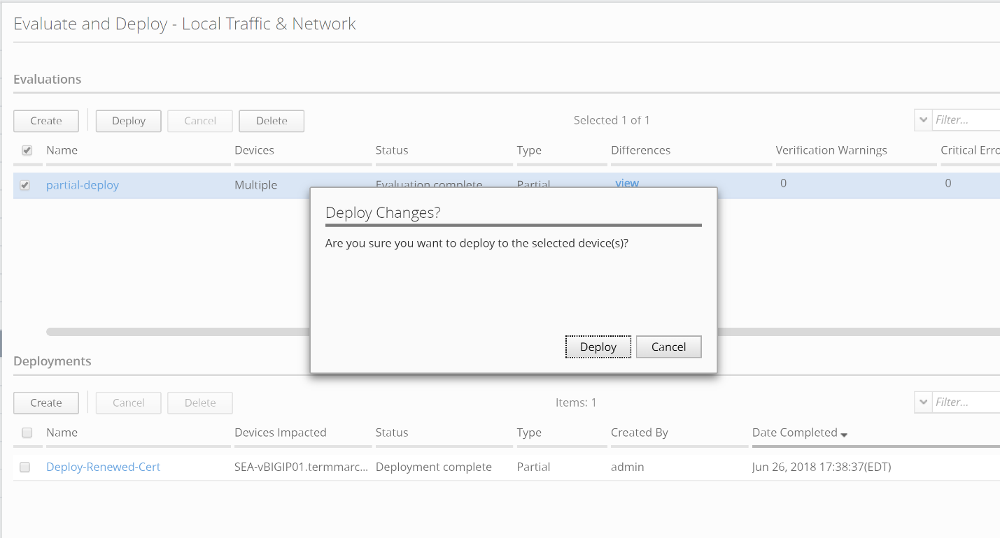

Lab 4.1: Create multiple changes & deploy single change
-------------------------------------------------------

.. note:: Estimated time to complete: **10 minutes**

.. include:: /accesslab.rst

Tasks
^^^^^
The user has the ability to select a specific change out of many made for deployment. We will try to add an additional node to the existing pool in this task.

**Take a snapshot**

Before we start to deploy our first change, we will need to take a snapshot on the current configurations of the BIG-IQ, so we have a reference point to compare before and after the change.

- From the Deployment tab on the top, click on the left SNAPSHOTS >> Local Traffic & Network on the left, 

- Click on Create under Snapshot – Local Traffic & Network title.

- Enter the name: **Snapshot-Before-Deployment**, then click on Create button on the lower right.

**Create multiple changes**

-  1\ :sup:`st` change

We will first add a pool member to app1pool

From the tab Configuration, click on LOCAL TRAFFIC > Pools, enter “app1pool” in the upper right Filter and search, select a pool by clicking on name “app1pool” on either BOS-vBIGIP01 or 02.

|image1|

Click on New Member, select from Existing Node “app1node2” on port 80 HTTP

|image2|

Leave everything else default, and click on “Save and Close” on lower right

We have just made a change to the BIG-IQ configuration for app1pool on the BOS HA pair.

-  2\ :sup:`nd` change 

Now we will make a few changes on another pool "app2pool".

First, we will create a New Monitor **mon-https**.

Click into Configuration > LOCAL TRAFFIC > Monitors and then click on “Create” button.

|image3|

New Monitor
   -  Name: **mon-https**

   -  Type: **HTTPS**

   -  Monitor template: **https**

   -  username: **admin**

   -  password: **Purple1234!**

Click “Save and Close”

|image4a|

2. Now, let's pin the new monitor to a device. Navigate to Pinning Policies under Local Traffic.

Click on **BOS-vBIGIP01.termmarc.com** device.

Look for the Monitor and add it to the device.

|image4b|

3. Next, we will add the new monitor to the app2pool.

Add newly created Health Monitor **mon-https** to Pool “app2pool”

   -  Under Configuration > LOCAL TRAFFIC > Pools, search app2pool in the upper right filter

   -  Select a pool by clicking on name “app2pool” on either BOS-vBIGIP01 or 02

   -  On Health Monitors, select /Common/mon-https

|image5|

Click on New Member in Resources section and add a new pool member app2node2:80 to app2pool. 
 
|image6|

Click Save and Close to add the pool member, and then click on Save and Close again to complete the change to the app2pool.

Now that we made multiple changes, a new member to pool app1pool, a new mon-https monitor, the association of monitor to the app2pool, and a new member to app2pool. 

4. Next, we will create evaluation and deploy one of these changes we just made above.

Click on top Deployment tab, select under EVALUATE & DEPLOY: Local Traffic & Network

Click Create under Evaluations and enter the following:

      Name: **partial-deploy**

      From Evaluation > Source Scope, Select “\ **Partial Changes**\ ”

      From Source Objects > Available, select “Pools”, from pool list, select **only** “app1pool” for Both BOS-vBIGIP01 & 02, and add them to Selected on the right

      Under Target Devices, click “Find Relevant Devices”, select both and add to right

      Click “Create” to complete

|image7|

After the evaluation is done, you can click on the “view” link under the Difference column for “partial-deployment” evaluation.

|image8|

|image9|

.. note::
	 Only changes to “app1pool” will be deployed. The monitor change on app2pool will not be deployed.

Now let's deploy the change.

   -  Cancel to dismiss the popup window and click on Deploy under Evaluation

   -  Confirm by click on Deploy button again.

|image10|

After deployment is complete, click into the “partial-deploy” to view the details of the deployment.

You can see that the change went in is only the addition of the pool member which is the first change. The change on mon-https monitor did not get pushed to BIG-IP, because it was not selected as the Partial Deploy.

.. note::
	 The deployment could fail if the targeted BIG-IP devices are not in full sync on configurations, due to timeout on waiting for sync to complete on target devices. Ensure the devices are in full sync before deploying changes.

.. |image1| image:: media/image1.png
   :width: 6.49583in
   :height: 4.47500in
.. |image2| image:: media/image2.png
   :width: 6.49583in
   :height: 4.87500in
.. |image3| image:: media/image3.png
   :width: 6.22917in
   :height: 2.67708in
.. |image4a| image:: media/image4a.png
   :width: 6.48958in
   :height: 4.21875in

.. |image5| image:: media/image5.png
   :width: 6.50000in
   :height: 4.22917in
.. |image6| image:: media/image6.png
   :width: 6.50000in
   :height: 4.92361in
.. |image7| image:: media/image7.png
   :width: 6.49583in
   :height: 2.84583in

.. |image10| image:: media/image10.png
   :width: 6.50000in
   :height: 3.65625in
