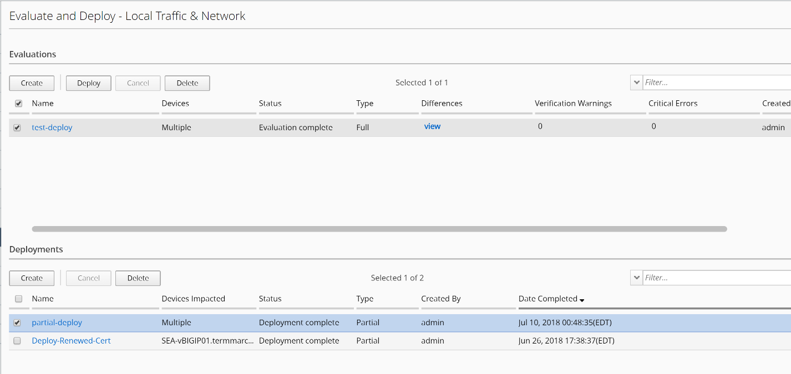
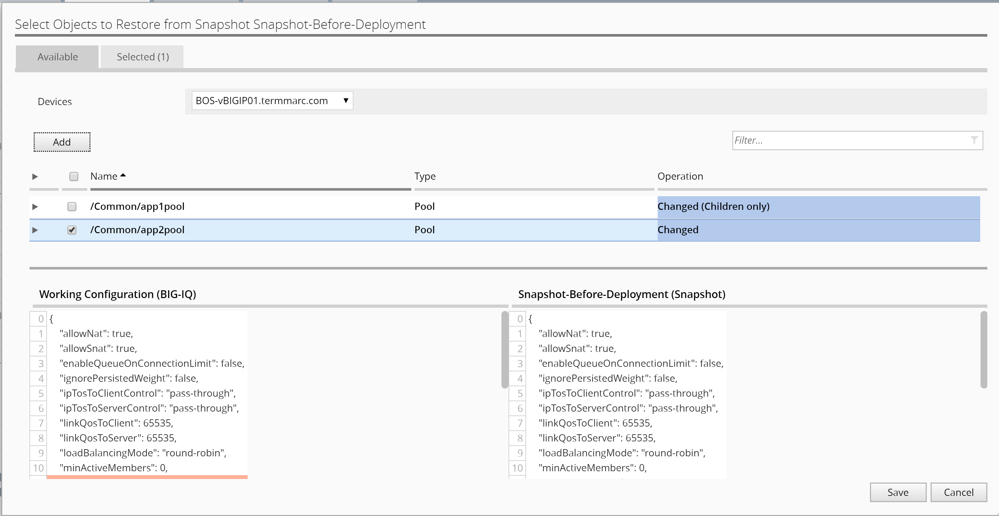

Lab 4.2: Deploy multiple changes and restore single change
----------------------------------------------------------

.. note:: Estimated time to complete: **10 minutes**

.. include:: /accesslab.rst

Tasks
^^^^^
In this deployment, we will be using the 1\ :sup:`st` change made to app1pool, as well as 2\ :sup:`nd` change made to app2pool in the previous task 5.1, to demonstrate the ability to partially roll back one of the two changes for this deployment.

1. First, we will need to deploy the 2\ :sup:`nd` change that consists of a few changes to the app2pool.

Recall that from the las task, the 2\ :sup:`nd` change on app2pool did not get pushed to BIG-IP.

Starting from the Deployment tab on the top, and under EVALUATE & DEPLOY, click on Local Traffic & Network on the left.

Click on Create under Deployments.

   Name: **all-deploy**

-  Ensure the default “Source Scope: All Changes” is selected

-  Select the BOS BIG-IP HA Pair from the Devices Targeted box and move them to the right Selected box.

-  Click on Create button on the bottom right to create the Evaluation of the deployment

-  Verify all changes are part of the deployment.

|image11|

-  Cancel the differences window to return to Evaluation list window, select **all-deploy** and click on Deploy button above.

|image12|

-  Click on Deploy button again to confirm and observe completion

What we have done so far, is to deploy the 2\ :sup:`nd` change made to the HA pair in task 5.1, in which only the 1st change to add pool member was deployed to BIG-IP.

2. Next, we will do a partial restore of the configurations on the HA pair, by rolling back one of the two changes we just made. 

We will need to use the previous snapshot made prior to the two changes done earlier, in order to restore one of the changes on BIG-IQ running configuration first, then deploy the change to restore the configurations on managed BIG-IP to complete the restore process.

   -  Locate RESTORE section on the left and click on Local Traffic & Network.

   -  Under Restores section, click on Create button to start a task

|image13|

    Name: **partial-restore**

    Snapshot: **Snapshot-Before-Deployment**

    Create Snapshot: check the box “\ **Create a snapshot prior to restoring**\ ”.

    Restore Scope: **Partial Restore**

    Method: **Create evaluation**

**Note** that duplicate names are allowed for a snapshot; therefore, the Deployment Date is provided as a reference.

User can narrow the scope of the restore from Full to **Partial**. For this lab let’s select Partial Restore from the Restore Scope section.

User can “Create Evaluation” or if urgent “Restore Immediately”.

|image14|

-  Select “Add” for Source Objects.

-  Select “/Common/app2pool” and click on “Add” to add the object to Selected tab.

-  Verify difference between BIG-IQ and Snapshot.

|image16|

-  Click on Save to close the Select Object window, and then click on Create to start the evaluation, then click on Evaluate button on the popup window to confirm.

|image15|

Wait until evaluation is complete, then click on View on the partial-restore Evaluation to verify the change once again.

Close the View window and select partial-restore evaluation, then click on Restore button to deploy the partial restore.

|image17|

|image18|

Click on Restore to complete the partial restore of the change made to app1pool.

Close the complete window and click on View to see the restored configuration. You can see that the added member has been removed from app1pool.

Select Configuration Tab on the top and click on Local Traffic >> Pools on the left. Locate pool app2pool and verify that the previously deployed mon-https monitor has been removed from the pool by the partial restore/rollback action.

.. note:: This restore (remove the monitor association to the pool) rolled back the change made to BIG-IQ configuration comparing to the snapshot made before the first change was made in this lab. However, the restore of BIG-IQ running configuration does not get merged onto managed BIG-IP. You will need to deploy another change in order make it happen on managed BIG-IP.

Now that we have partially restored BIG-IQ’s running configuration based on a previously taken snapshot, we will merge the change to the managed BIG-IP devices by deploying the changes.

Starting from the Deployment tab on the top, and under EVALUATE & DEPLOY, click on Local Traffic & Network on the left.

Click on Create under Deployments. 

- Name: **deploy-partial-restore**
- From Evaluation > Source Scope, Select “Partial Changes”
- From Source Objects > Available, select “Pools”, from pool list, select only “app2pool” for Both BOS-vBIGIP01 & 02, and add them to Selected on the right
- Under Target Devices, click “Find Relevant Devices”, select both and add to right
- Click “Create” to complete

Click on View link of the evaluation to see the differences.

|image18-1|

Cancel the differences window to return to Evaluation list window, select **deploy-partial-restore** and click on Deploy button above.

Click on Deploy button again to confirm and observe completion

|image18-2|

At last, log onto BOS-vBIGIP01 to see the changes made to app2pool to verify the successful partial restore action. You should see that the added node and the mon-https monitor association to the pool have been removed. 

.. |image11| image:: media/image11.png
   :width: 6.50000in
   :height: 3.28750in

.. |image13| image:: media/image13.png
   :width: 4.70833in
   :height: 1.05460in
.. |image14| image:: media/image14.png
   :width: 6.50000in
   :height: 4.94792in
.. |image15| image:: media/image15.png
   :width: 4.22917in
   :height: 2.20722in

.. |image17| image:: media/image17.png
   :width: 6.50000in
   :height: 1.57292in
.. |image18| image:: media/image18.png
   :width: 4.18547in
   :height: 2.20833in
.. |image18-1| image:: media/image18-1.png
.. |image18-2| image:: media/image18-2.png
