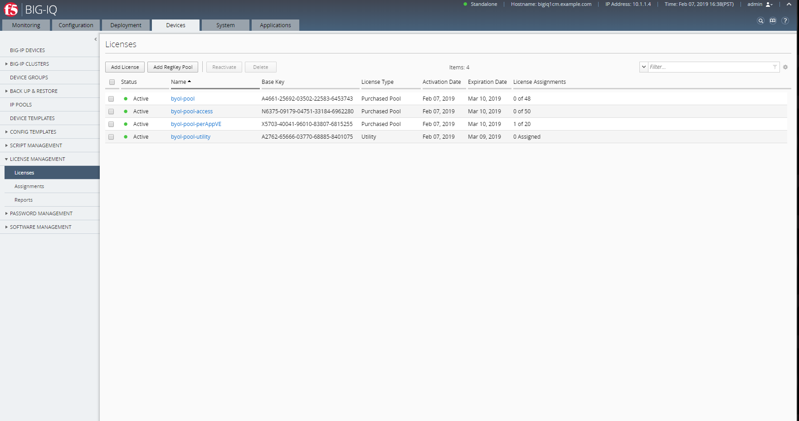
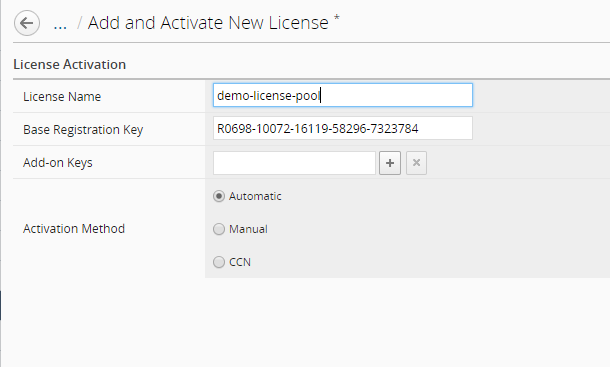
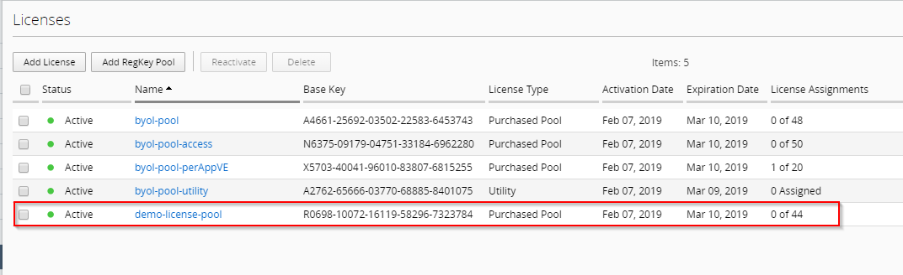
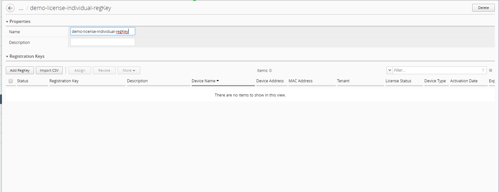
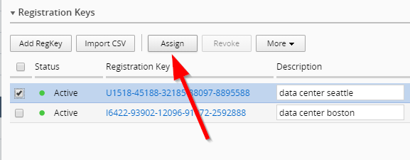
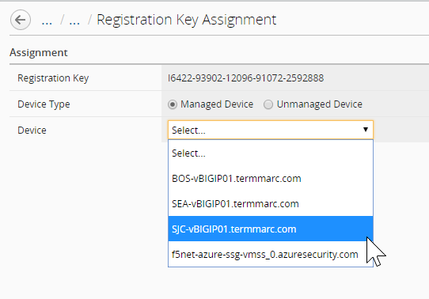
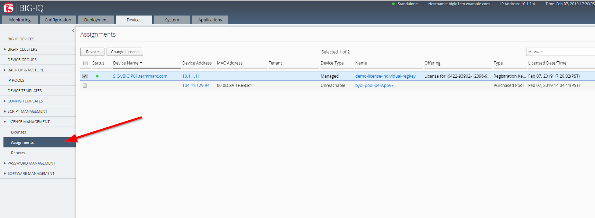

Lab 5.1: Using BIG-IQ as a license server for BIG-IP Virtual Edition devices
----------------------------------------------------------------------------
.. include:: /accesslab.rst

Tasks
^^^^^
Login to the BIG-IQ system with your user name (david) and password (david).

On the top menu bar, select Devices from the BIG-IQ menu.

On the left-hand menu bar, click License Management.

This screen displays information about active licenses.

|lab-5-1|

- To find a specific license in this list, type all or part of the license name in the Filter box, and then press the Enter key.
- To add and activate a new pool license, click the Add License button.
- To create a registration key pool for standalone BIG-IP VE licenses, click the Add RegKey Pool button.
- To reactivate a license, select the check box next to the license and click the Reactivate button.
- To delete a license from BIG-IQ, select the check box next to the license and click the Delete button.
- To assign a license or view details about a license (including current license assignments), click the license name.

There are 4 types of licence pools:

1. ``Purchased pool`` - Prepaid pool of a specific number of concurrent license grants for a single BIG-IP service, such as LTM. For example, a purchased pool of 25 licenses for BIG-IP LTM allows you to license up to 25 concurrent BIG-IP VE systems for LTM.
2. ``Utility pool`` - Designed for service providers, utility pools contain licenses for BIG-IP services you grant for a specific unit of measure (hourly, daily, monthly, or yearly). This means you can pay for licenses as needed with no limit to the number of licenses you can grant. From BIG-IQ, you can automatically submit a license usage report. F5 uses that report to calculate billing based on the licensed services, duration of the license grant, and the unit-of-measure pricing. To purchase a utility pool license, you must have a master service agreement.
3. ``Volume pool`` - Prepaid subscription (1 and 3 year terms) for a fixed number of concurrent license grants for multiple BIG-IP services. To purchase a volume pool, you must have a master service agreement.
4. ``Registration key pool`` - A pool of single standalone BIG-IP VE registration keys for one or more BIG-IP services. Because you are managing these registration keys from BIG-IQ (instead of directly from the BIG-IP device), you can revoke and reassign a license to BIG-IP VE systems without having to contact F5 to allow the license to be moved.

The **Add License** option is to add a License Pool (e.g. Purchases, Utility or Volume pool).

The **Add RegKey Pool** option is to add indiviual Registration keys.

Let's use both options as an example.

1. First, let's add the a pool license type. Click on **Add License**.

|lab-5-1|

Set a License Name and following Purchased pool Registration Key ``R0698-10072-16119-58296-7323784``.

|lab-5-2|

Click on **Activate**.

Once the license has been activated, it will show in the Licenses list.

|lab-5-3|

2. Let's now add indiviual Registration keys. Click on **Add RegKey Pool**, set a Registration Key Pool Name. 

|lab-5-4|

Click the Add RegKey button to add new standalone registration key(s) to this pool:

``I6422-93902-12096-91072-2592888``

``U1518-45188-32185-88097-8895588``

``V0951-08388-67526-48941-9468555``

|lab-5-5|

Add the key one by one (or use the Import CSV optionl, the CSV format is: regkey,notes/comments)

|lab-5-6|

Click on **Activate**.

Once the keys have been activated, they will show in the Licenses list.

|lab-5-7|

.. note:: If you want to associate this new pool with an optional identifier, type it in the Description field.

|lab-5-8|

3. Now we have added various type of license, let's use the indiviual Regkeys pool to license the **SJC-vBIGIP01.termmarc.com** device.

Select the Registration Key Pool previously created.

To assign an active registration key to a device, select the registration key's check box, and click the Assign button.

|lab-5-9|

Select the device to license, **SJC-vBIGIP01.termmarc.com** 

|lab-5-10|

Click on **Assign**, then a confirmation window appears. Click **Ok**.

|lab-5-11|

Once the license is assigned to the device, you can see the Device Name and Device Address are populated.

|lab-5-12|

On the left-hand menu bar, click License Management, Assignments. This screen displays all assigned licenses.

|lab-5-13|

.. |lab-5-4| image:: media/img_module5_lab1_4.png
   :scale: 60%

.. |lab-5-6| image:: media/img_module5_lab1_6.png
   :scale: 60%
.. |lab-5-7| image:: media/img_module5_lab1_7.png
   :scale: 60%
.. |lab-5-8| image:: media/img_module5_lab1_8.png
   :scale: 60%

.. |lab-5-11| image:: media/img_module5_lab1_11.png
   :scale: 60%
.. |lab-5-12| image:: media/img_module5_lab1_12.png
   :scale: 60%
