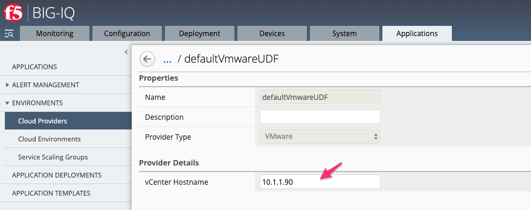
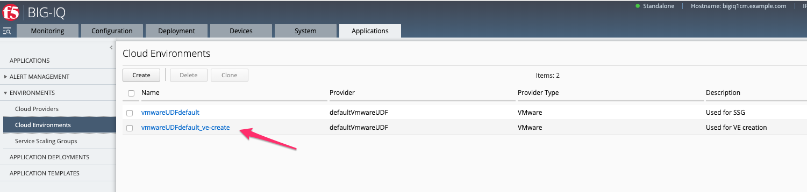
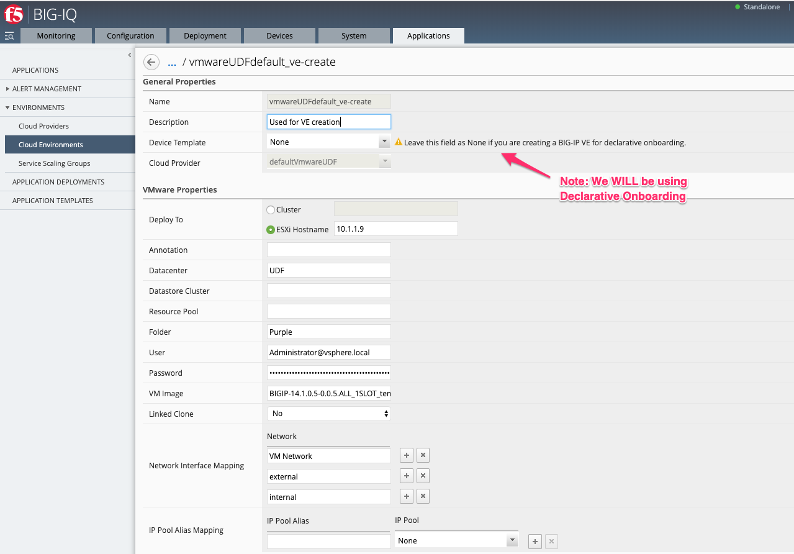
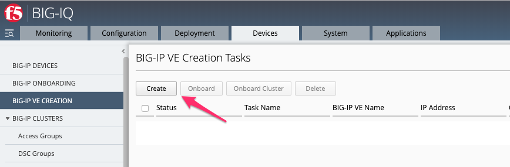
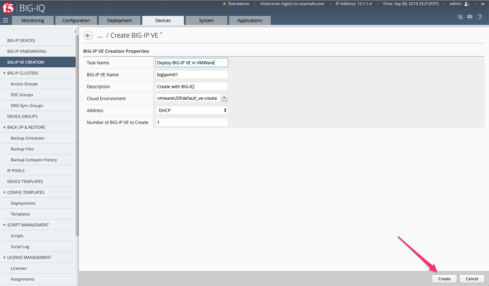
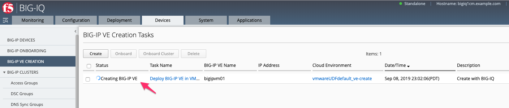
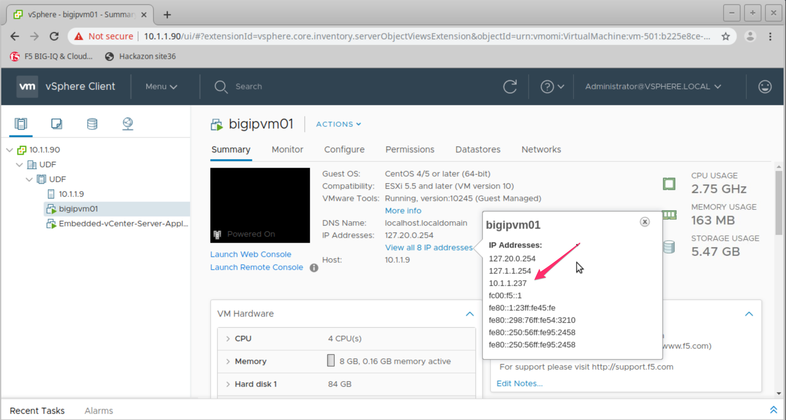
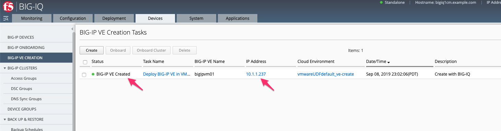
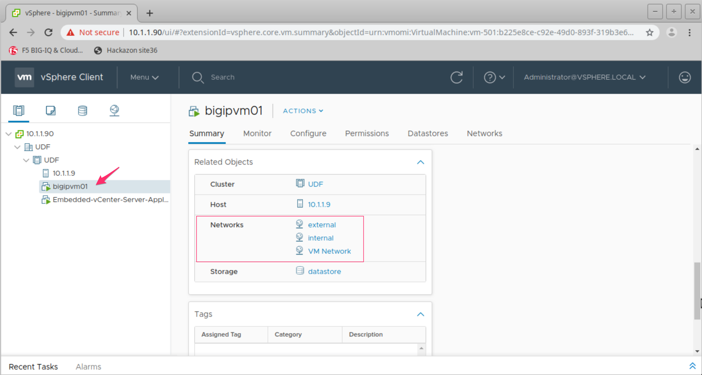

Lab 7.1: VMWare BIG-IP VE Creation
----------------------------------

.. note:: Estimated time to complete: **5 minutes**

.. include:: /accesslab.rst

Tasks
^^^^^
Prerequisites to this module:
  - None

1. Verify your BIG-IQ "Cloud Provider" for VMWare

Navigate to Applications > Environments > Cloud Providers

  |image01|

View the Cloud Provider object with your vCenter Hostname.

  |image02|

2. Verify your BIG-IQ "Cloud Environment" for VMWare

Navigate to Applications > Environments > Cloud Environments

  |image03|

Settings for our already created Cloud Environment should be left unchanged.

  |image04|

.. warning:: 
            Several parts of the Cloud Environment you may not want to be configured because you are planning on using F5 Declarative Onboarding.
             - **Device Templates** are used for Service Scaling Groups, not a single or cluster of BIG-IP.
             - Ensure the **IP Pool Alias Mapping: IP Pool** is set to "None".
             - **VM image**: Follow `K44134742`_ to install VMware tools on the VM template (required).

.. _`K44134742`: https://support.f5.com/csp/article/K44134742 

3. Creating your BIG-IP in VMWare

Navigate to Devices > BIG-IP VE Creation > and choose **Create**

  |image05|

Fill in the Create BIG-IP VE Options.

+-------------------------------+---------------------------+
| BIG-IP VE Creation            |                           |
+===============================+===========================+
| Task Name                     | Deploy BIG-IP VE in VMWare|
+-------------------------------+---------------------------+
| BIG-IP VE Name                | bigipvm01                 |
+-------------------------------+---------------------------+
| Description                   | Created with BIG-IQ       |
+-------------------------------+---------------------------+
| Cloud Environment             | VMWare-environment        |
+-------------------------------+---------------------------+
| Address                       | DHCP                      |
+-------------------------------+---------------------------+
| Number of BIG-IP VE to Create | 1                         |
+-------------------------------+---------------------------+

Once all the attributes are configured **Create** the VE.

  |image06|

BIG-IQ gathers all the needed pieces from our Provider, Environment, and Creation options. This configuration is sent to the VMWare API for building the instance.

  |image07|

To verify the creation of the BIG-IP VE, you can login to the vCenter server

 |image08|

.. Note:: vCenter credentials are administrator@vsphere.local    / Purpl3$lab, and you MUST login to the Jump host to access vCenter

BIG-IP VE Creation is complete from here we can see BIG-IQ harvested the DHCP IP address.

  |image09|
  |image11|

Lab 2 of this module will cover Onboarding the newly created VMWare VE.

.. Note:: If you try to open BIG-IP web interface, to bypass the Google Chrome “Your connection is not private” Warning, just type in blindly ``thisisunsafe``.

See `Class 2 Module 1 Lab 4`_ for help with Troubleshooting.

.. _Class 2 Module 1 Lab 4: ../../class2/module1/lab4.html

.. |image01| image:: pictures/image01.png
   :width: 60%

