Lab 7.2: Device Onboarding with BIG-IQ
--------------------------------------

Prerequisites to this module:
  - A BIG-IP available that you would like to target with F5 Declarative Onboarding
  - Connectivity to/from the BIG-IQ (CM/DCD) and the BIG-IP if you are going to onboard the BIG-IP into BIG-IQ

1. From the VE Creation in BIG-IQ, choose **Onboard**:

  |image10|

.. Note:: Although you can start BIG-IP onboarding from multiple locations, we selected our VMWare instance from the VE Create screen.

2. Build our Declarative Onboarding configuration

F5 Declarative Onboarding like Application Services 3 utilizes **Classes** as configuration objects. If you were to build DO without BIG-IQ, you would need to structure the Classes into a payload that can be sent at a BIG-IP. From the BIG-IQ Onboard Properties screen, we can see the DO classes available to us, which will form the payload to be sent at a targeted BIG-IP.

The two main differences between DO native and BIG-IQ with DO are the **BIG-IQ Settings**, and the **License** classes. 
  - The BIG-IQ settings class is used to replace the Discovery and Import process of traditional BIG-IPs into the BIG-IQ platform.
  - The License class can be used to license the BIG-IP VE with a regKey directly or utilizing a licensePool from either the Current BIG-IQ or a different BIG-IQ

Required Parameters for DO with created VMWare instances
  - Target Host
  - Target Username
  - Target Passphrase
  - Onboard Class License
  - Onboard Class User

Declarative Onboarding for VE in VMWare can be the most complex deployment of the 3 different styles. It requires two sets of ``admin`` credentials in three different DO Classes. The default admin credentials are used to access the BIG-IP from BIG-IQ, and then to license it, however, the third set of admin credentials are needed. BIG-IP deployments 14+ require an admin password change the first login, so under the User Class, we will be required to change the password.

.. Warning:: If using a pool license when onboarding a BIG-IP VE device running version 14.+, you must supply the BIG-IP admin and user names, same as the ones entered for the ```User``` Class.

.. Warning:: In TMOS versions 14+ the root account is set to the same password as the Admin account when changed, if you do not want this specify a different password for the root account in Declarative Onboarding.

.. Note:: You do not need to have created the BIG-IP VE from BIG-IQ to send Declarative Onboarding payloads. If you did create the VE from BIG-IQ, it would show up in the BIG-IP VE drop-down list; if you did not create it, you would need to specify the Target information.

Configure Declarative Onboarding for our VMWare BIG-IP VE

+-------------------------------+---------------------------+
| Device                        |                           |
+===============================+===========================+
| BIG-IP VE                     | bigipvm01                 |
+-------------------------------+---------------------------+
| Target Host                   | 10.1.1.237                |
+-------------------------------+---------------------------+
| Target Port                   |                           |
+-------------------------------+---------------------------+
| Target Username               | admin                     |
+-------------------------------+---------------------------+
| Target Passphrase             | admin                     |
+-------------------------------+---------------------------+
| Target Ssh Key                |                           |
+-------------------------------+---------------------------+
| Target Timeout                |                           |
+-------------------------------+---------------------------+
| Hostname                      | vmware-ve.example.com     |
+-------------------------------+---------------------------+
| Label                         |                           |
+-------------------------------+---------------------------+

+-------------------------------+---------------------------+
| BIG-IQ Settings               |                           |
+===============================+===========================+
| Snapshot Working Config       | UNCHECKED                 |
+-------------------------------+---------------------------+
| Fail Import On Conflict       | UNCHECKED                 |
+-------------------------------+---------------------------+
| Conflict Policy               | USE_BIGIQ                 |
+-------------------------------+---------------------------+
| Device Conflict Policy        | USE_BIGIP                 |
+-------------------------------+---------------------------+
| Versioned Conflict Policy     | KEEP_VERSION              |
+-------------------------------+---------------------------+
| Cluster Name                  |                           |
+-------------------------------+---------------------------+
| Use BIG-IQ Sync               | UNCHECKED                 |
+-------------------------------+---------------------------+
| Deploy When DSC Changes Pen.. | UNCHECKED                 |
+-------------------------------+---------------------------+
| Stats Config                  | default                   |
+-------------------------------+---------------------------+
| Access Module Properties      |                           |
+-------------------------------+---------------------------+

+-------------------------------+---------------------------+
| License                       |                           |
+===============================+===========================+
| Name                          | myLicense                 |
+-------------------------------+---------------------------+
| License Type                  | licensePool               |
+-------------------------------+---------------------------+
| License Pool                  | Current BIG-IQ byol-pool  |
+-------------------------------+---------------------------+
| Overwrite                     | UNCHECKED                 |
+-------------------------------+---------------------------+
| SKU Keyword1                  |                           |
+-------------------------------+---------------------------+
| SKU Keyword2                  |                           |
+-------------------------------+---------------------------+
| Unit Of Measure               | yearly                    |
+-------------------------------+---------------------------+
| Hypervisor                    | vmware                    |
+-------------------------------+---------------------------+
| BIG-IP Username               | admin                     |
+-------------------------------+---------------------------+
| BIG-IP Password               | admin                     |
+-------------------------------+---------------------------+
| BIG-IQ Host                   |                           |
+-------------------------------+---------------------------+
| BIG-IQ Username               |                           |
+-------------------------------+---------------------------+
| BIG-IQ Password               |                           |
+-------------------------------+---------------------------+
| BIG-IQ Password URI           |                           |
+-------------------------------+---------------------------+
| Reachable                     | CHECKED                   |
+-------------------------------+---------------------------+
| Revoke From                   | Current BIG-IQ byol-pool  |
+-------------------------------+---------------------------+

+-------------------------------+---------------------------+
| Provision                     |                           |
+===============================+===========================+
| Name                          | myProvision               |
+-------------------------------+---------------------------+
| AFM                           |                           |
+-------------------------------+---------------------------+
| AM                            |                           |
+-------------------------------+---------------------------+
| APM                           |                           |
+-------------------------------+---------------------------+
| ASM                           | nominal                   |
+-------------------------------+---------------------------+
| AVR                           | nominal                   |
+-------------------------------+---------------------------+
| DOS                           |                           |
+-------------------------------+---------------------------+
| FPS                           |                           |
+-------------------------------+---------------------------+
| GTM                           |                           |
+-------------------------------+---------------------------+
| ILX                           |                           |
+-------------------------------+---------------------------+
| LC                            |                           |
+-------------------------------+---------------------------+
| LTM                           | nominal                   |
+-------------------------------+---------------------------+
| PEM                           |                           |
+-------------------------------+---------------------------+
| SWG                           |                           |
+-------------------------------+---------------------------+
| URLDB                         |                           |
+-------------------------------+---------------------------+

+-------------------------------+---------------------------+
| DNS                           |                           |
+===============================+===========================+
| Name                          | myDns                     |
+-------------------------------+---------------------------+
| Name Servers                  | 8.8.8.8                   |
+-------------------------------+---------------------------+
| Name Servers                  | 8.8.4.4                   |
+-------------------------------+---------------------------+
| Search                        | example.com               |
+-------------------------------+---------------------------+

+-------------------------------+---------------------------+
| NTP                           |                           |
+===============================+===========================+
| Name                          | myNtp                     |
+-------------------------------+---------------------------+
| Servers                       | time.google.com           |
+-------------------------------+---------------------------+
| Timezone                      | America/Los_Angeles       |
+-------------------------------+---------------------------+

+-------------------------------+---------------------------+
| USER                          |                           |
+===============================+===========================+
| Name                          | admin                     |
+-------------------------------+---------------------------+
| User Type                     | regular                   |
+-------------------------------+---------------------------+
| Keys                          |                           |
+-------------------------------+---------------------------+
| Password                      | u7BnD@4f5                 |
+-------------------------------+---------------------------+
| Shell                         | tmsh                      |
+-------------------------------+---------------------------+
| Partition Access              | all-partition role:admin  |
+-------------------------------+---------------------------+

+-------------------------------+---------------------------+
| VLAN                          |                           |
+===============================+===========================+
| Name                          | internal-vlan             |
+-------------------------------+---------------------------+
| MTU                           |                           |
+-------------------------------+---------------------------+
| Tag                           |                           |
+-------------------------------+---------------------------+
| Interface                     | 1.2     Select...         |
+-------------------------------+---------------------------+

+-------------------------------+---------------------------+
| VLAN                          |                           |
+===============================+===========================+
| Name                          | external-vlan             |
+-------------------------------+---------------------------+
| MTU                           |                           |
+-------------------------------+---------------------------+
| Tag                           |                           |
+-------------------------------+---------------------------+
| Interface                     | 1.1     Select...         |
+-------------------------------+---------------------------+

+-------------------------------+---------------------------+
| Self IP                       |                           |
+===============================+===========================+
| Name                          | internal-self             |
+-------------------------------+---------------------------+
| Address                       | 10.1.20.237/24            |
+-------------------------------+---------------------------+
| Traffic Group                 | traffic-group-local-only  |
+-------------------------------+---------------------------+
| VLAN                          | internal-vlan             |
+-------------------------------+---------------------------+
| Allow Service                 | default                   |
+-------------------------------+---------------------------+

+-------------------------------+---------------------------+
| Self IP                       |                           |
+===============================+===========================+
| Name                          | external-self             |
+-------------------------------+---------------------------+
| Address                       | 10.1.10.237/24            |
+-------------------------------+---------------------------+
| Traffic Group                 | traffic-group-local-only  |
+-------------------------------+---------------------------+
| VLAN                          | external-vlan             |
+-------------------------------+---------------------------+
| Allow Service                 | default                   |
+-------------------------------+---------------------------+


  |image13|
  |image14|
  |image15|
  |image18|
  |image19|
  |image20|
  |image21|
  |image22|  

With the configuration, set click the **Onboard** button.

Similar to Application Templates and AS3 Templates, Declarative Onboarding has a Sample API request to see what this payload would look like being sent programmatically into the BIG-IQ.

  |image12|

BIG-IQ gathers all the needed pieces from our DO options. These are sent to the BIG-IP VE target API for configuring our device.

  |image16|

Once onboarding is complete, the BIG-IP VE will be a managed BIG-IP within BIG-IQ and can be used for Application and Service Deployments.

  |image17|

Utilizing the Jump host, we can login to the newly created BIG-IP with our newly created credentials from DO and see objects, and the BIG-IP is ready for use. 

.. Note:: Because we used the BIG-IQ DO Class our BIG-IP was added to our BIG-IQ under a managed device

  |image23|

.. Warning:: In case you get following error: *"Task Failed: Failed to complete onboarding task: Unexpected response from declartive onboarding: code: 404, message: Please confirm Declartive Onboarding (DO) is running on BIG-IQ. See log for details."*, restart restnoded on the BIG-IQ CM. SSH the BIG-IQ CM server and execute ``bigstart restart restnoded``.

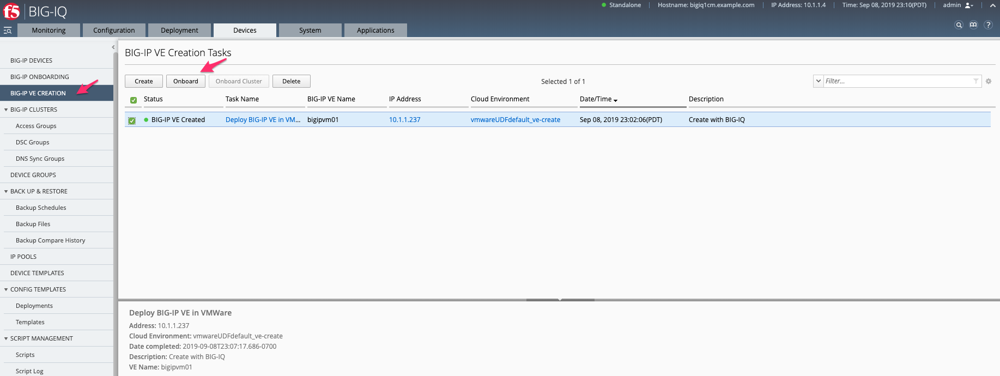
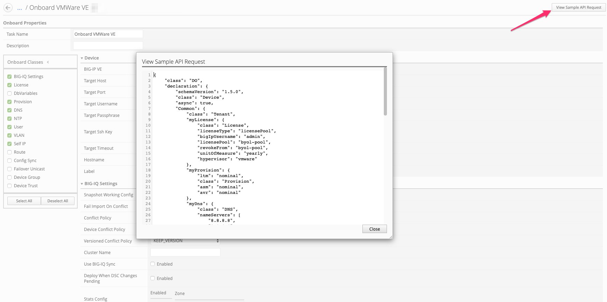
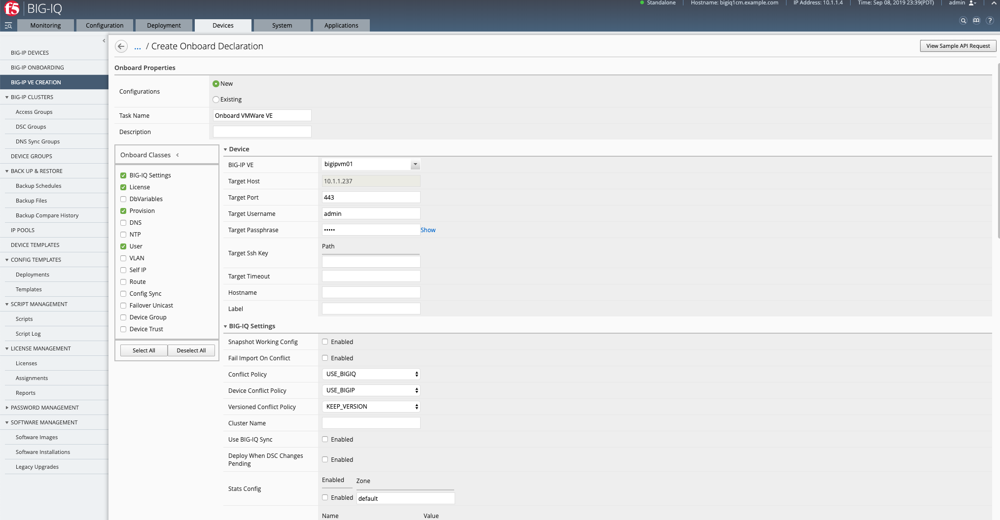
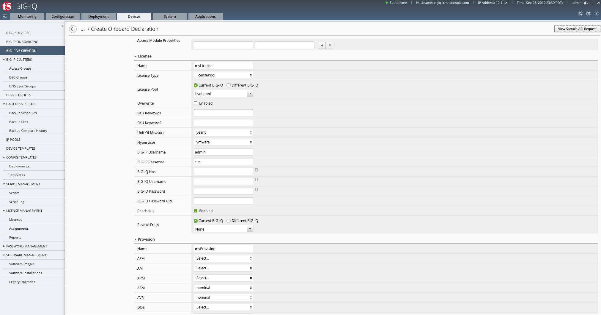
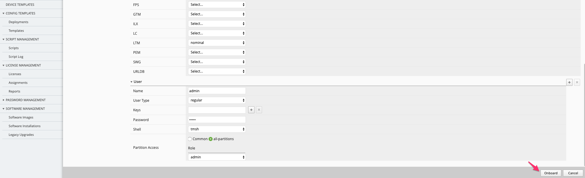
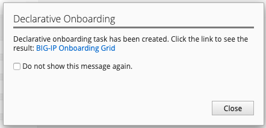
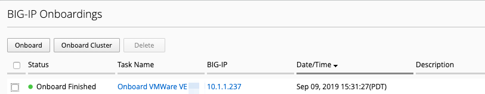
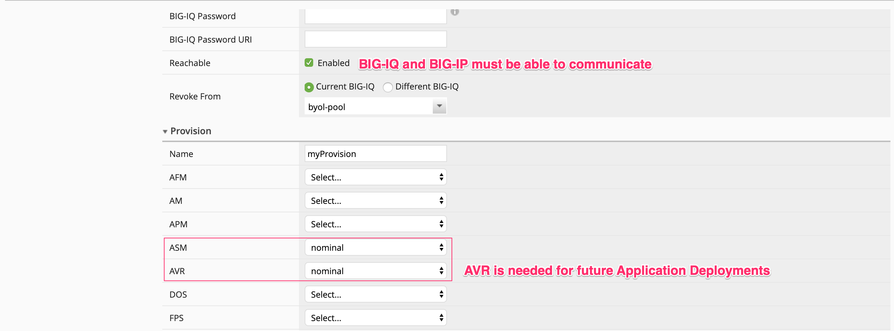
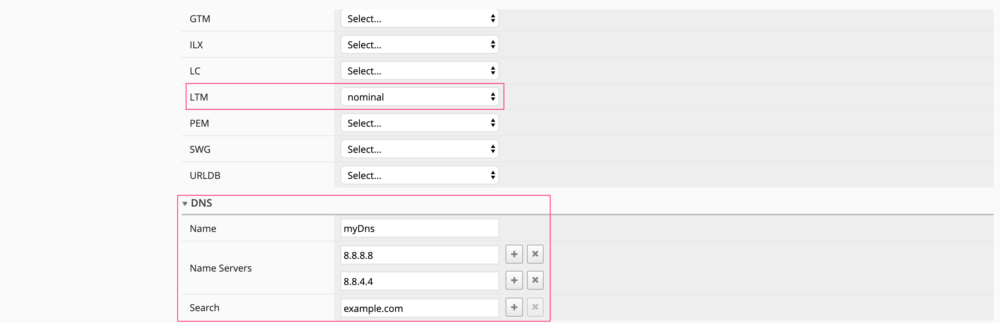
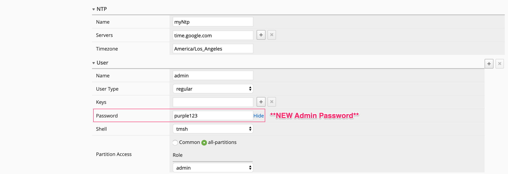
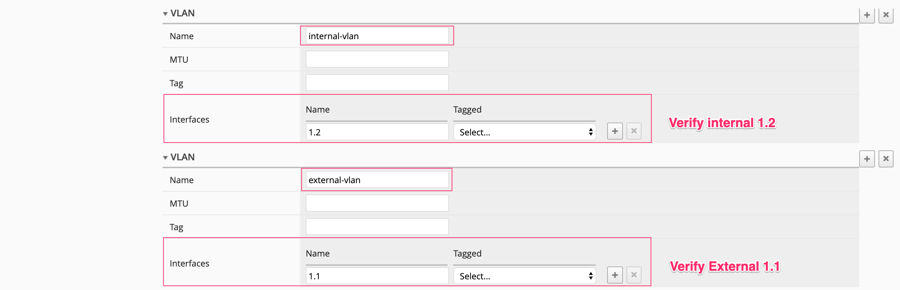
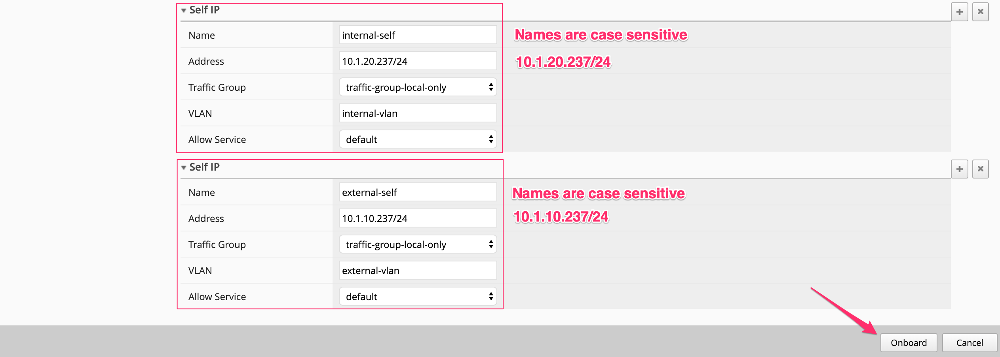
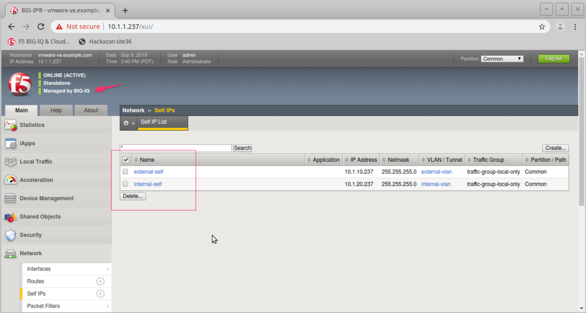