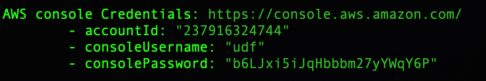

Lab 8.1: Prepare your AWS Account 
---------------------------------
.. include:: /accesslab.rst

Tasks
^^^^^
.. warning:: If you already created an AWS environment and VPN in Class 2 Module 4 (AWS SSG) you do not need to recreate this item.

1. Create the AWS environment and VPN

SSH Ubuntu host in lab environment.

Navigate to: ``cd f5-aws-vpn-ssg``

Execute the Ansible scripts to create the AWS resources (including VPN between AWS and the lab), cloud provider and cloud environment.

``./000-RUN_ALL.sh ve``

.. note:: VPN object and servers can take up to 15 minutes to complete.

The console will output your ephemeral credentials for the resources created, **yours will be different**. Save these for later use.

 |image01|

