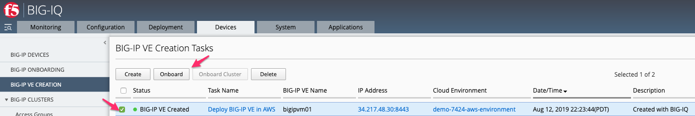
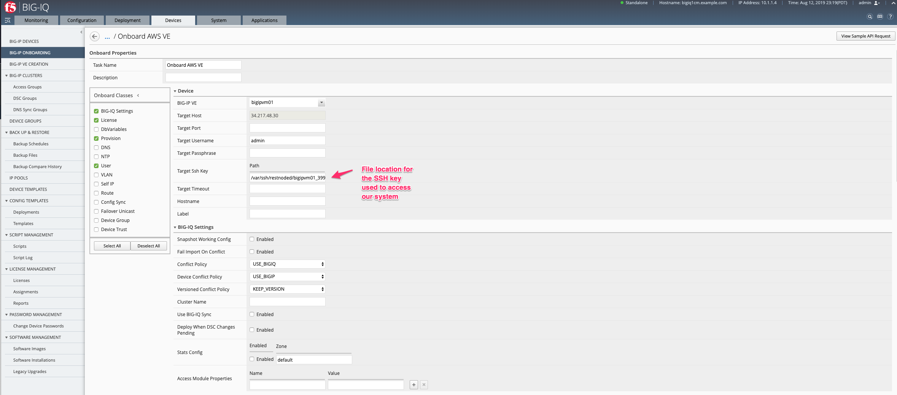
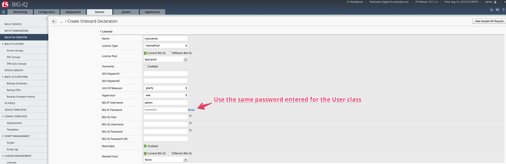
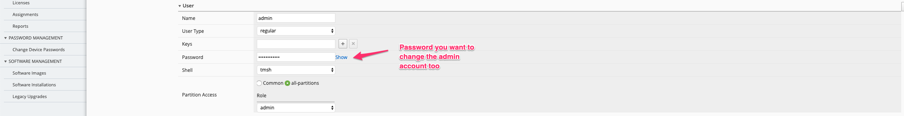
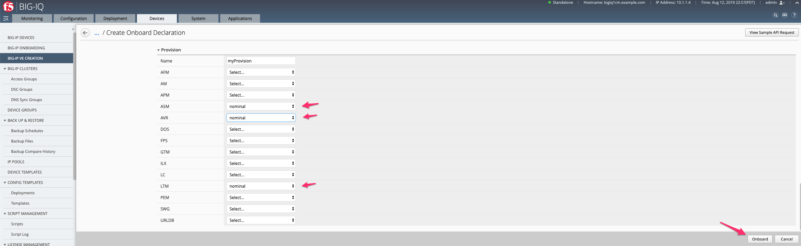
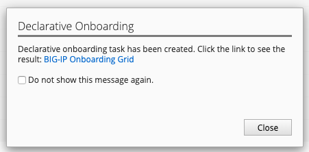
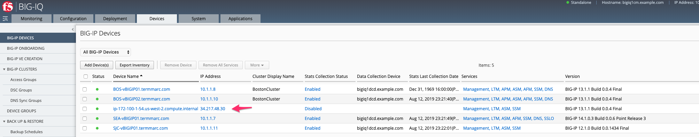
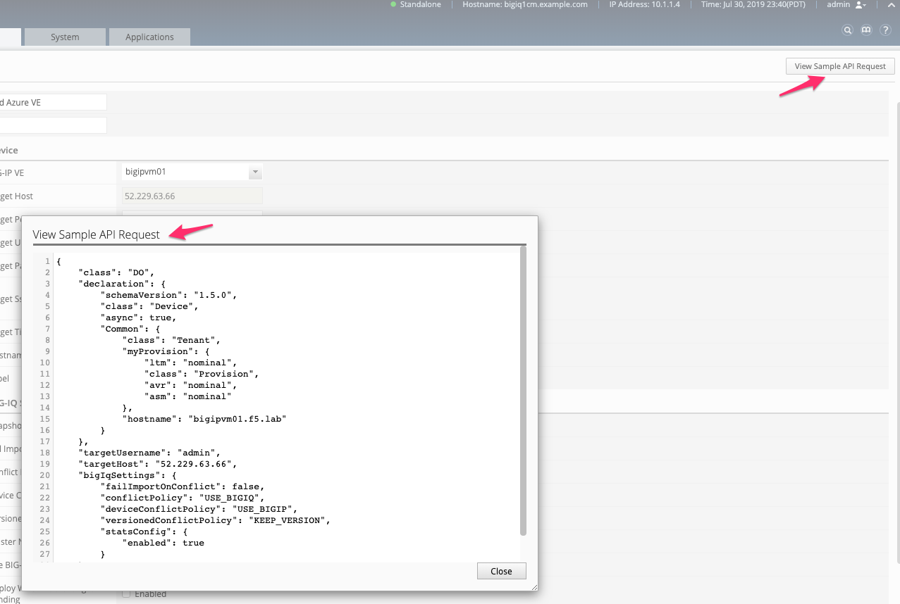

Lab 8.3: Device Onboarding with BIG-IQ
--------------------------------------

Prerequisites to this module:
- A BIG-IP available that you would like to target with F5 Declarative Onboarding
- Connectivity to/from the BIG-IQ (CM/DCD) and the BIG-IP if you are going to onboard the BIG-IP into BIG-IQ

1. From the VE Creation in BIG-IQ, choose **Onboard**:

  |image9|

.. Note:: Although you can start BIG-IP onboarding from multiple locations, if we select our AWS instance from the VE Create screen, it will automatically populate some needed configuration (like the SSH key location)

2. Build our Declarative Onboarding configuration

F5 Declarative Onboarding like Application Services 3 utilizes **Classes** as configuration objects. If you were to build DO without BIG-IQ, you would need to structure the Classes into a payload that is able to be sent at a BIG-IP. From the BIG-IQ Onboard Properties screen, we can see the DO classes available to us, which will form the payload to be sent at a targeted BIG-IP.

The two main differences between DO native and BIG-IQ with DO are the **BIG-IQ Settings**, and the **License** classes. 
  - The BIG-IQ settings class is used to replace the Discovery and Import process of traditional BIG-IPs into the BIG-IQ platform.
  - The License class can be used to license the BIG-IP VE with a regKey directly or utilizing a licensePool from either the Current BIG-IQ or a different BIG-IQ

Our VE created in the previous lab was a single instance with 1-NIC and a BYOL license. From our perspective, DO doesn't need many options, BIG-IQ management, ASM / AVR provisioned, User, and a License. Then it will be ready for AS3 or Application Templates.

  |image10|
  |image11|
  |image12|
  |image13|

.. Note:: You do not need to have created the BIG-IP VE from BIG-IQ to send Declarative Onboarding payloads. If you did create the VE from BIG-IQ, it would show up in the BIG-IP VE drop-down list; if you did not create it, you would need to specify the Target information.

With the configuration, set click the **Onboard** button.

Similar to Application Templates and AS3 Templates, Declarative Onboarding has a Sample API request to see what this payload would look like being sent programmatically into the BIG-IQ.

  |image20|

BIG-IQ will gather all the needed pieces from our DO options. These will be sent to the BIG-IP VE target API for configuring our device.

  |image14|

Once onboarding is complete, the BIG-IP VE will be a managed BIG-IP within BIG-IQ and can be used for Application and Service Deployments.

  |image15|

