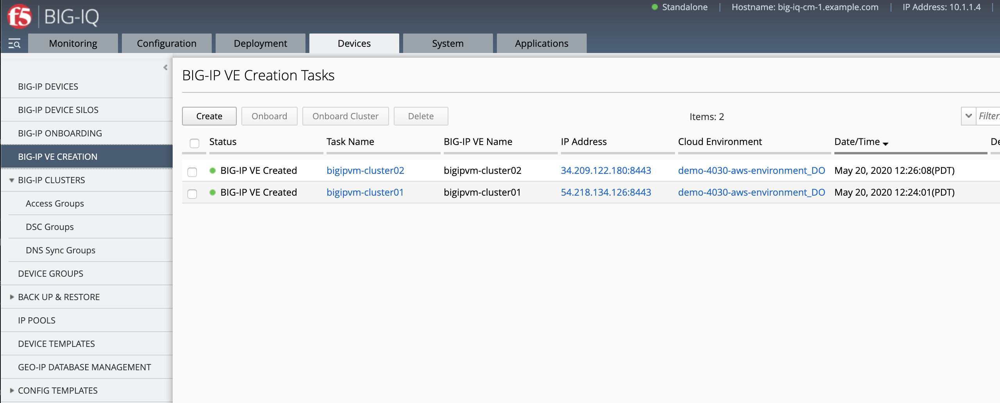
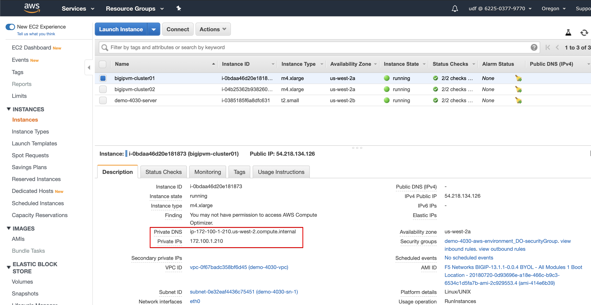
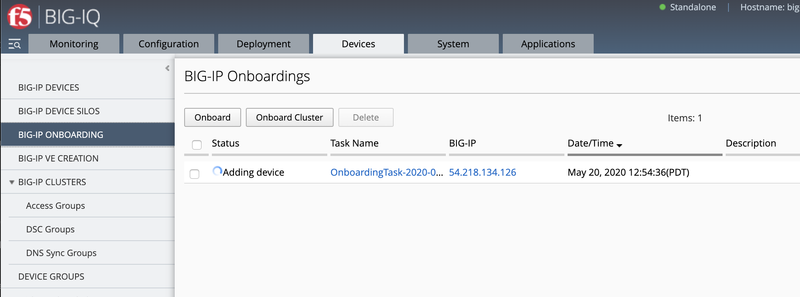
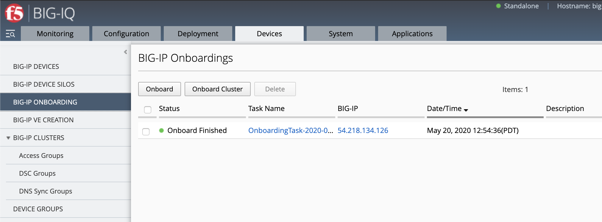
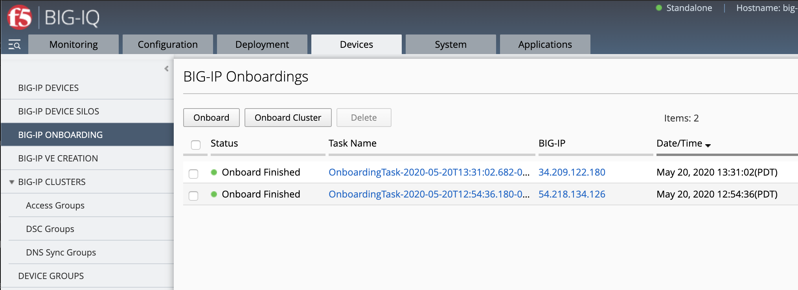
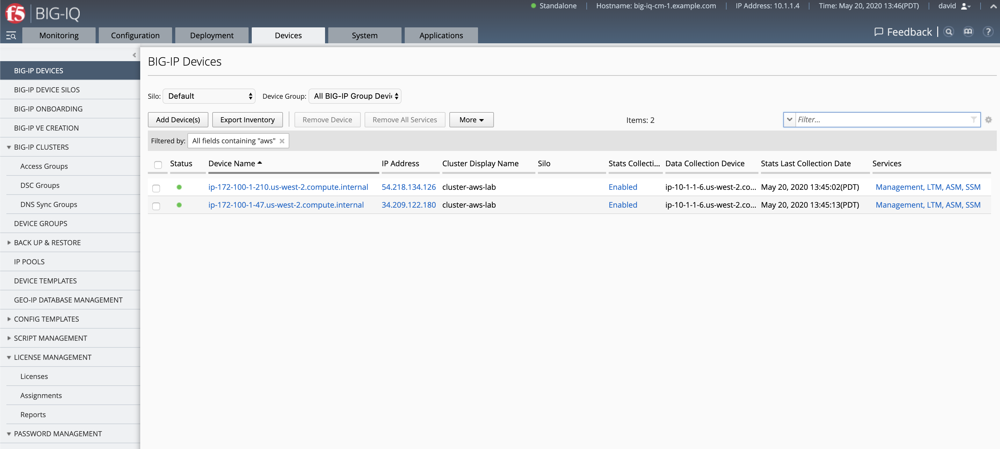

Lab 8.4: AWS BIG-IP HA VE Creation and Onboarding using the API
---------------------------------------------------------------

In this lab, we are going to create and onboard from scratch a cluster of BIG-IPs in AWS using BIG-IQ.

Using what you learned in previous labs, you can run the same below steps using the BIG-IQ UI 
to create and onboard the VE.

From the lab environment, launch a remote desktop session to have access to the Ubuntu Desktop.
To do this, in your lab environment, click on the *Access* button
of the *Ubuntu Lamp Server* system and select *noVNC* or *xRDP*.

.. note:: Modern laptops with higher resolutions you might want to use 1440x900 and once XRDP is launched Zoom to 200%.

.. image:: ../../pictures/udf_ubuntu.png
    :align: left
    :scale: 60%

|

Open Postman. Click right and click on execute (wait ~2 minutes).

.. note:: If Postman does not open, open a terminal, type ``postman`` to open postman.

.. image:: ../../pictures/postman.png
    :align: center
    :scale: 60%

|

1. If not already done, run through `Lab 8.1 Prepare your AWS Account`_.

.. _Lab 8.1 Prepare your AWS Account: ./lab1.html

2. Using Postman, use the **BIG-IQ Token (david)** collections to authenticate you on the BIG-IQ and save the token.
   If your token expires, obtain a new token by resending the ``BIG-IQ Token (david)``.

   .. warning:: The token timeout is set to 5 min. If you get the 401 authorization error, request a new token.

3. First, let's get the Cloud Environement Reference. 
   Using Postman, use the **BIG-IQ AS3 Declaration** call in order to create the service on the BIG-IP through BIG-IQ.
   Replace the method and URL with ``GET https://10.1.1.4/mgmt/cm/cloud/environments``.

   Save the **selfLink** value.
   
   Example: ``"selfLink": "https://localhost/mgmt/cm/cloud/environments/cbda6942-0224-391a-885f-681fec4f8b94"``

4. Click right and duplicate the tab. 
   Replace the method and URL with ``POST https://10.1.1.4/mgmt/cm/cloud/tasks/create-ve``.
   Copy/Paste the below  from the validator to the body in Postman.

.. code-block:: yaml
   :linenos:
   :emphasize-lines: 5

   {
      "name": "bigipvm-cluster01",
      "veName": "bigipvm-cluster01",
      "environmentReference": {
         "link": "https://localhost/mgmt/cm/cloud/environments/cbda6942-0224-391a-885f-681fec4f8b94"
      }
   }

.. note:: You **MUST** accept the terms of the instance in AWS before you can launch the image. Accept the EULA here_

.. _here: https://aws.amazon.com/marketplace/pp?sku=sxmg2kgwdu7h1ptwzl9d8e4b

Let's retreive the ``privateKeyFilename`` by doing a GET on the same URI: ``GET https://10.1.1.4/mgmt/cm/cloud/tasks/create-ve``.
Keep a note of it as we will need it later.

5. Repeat previous step to create the 2nd VE. Don't forget to update the veName.

.. code-block:: yaml
   :linenos:
   :emphasize-lines: 5

   {
      "name": "bigipvm-cluster02",
      "veName": "bigipvm-cluster02",
      "environmentReference": {
         "link": "https://localhost/mgmt/cm/cloud/environments/cbda6942-0224-391a-885f-681fec4f8b94"
      }
   }

Let's retreive the ``privateKeyFilename`` by doing a GET on the same URI: ``GET https://10.1.1.4/mgmt/cm/cloud/tasks/create-ve``.
Keep a note of it as we will need it later.

6. Login as **david** and navigate to Devices > BIG-IP VE Creation and see the 2 BIG-IPs created in AWS using the BIG-IQ API.

|image23|

7. By logging into the AWS Console with your ephemeral account, you can see the newly created EC2 instances. 
   BIG-IQ has also created a Network Interface Card, Security Group, Storage Account, and a Public IP Address.

|image24|

Note the Private DNS and IPs which will be used later. This information could be retreived using the `AWS API`_.

.. _AWS API: https://docs.aws.amazon.com/AWSEC2/latest/UserGuide/instancedata-data-retrieval.html

+--------------------+----------------+---------------------------------------------+---------------+-------------------------------------------------+
| BIG-IP VE Name     | Public IP      | Private DNS                                 | Private IPs   | Private Key Filename                            |       
+====================+================+=============================================+===============+=================================================+
| bigipvm-cluster01  | 54.218.134.126 | ip-172-100-1-210.us-west-2.compute.internal | 172.100.1.210 | /var/ssh/restnoded/bigipvm-cluster01_57989.pem  |
+--------------------+----------------+---------------------------------------------+---------------+-------------------------------------------------+
| bigipvm-cluster02  | 34.209.122.180 | ip-172-100-1-47.us-west-2.compute.internal  | 172.100.1.47  | /var/ssh/restnoded/bigipvm-cluster02_10783.pem  |
+--------------------+----------------+---------------------------------------------+---------------+-------------------------------------------------+

8. Copy below example of an DO Declaration into a JSON validator. 
   The validator is your IDE (Integrated development environment).
   
   Use the IDE available within the lab environment, click on the *Access* button
   of the *Ubuntu Lamp Server* system and select *Visual Studio*.

   You can also use an online tool such as `www.jsonschemavalidator.net`_.

   .. note:: It is recommended to `validate your DO declaration`_ against the schema using Microsoft Visual Studio Code.

   .. _validate your DO declaration: https://clouddocs.f5.com/products/extensions/f5-declarative-onboarding/latest/validate.html

   .. _www.jsonschemavalidator.net: https://www.jsonschemavalidator.net/

   Make sure all highlited information are correct (targetHost=Public IP, Private Key filename, Private DNS and IPs).

.. code-block:: yaml
   :linenos:
   :emphasize-lines: 18,42,46,50,55,57,58,66,68,70,72,76,78,81

   {
      "class": "DO",
      "declaration": {
         "schemaVersion": "1.5.0",
         "class": "Device",
         "async": true,
         "Common": {
               "class": "Tenant",
               "myDbVariables": {
                  "class": "DbVariables",
                  "configsync.allowmanagement": "enable"
               },
               "myLicense": {
                  "class": "License",
                  "licenseType": "licensePool",
                  "licensePool": "byol-pool",
                  "bigIpUsername": "admin",
                  "bigIpPassword": "u7BnD@4f5"
               },
               "myProvision": {
                  "class": "Provision",
                  "ltm": "nominal",
                  "asm": "nominal",
                  "avr": "nominal"
               },
               "myNtp": {
                  "class": "NTP",
                  "servers": [
                     "169.254.169.123"
                  ],
                  "timezone": "UTC"
               },
               "admin": {
                  "class": "User",
                  "keys": [],
                  "userType": "regular",
                  "partitionAccess": {
                     "all-partitions": {
                           "role": "admin"
                     }
                  },
                  "password": "u7BnD@4f5"
               },
               "myConfigSync": {
                  "class": "ConfigSync",
                  "configsyncIp": "172.100.1.210"
               },
               "myFailoverUnicast": {
                  "class": "FailoverUnicast",
                  "address": "172.100.1.210"
               },
               "myDeviceGroup": {
                  "class": "DeviceGroup",
                  "type": "sync-failover",
                  "owner": "ip-172-100-1-210.us-west-2.compute.internal",
                  "members": [
                     "ip-172-100-1-210.us-west-2.compute.internal",
                     "ip-172-100-1-47.us-west-2.compute.internal"
                  ],
                  "autoSync": true,
                  "asmSync": true,
                  "networkFailover": true
               },
               "myDeviceTrust": {
                  "class": "DeviceTrust",
                  "remoteHost": "172.100.1.210",
                  "localUsername": "admin",
                  "localPassword": "u7BnD@4f5",
                  "remoteUsername": "admin",
                  "remotePassword": "u7BnD@4f5"
               },
               "hostname": "ip-172-100-1-210.us-west-2.compute.internal"
         }
      },
      "targetUsername": "admin",
      "targetHost": "54.218.134.126",
      "targetSshKey": {
         "path": "/var/ssh/restnoded/bigipvm-cluster01_57989.pem"
      },
      "bigIqSettings": {
         "clusterName": "cluster-aws-lab",
         "conflictPolicy": "USE_BIGIQ",
         "deviceConflictPolicy": "USE_BIGIP",
         "failImportOnConflict": false,
         "versionedConflictPolicy": "KEEP_VERSION",
         "statsConfig": {
            "enabled": true
        }
      }
   }

9. Using Postman, use the **BIG-IQ Token (david)** collections to authenticate you on the BIG-IQ and save the token.
   If your token expires, obtain a new token by resending the ``BIG-IQ Token (david)``.

   .. warning:: The token timeout is set to 5 min. If you get the 401 authorization error, request a new token.

10. Using Postman, use the **BIG-IQ AS3 Declaration** call in order to create the service on the BIG-IP through BIG-IQ.
    Copy/Paste the DO declaration from the validator to the body in Postman.
    Replace the method and URL with ``POST https://10.1.1.4/mgmt/shared/declarative-onboarding``.

11. You can use GET to the URI ``https://10.1.1.4/mgmt/shared/declarative-onboarding/task/e1f88fa7-47c9-4860-95f9-132ca6dbaa28`` to track whether a 
declaration is successful or get information on why it failed. Note the ``id`` will be return when doing the initial POST during previous step.

.. code::

   "result": {
         "class": "Result",
         "code": 202,
         "status": "RUNNING",
         "message": "processing"
      },

You can also check the following logs on BIG-IQ and BIG-IP under ``/var/log/restjavad.0.log`` and ``/var/log/restnoded/restnoded.log``

12. Login as **david** and navigate to Devices > BIG-IP Onboarding and see the BIG-IP being provisioned.

|image25|

When onboarding is completed, you will see the task completed successfully:

|image26|

The GET on the URI monitoring the task will also show a success message.

.. code::

    "result": {
        "class": "Result",
        "code": 200,
        "status": "OK",
        "message": "success"
    },

.. note:: In case the onboarding task fails, look at the error message, make necessary fix to the DO declaration and retry. 
          If the first attempt fails after setting the admin password, you may need to remove the ``"targetSshKey": { .. },``
          and ``"admin": { "class": "User", ... }`` sections and add ``"targetPassphrase": "u7BnD@4f5",`` under ``targetUsername`` 
          to the declaration.

13. Repeat the same steps to onboard the 2nd VE. Don't forget to update all the necessary highlited values.

.. code-block:: yaml
   :linenos:
   :emphasize-lines: 18,42,46,50,55,57,58,66,68,70,72,76,78,81

   {
      "class": "DO",
      "declaration": {
         "schemaVersion": "1.5.0",
         "class": "Device",
         "async": true,
         "Common": {
               "class": "Tenant",
               "myDbVariables": {
                  "class": "DbVariables",
                  "configsync.allowmanagement": "enable"
               },
               "myLicense": {
                  "class": "License",
                  "licenseType": "licensePool",
                  "licensePool": "byol-pool",
                  "bigIpUsername": "admin",
                  "bigIpPassword": "u7BnD@4f5"
               },
               "myProvision": {
                  "class": "Provision",
                  "ltm": "nominal",
                  "asm": "nominal",
                  "avr": "nominal"
               },
               "myNtp": {
                  "class": "NTP",
                  "servers": [
                     "169.254.169.123"
                  ],
                  "timezone": "UTC"
               },
               "admin": {
                  "class": "User",
                  "keys": [],
                  "userType": "regular",
                  "partitionAccess": {
                     "all-partitions": {
                           "role": "admin"
                     }
                  },
                  "password": "u7BnD@4f5"
               },
               "myConfigSync": {
                  "class": "ConfigSync",
                  "configsyncIp": "172.100.1.47"
               },
               "myFailoverUnicast": {
                  "class": "FailoverUnicast",
                  "address": "172.100.1.47"
               },
               "myDeviceGroup": {
                  "class": "DeviceGroup",
                  "type": "sync-failover",
                  "owner": "ip-172-100-1-210.us-west-2.compute.internal",
                  "members": [
                     "ip-172-100-1-210.us-west-2.compute.internal",
                     "ip-172-100-1-47.us-west-2.compute.internal"
                  ],
                  "autoSync": true,
                  "asmSync": true,
                  "networkFailover": true
               },
               "myDeviceTrust": {
                  "class": "DeviceTrust",
                  "remoteHost": "172.100.1.210",
                  "localUsername": "admin",
                  "localPassword": "u7BnD@4f5",
                  "remoteUsername": "admin",
                  "remotePassword": "u7BnD@4f5"
               },
               "hostname": "ip-172-100-1-47.us-west-2.compute.internal"
         }
      },
      "targetUsername": "admin",
      "targetHost": "34.209.122.180",
      "targetSshKey": {
         "path": "/var/ssh/restnoded/bigipvm-cluster02_10783.pem"
      },
      "bigIqSettings": {
         "clusterName": "cluster-aws-lab",
         "conflictPolicy": "USE_BIGIQ",
         "deviceConflictPolicy": "USE_BIGIP",
         "failImportOnConflict": false,
         "versionedConflictPolicy": "KEEP_VERSION",
         "statsConfig": {
            "enabled": true
        }
      }
   }

14. Login as **david** and navigate to Devices > BIG-IP Onboarding and see the BIG-IP being provisioned.

|image27|

15. Login as **david** and navigate to Devices > Devices see both BIG-IPs have been added to BIG-IQ.
    They can be now used to deploy application services and security policies.

|image28|

