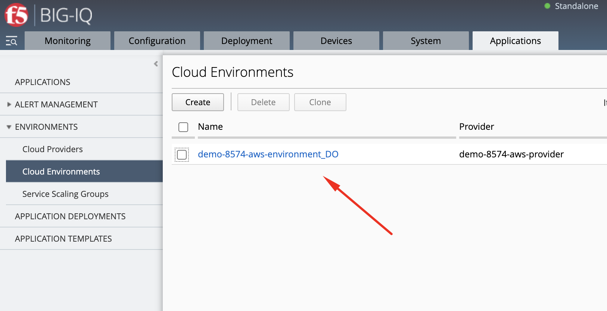
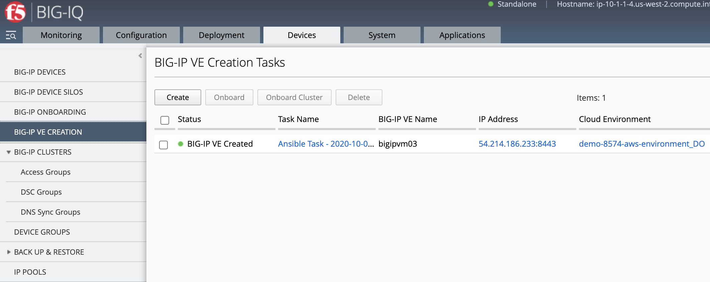
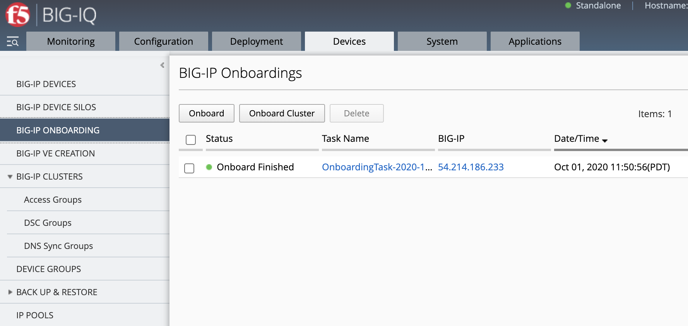
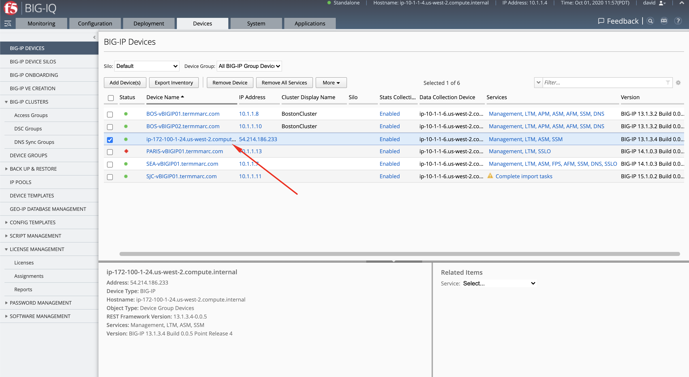
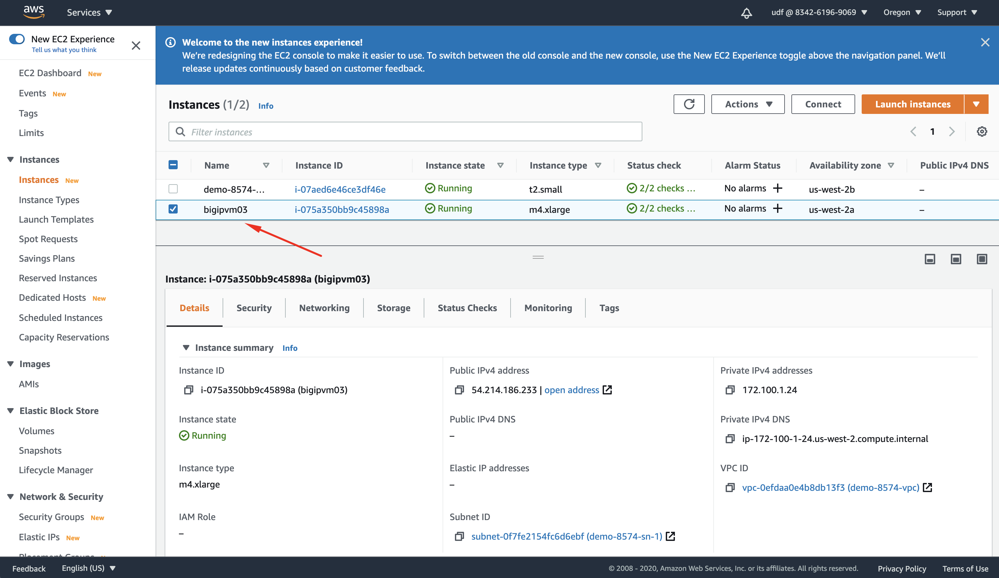
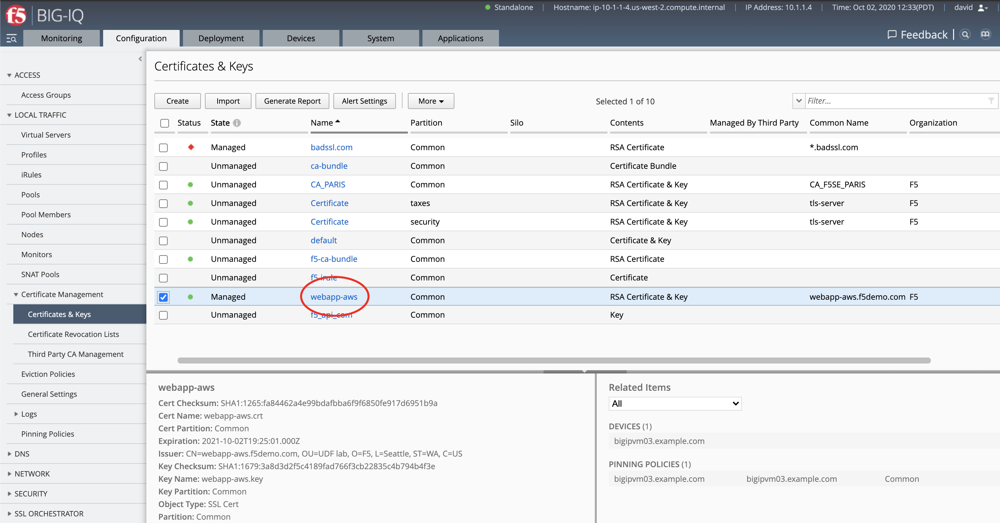
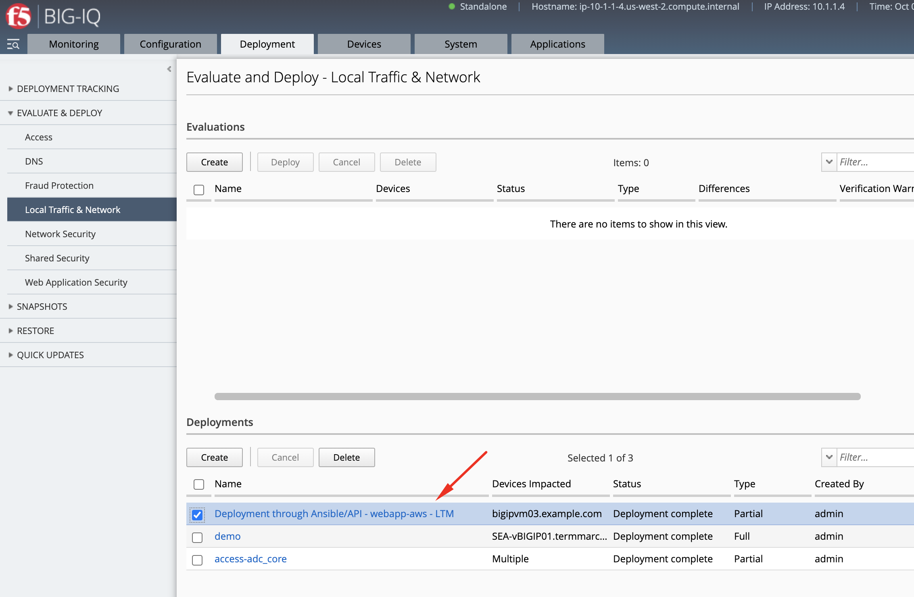
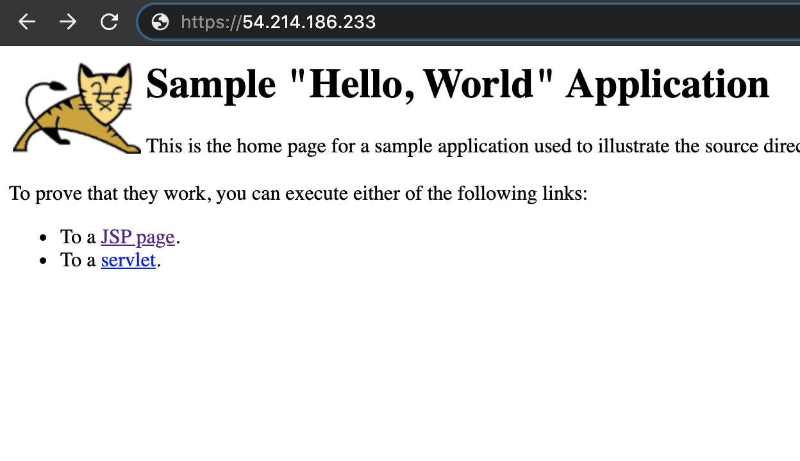
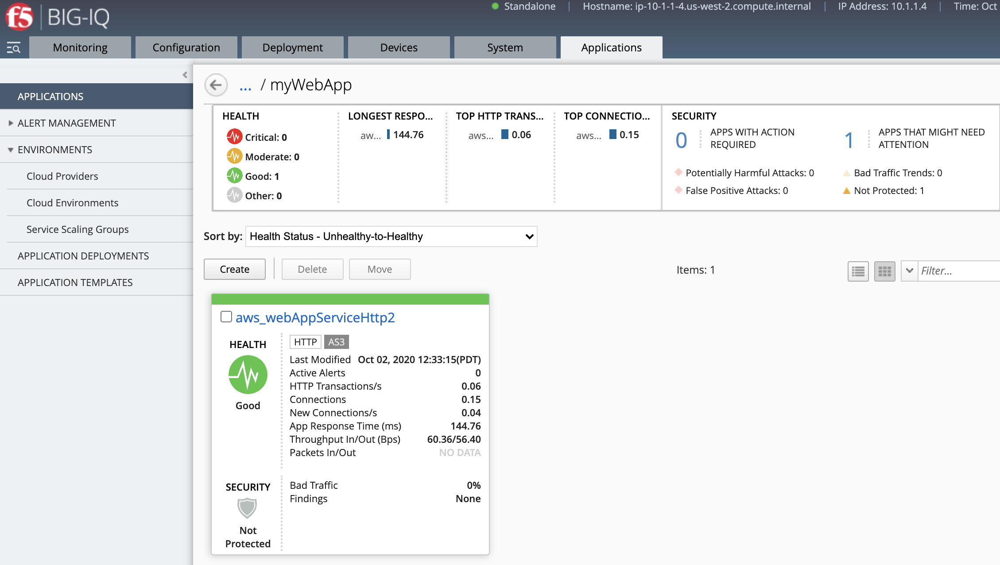

Lab 8.5: Deploy BIG-IP in AWS and configure App Services using Ansible, BIG-IQ & Automation Tool Chain
------------------------------------------------------------------------------------------------------

.. note:: Estimated time to complete: **20 minutes**

In this lab, we are going to deploy a new BIG-IP in AWS and deploy an HTTPS offload Application Service using BIG-IQ and Automation Tool Chain.

This lab will be using following F5 Ansible Galaxy roles:
    - `bigiq_create_ve`_ **ansible Role**: Create a BIG-IP VE (Virtual Edition) from BIG-IQ in AWS, Azure or VMware.
    - `atc_deploy`_  **ansible Role**: Allows AS3 and DO declarations to be sent to `automation tool chain`_ service.
    - `ansible.builtin.uri`_ **ansible Module**: Interacts with web services, create SSL cert & key on BIG-IQ
    - `bigiq_pinning_deploy_objects`_ **ansible Role**: Pin objects (e.g. Cert & Key) on BIG-IQ and deploy it to BIG-IP(s).
    - `bigiq_move_app_dashboard`_ **ansible Role**: Move Application Service(s) in BIG-IQ Application Dashboard.
    
.. _bigiq_create_ve: https://galaxy.ansible.com/f5devcentral/bigiq_create_ve
.. _ansible.builtin.uri: https://docs.ansible.com/ansible/latest/modules/uri_module.html
.. _bigiq_pinning_deploy_objects: https://galaxy.ansible.com/f5devcentral/bigiq_pinning_deploy_objects
.. _atc_deploy: https://galaxy.ansible.com/f5devcentral/atc_deploy
.. _bigiq_move_app_dashboard: https://galaxy.ansible.com/f5devcentral/bigiq_move_app_dashboard
.. _automation tool chain: https://www.f5.com/products/automation-and-orchestration

.. include:: /accesslab.rst

Workflow
^^^^^^^^

1. Create VPN between F5 Lab and AWS
2. Create BIG-IP VE using **bigiq_create_ve**
3. Onboard BIG-IP using **atc_deploy**
4. Create SSL Certificate and Key on BIG-IQ using **ansible.builtin.uri**
5. Deploy SSL objects to BIG-IP using **bigiq_pinning_deploy_objects**
6. Create AS3 Application Service HTTPS offload using **atc_deploy**
7. Organized Application Service in BIG-IQ Application Dashboard using **bigiq_move_app_dashboard**
8. Your HTTPS offload Application Service is now up and ready to serve traffic

All steps from 2 to 3 are handed in an simple Ansible playbook where creation & deployments of the BIG-IP and its configuration is automated.

Tasks
^^^^^

1. If not already done, run through `Lab 8.1 Prepare your AWS Account`_.

.. _Lab 8.1 Prepare your AWS Account: ./lab1.html

2. Login as **david** and navigate to Applications > Environments > Cloud Environments

|lab-5-1|

3. Connect via ``SSH`` to the system *Ubuntu Lamp Server* and ::

    cd /home/f5/f5-ansible-bigiq-ve-creation-do-demo
    vi bigiq_create_ve_and_app_services_aws.yml

   Update Cloud Environment variable in the playbook::

    cloud_environment: "demo-8574-aws-environment_DO"

   You also have the option to change few variables such as VE name, VE password, tenant, app service name, Common Name (CN) of the SSL certificate::

    veName: "bigipvm03"
    vePassword: "u7BnD@4f5"
    tenant: "aws"
    appName: "webAppServiceHttp2"
    cn: "webapp-aws"

You can look at the details of the Ansible Playbook source on the `GitHub repository`_.

.. _GitHub repository: https://github.com/f5devcentral/f5-big-iq-lab/blob/develop/lab/f5-ansible-bigiq-ve-creation-do-demo/bigiq_create_ve_and_app_services_aws.yml

4. build the ansible runner container::

    docker build -t f5-ansible-runner .

   Check ansible version and galaxy roles installed::

    ./ansible_helper ansible-playbook --version
    ./ansible_helper ansible-galaxy list

5. Now, let's execute the playbook::

    ./ansible_helper ansible-playbook /ansible/bigiq_create_ve_and_app_services_aws.yml -i /ansible/hosts

.. note:: Add ``-vvv`` if you want to get the debug output.

6. Let's now review everything which was created by the playbook.

Devices > BIG-IP VE Creation

|lab-5-2|

Devices > BIG-IP VE Onboarding

|lab-5-3|

Devices > BIG-IP Devices

|lab-5-4|

Log in to your AWS console to the EC2 Dashboard and look for the VE created.

|lab-5-5|

Configuration > Local Traffic > Certificate Management > Certificates & Keys

|lab-5-6|

Deployments > Evaluate & Deploy > Local Traffic & Network

|lab-5-7|

7. Test the application service by opening a browser and typing the Virtual Server IP address/port ``https://54.214.186.233``.
   You should see the *Hello, World* website.

|lab-5-8|

8. Go back on the BIG-IQ application dashboard and look at the HTTP analytics.

|lab-5-9|

