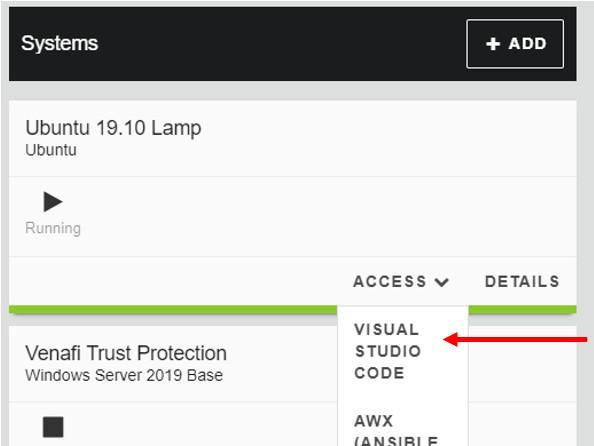
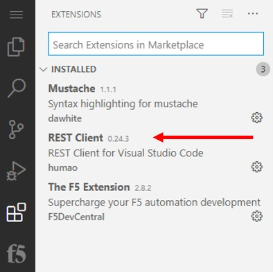
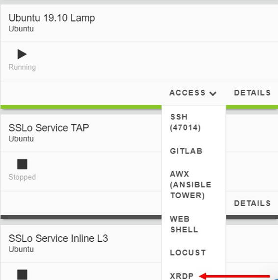

Lab 8.6: Upgrade BIG-IQ F5 Automated Toolchain .rpm packages
------------------------------------------------------------

.. note:: Estimated time to complete: **20 minutes**

BIG-IQ includes F5 Automation Toolchain functions starting from v6.1. First, AS3 got added and made it possible that application services could be defined as templates and targeted via BIG-IQ to a managed BIG-IP using REST-API.
DO or Declarative Onboarding followed with the release of BIG-IQ v7.0, being a supported package on BIG-IQ and with each new release of BIG-IQ, these .rpm’s will get updated to the latest available release at the point of going RTW (Released To the Web).

At this point both AS3 and DO are supported F5 automation toolchain packages for BIG-IQ.
An administrator is allowed to upgrade the F5 automation toolchain packages on BIG-IQ and enabling the ability to use the latest features available.

Tasks
^^^^^

Tasks for this lab are:

* Check BIG-IQ compatibility with AS3 and DO
* Display the running AS3 and DO version on BIG-IQ
* Upgrading a package

1. In the BIG-IQ UDF lab, go to the **Components** section and find Ubuntu Lamp. Select **Access** and click **Visual Studio Code**.

Enter the password (purple123).

2. We will use a Visual Studio Code Extension as a REST Client to get info from the current installed BIG-IQ F5 automation toolchain packages.

Check the Rest Client Extension by selecting **Extensions** in the left pane of Visual Studio Code.

Though this is a side-step of this lab. Using an VSC extension as REST Client can be beneficial to keep you away from switching back and foreword between applications to get the job done. Now, one can stick at VSC and do code/scripting development and test within the same window.

Of course, if you prefer to use Curl or Postman you are allowed to do so.

3. In VSC, go to Explorer in the Left pane and select **project > f5-bigiq-atc-package-update > bigiq-atc-package-info-postman.rest** and explore the body.

.. image:: ../module8/pictures/lab-6-3.png
  :align: center
  :scale: 40%

4. First we need to authenticate against the BIG-IQ by generating a token. In the REST body click **'Send Request'** of the BIG-IQ Token and watch the response.

.. image:: ../module8/pictures/lab-6-4.png
  :align: center
  :scale: 40%

5. Select **BIG-IQ AS3 Version Info** and check the GET URI.

The URI is asking AS3 package info from BIG-IQ
Now press **‘Send Request’**.

.. image:: ../module8/pictures/lab-6-5.png
  :align: center
  :scale: 40%

The response should return a version number meaning that the AS3 .rpm package is installed and revealing the version.

6. Select **BIG-IQ DO Version Info** and also here the URI is prepped to ask info about the DO installed .rpm package on BIG-IQ.

Press **'Send Request'**.

.. image:: ../module8/pictures/lab-6-6.png
  :align: center
  :scale: 40%

The current DO version installed on BIG-IQ is v1.17.

7. Check the latest AS3 and DO releases by browsing to their respected release pages on Github.

AS3: https://github.com/F5Networks/f5-appsvcs-extension/releases 

DO: https://github.com/F5Networks/f5-declarative-onboarding/releases 

Notice that both packages are not the latest and should be upgraded to contain the latest features and bug fixes.
Before doing so we first need to check the compatibility of our BIG-IQ version and the available packages for DO and AS3.

8. Browse to this F5 knowledge base article: https://support.f5.com/csp/article/K54909607 and check the compatibility by looking at the **‘BIG-IQ Centralized Management compatibility with AS3 and DO’** section and related table.

9. From the UDF lab page, go to the Components tab and on the Ubuntu Lamp, select XRDP to login to the system.

Ignore the connection verification warning and click **Connect** and **Yes**.
Hit **OK to** login the Xorg Session.

10. On the Ubuntu host start a Terminal from the left upper corner and using the Favorites menu.

11. Download the new .rpm packages shown in step 7 and store them locally on the Ubuntu Jumphost. (or do we have the latest .rpm’s already stored locally)
 
 
12. Copy the .rpm’s from the Jumphost to BIG-IQ via SCP.

On the Jumphost, select a **Terminal** through the ‘Activities’ section in the left top corner.
In the Terminal, navigate to the downloaded package.

::

 cd Downloads 
 ls -l (double check if the .rpm is in this directory)
 scp f5-appsvcs-3.24.0-5.noarch.rpm admin@10.1.1.4:/shared/tmp
 scp f5-declarative-onboarding-1.17.0-3.noarch.rpm  admin@10.1.1.4:/shared/tmp

13. Upgrading AS3 on BIG-IQ

Use the same terminal to login to BIG-IQ via SSH.

``ssh admin@10.1.1.4`` 

14. Before being able to copy the AS3 package to its final destination, we need to remount the /usr file system read-write mode by typing:

``mount -o remount,rw /usr``

Copy the AS3 package to /usr.

``cp /shared/tmp/f5-appsvcs-3.24.0-5.noarch.rpm /usr/lib/dco/packages/f5-appsvcs/``

This will be the version which will get pushed to managed BIG-IPs the next time an application service by AS3 gets deployed through BIG-IQ.
Remount the /usr file back to read-only mode.

``mount -o remount,ro /usr``

15. Upgrade AS3 on BIG-IQ by installing the package.

``rpm -Uv /usr/lib/dco/packages/f5-appsvcs/f5-appsvcs-3.24.0-5.noarch.rpm``

16. It is needed to restart the BIG-IQ services restjavad and restnoded.

``tmsh restart /sys service restjavad restnoded``

17. Let’s check if the package got installed. This can be done by repeating a previous step where we checked the appsvcs info via Postman. But instead, let’s check it locally on the BIG-IQ.

``curl http://localhost:8105/shared/appsvcs/info``

18. Upgrading DO on BIG-IQ

``rpm -Uv /shared/tmp/f5-declarative-onboarding-1.17.0-3.noarch.rpm``

19. It is needed to restart the BIG-IQ services restjavad and restnoded.

``tmsh restart /sys service restjavad restnoded``

20. Check if the package got updated. On the BIG-IQ (localhost) type:

``curl http://localhost:8105/shared/declarative-onboarding/info``

Note: When using BIG-IQ in an HA pair, you start updating the packages at the standby unit and repeat the procedure on the active BIG-IQ.
