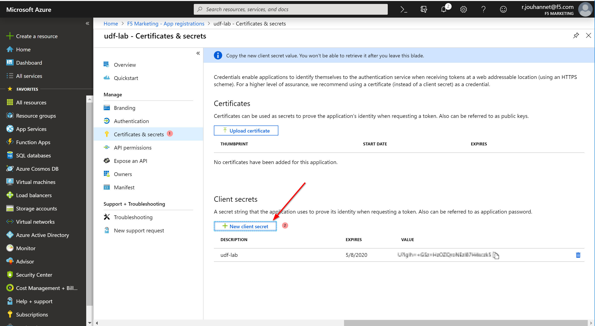
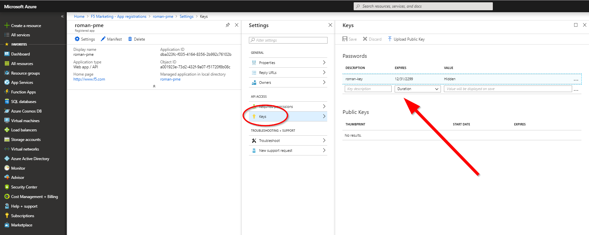
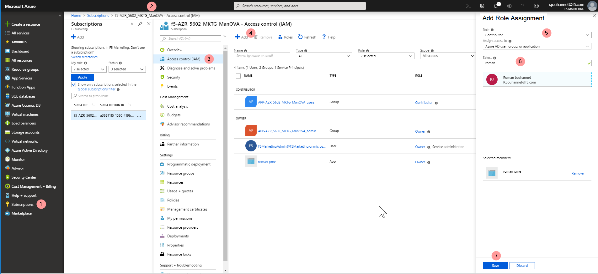
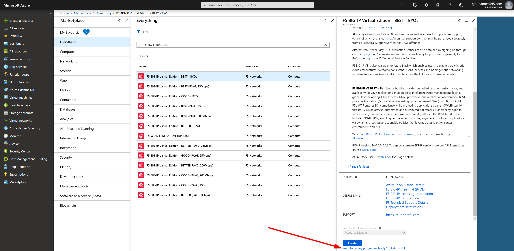
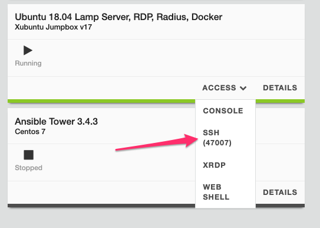

Lab 9.1: Prepare your ``Azure`` Account 
---------------------------------------

.. warning:: If you already created this account from Class2 (Azure SSG you do not need to recreate this item)

Setting up a Service Principal Account

.. note:: Needs to be done by an admin in the subscription

1. Registering an application

  - On the Azure portal, go to Azure Active Directory → App registrations
  - Click on "+ New registration"
  - Enter the following values
    Name: <Name of the application>
  - Click Create

.. image:: pictures/img_module5_lab1_1a.png
  :align: center
  :scale: 50%

|

  - Click on Certificates & secrets → New client secret
  - Enter a Description and select Expiration period.

|

2. Adding additional Application Owners

  - On the Azure portal, go to Azure Active Directory → App registrations → <the app you created in Registering an application>
  - Click on Settings → Owners → Add owner
  - Enter the user's F5 email address to search
  - Select the user and Click on Select

.. image:: pictures/img_module5_lab1_2.png
  :align: center
  :scale: 50%

|

3. Generating Service Principal Secret

  - On the Azure portal, go to Azure Active Directory → App registrations → <the app you created in Registering an application>
  - Click on Settings → Keys
  - Enter the user's name in the Description field and select "Never Expires" for the duration
  - Click on Save
  - Copy the Value field and save it somewhere. This will need to be provided to the user to be able to configure an Azure provider in BIG-IQ

|

4. Granting access control to the application

- On the Azure portal, go to Azure Active Directory → All Services
- Click on Subscriptions
- Click on the subscription that you are using for the application
- Click on Access Control (IAM) 
- Click on Add
- Select Role Assignment
- Select "Contributor" in the drop down for the Role
- Type in the Application name created in Step 1.
- Click on Save

|

5. Credentials needed for configuring Azure Provider in BIG-IQ

The following pieces of information is needed to configure an Azure Provider.
This information is required to make API calls to Azure for resource CRUD operations, either through Java or through Ansible.

- **Subscription Id**: You can get this by clicking on Subscriptions in Azure portal and copying the Subscription Id for the f5-AZR_7801_PTG_MANOVA-Dev subscription
- **Tenant Id**: Go to Azure Active Directory → Properties and copy the value of the Directory ID. This is the tenant Id.
- **Client Id**: Go to Azure Active Directory → App registrations and copy the value of the Application ID. This is the client ID.
- **Service Principal Secret**: Copy the value saved in step 5 of Generating Service Principal Secret

.. warning:: we need something unique for the User name since other student will do the lab and you may use 
  same Azure corporate account. 

6. Subscribe to the BIG-IP instance in the ``Azure MArketplace``

Before being able to deploy an instance in ``Azure``, you'll have to **subscribe** to this license agreement

Go here to **subscribe** to the right F5 instance we will use in this lab: 

`F5 BIG-IP VE – ALL (BYOL, 1 Boot Location) <https://azuremarketplace.microsoft.com/en-us/marketplace/>`_

Once you've subscribed, you should see something like this: 

.. image:: pictures/img_module5_lab1_6.png
  :align: center
  :scale: 50%

7. Create Azure Objects from Ansible Scripts.

To create the VPN between UDF and Azure and create the cloud provider and environement for DO

SSH Ubuntu host in UDF:

Navigate to:
``cd f5-azure-vpn-ssg``

Modify the **config.yml** file:

``vi config.yml``

Modify the following four items to reflect the Azure Application you created above:

  SUBSCRIPTION_ID: <Subscription Id>
  TENANT_ID: <Tenant Id>
  CLIENT_ID: <Client Id>
  SERVICE_PRINCIPAL_SECRET: <Service Principal Secret>
  PREFIX: Specify a prefix that will be used on each object automatically created.

Execute the Ansible scripts to create the VPN 

``./000-RUN_ALL.sh ve``