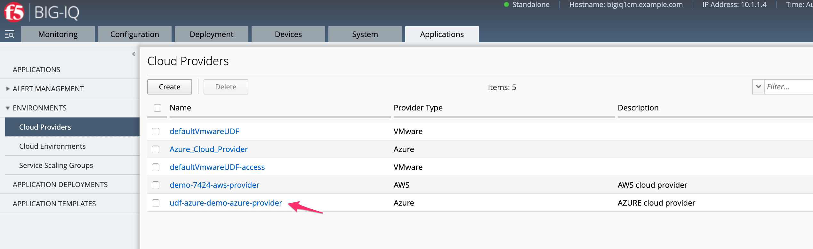
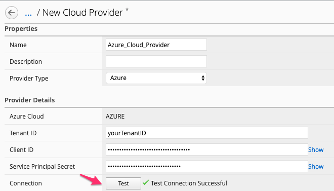
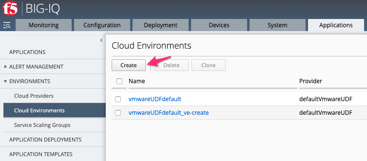
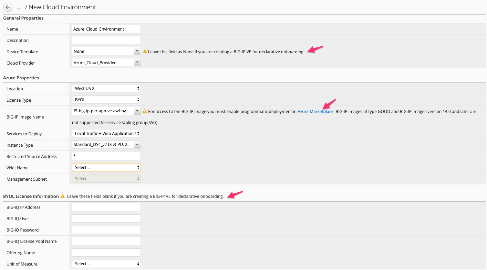
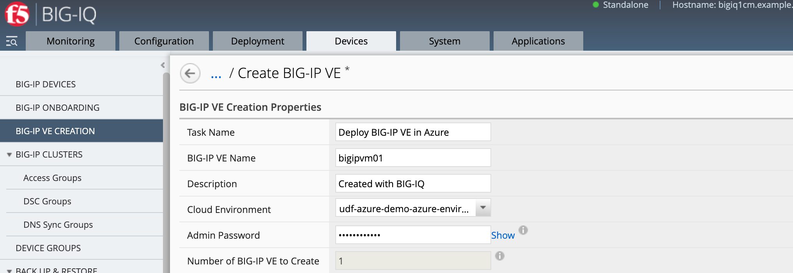
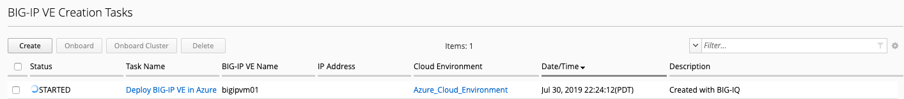
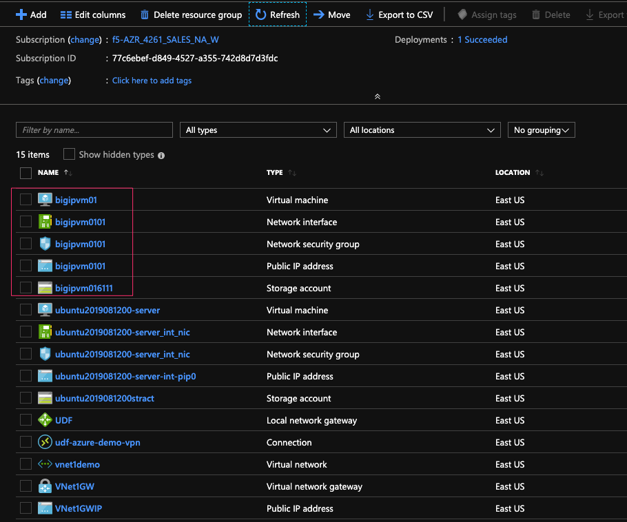
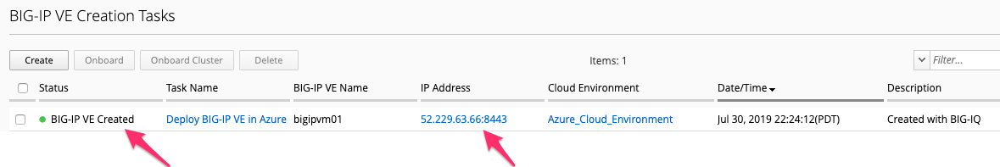

Lab 9.2: Azure BIG-IP VE Creation
---------------------------------

Prerequisites to this module:
- Run the script creation file at the end of the previous lab

.. Note:: VE Creation may not require the BIG-IQ and created BIG-IP's to communicate (Utility Licensing or Declarative Onboarding). The BIG-IQ targets the public Azure API for VE creation, and the BIG-IP VE public IP for onboarding.

1. Verify your BIG-IQ "Cloud Provider" for Azure

Navigate to Applications > Environments > Cloud Providers

  |image01|

View the Cloud Provider object with your Enterprise Application information.

  |image02|

.. Note:: If your credentials are valid, you should be able to **Test** the connectivity between BIG-IQ and the Azure API.

2. Verify your BIG-IQ "Cloud Environment" for Azure

Navigate to Applications > Environments > Cloud Environments

  |image03|

The Cloud Environment is where our BIG-IP will be deployed. If your credentials were valid, utilizing your just created **Cloud Provider** will expose resources available to you in your Azure account.

Several parts of the Cloud Environment you may not want to be configured because you are planning on using F5 Declarative Onboarding. 
- Device Templates are used for Service Scaling Groups, not a single or cluster of BIG-IP.
- You must accept Programmatic Deployments for any BIG-IP you wish to deploy from the BIG-IQ interface, not doing this will result in a failure to launch.
- Two types of Licensing, Utility will utilize the instance billing directly to the consumer, BYOL billing would be handled from a BIG-IQ License Pool. Alternatively, if you are planning to have F5 Declarative Onboarding specify a license, you will not define anything

3. Creating your BIG-IP in Azure

Navigate to Devices > BIG-IP VE Creation > and choose **Create**

  |image05|

Fill in the Create BIG-IP VE Options.

.. Note:: You can only create 1 VE at a time in Azure. Also, the BIG-IP VE name is the Instance name in Azure, not the TMOS name.

+-------------------------------+---------------------------+
| BIG-IP VE Creation            |                           |
+===============================+===========================+
| Task Name                     | Deploy BIG-IP VE in Azure |
+-------------------------------+---------------------------+
| BIG-IP VE Name                | bigipvm01                 |
+-------------------------------+---------------------------+
| Description                   | Created with BIG-IQ       |
+-------------------------------+---------------------------+
| Cloud Environment             | (your script created env) |
+-------------------------------+---------------------------+
| Admin Password                | Password123!              |
+-------------------------------+---------------------------+
| Number of BIG-IP VE to Create | 1                         |
+-------------------------------+---------------------------+

  |image06|

.. Note:: You can only create 1 VE at a time in Azure. Also, the BIG-IP VE name is the Instance name in Azure, not the TMOS name.

Once all the attributes are configured **Create** the VE.

  |image07|

BIG-IQ will gather all the needed pieces from our Provider, Environment, and Creation options. These will be sent to the Azure API for building out our instance.

  |image08|

From the Azure Portal, you can see the newly created instance, along with the instance BIG-IQ has created a Network Interface Card, Security Group, Storage Account, and a Public IP Address.

  |image09|

.. Warning:: You cannot change these options at this time, a Public address will be created, and the Security Group will have ports (22,8443,443,4353) open from *Any* source. If you delete the BIG-IP, you will need to manually clean up the Security Group created.

BIG-IP VE Creation is complete from here we can see BIG-IQ harvested the Public IP address.

.. Note:: All deployments are Single-NIC so that management will be on 8443

Lab 2 of this module will cover Onboarding the newly created VE.

  |image10|

.. |image05| image:: pictures/image5.png
   :width: 75%

.. _Enterprise_Application: https://docs.microsoft.com/en-us/azure/active-directory/develop/howto-create-service-principal-portal