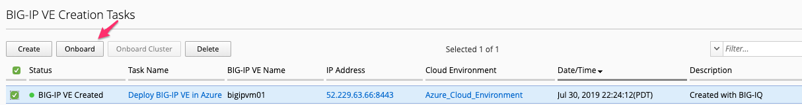
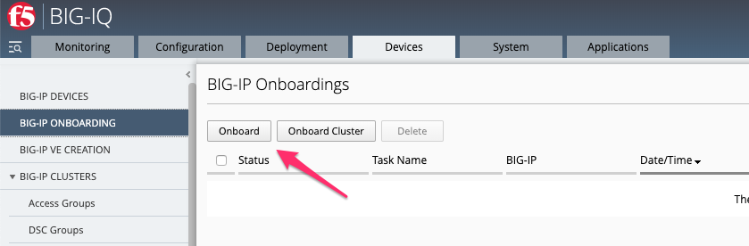
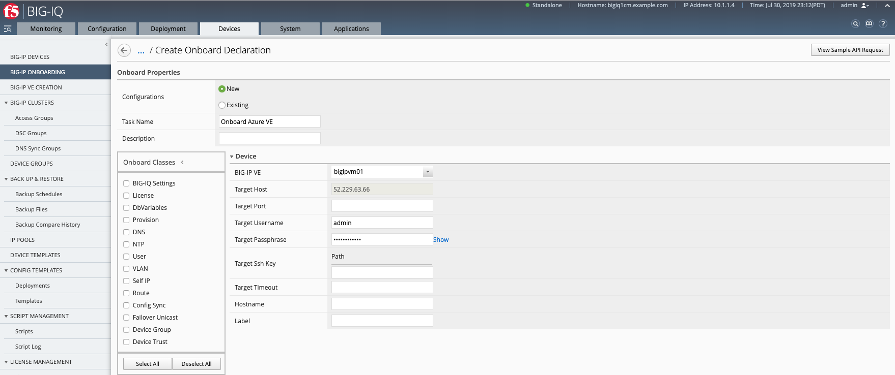
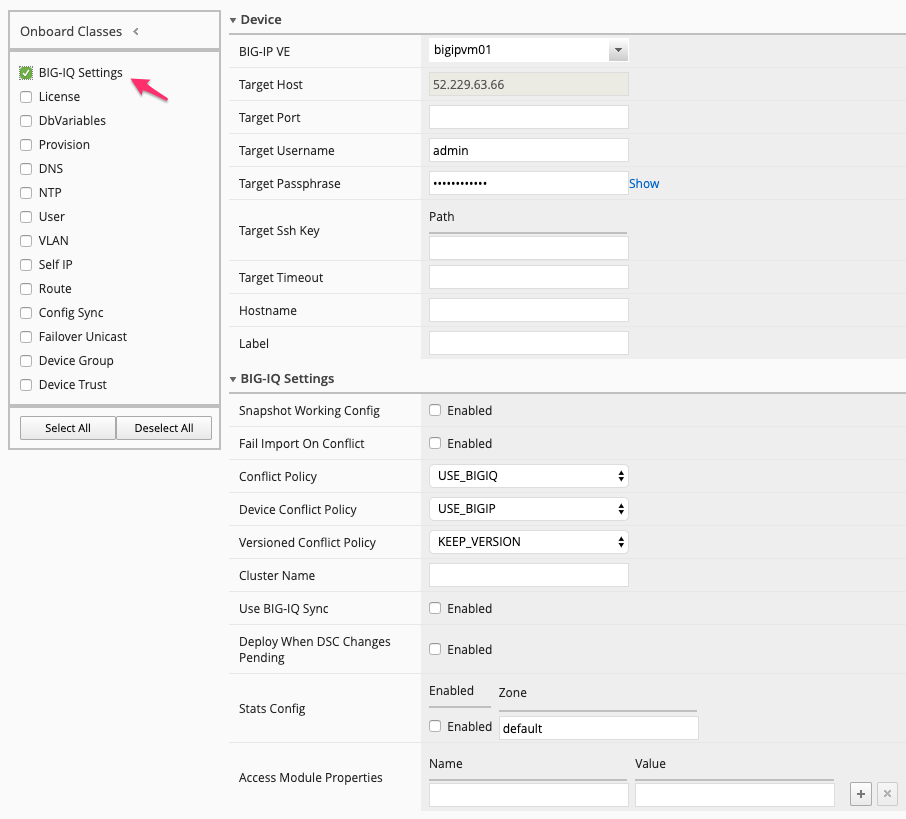
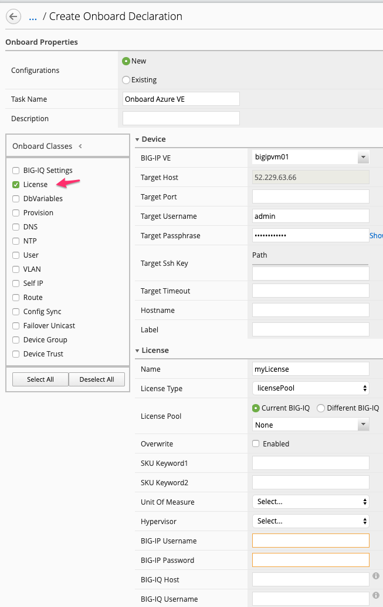
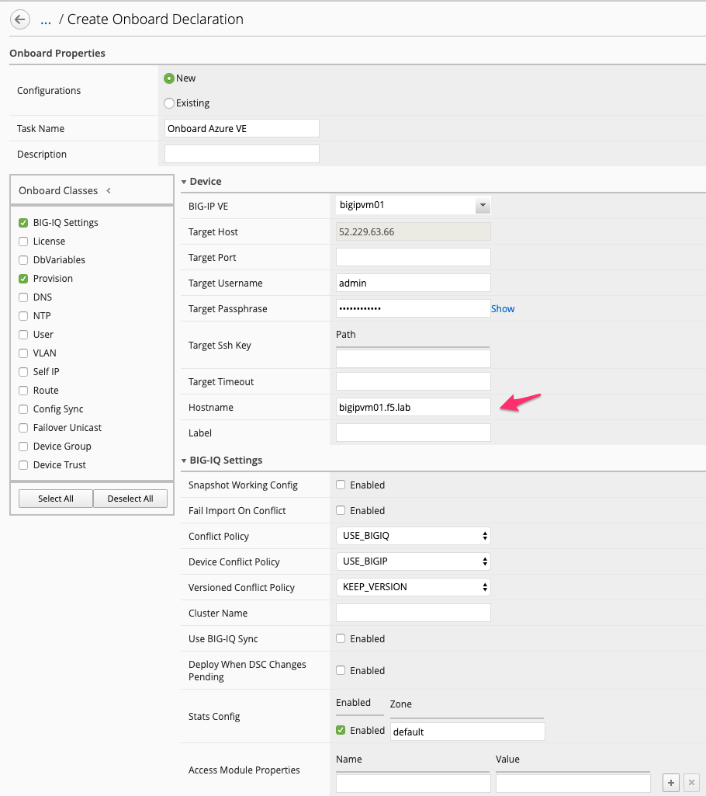
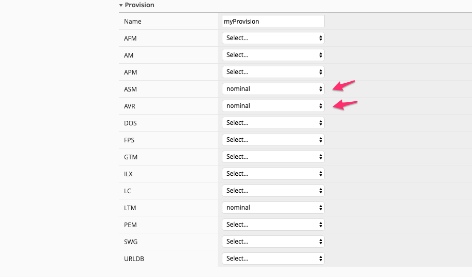
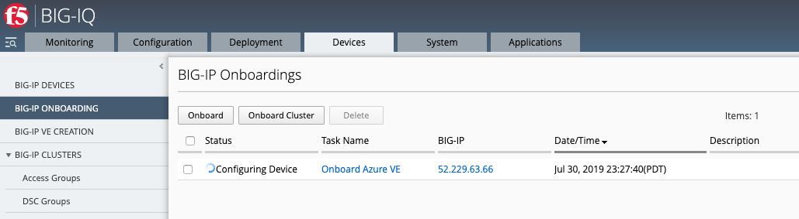

Lab 9.3: Device Onboarding with BIG-IQ
--------------------------------------

Prereqisites to this module:
  - A BIG-IP available that you would like to target with F5 Declarative Onboarding
  - Connectivity to/from the BIG-IQ (CM/DCD) and the BIG-IP if you are going to onboard the BIG-IP into BIG-IQ

BIG-IP Onboarding can be started from two locations in BIG-IQ. From a newly created VE you can choose to onboard right away, alternativly you can use the **BIG-IP Onboarding** menu option.

From the VE Creation in BIG-IQ:

  |image11|

From the BIG-IP Onboarding Menu:

  |image12|

Choosing either method will take you too the correct Onboarding interface.

.. Note:: You do not need to have created the BIG-IP VE from BIG-IQ to send Declarative Onboarding payloads. If you did create the VE from BIG-IQ it will show up in the BIG-IP VE drop down list, if you didnt not create it you will need to specify the Target information.

1. For the Onboarding Menu option Navigate to Devices > BIG-IP Onboarding > and choose **Create**

F5 Declarative Onboarding like Application Services 3 utilize **Classes** as configuration objects. If you were to build DO without BIG-IQ you would need to structure the Classes into a payload that is able to be sent at a BIG-IP. From the BIG-IQ Onboard Properties screen we can see the DO classes available to us, which will form the payload to be sent at a targeted BIG-IP.

  |image13|

The two main differences between DO native and BIG-IQ with DO are the **BIG-IQ Settings**, and the **License** classes. 
  - The BIG-IQ settings class is used to replace the Discovery and Import process of traditional BIG-IPs into the BIG-IQ platform.
  - The License class can be used to license the BIG-IP VE with a regKey directly or utilizing a licensePool from either the Current BIG-IQ or a different BIG-IQ

  |image14|
  |image23|
  |image15|

2. Build our Declarative Onboarding configuration

Our VE created in the previous lab was a single instance with 1-NIC, and a BYOL license. From our perspective DO doesnt need many options, except a hostname, BIG-IQ management, ASM / AVR provisioned, and a License. Then it will be ready for our Application Template.

Check the BIG-IQ Settings and Provision options to add the class to our configuration, our newly created BIG-IP VE has never been configured with any configuration so we can leave the default options for the BIG-IQ Settings class. Add in our demo hostname, under provisioning make sure that AVR and AWAF are configured with nominal.

  |image16|
  |image17|

  Similar to Application Templates and AS3 Templates, Declarative Onboarding has a Sample API request to see what this payload would look like being sent programmatically into the BIG-IQ

  |image20|

.. Note:: Azure does not require the use of an SSH key to log into the instance to be configured.

3. Onboard BIG-IP

With the configuration set click the **Onboard** button.

  |image18|

BIG-IQ will gather all the needed pieces from our DO options. These will be send to the BIG-IP VE target API for configuring our device.

  |image19|

Once onboarding is complete the BIG-IP VE will be a managed BIG-IP within BIG-IQ and can be used for Application and Service Deployments.

.. |image20| image:: pictures/image20.png
   :width: 50%

