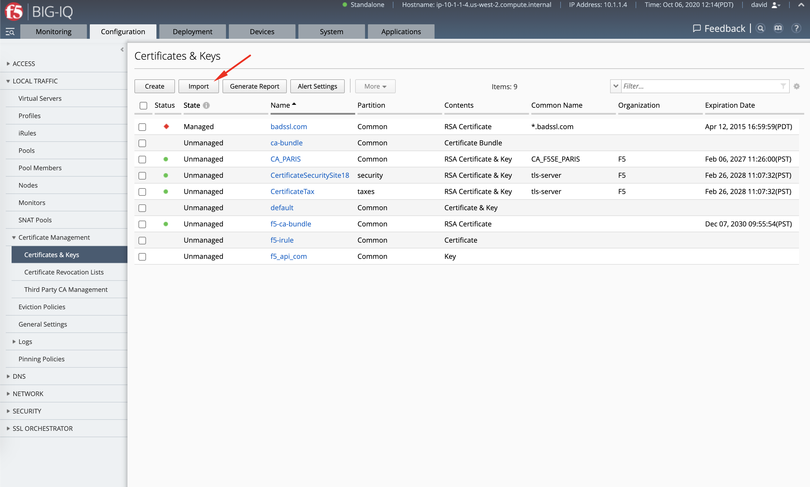
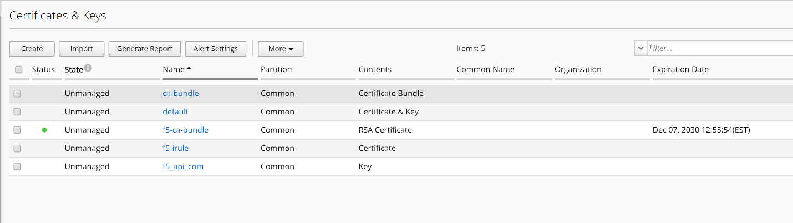
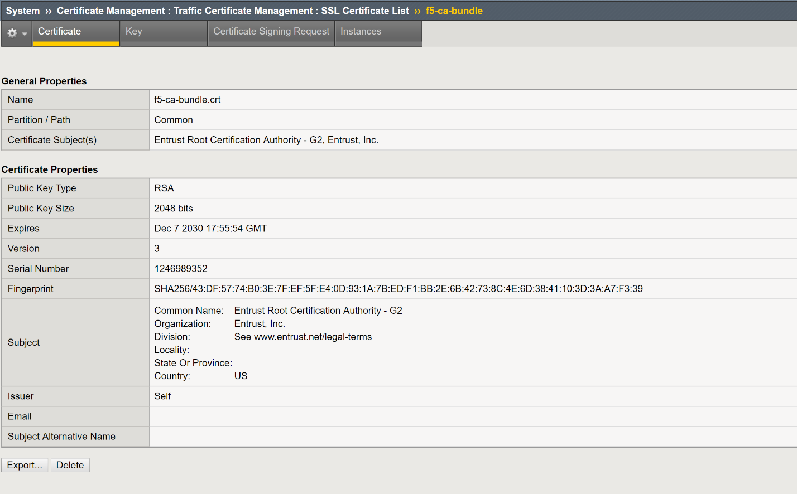
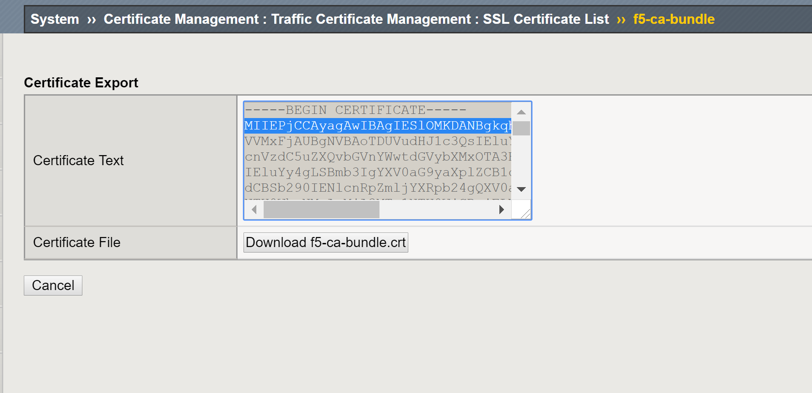
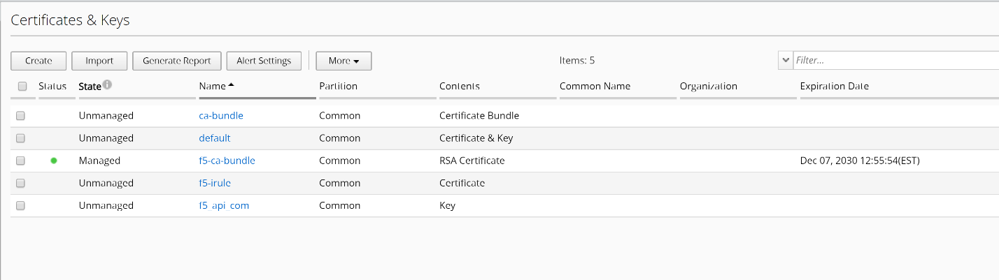

Lab 1.1: Move a certificate from unmanaged to managed state
------------------------------------------------------------

.. note:: Estimated time to complete: **10 minutes**

.. include:: /accesslab.rst

Import all Certificiates & keys from a device or multiple devices
^^^^^^^^^^^^^^^^^^^^^^^^^^^^^^^^^^^^^^^^^^^^^^^^^^^^^^^^^^^^^^^^^

1. Login as **david** in BIG-IQ. At the top of the screen, click Configuration.

2. On the left, click LOCAL TRAFFIC > Certificate Management > Certificates & Keys. These are the imported from BIG-IP but not yet managed by BIG-IQ.

3. Click on the **Import** button, then select *Import from BIG-IP Devices*.

Import a single Certificate & Key
^^^^^^^^^^^^^^^^^^^^^^^^^^^^^^^^^

1. Login as **david** in BIG-IQ. At the top of the screen, click Configuration.

2. On the left, click LOCAL TRAFFIC > Certificate Management > Certificates & Keys. These are the imported from BIG-IP but not yet managed by BIG-IQ.

|image1|

3. Click the name of the unmanaged certificate **f5-ca-bundle**. You will need to import the certificate from the managed BIG-IP.

|image2|

Before you can import the certificate to BIG-IQ, you will need to export certificate/key from the managed BIG-IP device.

4. Log onto the TMUI interface of the **BOS-vBIG-IP01.temmarc.com** device to export the certificate/key pair.

Click System ›› Certificate Management ›› Traffic Certificate Management ›› SSL Certificate List ›› f5-ca-bundle

|image3|

Click Export and then click on **Download f5-ca-bundle.crt** button to save the certificate to a file to a location that you can easily locate.

|image4|

After saving the certificate file, click Cancel button to go back to previous screen.

5. Now, circle back to the BIG-IQ CM TMUI and go back to the Certificate Properties: State setting, click the Import button and then:

-  To upload the certificate's file, select Upload File and click the Choose File button to navigate to the certificate file you saved before.

|image5|

Since this is a bundled certificate/key pair, you do not need to separately import the key file.

7. Click the Save & Close button. Your certificate/key pair is now **Managed** by BIG-IQ.

|image6|

.. |image2| image:: media/image2.png
   :width: 6.49583in
   :height: 3.38750in

.. |image5| image:: media/image5.png
   :width: 6.49167in
   :height: 3.06250in

