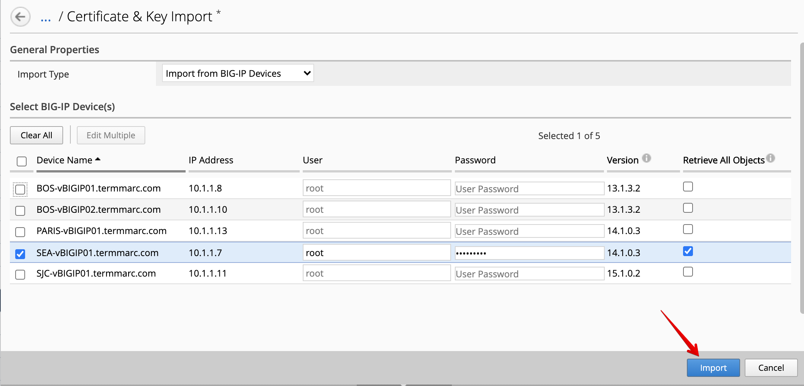
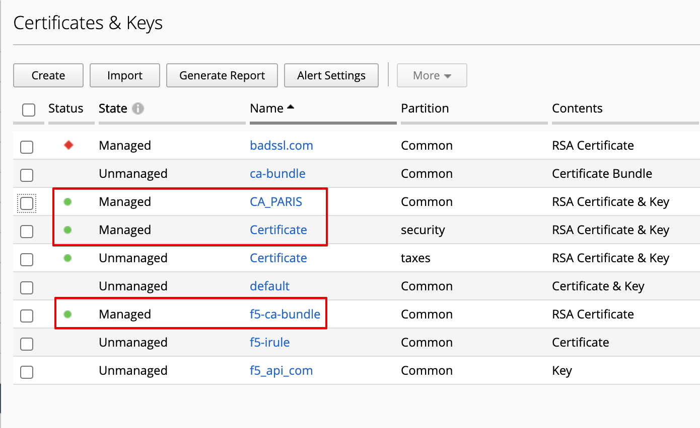
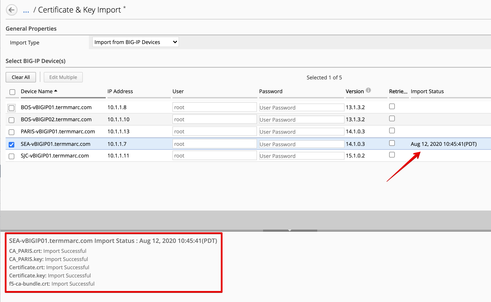

Lab 1.1: Import all Certificates & keys from multiple devices in BIG-IQ
-----------------------------------------------------------------------

.. note:: Estimated time to complete: **5 minutes**

.. include:: /accesslab.rst

Tasks
^^^^^

1. Login as **david** in BIG-IQ and navigate to **Configuration > LOCAL TRAFFIC > Certificate Management > Certificates & Keys**. 

   On this screen, you will see all the SSL certificates imported from BIG-IPs but not yet managed by BIG-IQ.

.. image:: media/img_module1_lab1-1.png
  :scale: 40%
  :align: center

2. Click on **Import**, then select *Import from BIG-IP Devices*.

3. Select **SEA-vBIGIP01.termmarc.com**, enter device login and password (default user is root, password ``purple123``), check the box *Retrieve All Objects*.

Click on the **Import**

4. After clicking on import, you will be taking back to the list of Certificates & Keys and should see the certificates & keys from **SEA-vBIGIP01.termmarc.com** being managed.

5. If you come back from the previous page, click on **Import**, then select *Import from BIG-IP Devices*, you can see the status and time of the last import.

.. note:: If you are interested to know how to automate the import of Certificate and Key, read the following devcentral article `Automate import of SSL Certificate, Key & CRL from BIG-IP to BIG-IQ`_.

.. _Automate import of SSL Certificate, Key & CRL from BIG-IP to BIG-IQ: https://devcentral.f5.com/s/articles/automate-import-of-ssl-certificate-key-crl-from-big-ip-to-big-iq-31899