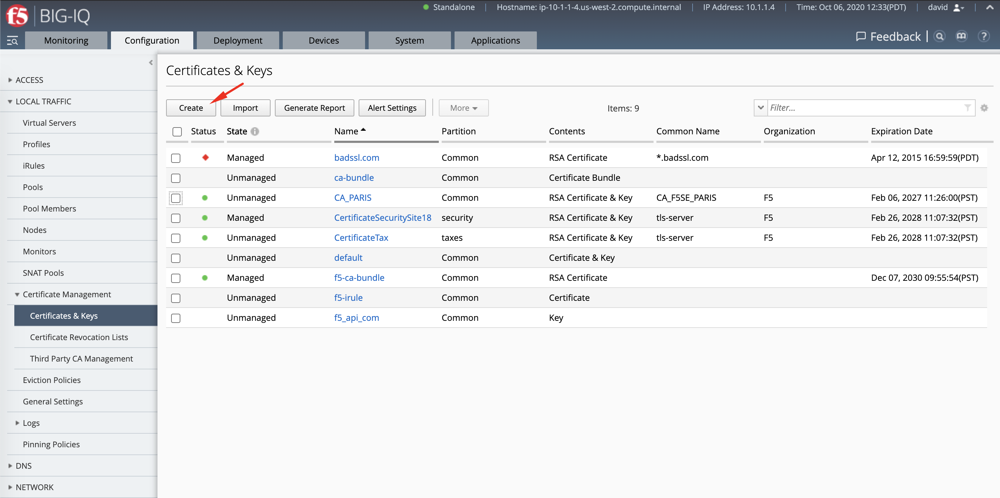
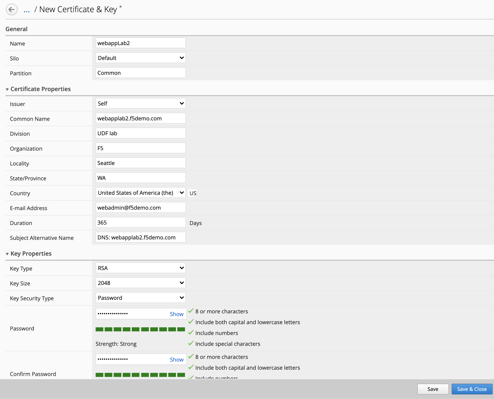
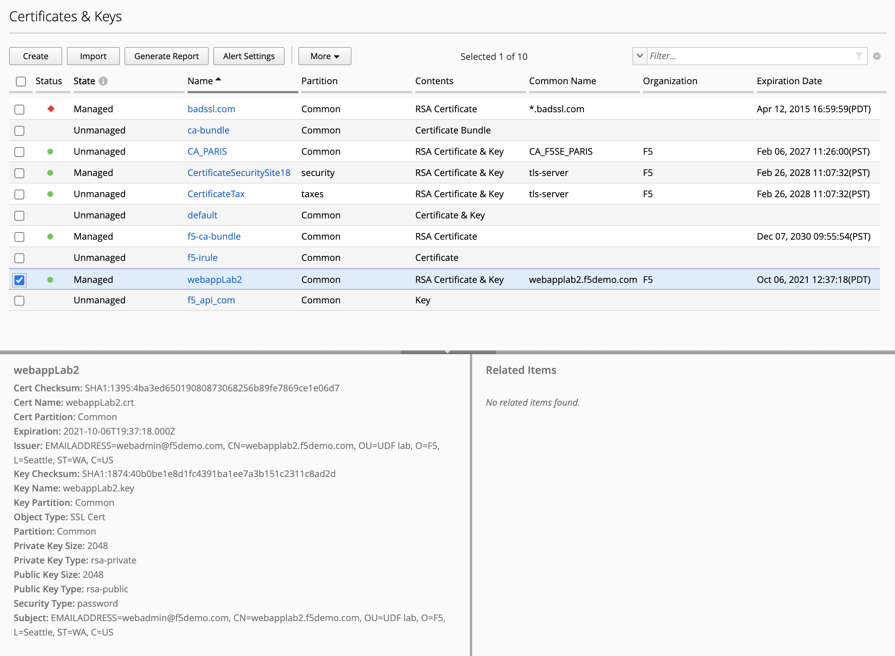
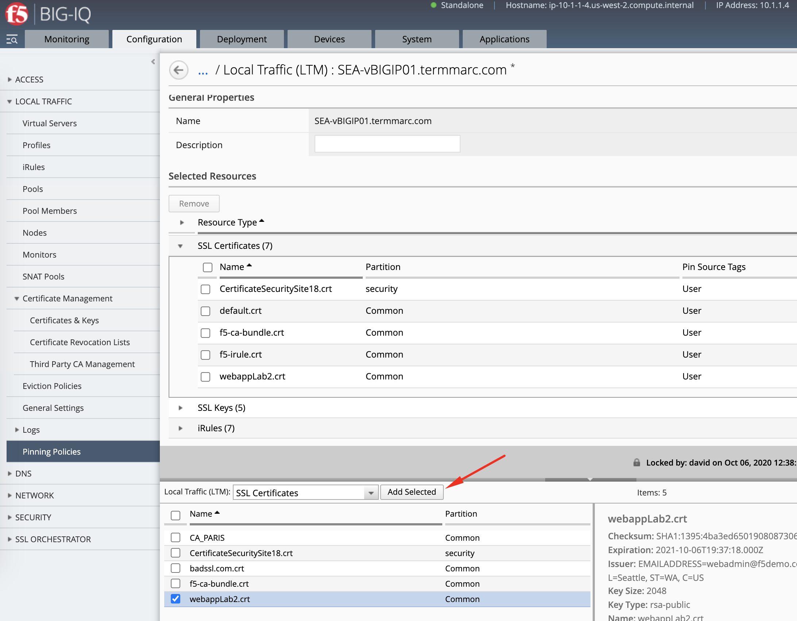
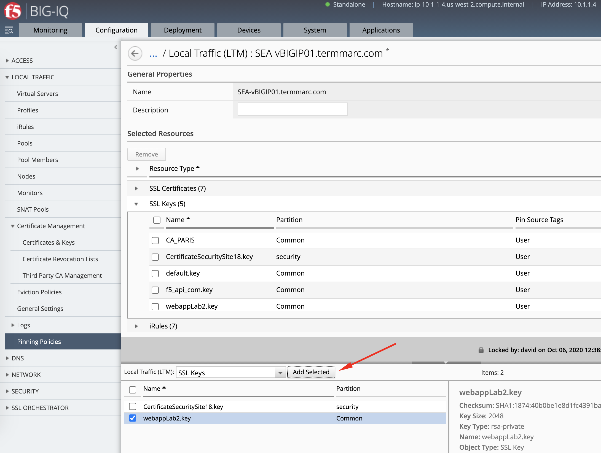
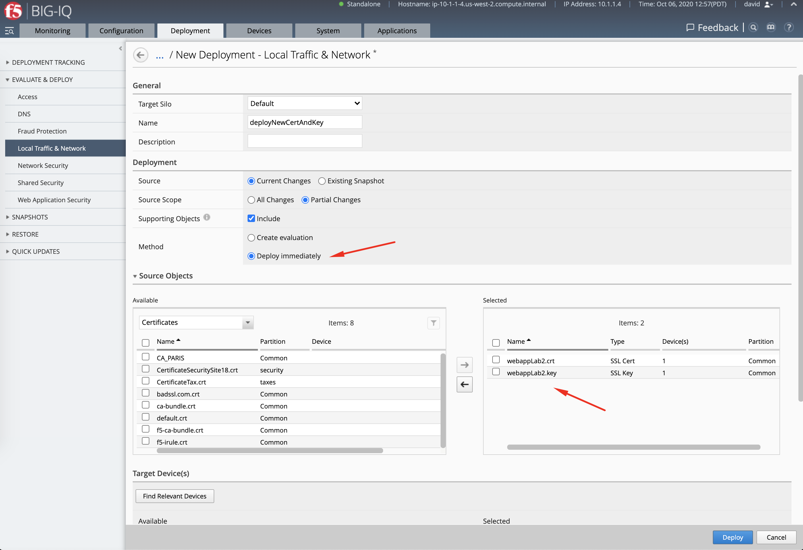
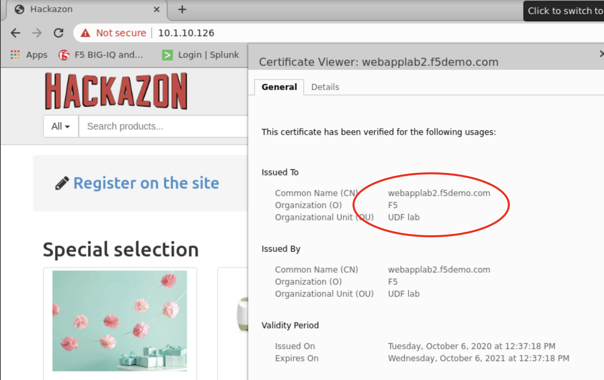
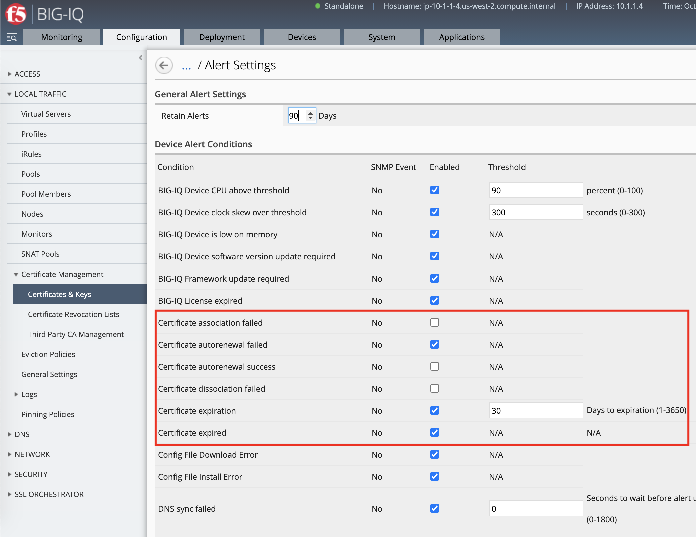

Lab 1.2: Create a self-signed SSL certificate & key on BIG-IQ
-------------------------------------------------------------

.. note:: Estimated time to complete: **10 minutes**

.. include:: /accesslab.rst

SSL Certificate & Key creation on BIG-IQ
^^^^^^^^^^^^^^^^^^^^^^^^^^^^^^^^^^^^^^^^

1. Navigate to **Configuration > Local Traffic > Certificate Management > Certificates & Keys**.

Fill all necessary information and click **Create**. This will generate a certificate request or CSR along with a Private Key.
This CSR will be send to Let's encrypt server which will sign it and send it back to BIG-IQ.

- Name: ``webappLab2``
- Issuer: ``Self``
- Common Name: ``webapplab2.f5demo.com``
- Division: ``UDF lab``
- Organization: ``F5``
- Locality: ``Seattle``
- State/Province: ``WA``
- Country: ``US``
- E-mail Address: ``webadmin@f5demo.com``
- Subject Alternative Name: ``DNS: webapplab2.f5demo.com``
- Key Password: ``Password@123456``

2. After the Certificate Request is signed, it will show Managed on the BIG-IQ and ready to be deploy on the BIG-IP.

3. Now, let's pin both certificate and key to a device. Navigate to Pinning Policies under Local Traffic.

Click on **SEA-vBIGIP01.termmarc.com** device.

Look for the SSL certificate and add it to the device.

Repeat the same with the SSL Key:

4. Deploy the SSL objects to the BIG-IP.

Navigate **Deployment > Evaluate & Deploy > Local Traffic & Networks**.

Create a new deployment:

- Source Scope: ``Partial Change``
- Method: ``Deploy Immediately``
- Source Objects: select both SSL certificate & Key
- Target Device(s): ``SEA-vBIGIP01.termmarc.com``

Click **Deploy**.

AS3 HTTPS template with SSL Key Passphrase creation
^^^^^^^^^^^^^^^^^^^^^^^^^^^^^^^^^^^^^^^^^^^^^^^^^^^

1. Go back on BIG-IQ and navigate to the Applications tab > Applications Templates and 
   select ``AS3-F5-HTTPS-offload-lb-existing-cert-template-big-iq-default-<version>`` and press **Clone**.

2. Give the cloned template a name: ``AS3-F5-HTTPS-offload-lb-existing-cert-with-passphrase`` and click Clone.

.. image:: ./media/img_module1_lab4-15.png
  :scale: 40%
  :align: center

3. Open the new templates created and select the AS3 class ``Certificates`` on the left menu of the AS3 template editor.

Check **Editable** the 2 following attributes: ``JOSE header`` and ``Ciphertext``.

.. image:: ./media/img_module1_lab4-16.png
  :scale: 40%
  :align: center

4. Save & close the template and publish it so it can be used in the next step.

AS3 HTTPS offload application service creation
^^^^^^^^^^^^^^^^^^^^^^^^^^^^^^^^^^^^^^^^^^^^^^

1. Go to the Applications tab > Applications and  click **Create** to create an Application Service:

+---------------------------------------------------------------------------------------------------+
| Application properties:                                                                           |
+---------------------------------------------------------------------------------------------------+
| * Grouping = New Application                                                                      |
| * Application Name = ``LAB_module2``                                                              |
+---------------------------------------------------------------------------------------------------+
| Select an Application Service Template:                                                           |
+---------------------------------------------------------------------------------------------------+
| * Template Type = Select ``AS3-F5-HTTPS-offload-lb-existing-cert-with-passphrase [AS3]``          |
+---------------------------------------------------------------------------------------------------+
| General Properties:                                                                               |
+---------------------------------------------------------------------------------------------------+
| * Application Service Name = ``https_app_service``                                                |
| * Target = ``SEA-vBIGIP01.termmarc.com``                                                          |
| * Tenant = ``tenant4``                                                                            |
+---------------------------------------------------------------------------------------------------+
| Analytics_Profile. Keep default.                                                                  |
+---------------------------------------------------------------------------------------------------+
| Pool                                                                                              |
+---------------------------------------------------------------------------------------------------+
| * Members: ``10.1.20.116``                                                                        |
+---------------------------------------------------------------------------------------------------+
| TLS_Server. Keep default.                                                                         |
+---------------------------------------------------------------------------------------------------+
| Certificate                                                                                       |
+---------------------------------------------------------------------------------------------------+
| * privateKey: ``/Common/webappLab2.key``                                                          |
| * certificate: ``/Common/webappLab2.crt``                                                         |
| * Passphrase > Ciphertext: ``UGFzc3dvcmRAMTIzNDU2``                                               |
+---------------------------------------------------------------------------------------------------+
| Service_HTTPS                                                                                     |
+---------------------------------------------------------------------------------------------------+
| * Virtual addresses: ``10.1.10.126``                                                              |
+---------------------------------------------------------------------------------------------------+

.. note:: In order to get the value of the Ciphertext, we convert the SSL key password (``Password@123456``) using https://www.url-encode-decode.com/base64-encode-decode/
          More details on the AS3 Certificate class `here <https://clouddocs.f5.com/products/extensions/f5-appsvcs-extension/latest/refguide/schema-reference.html#certificate-passphrase>`_.

2. Check the application ``LAB_module2`` has been created along with the application service https_app_service

.. image:: ./media/img_module1_lab4-17.png
  :scale: 40%
  :align: center

.. note:: If not visible, refresh the page. It can take few seconds for the application service to appears on the dashboard.

4. From the lab environment, launch a remote desktop session to have access to the Ubuntu Desktop. 

You can test the application service by opening a browser in the **Ubuntu Jump-host** and type the URL ``https://10.1.10.126``.

.. note:: The certificate shows not secure as we are using a demo Root CA not imported in the browser by default.

Certificate expiration alerts
^^^^^^^^^^^^^^^^^^^^^^^^^^^^^

BIG-IQ also offers the ability to specify alerts for certificate expiration. 

Navigate to **Configuration > Local Traffic > Certificate Management > Certificates & Keys** and click the **Alert Settings** button to see the alerts options.

