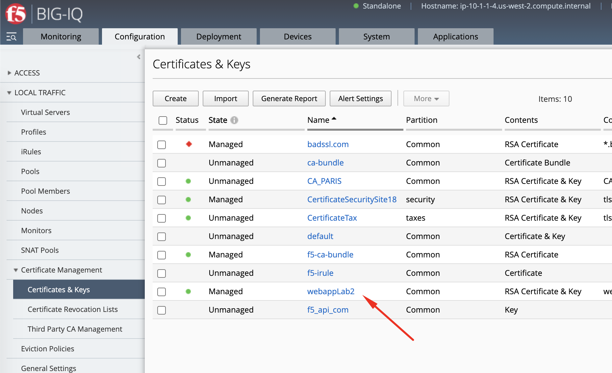
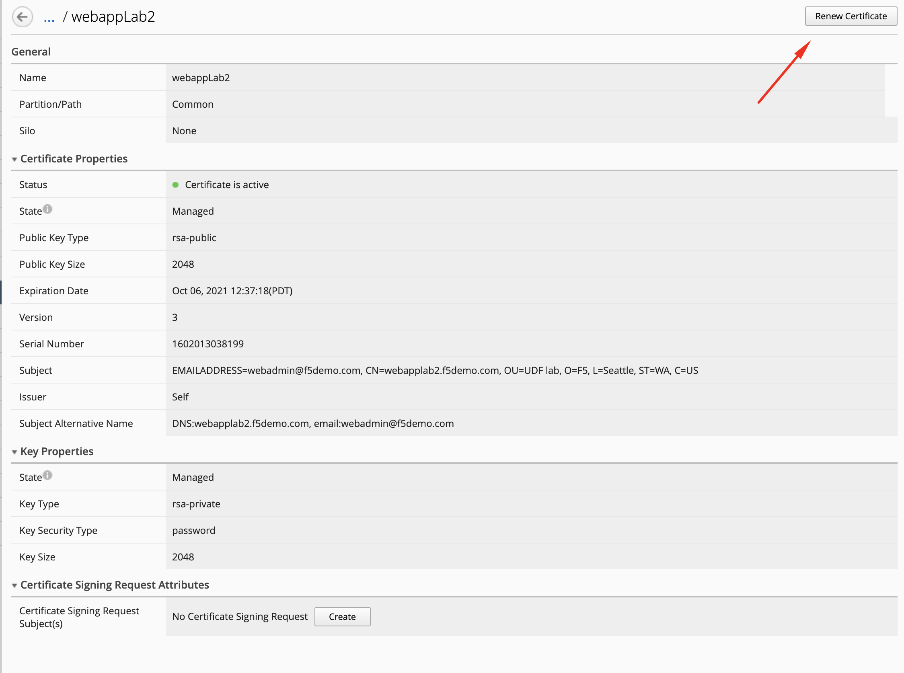
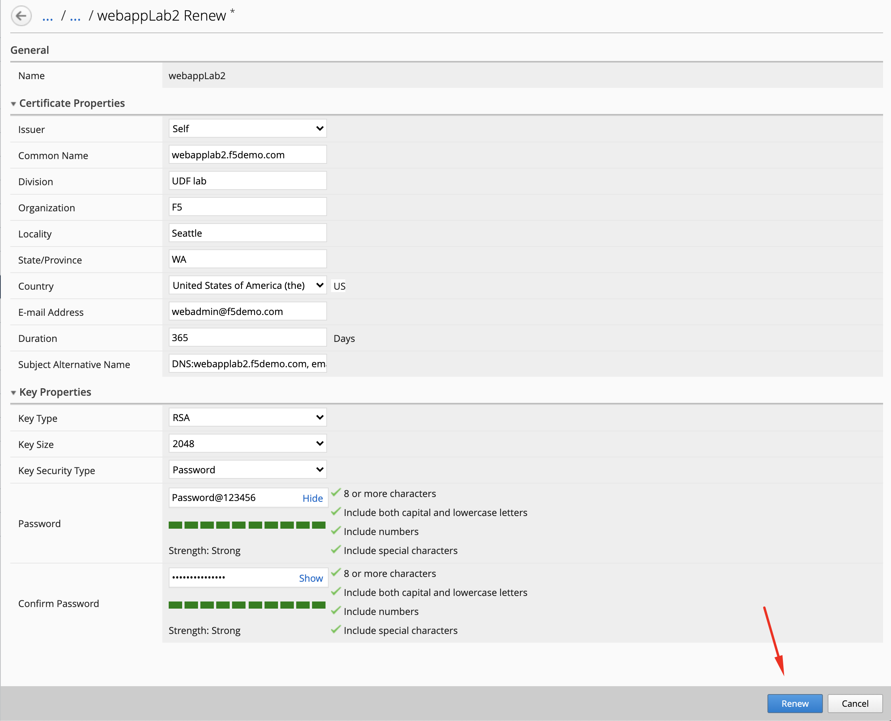
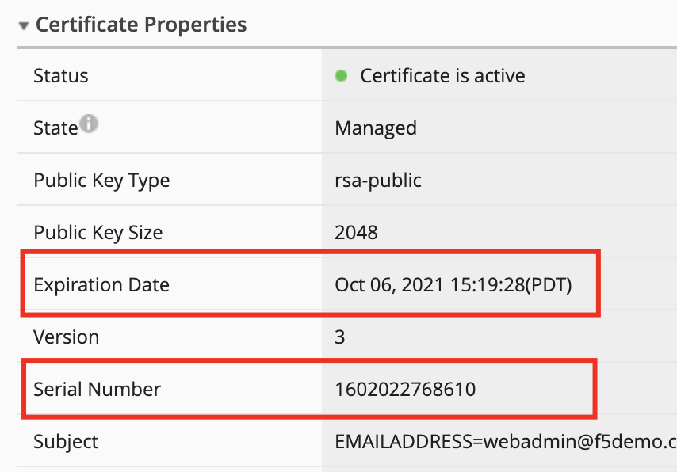
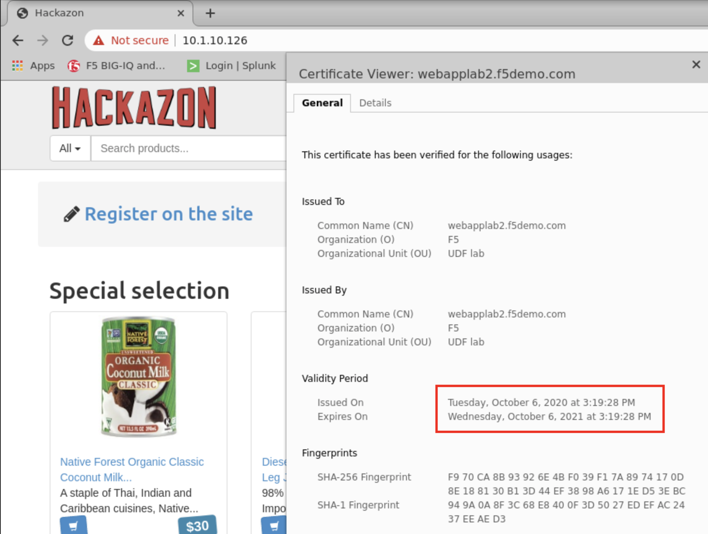

Lab 1.3: Renew expired certificates and deploy from BIG-IQ to managed BIG-IP
----------------------------------------------------------------------------

.. note:: Estimated time to complete: **5 minutes**

We will now test how to renew an expired certificate on BIG-IQ, and push the renewed certificate & key pair to the managed BIG-IPs.

.. include:: /accesslab.rst

Tasks
^^^^^

1. Login as **david** in BIG-IQ and navigate to **Configuration > LOCAL TRAFFIC > Certificate Management > Certificates & Keys**. 

2. Click on existing certificate created in the previous lab ``webappLab2``.

3. On the top right corner, click on **Renew Certificate**

4. Fill the Key Password ``Password@123456`` and click on **Renew**

5. Notice the expiration date and serial number have changed.

6. Deploy the SSL objects to the BIG-IP.

Navigate **Deployment > Evaluate & Deploy > Local Traffic & Networks**.

Create a new deployment:

- Source Scope: ``Partial Change``
- Method: ``Deploy Immediately``
- Source Objects: select both SSL certificate & Key
- Target Device(s): ``SEA-vBIGIP01.termmarc.com``

Click **Deploy**.

.. image:: ./media/img_module1_lab2-6.png
  :scale: 40%
  :align: center

7. From the lab environment, launch a remote desktop session to have access to the Ubuntu Desktop. 

You can test the application service by opening a browser in the **Ubuntu Jump-host** and type the URL ``https://10.1.10.126``.

.. note:: The certificate shows not secure as we are using a demo Root CA not imported in the browser by default.

