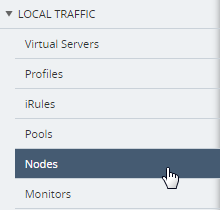
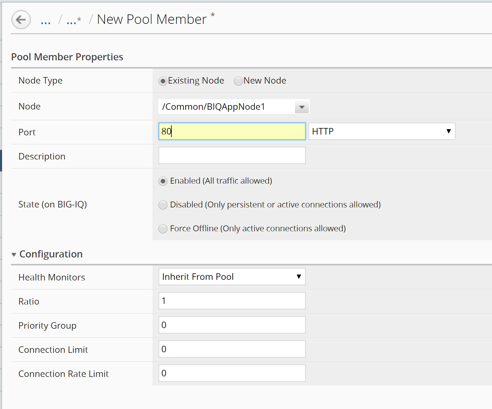
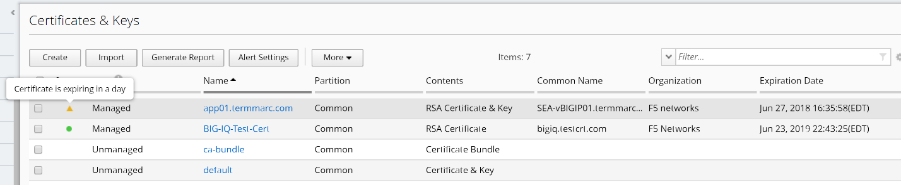
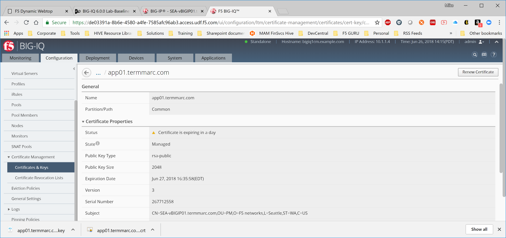
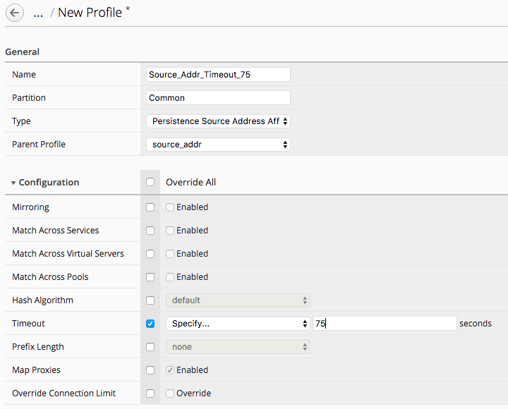
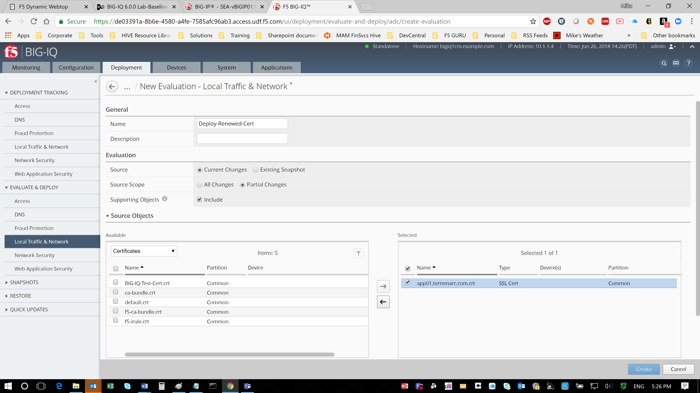
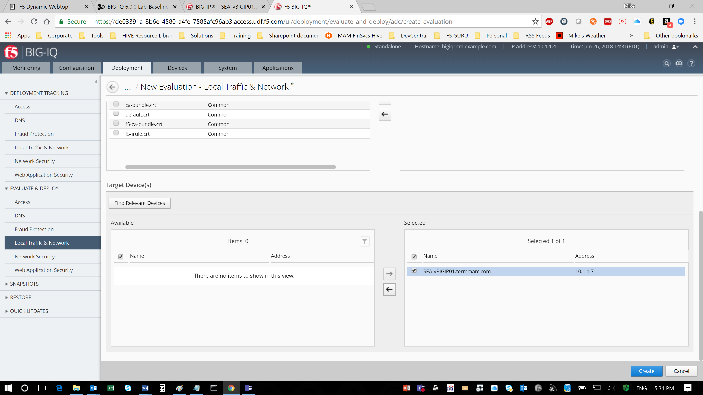
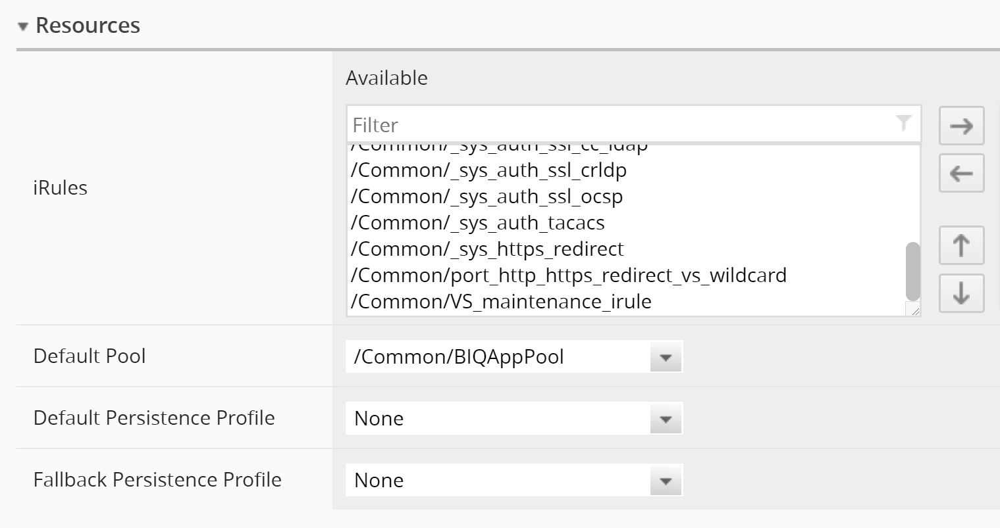

Lab 2.1: Stage a new application on BIG-IQ for deployment
---------------------------------------------------------

.. note:: Estimated time to complete: **10 minutes**

.. include:: /accesslab.rst

Tasks
^^^^^

1.  We will build our application starting at the nodes and making our way to the virtual servers.

Navigate to the **Configuration** tab on the top menu bar.

Navigate to **LOCAL TRAFFIC** > **Nodes**

|image1|

Click the Create button to create a node

|image2|

Fill out the configuration properties for the node
    | Name: **BIQAppNode1**
    | Device: **BOS-vBIGIP01.termmarc.com**
    | Address: **10.1.20.110**

|image3|

Click the **Save & Close** button in the lower right

Repeat above steps for the second node:
    | Name: **BIQAppNode2**
    | Device: **BOS-vBIGIP01.termmarc.com**
    | Address: **10.1.20.121**

Verify that the nodes are created by typing “BIQApp” in the filter box in the upper right and pressing return.
 
 |image4|

You should now see an entry for each of the MyApp nodes on BIG-IP01 and BIG-IP02. 

\*\*\ ***When you create an object on a clustered device, BIG-IQ automatically replicates that configuration to the peer node in the staged configuration.***

|image5|

2. Now we will create a pool with these nodes as pool members.

Navigate to **LOCAL TRAFFIC > Pools**

|image6|

Click the Create button to start creating your pool

|image7|

Fill out the Pool Properties
    | Name: **BIQAppPool**
    | Device: **BOS-vBIGIP01.termmarc.com**
    | Health Monitors: **/Common/tcp**
    | Load Balancing Method: **Round Robin**

|image8|

Click on the New Member button under Resources to add pool members

|image10|

Complete the Pool Member Properties for the first pool member
    | Node Type: **Existing Node**
    | Node: **BIQAppNode1**
    | Port: **80**

|image11|

Click the **Save & Close** button in the lower right to close the Add New Member window.

Repeat the above steps for the second pool member **BIQAppNode2 port 80**.

At last, click the **Save** **& Close** button in the lower right to save your pool.

3. Now we will create a custom profile for our Virtual Server.

Navigate to **LOCAL TRAFFIC > Profiles**
 
 |image12|

Click the Create button to create our custom profile.

|image13|

Fill out the Profile Properties.

    | Name: **Source\_Addr\_Timeout\_75**
    | Type: **Persistence Source Address**
    | Parent Profile: **Source\_addr**
    | Timeout: **Specify 75 Seconds**

|image14|

Click **Save & Close** in the lower right.

4. Now we will create our Virtual Server. 

Navigate to **LOCAL TRAFFIC > Virtual Servers**.

|image15|

Click the Create button to create the Virtual Server.

|image16|

Fill out the Virtual Server Properties:

    | Name: **BIQAppVS**
    | Device: **BOS-vBIGIP01.termmarc.com**
    | Destination Address: **10.1.10.120**
    | Service Port **8088**
    | HTTP Profile: **/Common/http**

|image17|

Scroll down and fill out the "Resources" section:

    | Default Pool: **BIQAppPool**
    | Default Persistence Profile: **Source\_Addr\_Timeout\_75**
    | Leave all other options at their default settings.

|image18|

Click **Save & Close** in the lower right.

We now have staged our application and we will deploy it in a later workflow.

.. |image2| image:: media/image3.png
   :width: 1.91643in
   :height: 1.02071in
.. |image3| image:: media/image4.png
   :width: 4.53068in
   :height: 4.42653in

.. |image5| image:: media/image6.png
   :width: 6.50000in
   :height: 2.30556in
.. |image6| image:: media/image7.png
   :width: 2.28096in
   :height: 1.87477in
.. |image7| image:: media/image8.png
   :width: 1.98934in
   :height: 1.06237in
.. |image8| image:: media/image9.png
   :width: 6.50000in
   :height: 4.62014in
.. |image9| image:: media/image10.png
   :width: 6.50000in
   :height: 0.58611in
.. |image10| image:: media/image11.png
   :width: 1.36441in
   :height: 0.76032in

.. |image17| image:: media/image18.png
   :width: 6.50000in
   :height: 4.10486in
