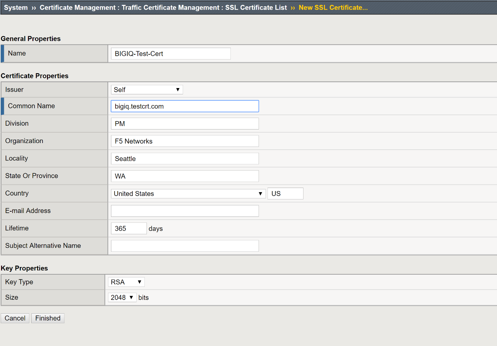
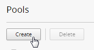
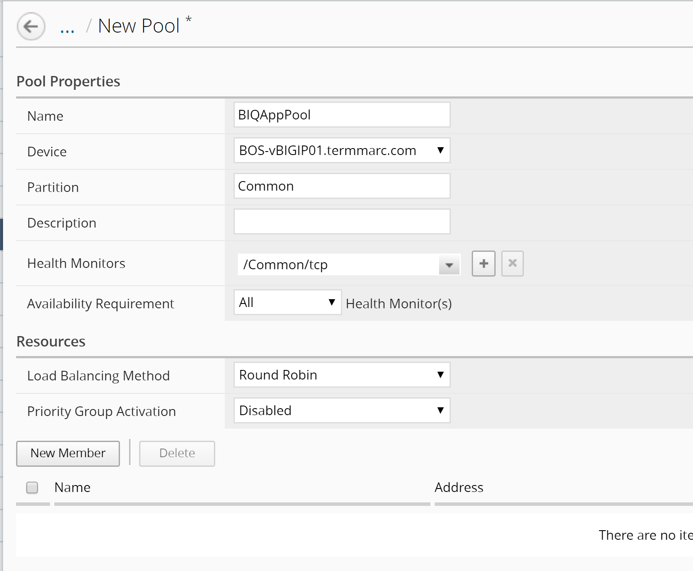
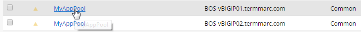

Lab 2.2: Create and Import a self-signed certificates/key to BIG-IQ
-------------------------------------------------------------------

Now that you have tried how to move a BIG-IP client certificate to “Managed”, we can now try to create a BIG-IP self-signed certificate and key pair, then import and manage them on BIG-IQ.

**Step 1: On BOS-vBIGIP01, create a new self-signed certificate.**

Log onto the TMUI interface of the BOS-vBIG-IP01.temmarc.com, go to System >> Certificate Management: Traffic Certificate Management: SSL Certificate List, click Create for a new SSL Certificate.

Name: **BIG-IQ-Test-Cert**
Common Name: **bigiq.testcrt.com**

|image7|

Leave everything else default and click on Finished.

|image8|

Click on Export, and download the BIG-IQ-Test-Cert.crt file.

|image9|

Click on Cancel to return to the BIG-IQ-Test-Cert details screen.

Click on the Key tab on the top, and then click on Export key again to export the BIG-IQ-Test-Cert.key file, and then click on “Download BIG-IQ-Test-Cert.key” to download the Key file.

|image11-1|

Click the Cancel button to return.

Now that we have exported the Cert & Key files, we will go back to BIG-IQ CM and import the files.

**Step 2: Import the Self-Signed Certificate & Key pair to BIG-IQ**

Switch back to the BIG-IQ CM 6.0 TMUI, at the top of the screen, click Configuration.

On the left, click LOCAL TRAFFIC > Certificate Management > Certificates & Keys.  

Click on Import button on the top, select Certificate from the Import Type drop down menu, and choose the BIG-IQ-Test-Cert.crt file from the location where you saved the Cert and Key files.

|image11-2|

Click on the Import button on the lower right, the Certificate file is now imported to BIG-IQ, and the system takes you back to the Certificate & Key screen.

Click on the BIG-IQ-Test-Cert link again on the screen. Find the "Key Properties: State" section, click the Import button. 

To upload the key's file, select Upload File and click the "Choose File" button to navigate to the key file.

Select “Normal” for the Key Security Type: section, and then click on **Save & Close** button on the lower right.

|image10|

BIG-IQ now shows the cert/key being active (green status) and “Managed”.

|image11|

.. |image11| image:: media/image11.png
   :width: 6.48750in
   :height: 1.76250in
.. |image11-1| image:: media/image11-1.png
   :width: 6.49583in
   :height: 2.90833in   
.. |image11-2| image:: media/image11-2.png
   :width: 6.49583in
   :height: 3.39167in