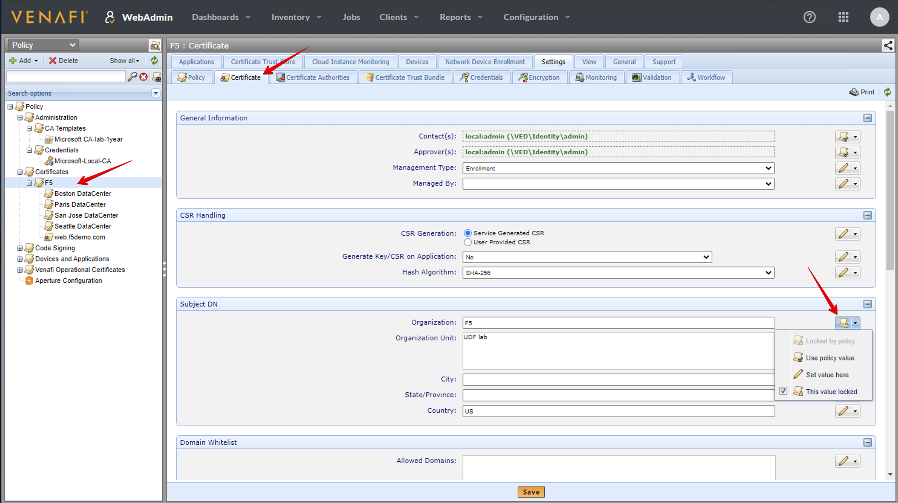
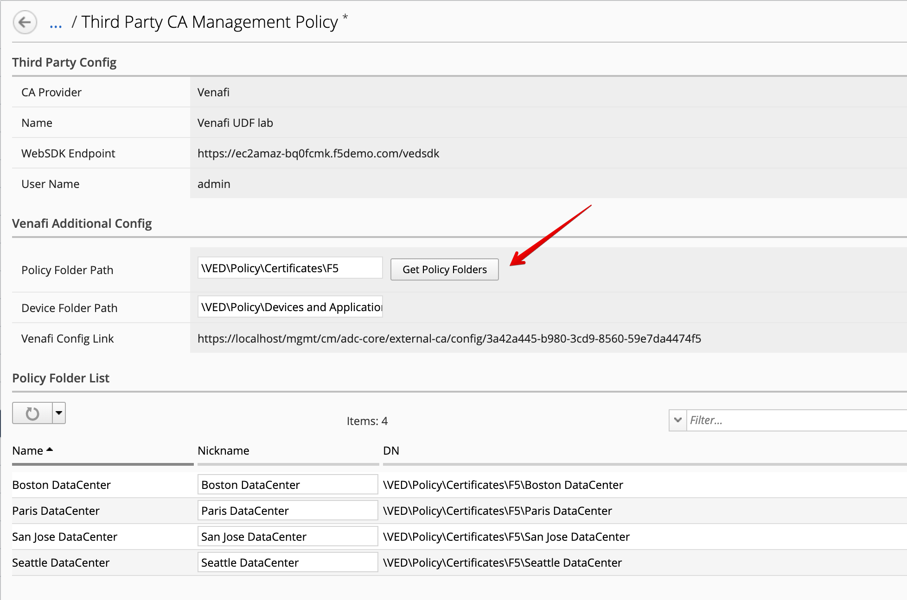
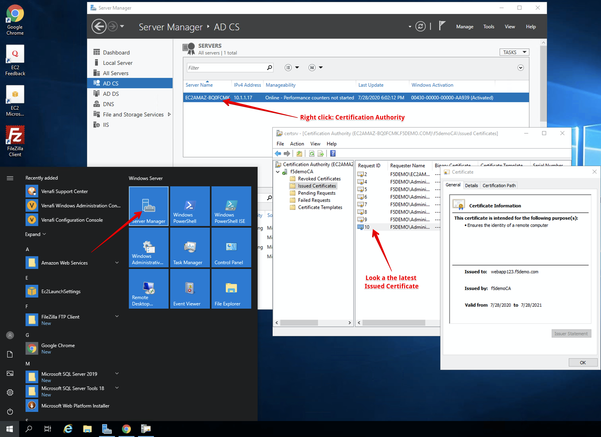

Lab 2.4: Integrating Venafi with BIG-IQ for Certificate Management (new 7.0)
----------------------------------------------------------------------------
F5 Networks and Venafi have partnered to provide a tightly-integrated solution for certificate and key management.
Managing Venafi certificate requests through BIG-IQ automates laborious processes and reduces the amount of time you 
have to spend requesting and distributing certificates and keys to your managed devices. 

More information in `BIG-IQ Knowledge Center`_.

.. _`BIG-IQ Knowledge Center`: https://techdocs.f5.com/en-us/bigiq-7-1-0/integrating-third-party-certificate-management.html

Also:

- `F5 Newsroom Article`_
- `DevCentral Technical Blog Post`_
- `Solution Overview - Automating Protection: Machine Identities, F5 and Venafi`_

.. _`F5 Newsroom Article`: https://www.f5.com/company/blog/machine-identity-protection-is-a-critical-part-of-modern-app-dev
.. _`DevCentral Technical Blog Post`: https://devcentral.f5.com/s/articles/F5-Venafi-Solution-for-enterprise-Key-and-Certificate-management
.. _`Solution Overview - Automating Protection: Machine Identities, F5 and Venafi`: https://www.f5.com/services/resources/use-cases/automating-protection--machine-identities--f5-and-venafi

.. raw:: html

    <iframe width="560" height="315" src="https://www.youtube.com/embed/MUl74aWxE88" frameborder="0" allow="accelerometer; autoplay; encrypted-media; gyroscope; picture-in-picture" allowfullscreen></iframe>

.. raw:: html

    <iframe width="560" height="315" src="https://www.youtube.com/embed/BrkIlhpEGtU" frameborder="0" allow="accelerometer; autoplay; encrypted-media; gyroscope; picture-in-picture" allowfullscreen></iframe>

.. raw:: html

    <iframe width="560" height="315" src="https://www.youtube.com/embed/-LfDKoMYa9Y" frameborder="0" allow="accelerometer; autoplay; encrypted-media; gyroscope; picture-in-picture" allowfullscreen></iframe>

.. raw:: html

    <iframe width="560" height="315" src="https://www.youtube.com/embed/F0GjpYDf2qs" frameborder="0" allow="accelerometer; autoplay; encrypted-media; gyroscope; picture-in-picture" allowfullscreen></iframe>

|

Venafi Setup and Microsoft CA
^^^^^^^^^^^^^^^^^^^^^^^^^^^^^

.. image:: ./media/img_module2_lab4-1.png
  :scale: 40%
  :align: center

.. image:: ./media/img_module2_lab4-3.png
  :scale: 40%
  :align: center

.. image:: ./media/img_module2_lab4-4.png
  :scale: 40%
  :align: center

Configured third-party certificate provider on BIG-IQ
^^^^^^^^^^^^^^^^^^^^^^^^^^^^^^^^^^^^^^^^^^^^^^^^^^^^^

- CA Providers: ``Venafi``
- Name: ``Venafi UDF lab``
- WebSDK Endpoint: ``https://ec2amaz-bq0fcmk.f5demo.com/vedsdk``
- User Name: ``admin``
- Password: ``Purple123@123``

.. image:: ./media/img_module2_lab4-5.png
  :scale: 40%
  :align: center

**Test Connection**

**Save & Close**

.. image:: ./media/img_module2_lab4-6.png
  :scale: 40%
  :align: center

- Policy Folder Path: ``\VED\Policy\Certificates\F5``

SSL Certificate & Key creation on BIG-IQ
^^^^^^^^^^^^^^^^^^^^^^^^^^^^^^^^^^^^^^^^

Name: ``webapp123``
Issuer: ``Venafi UDF lab``
Policy Folder: ``Seattle DataCenter``
Common Name: ``webapp123.f5demo.com``
Division: ``UDF lab``
Organization: ``F5``
Locality: ``Seattle``
State/Province: ``WA``
Country: ``US``
E-mail Address: ``webadmin@f5demo.com``
Subject Alternative Name: ``DNS: webapp123.f5demo.com``
Key Password: ``Password@123456``

.. image:: ./media/img_module2_lab4-8.png
  :scale: 40%
  :align: center

.. image:: ./media/img_module2_lab4-9.png
  :scale: 40%
  :align: center

.. image:: ./media/img_module2_lab4-10.png
  :scale: 40%
  :align: center

AS3 HTTPS offload application service deployment
^^^^^^^^^^^^^^^^^^^^^^^^^^^^^^^^^^^^^^^^^^^^^^^^

to be continue...
