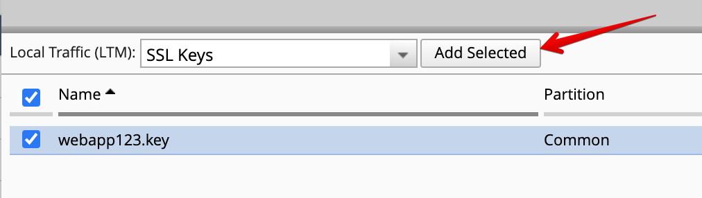
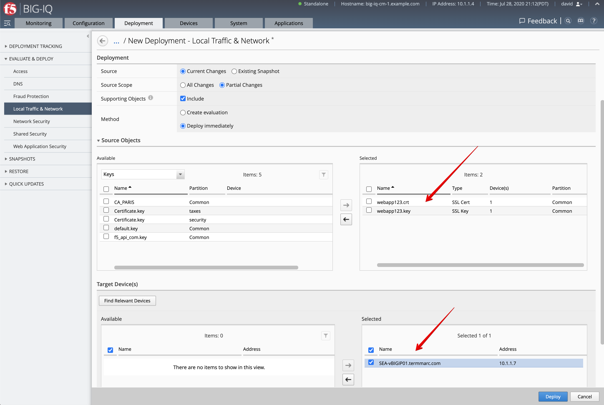
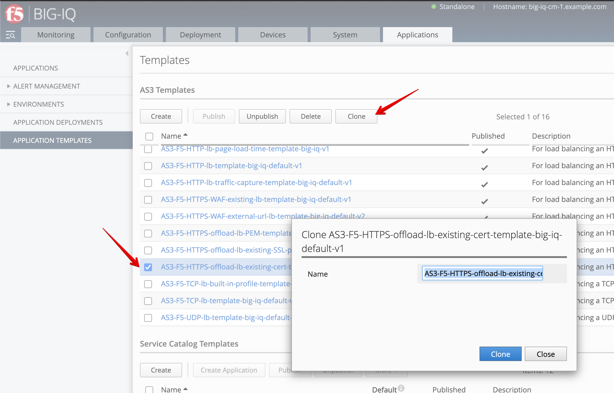
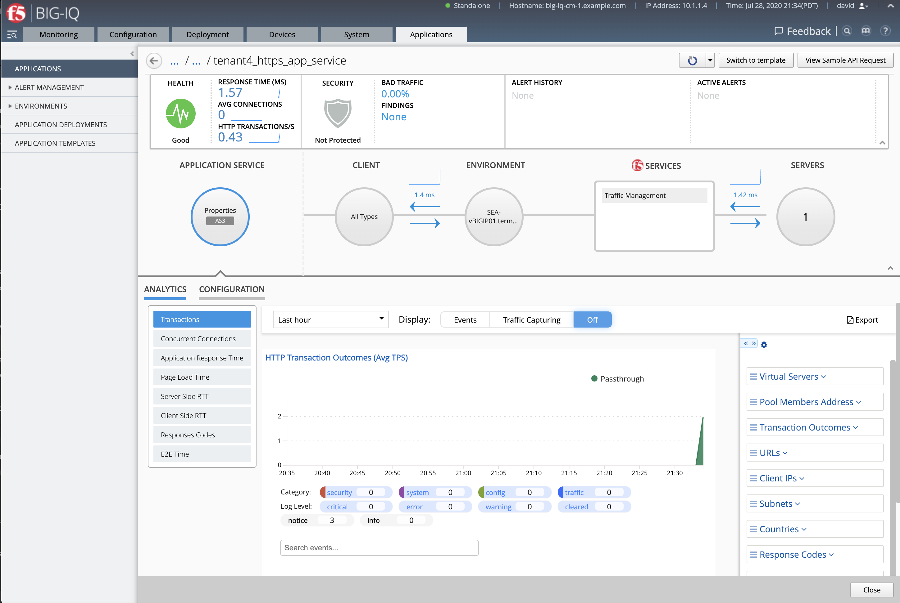
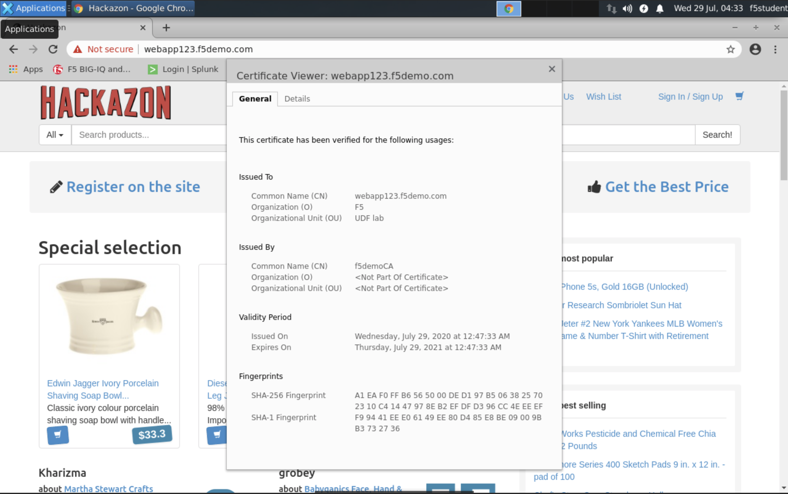

Lab 2.4: Integrating Venafi with BIG-IQ for Certificate Management
------------------------------------------------------------------
F5 Networks and Venafi have partnered to provide a tightly-integrated solution for certificate and key management.
Managing Venafi certificate requests through BIG-IQ automates laborious processes and reduces the amount of time you 
have to spend requesting and distributing certificates and keys to your managed devices. 

More information in `BIG-IQ Knowledge Center`_.

.. _`BIG-IQ Knowledge Center`: https://techdocs.f5.com/en-us/bigiq-7-1-0/integrating-third-party-certificate-management.html

Also:

- `F5 Newsroom Article`_
- `DevCentral Technical Blog Post`_
- `F5 Venafi Solution for Enterprise Key and Certificate Management without AS3`_

.. _`F5 Newsroom Article`: https://www.f5.com/company/blog/machine-identity-protection-is-a-critical-part-of-modern-app-dev
.. _`DevCentral Technical Blog Post`: https://devcentral.f5.com/s/articles/F5-Venafi-Solution-for-enterprise-Key-and-Certificate-management
.. _`F5 Venafi Solution for Enterprise Key and Certificate Management without AS3`: https://www.f5.com/services/resources/use-cases/automating-protection--machine-identities--f5-and-venafi

.. raw:: html

    <iframe width="560" height="315" src="https://www.youtube.com/embed/MUl74aWxE88" frameborder="0" allow="accelerometer; autoplay; encrypted-media; gyroscope; picture-in-picture" allowfullscreen></iframe>

.. raw:: html

    <iframe width="560" height="315" src="https://www.youtube.com/embed/-LfDKoMYa9Y" frameborder="0" allow="accelerometer; autoplay; encrypted-media; gyroscope; picture-in-picture" allowfullscreen></iframe>

Watch the video from our partner Venafi:

- |video1|
- |video3|

.. |video1| raw:: html

   <a href="https://youtu.be/BrkIlhpEGtU" target="_blank">F5 Solution Overview: The Difference Between Big-IP and Big-IQ | Paul Cleary, Venafi</a>

.. |video1| raw:: html

   <a href="https://youtu.be/F0GjpYDf2qs" target="_blank">F5 New Application Deployed via Big-IQ | Paul Cleary, Venafi</a>

|


Venafi Setup and Microsoft CA
^^^^^^^^^^^^^^^^^^^^^^^^^^^^^

1. Open the **Venafi Trust Protection** in the Windows Server 2019 (start it if stopped).

2. Open Chrome and open the Venafi Web Admin Console ``https://ec2amaz-bq0fcmk.f5demo.com/vedadmin``.

.. image:: ./media/img_module2_lab4-1.png
  :scale: 40%
  :align: center

.. image:: ./media/img_module2_lab4-2.png
  :scale: 40%
  :align: center

.. image:: ./media/img_module2_lab4-3.png
  :scale: 40%
  :align: center

.. image:: ./media/img_module2_lab4-4.png
  :scale: 40%
  :align: center


Configured third-party certificate provider on BIG-IQ
^^^^^^^^^^^^^^^^^^^^^^^^^^^^^^^^^^^^^^^^^^^^^^^^^^^^^

1. Login to BIG-IQ as **david** by opening a browser and go to: ``https://10.1.1.4``.

Navigate to Configuration tab > Local Traffic > Certificate Management > Third Party CA Management.

Click **Create**.

- CA Providers: ``Venafi``
- Name: ``Venafi UDF lab``
- WebSDK Endpoint: ``https://ec2amaz-bq0fcmk.f5demo.com/vedsdk``
- User Name: ``admin``
- Password: ``Purple123@123``

.. image:: ./media/img_module2_lab4-5.png
  :scale: 40%
  :align: center

Click on **Test Connection**.

**Save & Close**

.. image:: ./media/img_module2_lab4-6.png
  :scale: 40%
  :align: center

- Policy Folder Path: ``\VED\Policy\Certificates\F5``

.. image:: ./media/img_module2_lab4-7.png
  :scale: 40%
  :align: center


SSL Certificate & Key creation on BIG-IQ
^^^^^^^^^^^^^^^^^^^^^^^^^^^^^^^^^^^^^^^^

1. Navigate to Configuration tab > Local Traffic > Certificate Management > Certificates & Keys.

Fill all necessary information and click **Create**. This will generate a certificate request or CSR along with a Private Key.
This CSR will be send to Let's encrypt server which will sign it and send it back to BIG-IQ.

- Name: ``webapp123``
- Issuer: ``Venafi UDF lab``
- Policy Folder: ``Seattle DataCenter``
- Common Name: ``webapp123.f5demo.com``
- Division: ``UDF lab``
- Organization: ``F5``
- Locality: ``Seattle``
- State/Province: ``WA``
- Country: ``US``
- E-mail Address: ``webadmin@f5demo.com``
- Subject Alternative Name: ``DNS: webapp123.f5demo.com``
- Key Password: ``Password@123456``


.. image:: ./media/img_module2_lab4-8.png
  :scale: 40%
  :align: center

2. After the Certificate Request is signed, it will show Managed on the BIG-IQ and ready to be deploy on the BIG-IP.

.. image:: ./media/img_module2_lab4-9.png
  :scale: 40%
  :align: center

3. On Venafi

.. image:: ./media/img_module2_lab4-10.png
  :scale: 40%
  :align: center


.. image:: ./media/img_module2_lab4-11.png
  :scale: 40%
  :align: center

3. Now, let's pin both certificate and key to a device. Navigate to Pinning Policies under Local Traffic.

Click on **SEA-vBIGIP01.termmarc.com** device.

Look for the SSL certificate and add it to the device.

.. image:: ./media/img_module2_lab4-12.png
  :scale: 40%
  :align: center

Repeat the same with the SSL Key:



4. Deploy the SSL objects to the BIG-IQ.

Navigate Deployment tab > Evaluate & Deploy > Local Traffic & Networks.

Create a new deployment:

- Source Scope: ``Partial Change``
- Method: ``Deploy Immediately``
- Source Objects: select both SSL certificate & Key
- Target Device(s): ``SEA-vBIGIP01.termmarc.com``

Click **Deploy**.




AS3 HTTPS template with SSL Key Passphrase creation
^^^^^^^^^^^^^^^^^^^^^^^^^^^^^^^^^^^^^^^^^^^^^^^^^^^




.. image:: ./media/img_module2_lab4-16.png
  :scale: 40%
  :align: center


AS3 HTTPS offload application service deployment
^^^^^^^^^^^^^^^^^^^^^^^^^^^^^^^^^^^^^^^^^^^^^^^^

1. Go to the Applications tab > Applications and  click **Create** to create an Application Service:

+---------------------------------------------------------------------------------------------------+
| Application properties:                                                                           |
+---------------------------------------------------------------------------------------------------+
| * Grouping = Part of an Existing Application                                                      |
| * Application Name = ``LAB_module2``                                                              |
+---------------------------------------------------------------------------------------------------+
| Select an Application Service Template:                                                           |
+---------------------------------------------------------------------------------------------------+
| * Template Type = Select ``AS3-F5-HTTPS-offload-lb-existing-cert-with-passphrase [AS3]``          |
+---------------------------------------------------------------------------------------------------+
| General Properties:                                                                               |
+---------------------------------------------------------------------------------------------------+
| * Application Service Name = ``https_app_service``                                                |
| * Target = ``SEA-vBIGIP01.termmarc.com``                                                          |
| * Tenant = ``tenant4``                                                                            |
+---------------------------------------------------------------------------------------------------+
| Analytics_Profile. Keep default.                                                                  |
+---------------------------------------------------------------------------------------------------+
| Pool                                                                                              |
+---------------------------------------------------------------------------------------------------+
| * Members: ``10.1.20.115``                                                                        |
+---------------------------------------------------------------------------------------------------+
| TLS_Server. Keep default.                                                                         |
+---------------------------------------------------------------------------------------------------+
| Certificate                                                                                       |
+---------------------------------------------------------------------------------------------------+
| * privateKey: ``/Common/webapp123.key``                                                           |
| * certificate: ``/Common/webapp123.crt``                                                          |
| * Passphrase > Ciphertext: ``UGFzc3dvcmRAMTIzNDU2``                                               |
+---------------------------------------------------------------------------------------------------+
| Service_HTTPS                                                                                     |
+---------------------------------------------------------------------------------------------------+
| * Virtual addresses: ````                                                              |
+---------------------------------------------------------------------------------------------------+

.. note:: In order to get the value of the Ciphertext, we convert the SSL key password (``Password@123456``) using https://www.url-encode-decode.com/base64-encode-decode/
          More details on the AS3 Certificate class `here <https://clouddocs.f5.com/products/extensions/f5-appsvcs-extension/latest/refguide/schema-reference.html#certificate-passphrase>`_.

2. Check the application ``LAB_module2`` has been created along with the application service https_app_service



.. note:: If not visible, refresh the page. It can take few seconds for the application service to appears on the dashboard.

3. SSH Ubuntu host in lab environment and add the domain name and Virtual address to the /etc/hosts file.

We are doing this to be able to use the domain name we used in the SSL certificate along with the Virtual IP address created in BIG-IP.
This is only for this lab.

.. code::

    f5student@ip-10-1-1-5:~$ sudo su -
    root@ip-10-1-1-5:/home/f5student# echo "10.1.10.126 webapp123.f5demo.com" >> /etc/hosts
    root@ip-10-1-1-5:/home/f5student# nslookup webapp123.f5demo.com


4. From the lab environment, launch a remote desktop session to have access to the Ubuntu Desktop. 
To do this, in your lab environment, click on the *Access* button
of the *Ubuntu Lamp Server* system and select *noVNC* or *xRDP*.

.. note:: Modern laptops with higher resolutions you might want to use 1440x900 and once XRDP is launched Zoom to 200%.

You can test the application service by opening a browser in the Ubuntu Jump-host and type the URL ``https://webapp123.f5demo.com``.

.. note:: The certificate shows not secure as we are using a demo Root CA not imported in the browser by default.


