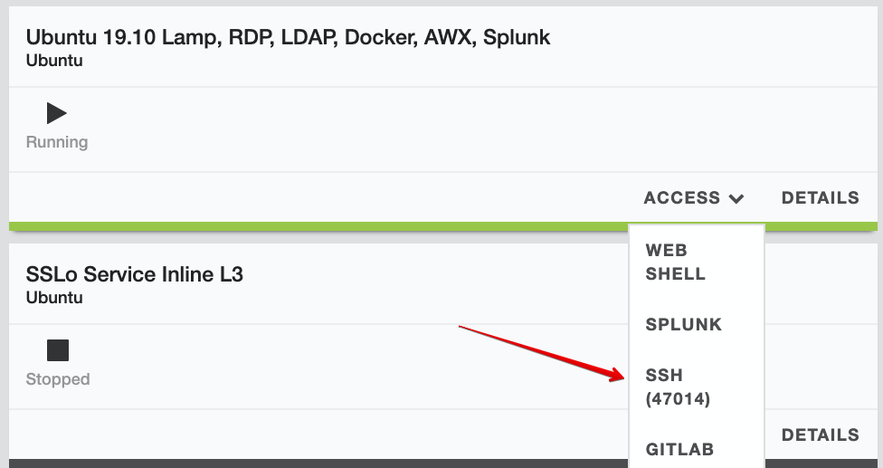
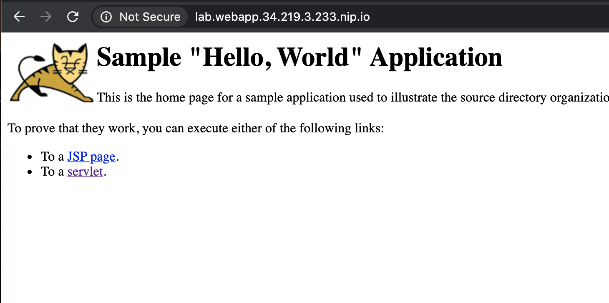
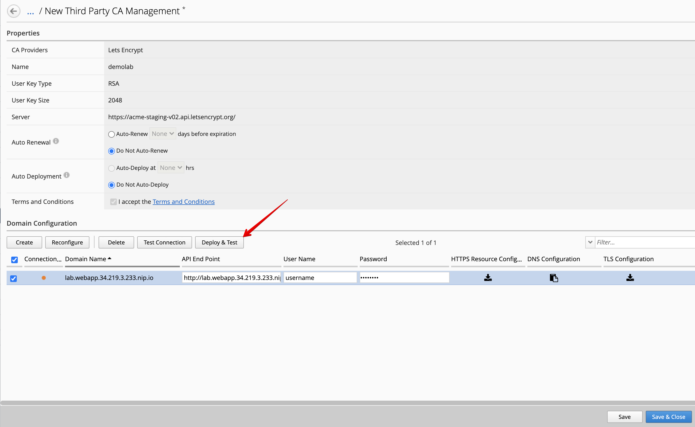
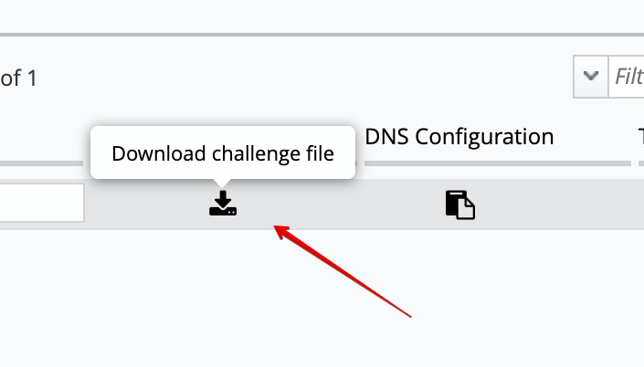
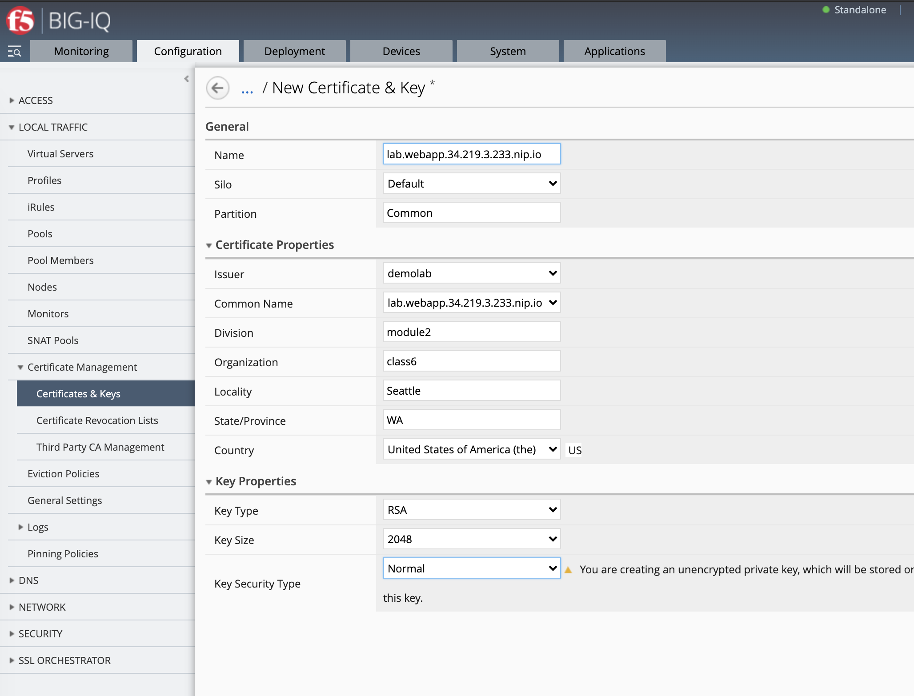
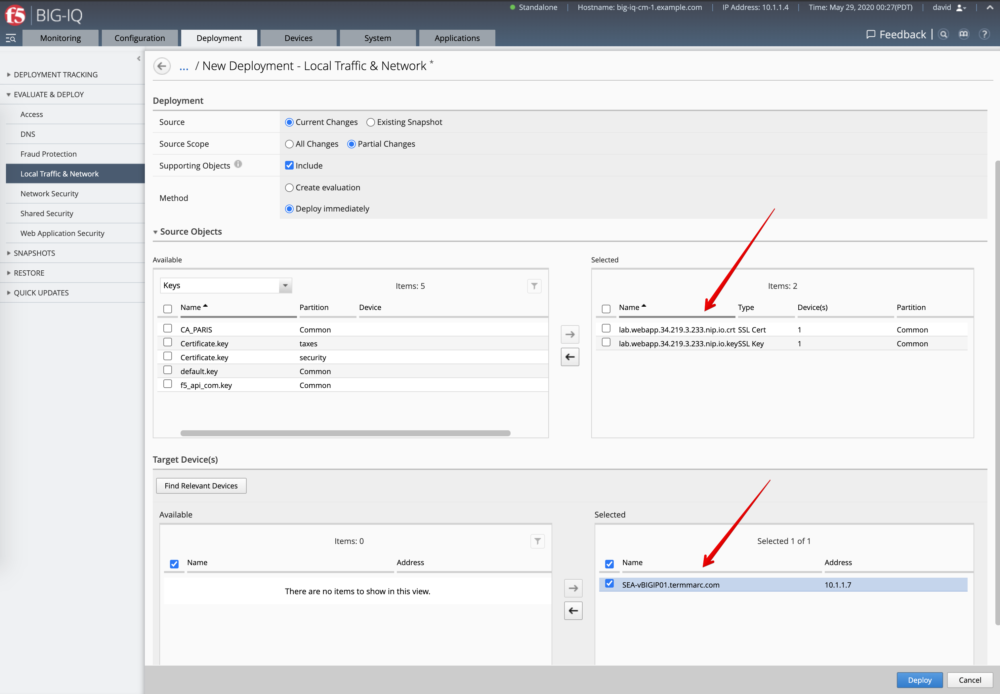
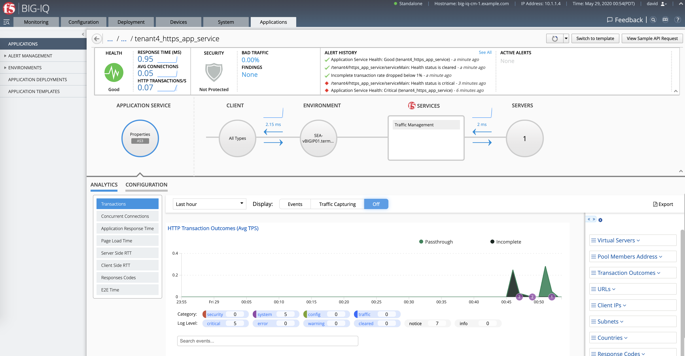
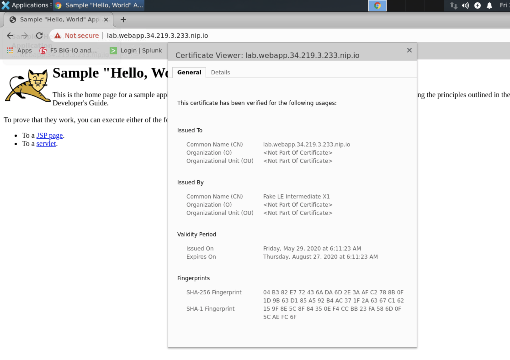
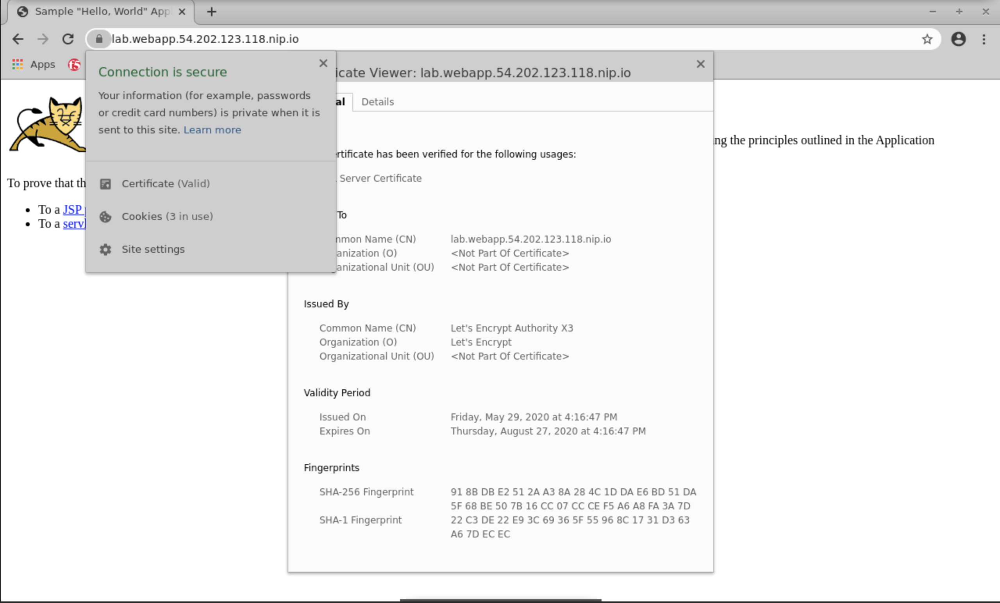

Lab 2.5: Integrating Let's Encrypt with BIG-IQ for Certificate Management (new 7.1)
-----------------------------------------------------------------------------------

In this lab, we are going to do the initial authentication/validation with the Let's Encrypt servers.
Then create a certificate request and key using BIG-IQ and sign it with Let's Encrypt stage server.
Finally, the last step will be to deploy the new certificate and key to a BIG-IP and create an 
HTTPS Application Service using AS3 to serve the web application and do HTTPS offload.

More information in `BIG-IQ Knowledge Center`_ and `Let’s Encrypt website`_.

.. _`BIG-IQ Knowledge Center`: https://techdocs.f5.com/en-us/bigiq-7-1-0/integrating-third-party-certificate-management.html
.. _Let’s Encrypt website: https://letsencrypt.org/how-it-works/

Demo web server and domain name setup in AWS
^^^^^^^^^^^^^^^^^^^^^^^^^^^^^^^^^^^^^^^^^^^^

To do this lab, we will need a real domain name and a web server accessible from the Let's Encrypt servers.
We will start by deploying the web server (simple Hello World Java web app) on a EC2 instance in AWS.

1. Create the AWS environment and VPN

.. warning:: If you already created an AWS environment and VPN in Class 2 Module 4 (AWS SSG) or Class 5 Module 8 (VE creation),
             you do not need to recreate this item.

SSH Ubuntu host in lab environment:

Navigate to: ``cd f5-aws-vpn-ssg``

Execute the Ansible scripts to create the AWS resources (including VPN between AWS and the lab), cloud provider and cloud environment.

``./000-RUN_ALL.sh vpn``

.. note:: VPN object and servers can take up to 15 minutes to complete.

The console will output your ephemeral credentials for the resources created as well as 
the demo web server public IP running in AWS. Save these for later use.

2. We are going to use for this lab one of the below wildcard DNS services along with the demo web server public IP address in AWS.

This will give us a valid domain name to use to generate a certificate with Let's Encrypt.

We are going to use a domain name like lab.webapp.34.219.3.233.nip.io resolves to IP address 34.219.3.233.

+-----------------------+-------------------------------------------------+
| Wildcard DNS services |                    Example                      |
+=======================+=================================================+
| xip.io                | ``http://lab.webapp.34.219.3.233.xip.io/``      |
+-----------------------+-------------------------------------------------+
| nip.io                | ``http://lab.webapp.34.219.3.233.nip.io/``      |
+-----------------------+-------------------------------------------------+
| sslip.io              | ``http://lab.webapp.34.219.3.233.sslip.io/``    |
+-----------------------+-------------------------------------------------+

.. note:: Replace ``lab.webapp.34.219.3.233.nip.io`` and ``34.219.3.233`` with the correct wildcard DNS services 
          and demo web server public IP address in AWS.

3. Let's use nip.io service for the remaining of the lab.

Open a browser and navigate to ``http://lab.webapp.34.219.3.233.nip.io``

This is our demo web server which is available on port 80 (HTTP).

4. This demo web server is hosting an API call to automatically deploy challenge resources to it.

The API available for automatic deploy the HTTP challenge file is ``http://lab.webapp.34.219.3.233.nip.io/hello``

For demo purpose, the API call is showing current HTTP challenge file(s) if any available on the demo web server.
Note the challenge file must be located under ``.well-known/acme-challenge`` at the root of the web site.

The location is defined by IETF and used to demonstrate ownership of a domain.

.. image:: ./media/img_module2_lab5-2.png
  :scale: 40%
  :align: center

Here is the API call the BIG-IQ does to the web app API to deploy the HTTP challenge file.

.. code-block:: yaml

    {
        "username": "username",
        "password": "password",
        "challenges": [
            {
                "type": "http",
                "fileName": "u0I9eyI38aLP-xBs4x1TkYklr0hyvJ6RzWnwnIK2s",
                "content": "u0I9eyI38aLP-xBs4x1TkYklhyvJ6RzWnwu8nIK2s.yI3JvlzD374If-XdBCLA729aSeiJb7hqPqfd9PxG8"
            }
        ]
    }

.. note:: The use of an API to deploy automatically the HTTP challenge file to the web server is optional.
          The challenge file can be uploaded manually in the ``.well-known/acme-challenge`` folder in the web server.

Configured third-party certificate provider on BIG-IQ
^^^^^^^^^^^^^^^^^^^^^^^^^^^^^^^^^^^^^^^^^^^^^^^^^^^^^

1. Login to BIG-IQ as **david** by opening a browser and go to: ``https://10.1.1.4``.

Navigate to Configuration tab > Local Traffic > Certificate Management > Third Party CA Management.

Click **Create**.

- Name: ``demolab``
- CA Providers: ``Lets Encrypt``
- Server: ``https://acme-staging-v02.api.letsencrypt.org/``

Validate the server and accept the Terms and Conditions.

.. note:: We are using the Let's encrypt stage server for this lab which won't generate a validate certificate.
          If you want to generate a valid certificate, use Let's encrypt production server https://acme-v02.api.letsencrypt.org/
          to sign the certificate request in BIG-IQ.

.. image:: ./media/img_module2_lab5-3.png
  :scale: 40%
  :align: center

2. Under Domain Configuration, click **Create**.

.. note:: Replace ``lab.webapp.34.219.3.233.nip.io`` and ``34.219.3.233`` with the correct wildcard DNS services 
          and demo web server public IP address in AWS.

- Domain Name: ``lab.webapp.34.219.3.233.nip.io``
- API End Point: ``http://lab.webapp.34.219.3.233.nip.io/hello``
- User Name: ``username``
- Password: ``password``

Click **Deploy & Test**.

3. While previous step is in progress, in your browser open ``http://lab.webapp.34.219.3.233.nip.io/hello``.

Notice a new HTTP challenge file has been added automatically.

.. image:: ./media/img_module2_lab5-5.png
  :scale: 40%
  :align: center

4. Download the HTTP challenge file and compare with previous value showing in the previous step.

.. note:: For security reason, it is not recommended to keep the HTTP challenge file for long.
          The API example used on the demo web app server is deleting challenge file on the web server automatically
          after validation is done.

5. Wait until the Connection Status icon turns green and show Valid.

.. image:: ./media/img_module2_lab5-7.png
  :scale: 40%
  :align: center

.. note:: Challenge content is getting expired in below conditions:
            - 7 days if validation is not done (status: pending)
            - 30 days if validation is done with Let's Encrypt server (status: valid)
            - If any wrong validations request has been sent, Let's Encrypt invalided the challenge immediately.

          The use of the custom API on the web server will allow to automate the renewal of the HTTP challenge file.

SSL Certificate & Key creation on BIG-IQ
^^^^^^^^^^^^^^^^^^^^^^^^^^^^^^^^^^^^^^^^

1. Navigate to Configuration tab > Local Traffic > Certificate Management > Certificates & Keys.

Fill all necessary information and click **Create**. This will generate a certificate request or CSR along with a Private Key.
This CSR will be send to Let's encrypt server which will sign it and send it back to BIG-IQ.

- Name: ``lab.webapp.34.219.3.233.nip.io``
- Issuer: ``demolab``
- Common Name: ``lab.webapp.34.219.3.233.nip.io``
- Division: ``module2``
- Organization: ``class6``
- Locality: ``Seattle``
- State/Province: ``WA``
- Country: ``USA``
- Key Security Type: ``Normal``

2. After the Certificate Request is signed, it will show Managed on the BIG-IQ and ready to be deploy on the BIG-IP.

.. image:: ./media/img_module2_lab5-9.png
  :scale: 40%
  :align: center

3. Now, let's pin both certificate and key to a device. Navigate to Pinning Policies under Local Traffic.

Click on **SEA-vBIGIP01.termmarc.com** device.

Look for the SSL certificate and add it to the device.

.. image:: ./media/img_module2_lab5-10.png
  :scale: 40%
  :align: center

Repeat the same with the SSL Key:

.. image:: ./media/img_module2_lab5-11.png
  :scale: 80%
  :align: center

4. Deploy the SSL objects to the BIG-IQ.

Navigate Deployment tab > Evaluate & Deploy > Local Traffic & Networks.

Create a new deployment:

- Source Scope: ``Partial Change``
- Method: ``Deploy Immediately``
- Source Objects: select both SSL certificate & Key
- Target Device(s): ``SEA-vBIGIP01.termmarc.com``

Click **Deploy**.

AS3 HTTPS offload application service deployment
^^^^^^^^^^^^^^^^^^^^^^^^^^^^^^^^^^^^^^^^^^^^^^^^

1. Go to the Applications tab > Applications and  click **Create** to create an Application Service:

.. note:: Replace ``lab.webapp.34.219.3.233.nip.io`` and ``34.219.3.233`` with the correct wildcard DNS services 
          and demo web server public IP address in AWS.

+---------------------------------------------------------------------------------------------------+
| Application properties:                                                                           |
+---------------------------------------------------------------------------------------------------+
| * Grouping = Part of an Existing Application                                                      |
| * Application Name = ``LAB_module2``                                                              |
+---------------------------------------------------------------------------------------------------+
| Select an Application Service Template:                                                           |
+---------------------------------------------------------------------------------------------------+
| * Template Type = Select ``AS3-F5-HTTPS-offload-lb-existing-cert-template-big-iq-default [AS3]``  |
+---------------------------------------------------------------------------------------------------+
| General Properties:                                                                               |
+---------------------------------------------------------------------------------------------------+
| * Application Service Name = ``https_app_service``                                                |
| * Target = ``SEA-vBIGIP01.termmarc.com``                                                          |
| * Tenant = ``tenant4``                                                                            |
+---------------------------------------------------------------------------------------------------+
| Analytics_Profile. Keep default.                                                                  |
+---------------------------------------------------------------------------------------------------+
| Pool                                                                                              |
+---------------------------------------------------------------------------------------------------+
| * Members: ``34.219.3.233``                                                                       |
+---------------------------------------------------------------------------------------------------+
| Service_HTTPS                                                                                     |
+---------------------------------------------------------------------------------------------------+
| * Virtual addresses: ``10.1.20.114``                                                              |
+---------------------------------------------------------------------------------------------------+
| Certificate.                                                                                      |
+---------------------------------------------------------------------------------------------------+
| * privateKey: ``/Common/lab.webapp.34.219.3.233.nip.io.key``                                      |
| * certificate: ``/Common/lab.webapp.34.219.3.233.nip.io.crt``                                     |
+---------------------------------------------------------------------------------------------------+
| TLS_Server. Keep default.                                                                         |
+---------------------------------------------------------------------------------------------------+

.. note:: We are using the demo web server public IP in the pool members for the lab/demo but we would likely use 
          the demo web server private IP as pool member and a public IP/private IP behind a NAT for the VIP.

2. Check the application ``LAB_module2`` has been created along with the application service https_app_service

.. note:: If not visible, refresh the page. It can take few seconds for the application service to appears on the dashboard.

3. SSH Ubuntu host in lab environment and add the domain name and Virtual address to the /etc/hosts file.

We are doing this to be able to use the domain name we used in the SSL certificate along with the Virtual IP address created in BIG-IP.
This is only for this lab.

.. code::

    f5student@ip-10-1-1-5:~$ sudo su -
    root@ip-10-1-1-5:/home/f5student# echo "10.1.10.114 lab.webapp.34.219.3.233.nip.io" >> /etc/hosts
    root@ip-10-1-1-5:/home/f5student# nslookup lab.webapp.34.219.3.233.nip.io

4. From the lab environment, launch a remote desktop session to have access to the Ubuntu Desktop. 
To do this, in your lab environment, click on the *Access* button
of the *Ubuntu Lamp Server* system and select *noVNC* or *xRDP*.

.. note:: Modern laptops with higher resolutions you might want to use 1440x900 and once XRDP is launched Zoom to 200%.

You can test the application service by opening a browser in the Ubuntu Jump-host and type the URL ``https://lab.webapp.34.219.3.233.nip.io``.

.. note:: We are using the Let's encrypt stage server for this lab which won't generate a validate certificate.
          If you want to generate a valid certificate, use Let's encrypt production server https://acme-v02.api.letsencrypt.org/
          to sign the certificate request in BIG-IQ.

Example of the same workflow using the Let's encrypt production server using a different web server:

