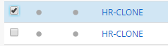
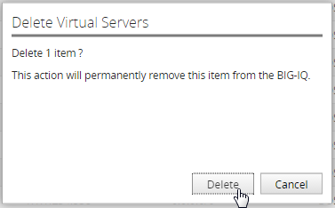
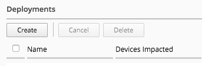
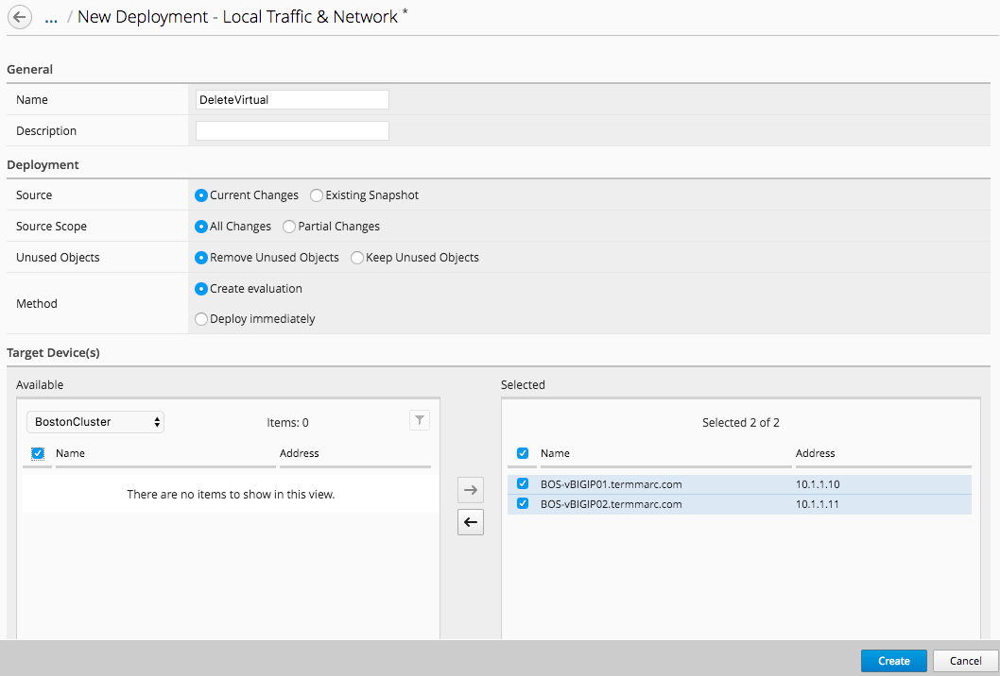
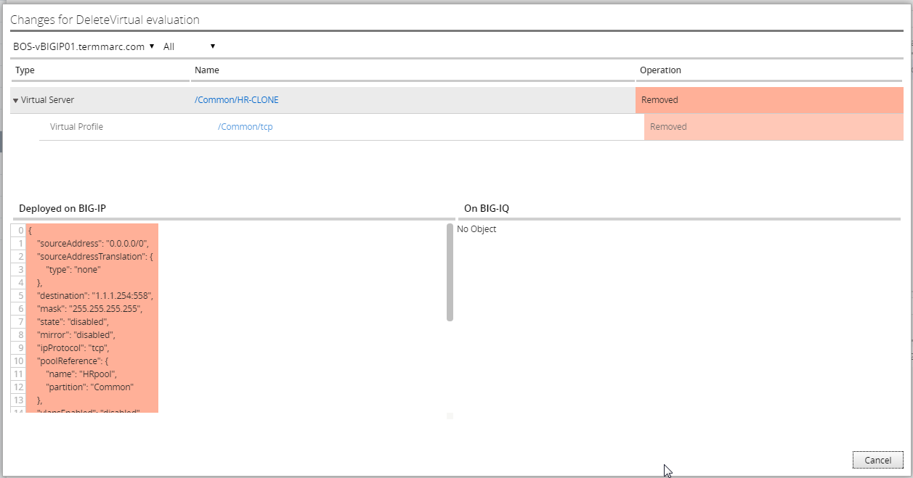

Lab 2.4: Decommission a virtual server
--------------------------------------

.. include:: /accesslab.rst

Tasks
^^^^^

BIG-IQ can be used to remove virtual servers, and other objects that are no longer needed. The same staged change workflow applies for removal of objects.

Navigate to the **Configuration** on the top menu bar.

Navigate to **LOCAL TRAFFIC > Virtual Servers**

|image45|

Select the top **HR-CLONE** virtual server

|image46|

Click the Delete button

Verify that you want to delete this virtual server from the BIG-IQ configuration.

|image47|

Now we need to deploy this change. Navigate to the **Deployment** menu on the top menu bar.

Navigate to **EVALUATE & DEPLOY > Local Traffic & Network**

|image48|

Click the Create button under Deployments

|image49|

Fill out the evaluation properties
   | Name: **DeleteVirtual**
   | Source: **Current Changes** 
   | Source Scope: **All Changes** 
   | Unused Objects: **Remove Unused Objects** 
   | Method: **Create Evaluation**
   | Target: Group, BostonCluster, both devices selected

|image50|

Click the create button in the lower right.

|image51|

After the evaluation completes, review the differences by clicking the view link under Differences.

|image52|

Review the differences.

|image53|

After you have reviewed all of the changes, click the Cancel button in the lower right

Click the Deploy button to push the changes to the BIG-IPs.

|image55|

Verify that you want to deploy the changes to the selected devices.

|image56|

.. |image45| image:: media/image16.png
   :width: 2.32263in
   :height: 0.78115in

.. |image48| image:: media/image32.png
   :width: 2.27055in
   :height: 1.28109in

.. |image52| image:: media/image49.png
   :width: 6.50000in
   :height: 1.38194in

.. |image55| image:: media/image51.png
   :width: 3.59330in
   :height: 1.24984in
.. |image56| image:: media/image52.png
   :width: 4.60359in
   :height: 2.17681in
