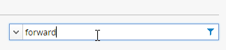

Lab 3.2: Create a new virtual server by cloning an existing virtual server
--------------------------------------------------------------------------

BIG-IQ allows you to clone an existing virtual server to create a new virtual server. This cloned virtual can be deployed to the same BIG-IP device/cluster or to a new BIG-IP device/cluster. Cloning can be used to migrate a virtual server or to make a virtual server that is similar to one that already exists.

In this scenario, we will clone a virtual server from our cluster and deploy it to our standalone device.

Navigate to the **Configuration** tab on the top menu bar.

Navigate to **LOCAL TRAFFIC > Virtual Servers**

|image19|

Type forward in the filter box on the right-hand side of the screen and press return.

|image20|

Click the check box to the left of the first virtual server entry.

|image21|

Click the **Clone** button under Virtual Servers at the top of the page.

Edit the Virtual Server Properties:

   | Name: **forward\_vs\_udf\_CLONED**
   | Device: **SEA-vBIGIP01.termmarc.com**
   | Destination Address: **1.0.0.0/8**
   | Protocol: **All Protocols**
   | VLANs and Tunnels: **Enabled on…**
   | VLANs and Tunnels: Selected: **internal**

|image22|

Click the **Save & Close** button in the lower right.

|image23|

Click on the X in the “Filtered by” box to clear the filter and move to next task.

.. |image19| image:: media/image16.png
   :width: 2.32263in
   :height: 0.78115in

.. |image21| image:: media/image21.png
   :width: 5.73887in
   :height: 1.56230in
.. |image22| image:: media/image22.png
   :width: 6.50000in
   :height: 2.80417in
.. |image23| image:: media/image23.png
   :width: 5.73887in
   :height: 1.56230in
