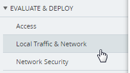
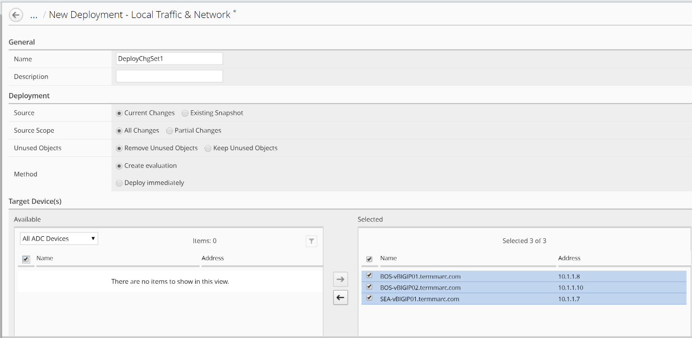
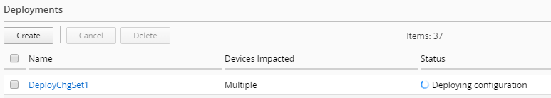

Lab 3.4: Deploy Staged Changes
------------------------------

Now that we have staged a number of changes on the BIG-IQ, we will evaluate the staged changes, and then deploy them to the BIG-IPs.

Navigate to **Deployment** on the top menu bar.

Navigate to **EVALUATE & DEPLOY > Local Traffic & Network**.

|image33|

Click the **Create** button under **Evaluations**.

Fill out the fields to Create Evaluation:

    | Name: **DeployChgSet1**
    | Source: **Current Changes**
    | Source Scope: **All Changes**
    | Unused Objects: **Removed Unused Objects**
    | Target Devices: Select Group “All ADC Devices” and move all devices to Selected

|image34|

Click the Create button in the lower right.

|image35|

After the evaluation completes, click the View link under Differences to review the changes that will be deployed.

|image36|

Review the staged changes for each device. Change devices with the selector in the upper left.

|image37|

Click on each change to review the differences.

|image38|

After you have reviewed all of the changes, click the Cancel button in the lower right.

|image39|

Click on the name of the Evaluation to review the options available there.

|image40|

**Note** that you can review the changes to be deployed on a device by device basis and you can choose to exclude a device from the deployment at this point. At the bottom of the page, you can schedule the deployment for a later time, or you can Deploy Now.

Click the **Deploy Now** button to push the changes to the BIG-IPs.

|image41|

Click the **Deploy** button

|image42|

At the bottom of the screen, you can review that your changes are being deployed

|image43|

Click on the name of the Deployment to review what was deployed

|image44|

Login to BOS—vBIGIP01 using the TMUI link in lab environment and confirm that your deployment was successful. 

You should now see the **BIQAppVS** on the Network Map.

.. |image35| image:: media/image34.png
   :width: 1.82269in
   :height: 0.55201in
.. |image36| image:: media/image35.png
   :width: 6.50000in
   :height: 0.87847in
.. |image37| image:: media/image36.png
   :width: 3.09336in
   :height: 1.36441in
.. |image38| image:: media/image37.png
   :width: 6.50000in
   :height: 3.39792in
.. |image39| image:: media/image38.png
   :width: 0.95821in
   :height: 0.51035in
.. |image40| image:: media/image39.png
   :width: 1.99975in
   :height: 1.69770in
.. |image41| image:: media/image40.png
   :width: 7.36203in
   :height: 2.07222in
.. |image42| image:: media/image41.png
   :width: 4.57234in
   :height: 2.17681in

.. |image44| image:: media/image43.png
   :width: 6.50000in
   :height: 1.15625in