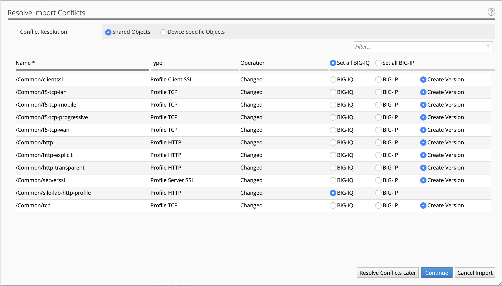
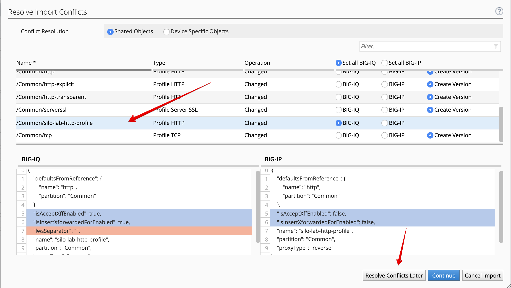
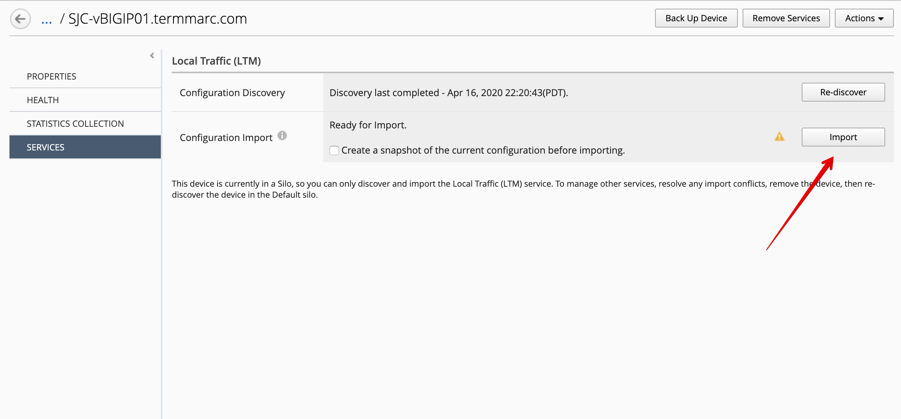
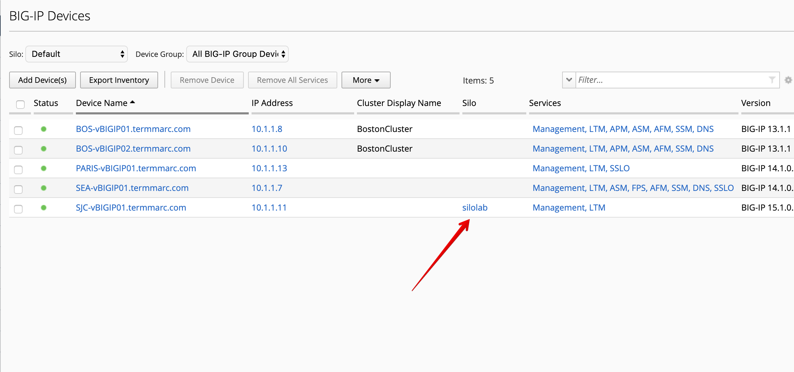

Lab 5.1: Import a device into a silo
-------------------------------------

.. note:: Estimated time to complete: **10 minutes**

.. include:: /accesslab.rst

Tasks
^^^^^

1. Login to BIG-IQ as **david** by opening a browser and go to: ``https://10.1.1.4``

2. Navigate to Devices > BIG-IP Devices. You can hide some columns you won't need 
   for this lab such as Stats Collection, Data Collection, Stats Last Collection.

.. image:: ../pictures/img_module5_lab1-1.png
  :scale: 40%
  :align: center

3. Click on *Complete import tasks* under **SJC-vBIGIP01.termmarc.com** Services.

.. image:: ../pictures/img_module5_lab1-2.png
  :scale: 40%
  :align: center

4. Click on Import to start the device configuration import into BIG-IQ. If prompted to re-discover
the device before importing, go ahead and complete that step first, then Import.

.. image:: ../pictures/img_module5_lab1-3.png
  :scale: 40%
  :align: center

5. The conflict resolution window opens. All the objects are given one of the following options, ``Set all BIG-IQ`` ,
   ``Set all BIG-IP`` or ``Create Version`` with the exception of 1 object ``silo-lab-http-profile`` which only has the 2 first
   options.

The HTTP profile ``silo-lab-http-profile`` already exists in BIG-IQ and is tied to one or more of the BIG-IP's discovered & imported
into BIG-IQ. In this case the Boston BIG-IP Cluster or the Seattle BIG-IP. 

If you choose ``BIG-IQ``, the the contents of this profile on the SJC-vBIGIP01 BIG-IP will get overwritten by what is already on BIG-IQ. 
This is likely not a preferred behavior because this is a working configuration and changing the content of the profile will likely break something. 

Choosing ``BIG-IP`` will overwrite the contents of this profile on BIG-IQ with what is being imported from this BIG-IP. This would then overwrite 
the configuration of the other BIG-IP's that use this same shared object with the contents of the SJC-vBIGIP01 BIG-IP profile on the next deployment. 
This is also not a desired outcome as it will change working configurations on those devices. 

.. note:: When adding multiple BIG-IP devices and discovering and importing their services at the same time,
          you can specify a conflict resolution policy if BIG-IQ finds any default monitors or 
          LTM profiles with different parameters. More details on Version Specific Objects in `Module 4`_.

.. _Module 4: ../module4/module4.html

6. Select the ``silo-lab-http-profile`` profile HTTP and note the difference between BIG-IQ and the BIG-IP device profile.

- BIG-IQ

+--------------------------+----------+
| Accept XFF               | Enabled  |
+--------------------------+----------+
| Insert X-Forwarded-For   | Enabled  |
+--------------------------+----------+

- SJC-vBIGIP01.termmarc.com

+--------------------------+----------+
| Accept XFF               | Disabled |
+--------------------------+----------+
| Insert X-Forwarded-For   | Disabled |
+--------------------------+----------+

What you are noticing is a conflict between what BIG-IQ has stored for a profile named ``silo-lab-http-profile`` and 
what a profile of the same name has on the SJC-vBIGIP01 device. They share the same name, but have different configuration
options enabled as highlighted in the display. Because we want to preserve both configurations and not overwrite ``BIG-IP`` or ``BIG-IQ`` for the 
conflicting HTTP profile, click on **Resolve Conflicts Later**.

7. Select **Create a New Silo** and name it ``silolab`` then click **Continue**

.. image:: ../pictures/img_module5_lab1-6.png
  :scale: 40%
  :align: center

The device is now imported into its own silo named ``silolab``. Note the object naming collision has not been resolved yet.
Click **Close**.

.. image:: ../pictures/img_module5_lab1-7.png
  :scale: 40%
  :align: center

.. note:: If you know all the devices from 1 data center have the exact same conflicts, 
          you can put all of those devices in the same silo rather than put each one into its own silo.

8. Once the device is added to the silo, import the device configuration.

9. After the Import has completed, go back to the ``BIG-IP Devices`` grid, you can see now **SJC-vBIGIP01.termmarc.com** has been imported
into a Silo named ``silolab``.

10. If you navigate to the Configuration tab > Local Traffic > Profile and filter on ``silo-lab-http-profile``
    you will see the 2 different instances of the same HTTP profile. One which is part of the default silo and the newly
    imported profile from the SJC BIG-IP device which is in the Silo called ``silolab``.

.. image:: ../pictures/img_module5_lab1-10.png
  :scale: 40%
  :align: center
