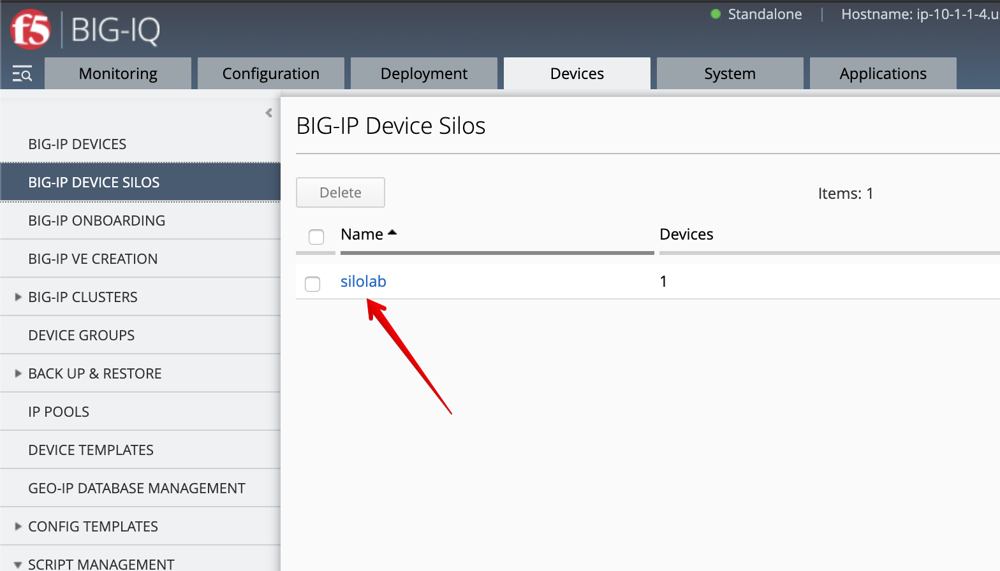
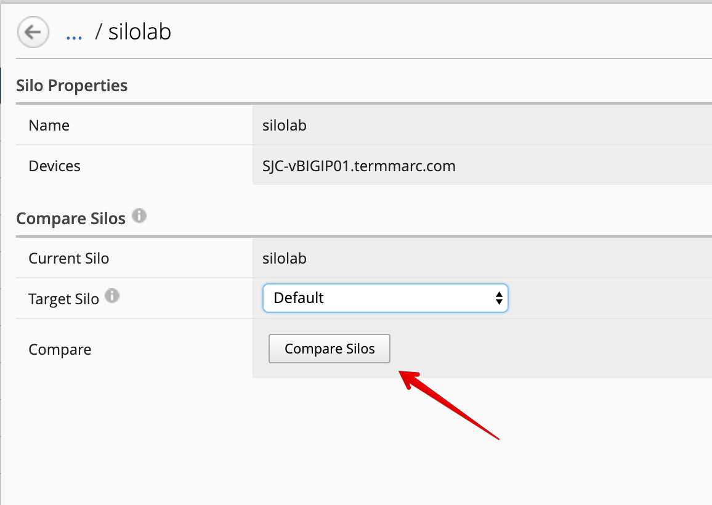
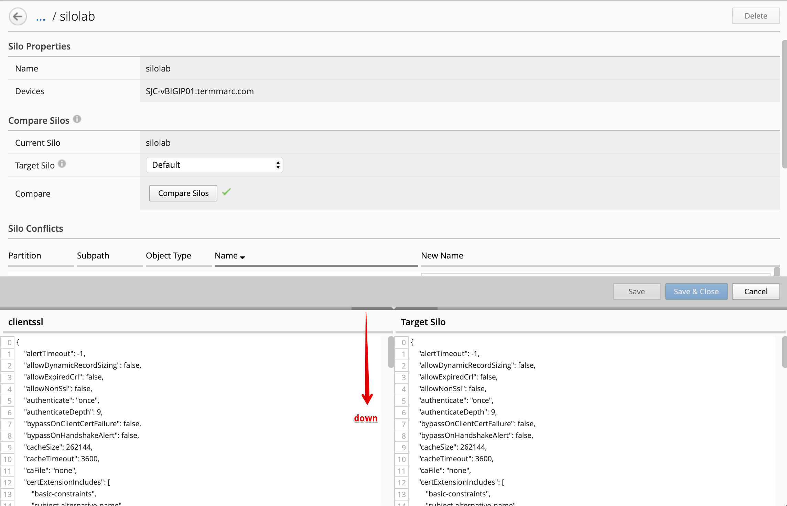
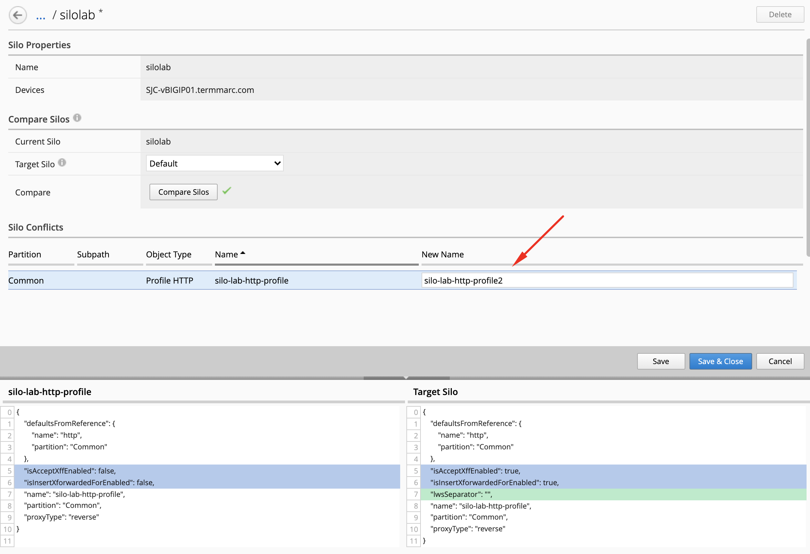
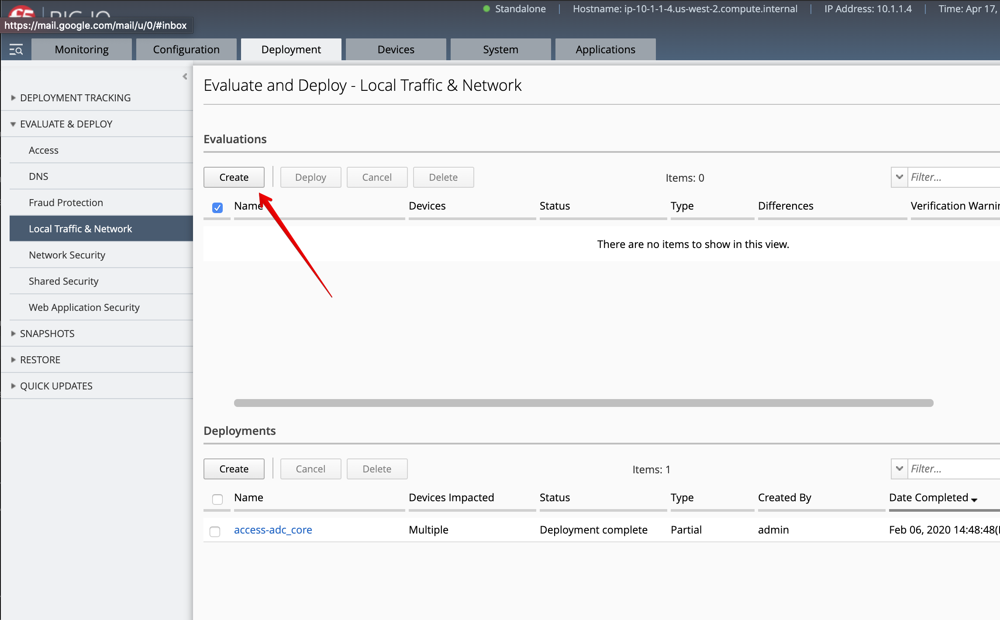

Lab 5.2: Resolve conflicts in the silo
--------------------------------------

1. Navigate to the BIG-IP Device Silos in the menu and clock on the ``silolab``.

2. Select Target Silo: Default, then click on **Compare Silos**

3. The comparison window opens. You can adjust the diff window with your cursor.

4. Select Profile HTTP ``silo-lab-http-profile`` and look at the differences.

Ignore the following diff:

.. code::

    1	    "cm": {
    2	        "silo": "silolab"
    3	    },

The values of the ``Accept XFF`` and ``Insert X-Forwarded-For`` are different.

Let's rename the profile to ``silo-lab-http-profile2``.

**Save & Close**.

5. Wait for the renaming operation to complete.

.. image:: ../pictures/img_module5_lab2-5.png
  :scale: 40%
  :align: center

6. Let's now deploy the changes. Navigate to the Deployment tab > Evaluate & Deploy > Local Traffic & Network.

7. Create a new Evaluation, select the silo ``silolab`` and set a name.

.. image:: ../pictures/img_module5_lab2-7.png
  :scale: 40%
  :align: center

Click **Create**.

8. Review the differences. BIG-IQ is going to deploy the new renamed profile and re-deploy
   the VIP with the new profile attached. Then, remove the old profile with the old name.

- ``silo-lab-http-profile`` is removed
- ``silo-lab-http-profile2`` is added
- ``silo-lab-http-profile`` is removed from the VIP ``vip-silo-lab``
- ``silo-lab-http-profile2`` is attached to the VIP ``vip-silo-lab``

.. image:: ../pictures/img_module5_lab2-8.png
  :scale: 40%
  :align: center

9. Now deploy the changes to the BIG-IP.

.. image:: ../pictures/img_module5_lab2-9.png
  :scale: 40%
  :align: center

10. Navigate to the Configuration tab > Local Traffic > Profile and filter on ``silo-lab-http-profile``
    to confirm the HTTP profile was renamed.

.. image:: ../pictures/img_module5_lab2-10.png
  :scale: 40%
  :align: center

You can eventually go to the BIG-IP **SJC-vBIGIP01.termmarc.com** to verify the profile
has been renamed correctly.