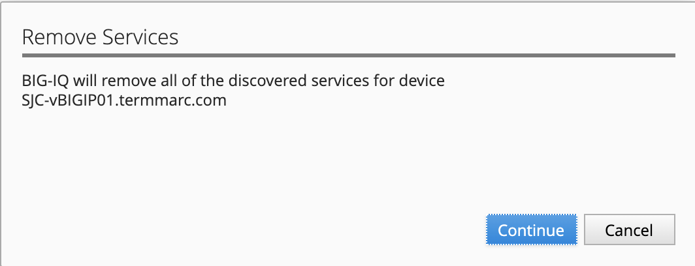
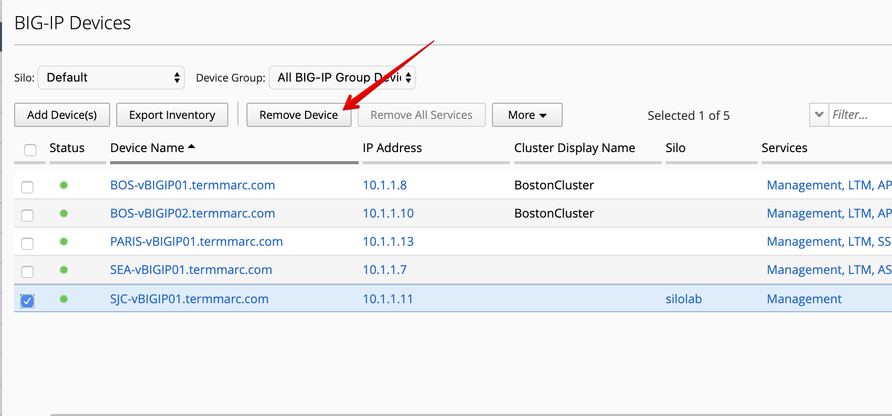
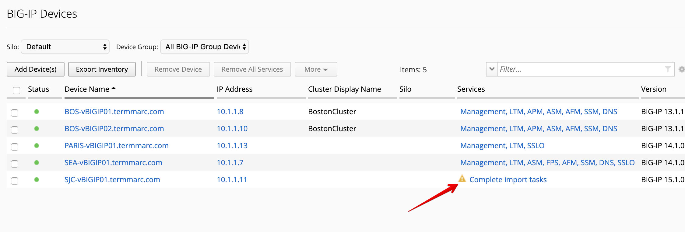
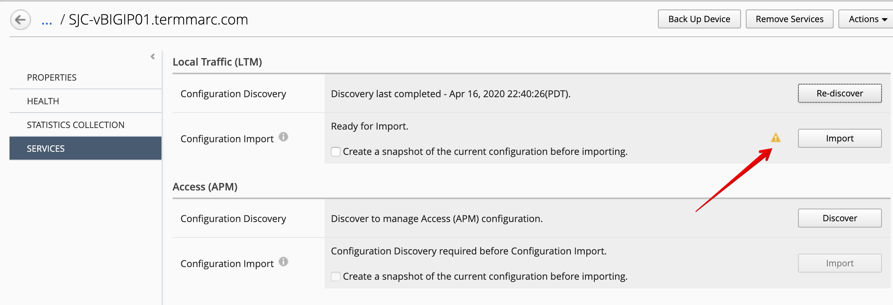
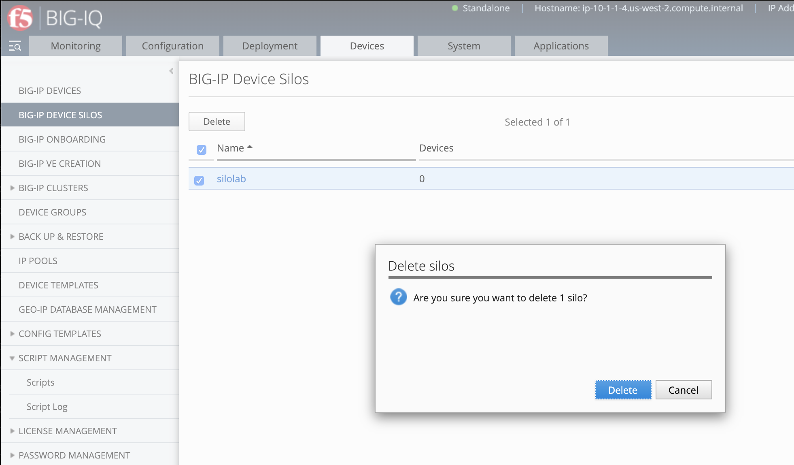

Lab 5.3: Remove device from a silo and re-import it in BIG-IQ
-------------------------------------------------------------

.. note:: Estimated time to complete: **15 minutes**

.. include:: /accesslab.rst

Tasks
^^^^^

Now the necessary objects have been renamed on the BIG-IP, let's remove the device 
from its own Silo and re-discover and re-import it into BIG-IQ.

1. From **Devices > BIG-IP Devices**, select **SJC-vBIGIP01.termmarc.com** and click on
   **Remove All Services**

.. image:: ../pictures/img_module5_lab3-1.png
  :scale: 40%
  :align: center

Click on **Continue**.

3. Once the services are removed, click on **Remove Device**.

Click on **Remove**. You may need to refresh the page to see that it has been deleted.

.. image:: ../pictures/img_module5_lab3-4.png
  :scale: 40%
  :align: center

4. Click on **Add Devices(s)** and fill below device information.

- IP Address: ``10.1.1.11``
- User Name: ``admin``
- Password: ``purple123``

.. image:: ../pictures/img_module5_lab3-5.png
  :scale: 40%
  :align: center

5. The Service configuration & Statistic monitoring window will open. Select LTM and deselect DNS and AFM stats.

.. image:: ../pictures/img_module5_lab3-6.png
  :scale: 40%
  :align: center

Click on **Continue**.

6. Back on the Devices grid, click on *Complete import tasks* under **SJC-vBIGIP01.termmarc.com** Services.

7. Click on Import to start the device configuration import in BIG-IQ.

8. The conflict resolution window opens. Notice the profile HTTP ``silo-lab-http-profile`` is not showing anymore.
   Select **Create Version** option for all the remaining default profiles. The remaining conflicts are due to default changes
   in profiles across different TMOS versions. The **Version Specific Defaults** feature was added in a previous BIG-IQ 
   release to deal with these sorts of conflicts. BIG-IQ will store different default values for each version of SW starting
   with whats been imported originally as the default. Next click **Continue** and if prompted click **Resolve** to 
   address the version specific default conflicts.

.. image:: ../pictures/img_module5_lab3-9.png
  :scale: 40%
  :align: center

9. Once the import is completed, the device shows *Management, LTM* in the device grid.

.. image:: ../pictures/img_module5_lab3-10.png
  :scale: 40%
  :align: center

10. You can navigate to **Configuration > Local Traffic > Profile** and filter on ``silo-lab-http-profile``
    to confirm both HTTP profiles ``silo-lab-http-profile`` and ``silo-lab-http-profile2`` were imported. Note 
    a second copy of `silo-lab-http-profile2` still exists in the silolab Silo. Since this Silo is no longer in use 
    it will be deleted.

11. Finally, the silo ``silolab`` can be removed from BIG-IQ. Go to Devices > BIG-IP Device Silos and select the 
silolab Silo. Then click **Delete**. You may need to refresh the page to see that it is gone. That completes this lab.

