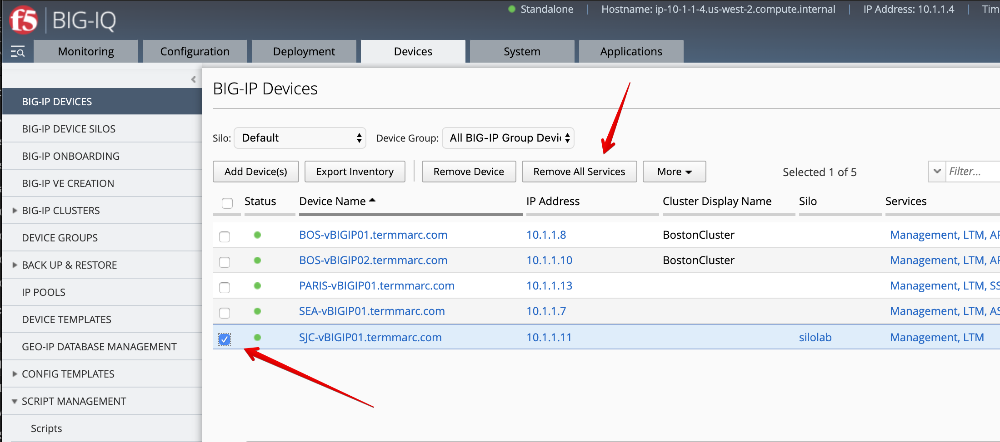
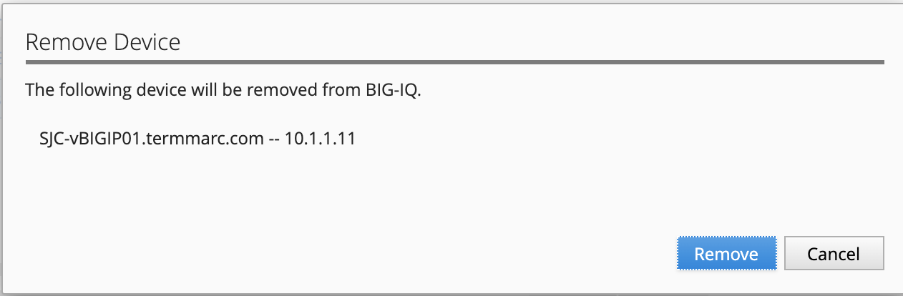
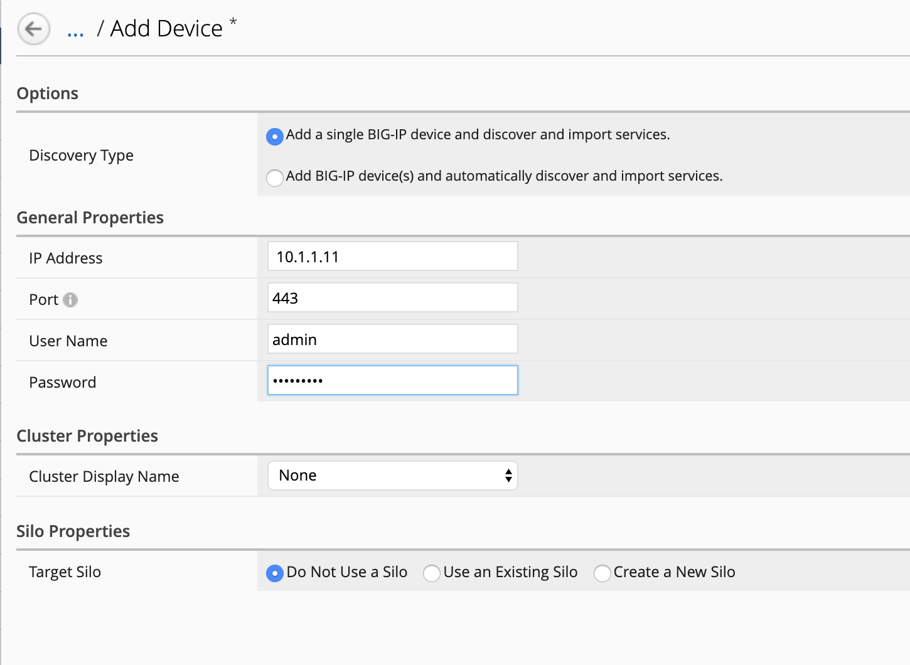
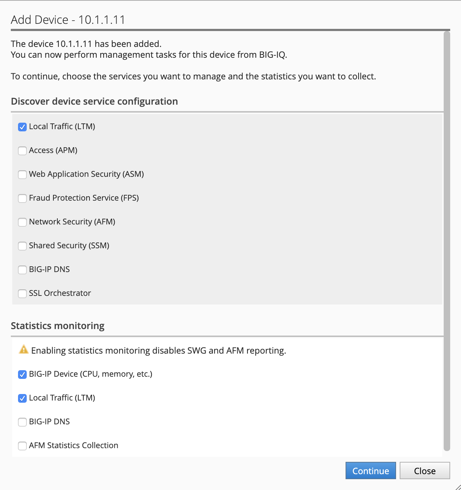
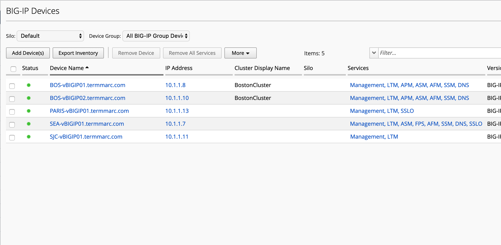

Lab 5.3: Remove device from a silo and import in default silo
-------------------------------------------------------------

Now the necessary objects have been renamed on the BIG-IP, let's remove the device 
from its silo and re-discover and re-import it into the default silo (main stream).

1. From the Device tab > BIG-IP Devices, select **SJC-vBIGIP01.termmarc.com** and click on
   **Remove All Services**

Click on **Continue**.

.. image:: ../pictures/img_module6_lab3-2.png
  :scale: 40%
  :align: center

3. Once the services are removed, click on **Remove Device**.

.. image:: ../pictures/img_module6_lab3-3.png
  :scale: 40%
  :align: center

Click on **Remove**.

4. Click on **Add Devices(s) and fill below device information.

- IP Address: ``10.1.1.11``
- User Name: ``admin``
- Password: ``purple123``

5. The Service configuration & Statistic monitoring window open. Select LTM and deselect DNS and AFM stats.

Click on **Continue**.

6. Back on the Devices grid, click on *Complete import tasks* under **SJC-vBIGIP01.termmarc.com** Services.

.. image:: ../pictures/img_module6_lab3-7.png
  :scale: 40%
  :align: center

7. Click on Import to start the device configuration import in BIG-IQ.

.. image:: ../pictures/img_module6_lab3-8.png
  :scale: 40%
  :align: center

8. The conflict resolution window opens. Notice the profile HTTP ``silo-lab-http-profile`` is not showing anymore.
   Select for all default profile Create Version.

.. image:: ../pictures/img_module6_lab3-9.png
  :scale: 40%
  :align: center

9. Once the import is completed, the device shows *Management, LTM* in the device grid.

10. You can navigate to the Configuration tab > Local Traffic > Profile and filter on ``silo-lab-http-profile``
    to confirm the HTTP profile was imported.

11. Finally, the silo ``silolab`` can be removed from BIG-IQ.

.. image:: ../pictures/img_module6_lab3-11.png
  :scale: 40%
  :align: center
