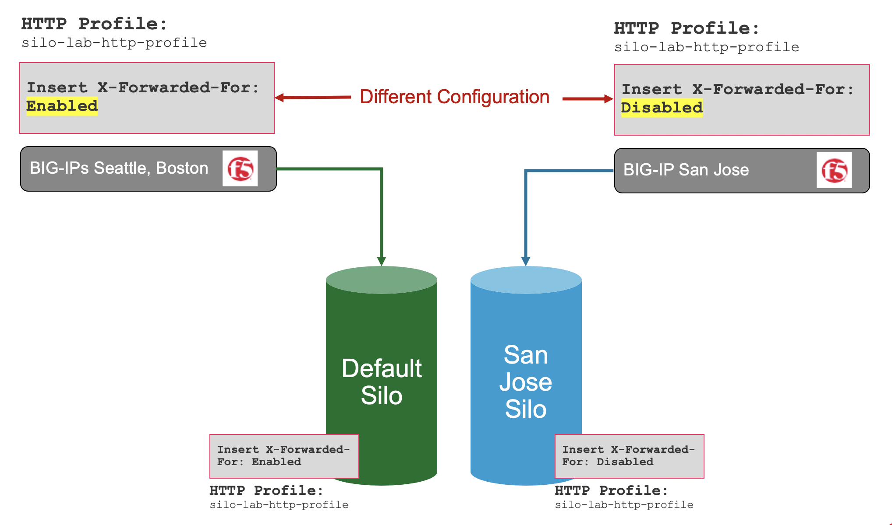

Module 5: LTM conflict resolution: silo in BIG-IQ (new 7.1)
===========================================================

BIG-IP configuration naming conventions are not consistent within many customer 
environments. It is common to find similar names reused across different BIG-IP's 
for shared configuration objects such as Profiles, Monitors etc….

When shared objects have the same name but different configurations this creates a 
conflict within the centralized management system, and BIG-IQ will raise an error and 
fail to import the BIG-IP device. In previous releases you could either choose to 
override and rewrite what was on the BIG-IP being imported with the configuration 
that was already in BIG-IQ, or you could override the configuration that was in 
BIG-IQ with the newly imported BIG-IP's configuration. Overwriting the shared 
object that is already in the BIG-IQ's database would have consequences of 
affecting other devices utilizing the same shared object as their configuration 
would be changed on the next deployment. Most customers would choose not to import 
the device until they could manually fix the object name collision by giving the offending 
profile or monitor a new name. This process was time consuming and cumbersome and had 
to be done on BIG-IP directly.

Starting with BIG-IQ 7.1, you can now import devices with object naming collisions
into a temporary “silo” on BIG-IQ. Think of this as a quarantine area that doesn’t 
impact the rest of BIG-IQ or overwrite shared objects which may have different configurations on
other BIG-IP's. This will allow you to rename the configuration objects on 
BIG-IP using BIG-IQ. Once all of the conflicting objects that need to remain 
unique have been renamed, the device can be re-imported fully into BIG-IQ without 
the need for a silo.

In this lab, Seattle and Boston BIG-IP devices were imported first, and they have a
common shared object named ``silo-lab-http-profile``. Since both devices profiles have 
the same name and the same configuration within that profile they are imported into
the default silo. Any update to that shared profile would be pushed out to all 
devices that share the profile of the same name.

The San Jose BIG-IP device fails import due to a naming collision because of a 
profile named ``silo-lab-http-profile`` (same name) but has different configuration 
items within the profile.  If you want to keep the different configuration items 
for this device, you can now import it into its own temporary silo to avoid conflict. 
You may then review the configuration differences from BIG-IQ, and push out naming changes 
to resolve the conflict. The device can then be re-imported into BIG-IQ's default silo because 
the naming conflict will have been removed.

Official documentation about Silo feature can be found on the `BIG-IQ Knowledge Center`_.

.. _`BIG-IQ Knowledge Center`: https://support.f5.com/csp/knowledge-center/software/BIG-IQ?module=BIG-IQ%20Centralized%20Management&version=7.1.0

.. toctree::
   :maxdepth: 1
   :glob:

   lab*
