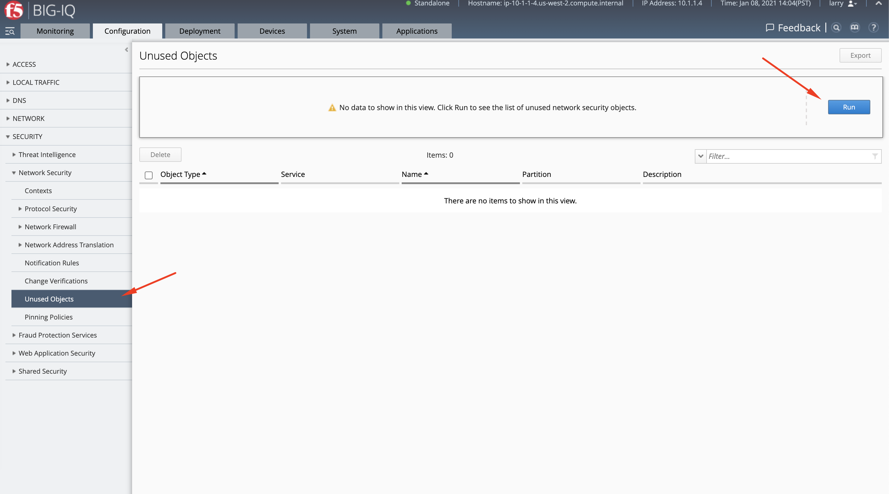
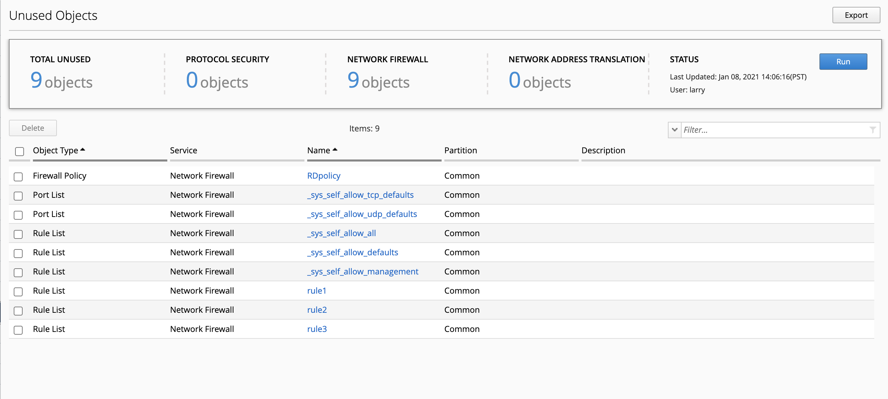
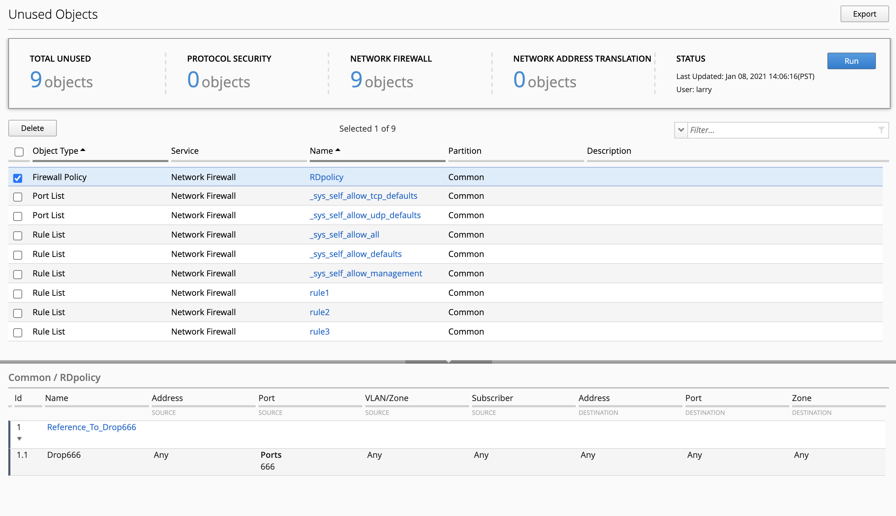
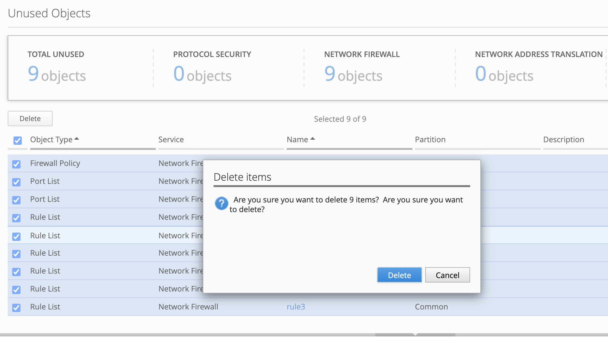
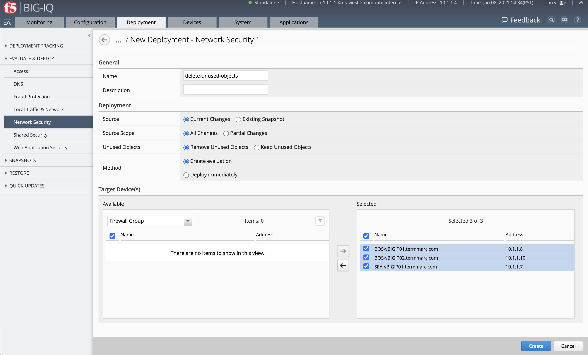
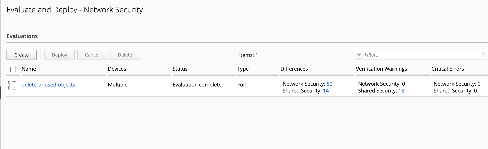
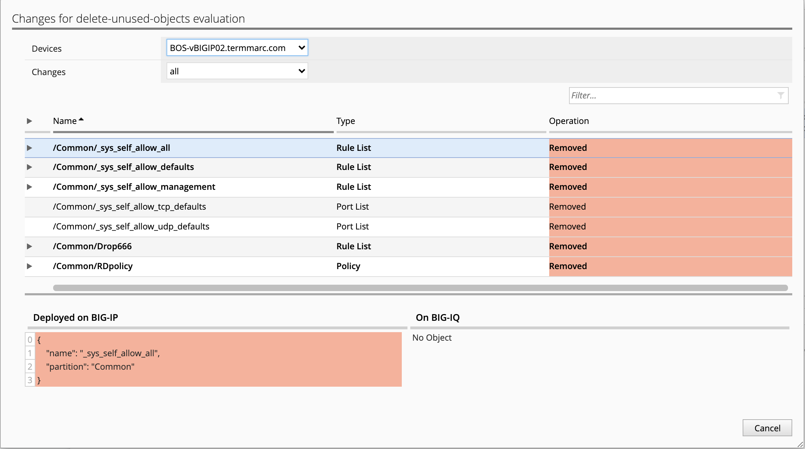
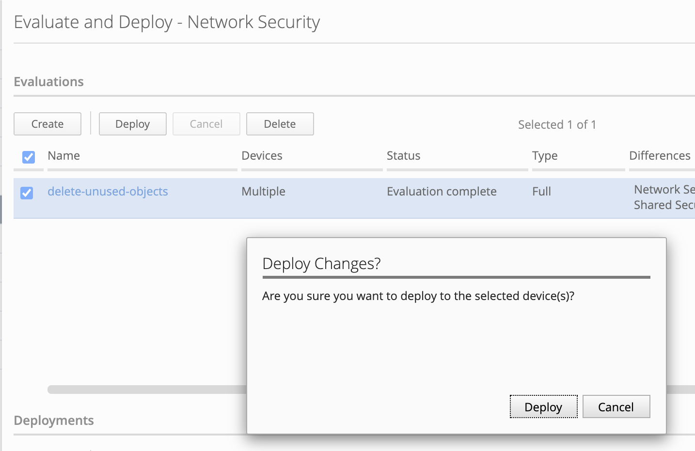
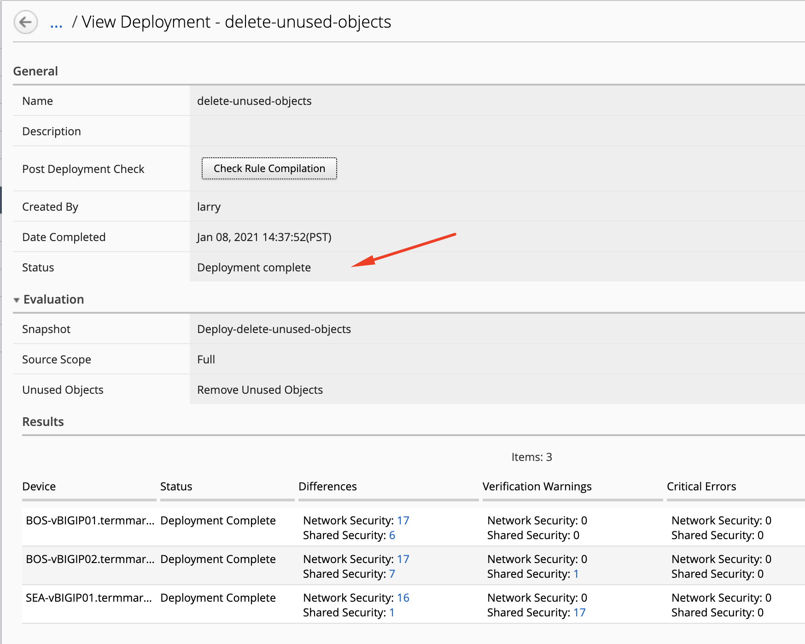

Lab 1.3: Report on orphaned, unused, network security (new 8.0)
---------------------------------------------------------------

.. note:: Estimated time to complete: **15 minutes**

In this lab, we will generate a report of network security objects that are currently not being used by any AFM policies or rules.

Prerequisites
^^^^^^^^^^^^^

Make sure your devices have AFM module discovered and imported for **BOS-vBIGIP01.termmarc.com**, **BOS-vBIGIP02.termmarc.com** 
and **SEA-vBIGIP01.termmarc.com** under Devices > BIG-IP DEVICES.

Tasks
^^^^^

1. Login to BIG-IQ as **larry** .

2. Go to **Configuration > Security > Network Security > Unused Objects**, then click on **Run** to generate the report.

3. A report is created showing a list of unused Network Security objects.

4. By selecting an object, you can see its details.

5. Now, let's start to do some cleanup. Select all the objects and click on **Delete**. This action will not delete objects from the BIG-IPs but only from the BIG-IQ.

..warning:: Address lists might be referenced in other services such as LTM or Shared Security.

6. Next, we will create an evaluation and deploy the changes we just made.

7. Click on top Deployment tab, select under EVALUATE & DEPLOY: Network Security and click **Create**.

Set a name, Under Target Devices, select all the devices, click **Create** to launch the evaluation.

8. Once the evaluation is completed, review the objects to be removed.

9. Then, select the evaluation and click on **Deploy**.

10. Verify the deployment is successful.

11. Now, the cleanup of unused network objects is done. Let's verify on BIG-IP. 
    From the lab environment, login to the **BOS-vBIGIP01.termmarc.com** and navigate under Security > Network Firewall > Policies.
    Confirm the unused objects showing in the report at the beginning of this lab are deleted from the BIG-IP.

 .. image:: ../pictures/module1/img_module1_lab3_10.png
  :scale: 40%
  :align: center