Lab 1.1: Proactive Bot Defense Configuration and Monitoring
-----------------------------------------------------------
BIG-IP BOT protection protects apps from automated attacks by bots and other malicious tools.

The goal of this lab is to show how to use BIG-IQ to configure the BOT protection to 
an HTTP Application Service and how to use BIG-IQ BOT Dashboards to monitors the BOT traffic.

.. note:: This lab requires BIG-IP 14.1 and BIG-IQ 7.0 minimum. 
          AVR also needs to be provisioned on the device. See more details `K12121934`_.

.. _`K12121934`: https://support.f5.com/csp/article/K12121934

Official documentation about BOT Monitoring on BIG-IQ can be found on the `BIG-IQ Knowledge Center`_
and the `DevCentral`_ article.

.. _`BIG-IQ Knowledge Center`: https://techdocs.f5.com/en-us/bigiq-7-0-0/mitigating-managing-bot-defense-using-big-iq/monitoring-bot-defense-activity.html

.. _`DevCentral`: https://devcentral.f5.com/s/articles/Configuring-Unified-Bot-Defense-with-BIG-IQ-Centralized-Management

Workflow
^^^^^^^^

1. **David** creates the Log Destinations, Publisher and Logging Profile either using the UI or the API/AS3
2. **Larry** creates the BOT Defense Profile
3. **David** creates the AS3 template and reference BOT profile created by **Larry** in the template.
4. **David** creates the application service using the template created previously.
5. **Larry** review the BIG-IQ BOT dahsboards

Prerequists
^^^^^^^^^^^

Connect as **david** on BIG-IQ.

1. First make sure your device has ASM module discovered and imported 
for **SEA-vBIGIP01.termmarc.com** under Devices > BIG-IP DEVICES.

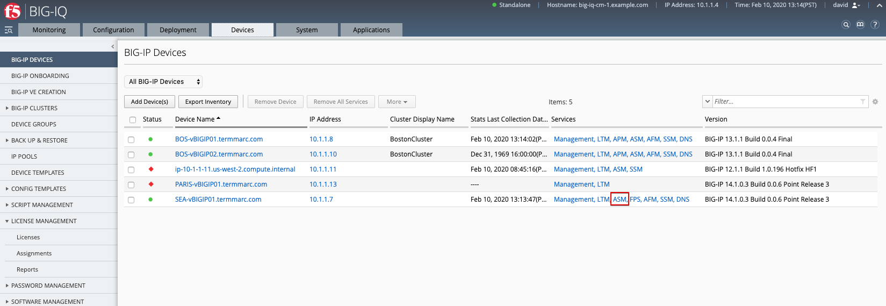

|

2. Check if the **Web Application Security** service is Active  
under System > BIG-IQ DATA COLLECTION > BIG-IQ Data Collection Devices.

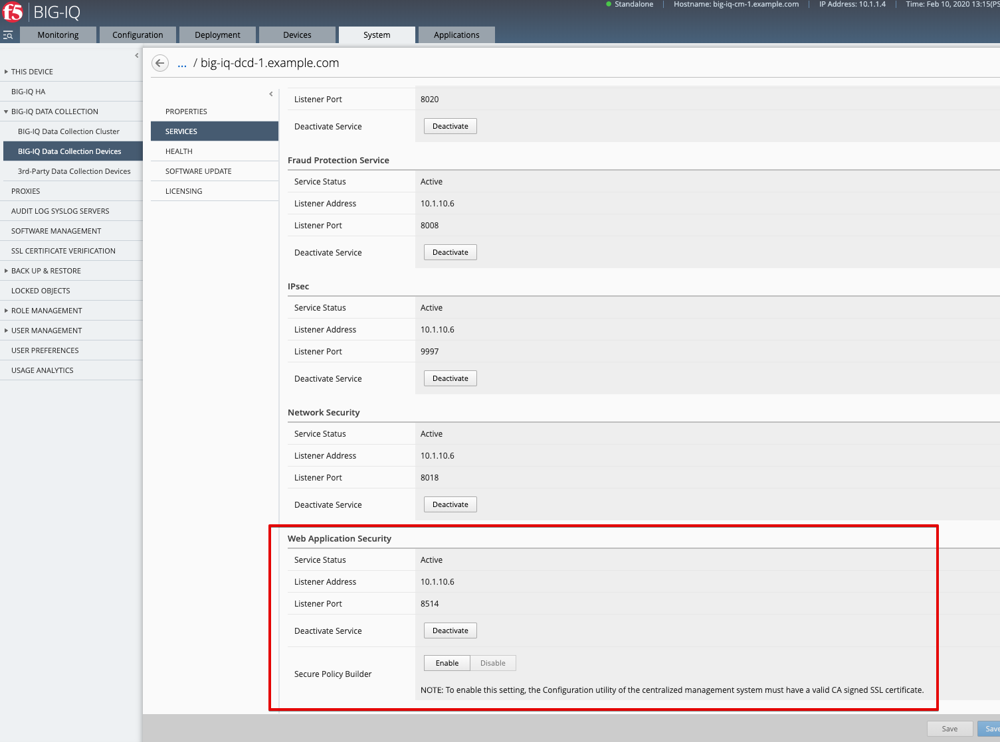

|

ASM BOT Log Destinations and Publisher creation using UI
^^^^^^^^^^^^^^^^^^^^^^^^^^^^^^^^^^^^^^^^^^^^^^^^^^^^^^^^

.. warning:: If you want to use API to create the log destinations & publisher, skip this part and go to the next one.

1. Create the DCD Pool and Log Destination. Navigate to Configuration Tab > LOCAL TRAFFIC > Pools, click Create.

- Name: ``bot-remote-dcd-asm-pool``
- Health Monitors: ``tcp``
- Pool Member/Port: ``10.1.10.6:8514``

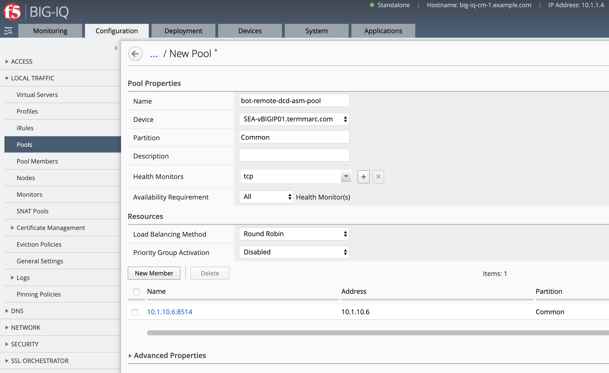

|

2. Navigate to Configuration Tab > LOCAL TRAFFIC > Logs > Log Destinations, click Create.

- Name Log Destination hslog: ``bot-remote-logging-destination-remote-hslog-8514``
- Device: ``SEA-vBIGIP01.termmarc.com``
- Pool: ``bot-remote-dcd-asm-pool`` previously created

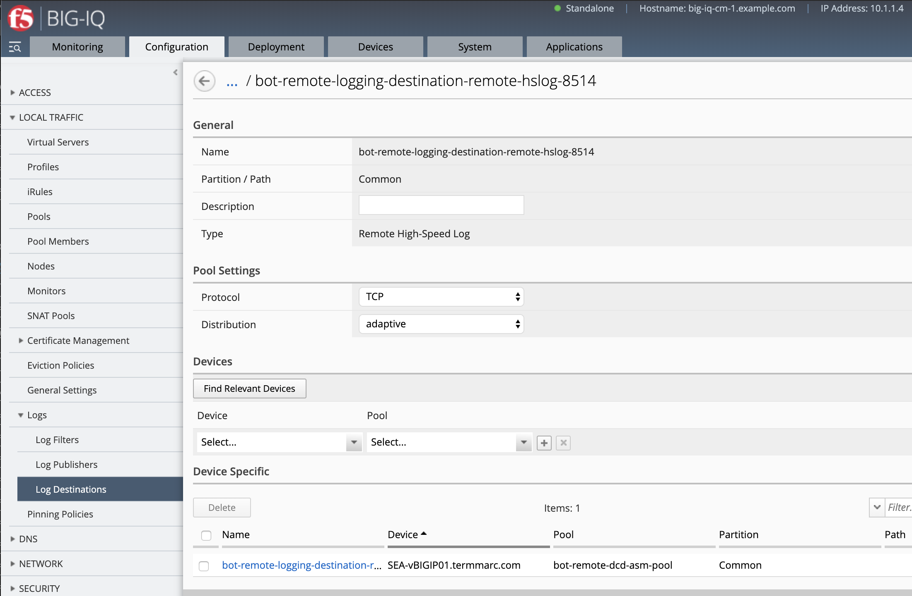

|

3. Navigate to Configuration Tab > LOCAL TRAFFIC > Logs > Log Destinations, click Create.

- Name Log Destination Splunk: ``bot-remote-logging-destination-splunk-8514``
- Type: ``Splunk``
- Forward To: ``Remote High Speed Log`` - ``bot-remote-logging-destination-remote-hslog-8514`` previously created

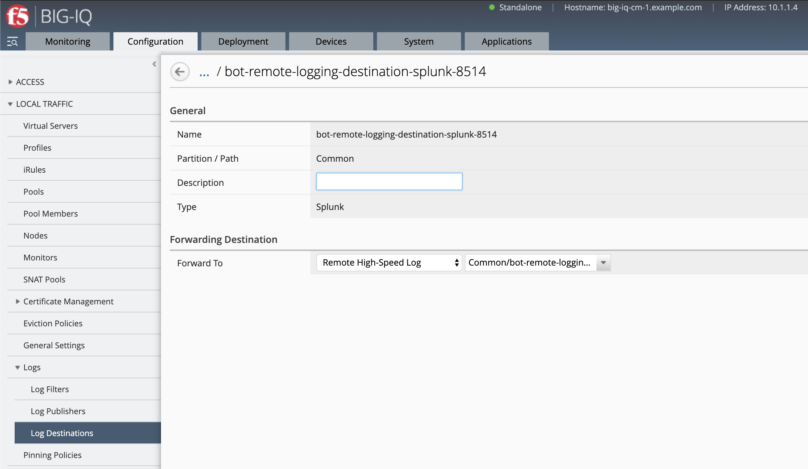

|

.. note:: This is to add the formating supported by BIG-IQ

4. Create the Log Publisher. Navigate to Configuration Tab > LOCAL TRAFFIC > Logs > Log Publisher. click Create.

- Name: ``bot-remote-logging-publisher-8514``
- Log Destinations: ``bot-remote-logging-destination-splunk-8514`` previously created

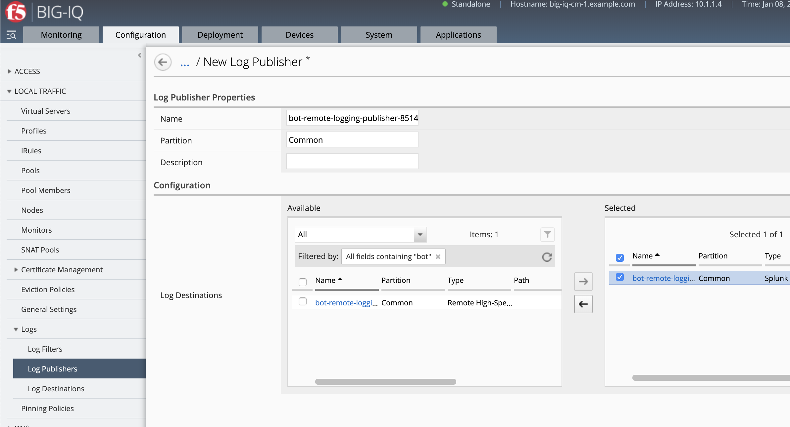

|

5. Pin the new Log Publisher to the SEA-vBIGIP01.termmarc.com device. Navigate to Pinning Policies and 
   add the Log Publisher previously created to SEA-vBIGIP01.termmarc.com.

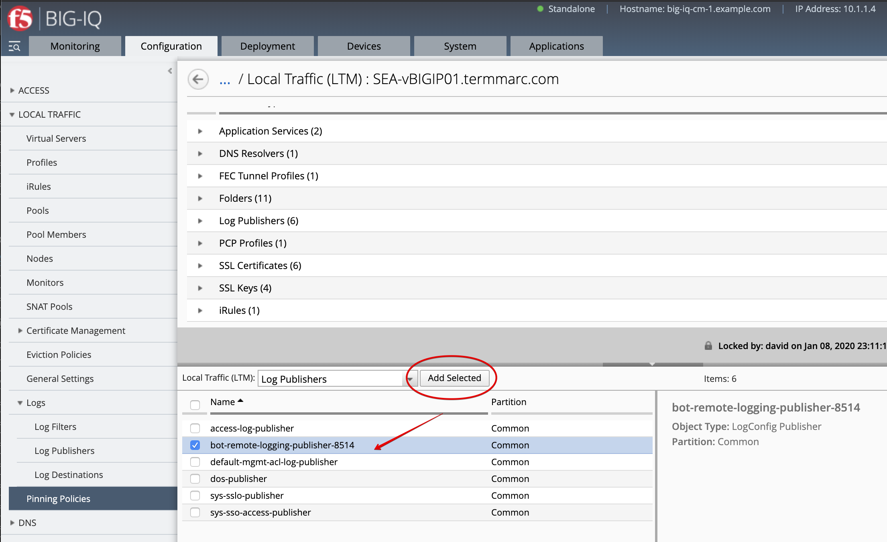

|

6. Deploy the Pool, Log Destinations, Log Publisher. Go to Deployment tab > EVALUATE & DEPLOY > Local Traffic & Network.

Create a Deploments to deploy the Remote Logging Changes on the SEA BIG-IP.

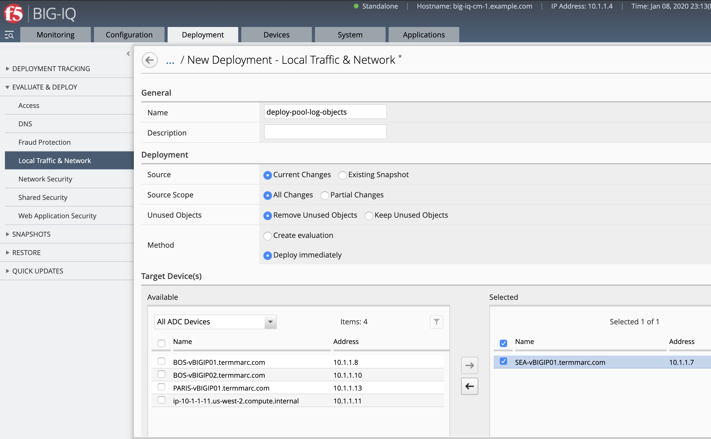

|

Make sure the deployment is successfull.

ASM BOT Log Destinations and Publisher creation using API/AS3
^^^^^^^^^^^^^^^^^^^^^^^^^^^^^^^^^^^^^^^^^^^^^^^^^^^^^^^^^^^^^

1. From the lab environment, launch a xRDP/noVNC session to have access to the Ubuntu Desktop. 
To do this, in your lab environment, click on the *Access* button of the *Ubuntu Lamp Server* 
system and select *noVNC* or *xRDP*.

.. note:: Modern laptops with higher resolutions you might want to use 1440x900 and once XRDP is launched Zoom to 200%.

.. image:: ../../pictures/udf_ubuntu.png
    :align: left
    :scale: 40%

|

You can also directly using Postman on your laptop and use the following URL (Go to **BIGIQ CM (Config Mgt)** > **Access Methods** > **API**):

.. image:: ../../pictures/udf_bigiq_api.png
    :align: center
    :scale: 40%

|

Open Chrome and Postman.

For Postman, click right and click on execute (wait ~2 minutes).

.. note:: If Postman does not open, open a terminal, type ``postman`` to open postman.

.. image:: ../../pictures/postman.png
    :align: center
    :scale: 40%

|

Using the declarative AS3 API, let's send the following BIG-IP configuration through BIG-IQ:

Using Postman select ``BIG-IQ Token (david)`` available in the Collections.
Press Send. This, will save the token value as _f5_token. If your token expires, 
obtain a new token by resending the ``BIG-IQ Token``

.. note:: The token timeout is set to 5 min. If you get the 401 authorization error, request a new token.

2. Copy below AS3 declaration into the body of the **BIG-IQ AS3 Declaration** collection in order to create 
   the service on the BIG-IP through BIG-IQ:

  POST https\:\/\/10.1.1.4/mgmt/shared/appsvcs/declare?async=true

.. code-block:: yaml
   :linenos:
   :emphasize-lines: 5,16,18

      {
          "class": "AS3",
          "action": "deploy",
          "persist": true,
          "declaration": {
              "class": "ADC",
              "schemaVersion": "3.12.0",
              "target": {
                  "address": "10.1.1.7"
              },
              "bot": {
                  "class": "Tenant",
                  "security-log-profile": {
                      "class": "Application",
                      "template": "generic",
                      "bot-remote-dcd-asm-pool": {
                          "class": "Pool",
                          "members": [
                              {
                                  "servicePort": 8514,
                                  "serverAddresses": [
                                      "10.1.10.6"
                                  ]
                              }
                          ]
                      },
                      "bot-remote-logging-destination-remote-hslog-8514": {
                          "class": "Log_Destination",
                          "type": "remote-high-speed-log",
                          "pool": {
                              "use": "bot-remote-dcd-asm-pool"
                          }
                      },
                      "bot-remote-logging-destination-splunk-8514": {
                          "class": "Log_Destination",
                          "type": "splunk",
                          "forwardTo": {
                              "use": "bot-remote-logging-destination-remote-hslog-8514"
                          }
                      },
                      "bot-remote-logging-publisher-8514": {
                          "class": "Log_Publisher",
                          "destinations": [
                              {
                                  "use": "bot-remote-logging-destination-splunk-8514"
                              }
                          ]
                      }
                  }
              }
          }
      }

3. Navigate to Device tab and re-discover/re-import SEA-vBIGIP01.termmarc.com.

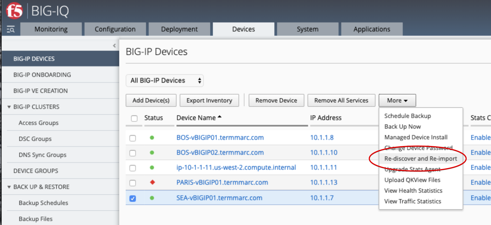

|

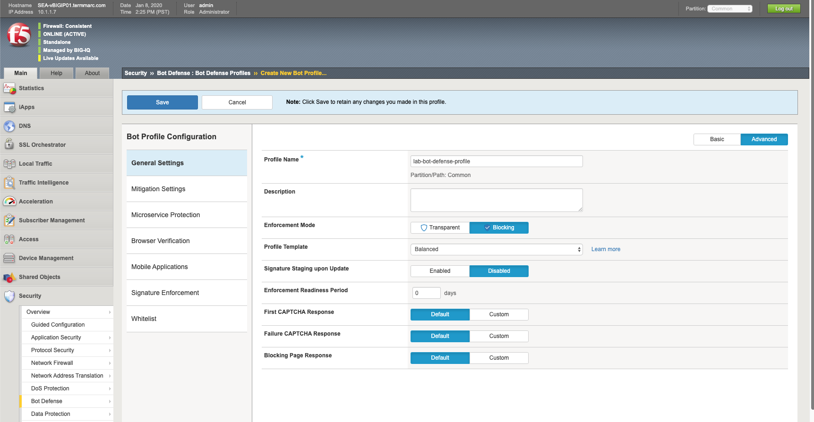

|

ASM BOT Logging Profile creation
^^^^^^^^^^^^^^^^^^^^^^^^^^^^^^^^

.. warning:: This step is only for BIG-IQ => 7.1, go see the Annex at the end if you are using a lower version.

1. Create a new BOT Logging profile. Navigate to Security > Event Logs > Logging Profiles. Click Create.

- Name: ``lab-bot-logging-profile``
- Properties: select ``Bot Defense``
- Remote Publisher: ``bot-remote-logging-publisher-8514``
- Logs Requests: select all options (Human Users, Bots, etc...)]

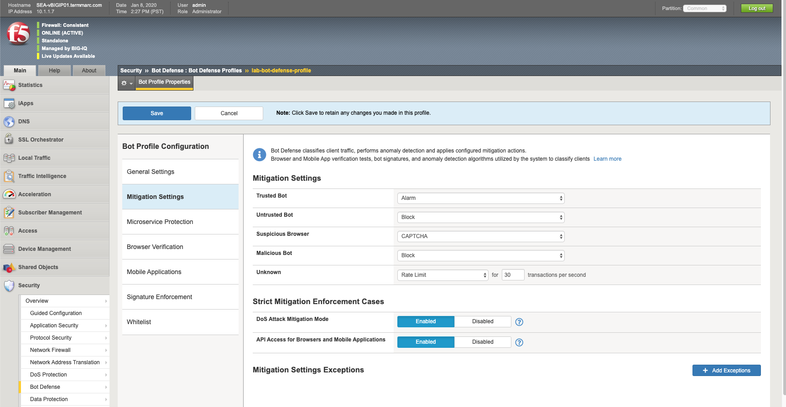

|

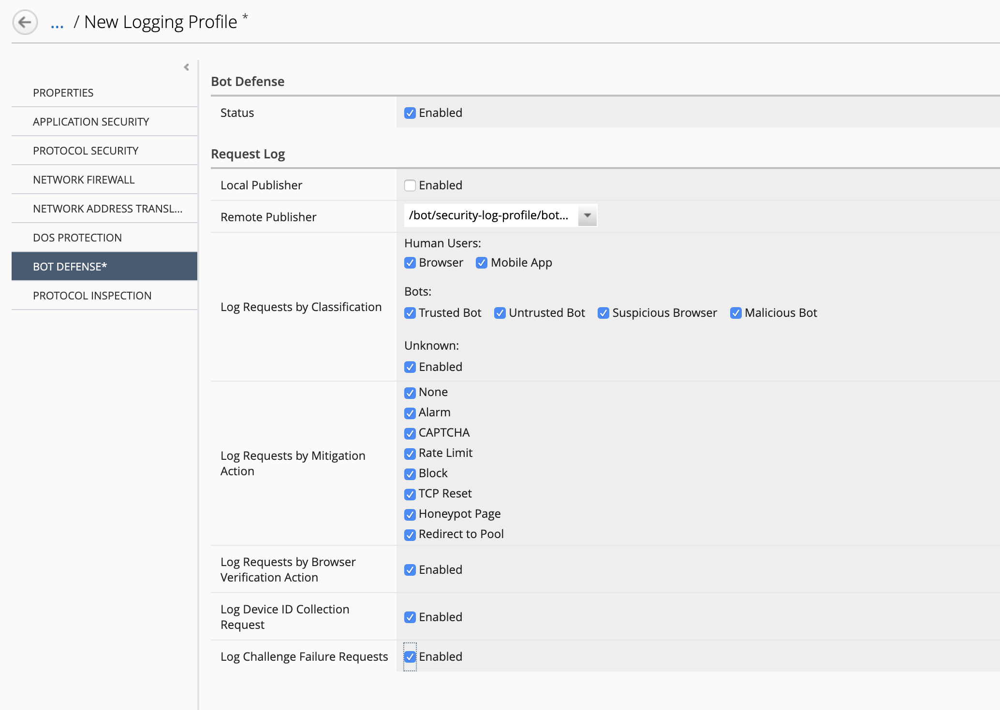

|

2. Pin the new BOT Logging profile to the SEA-vBIGIP01.termmarc.com device.
   Navigate to Pinning Policies and add the Log Publisher previously created to SEA-vBIGIP01.termmarc.com.

.. image:: ../pictures/module1/img_module1_lab1_11.png
  :align: center
  :scale: 40%

|

ASM BOT Defense Profile creation
^^^^^^^^^^^^^^^^^^^^^^^^^^^^^^^^

.. warning:: This step is only for BIG-IQ => 7.1, go see the Annex at the end if you are using a lower version.

1. Go to Configuration > SECURITY > Shared Security > Bot Defense > Bot Profiles, click Create and fill in the settings:

- Name: ``lab-bot-defense-profile``
- Enforcement Mode: ``Blocking``
- Enforcement Readiness Period: ``0`` (**lab only**)

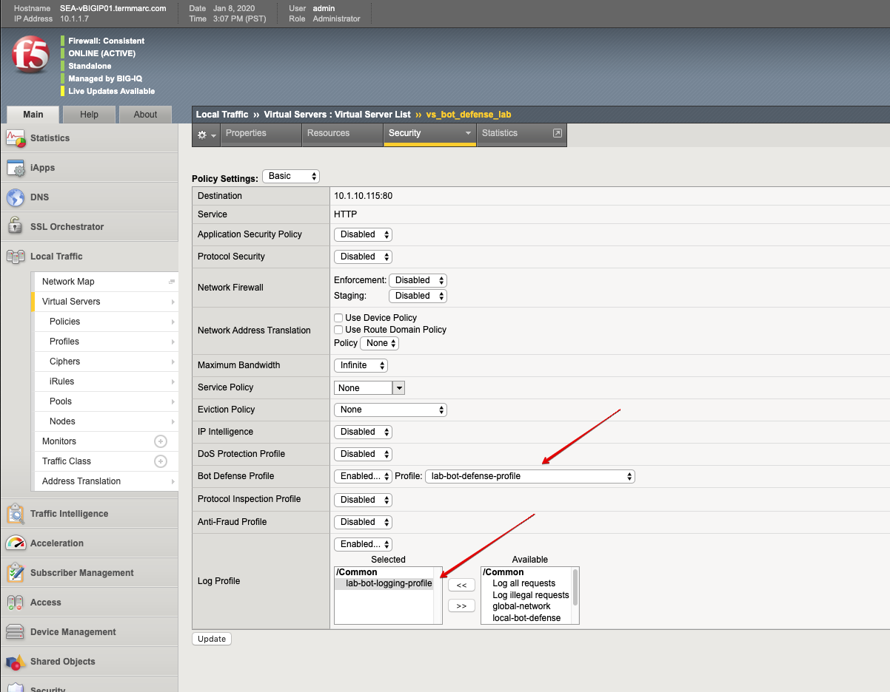

|

- Browser Verification:
- Browser Access: ``Allowed``
- Browser Verification: ``Verify After Access (Blocking)``

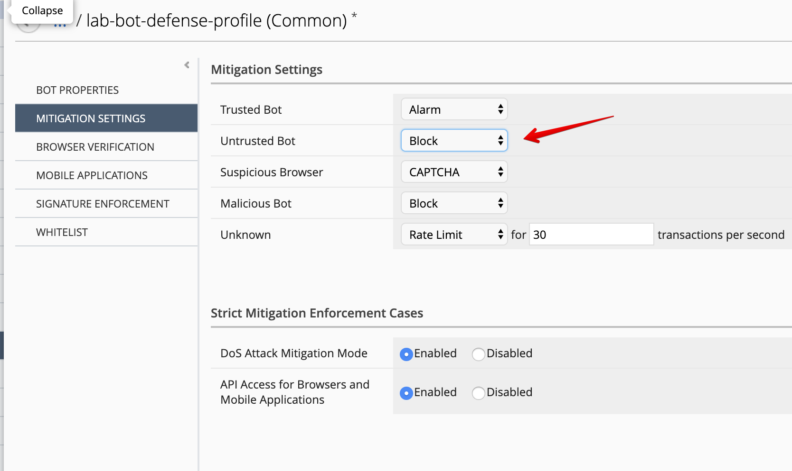

|

.. note:: As per `K42323285`_: Overview of the unified Bot Defense profile the available options for the configuration elements.

.. _`K42323285`: https://support.f5.com/csp/article/K42323285

2. Pin the new BOT Defense Profile to the SEA-vBIGIP01.termmarc.com device.
   Navigate to Pinning Policies and add the Log Publisher previously created to SEA-vBIGIP01.termmarc.com.

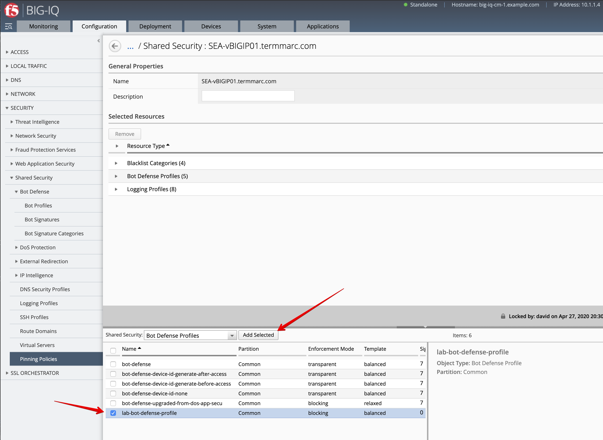

|

3. Deploy the BOT Defense profile alon with the BOT Logging Profile. 
   Go to Deployment tab > EVALUATE & DEPLOY > Shared Security.

Create a Deploments to deploy the Remote Logging Changes on the SEA BIG-IP.

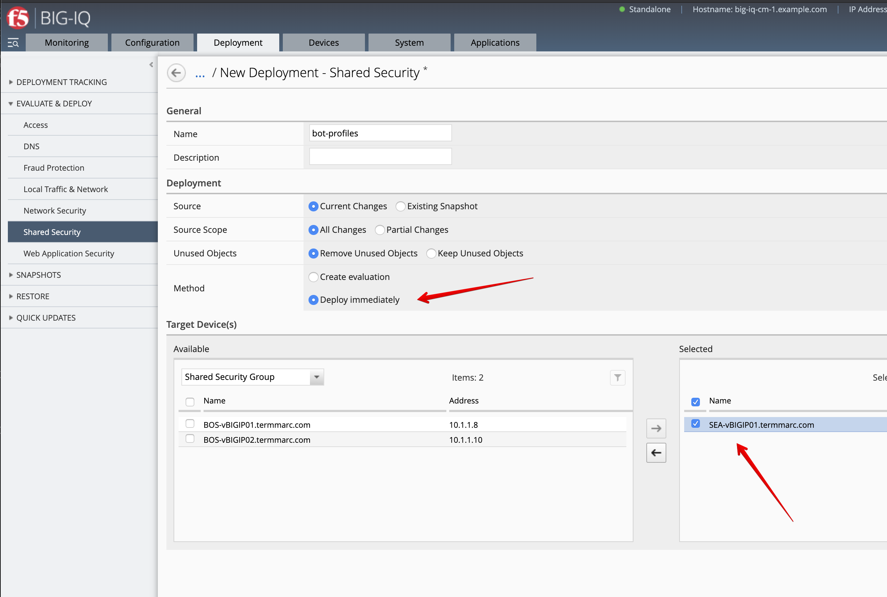

|

Make sure the deployment is successfull.

AS3 BOT template creation and application service deployement
^^^^^^^^^^^^^^^^^^^^^^^^^^^^^^^^^^^^^^^^^^^^^^^^^^^^^^^^^^^^^

1. Navigate to the Applications tab > APPLICATION TEMPLATES.

Select the ``AS3-F5-HTTP-lb-template-big-iq-default-<version>`` AS3 Template and clone it.

Rename it ``LAB-HTTP-bot-defense``. 

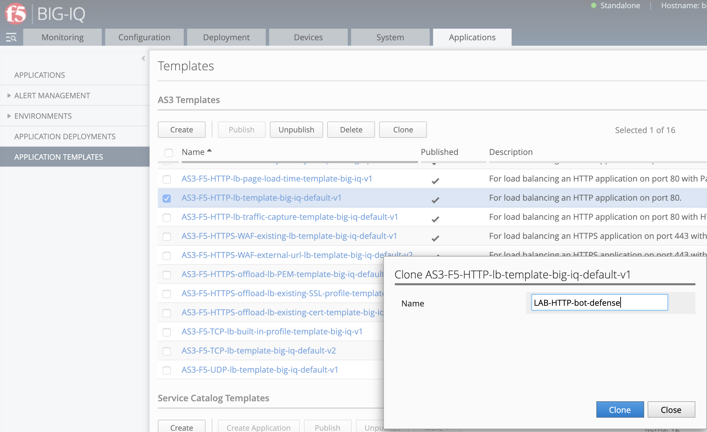

|

Edit the new cloned template and select the Service_HTTP class.

- Look for the attribute called ``profileBotDefense`` and set it to ``/Common/lab-bot-defense-profile``.

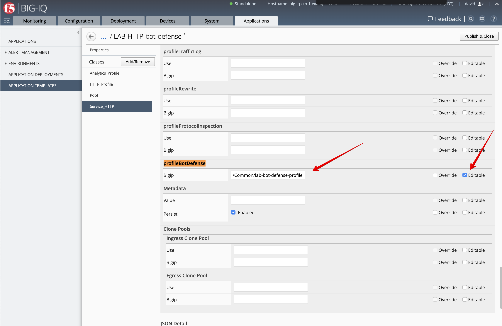

|

- Look for the attribute called ``Security Log Profiles`` and set it to ``/Common/lab-bot-logging-profile``.

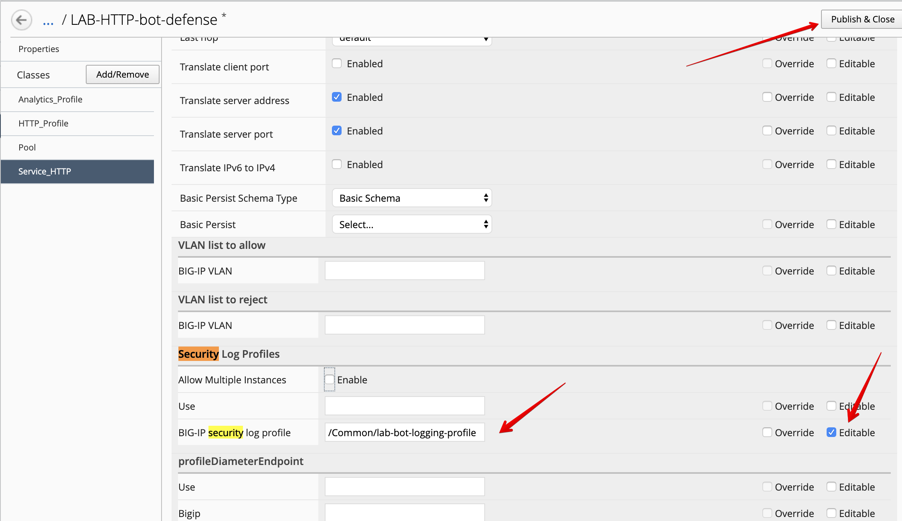

|

At the top right corner, click on **Publish and Close**

2. Navigate to the APPLICATION menu, click on **Create** 

Assign the Bot Defense Profile and the Log Profile previously created.

+---------------------------------------------------------------------------------------------------+
| Application properties:                                                                           |
+---------------------------------------------------------------------------------------------------+
| * Grouping = New Application                                                                      |
| * Application Name = ``LAB_Bot``                                                                  |
| * Description = ``BOT defense protection``                                                        |
+---------------------------------------------------------------------------------------------------+
| Select an Application Service Template:                                                           |
+---------------------------------------------------------------------------------------------------+
| * Template Type = Select ``LAB-HTTP-bot-defense [AS3]``                                           |
+---------------------------------------------------------------------------------------------------+
| General Properties:                                                                               |
+---------------------------------------------------------------------------------------------------+
| * Application Service Name = ``bot_defense_service``                                              |
| * Target = ``SEA-vBIGIP01.termmarc.com``                                                          |
| * Tenant = ``tenant3``                                                                            |
+---------------------------------------------------------------------------------------------------+
| Pool                                                                                              |
+---------------------------------------------------------------------------------------------------+
| * Members: ``10.1.20.123``                                                                        |
+---------------------------------------------------------------------------------------------------+
| HTTP_Profile. Keep default                                                                        |
+---------------------------------------------------------------------------------------------------+
| Service_HTTP                                                                                      |
+---------------------------------------------------------------------------------------------------+
| * Virtual addresses: ``10.1.10.126``                                                              |
| * profileBotDefense: ``/Common/lab-bot-defense-profile``                                          |
| * securityLogProfiles: ``/Common/lab-bot-logging-profile``                                        |
+---------------------------------------------------------------------------------------------------+
| Analytics_Profile. Keep default                                                                   |
+---------------------------------------------------------------------------------------------------+

.. note:: You are attaching the bot defense and logging profiles to the VIP using AS3.

The application service called ``tenant3_bot_defense_service`` is now created on the BIG-IQ dashboard
under the application called ``LAB_Access``.

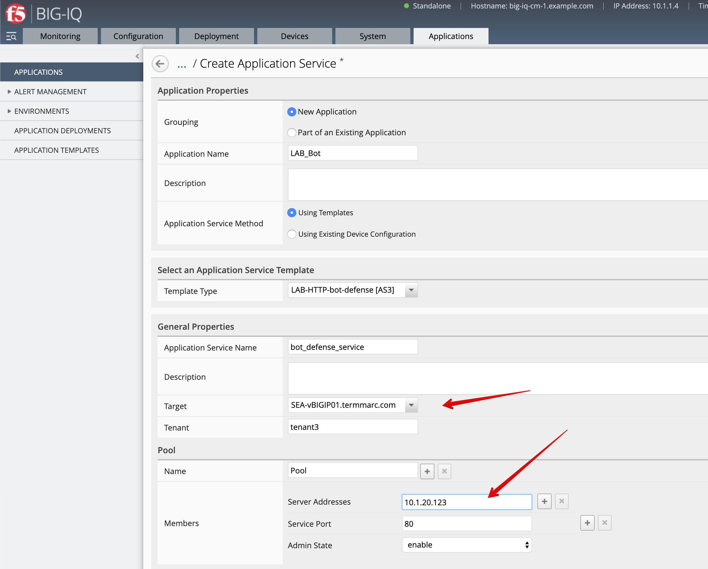

|

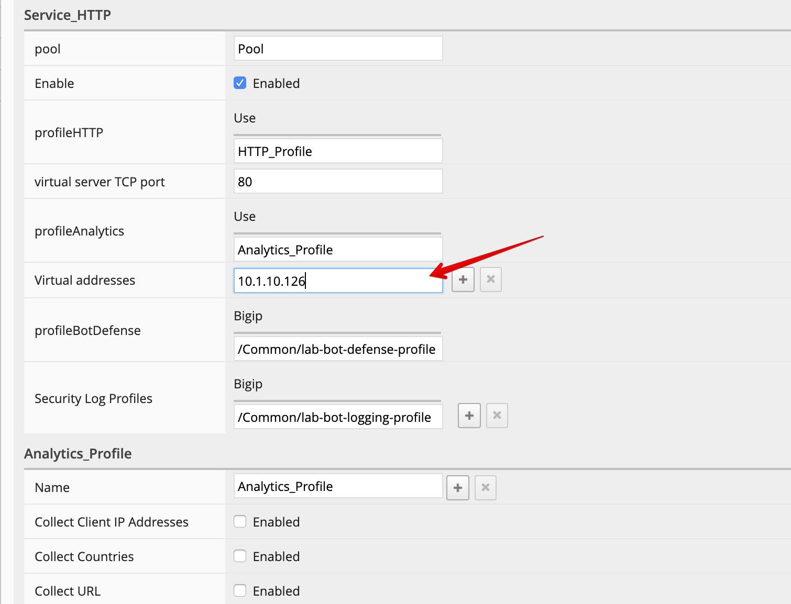

|

Traffic simulation and Dashboard/Events
^^^^^^^^^^^^^^^^^^^^^^^^^^^^^^^^^^^^^^^

1. On Lamp server, generate HTTP traffic from a browser and CLI.

Connect via ``SSH`` to the system *Ubuntu Lamp Server* and run:

``while true; do curl http://10.1.10.126; sleep 1; done``

From the lab environment, launch a xRDP/noVNC session to have access to the Ubuntu Desktop. 
To do this, in your lab environment, click on the *Access* button
of the *Ubuntu Lamp Server* system and select *noVNC* or *xRDP*.

.. note:: Modern laptops with higher resolutions you might want to use 1440x900 and once XRDP is launched Zoom to 200%.

.. image:: ../../pictures/udf_ubuntu.png
    :align: left
    :scale: 40%

|

2. Open Chrome and Navigate to the URL http\:\/\/10.1.10.126.

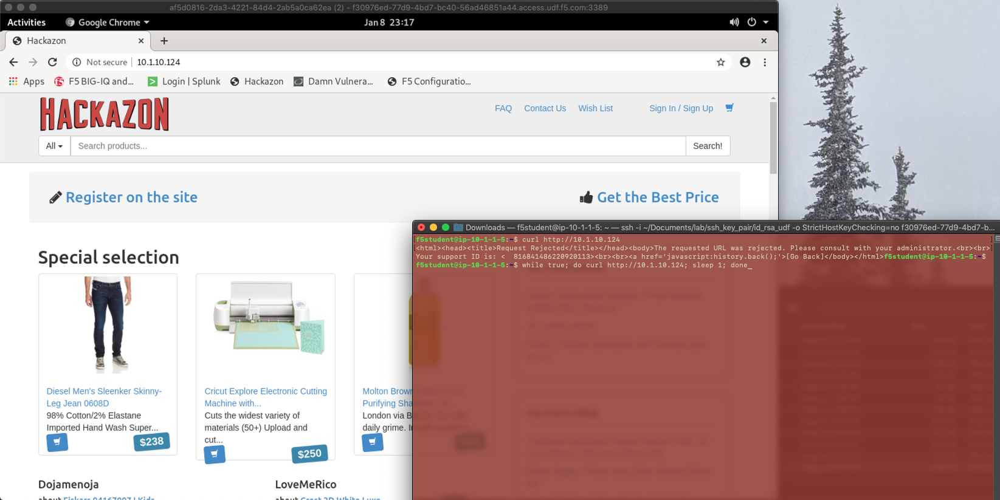

|

Notice the HTTP requests are going through when using a real browser but are blocked when using curl.

3. Now, have a look at the BIG-IQ BOT Dashboard available on BIG-IQ under Monitoring > DASHBOARDS > Bot Traffic.

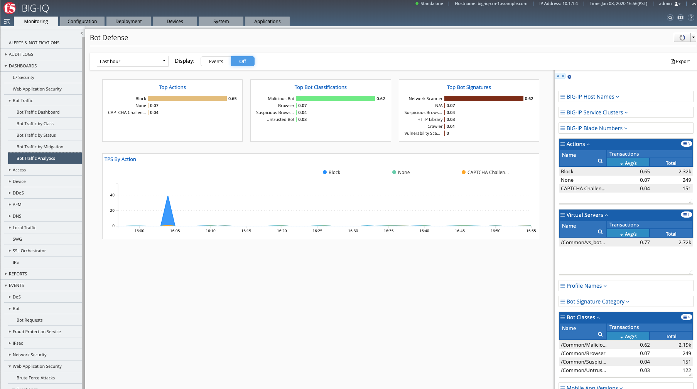

|

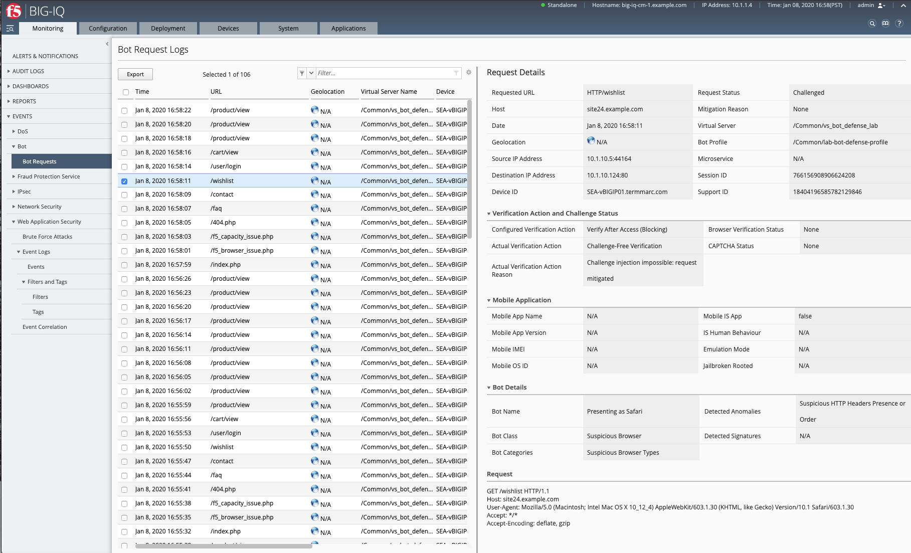

|

You can also see the details of each request logged nunder Monitoring > EVENTS > Bot > Bot Requests.

.. image:: ../pictures/module1/img_module1_lab1_24.png
  :align: center
  :scale: 40%

|

Annex | ASM BOT Defense & Logging Profiles creation from BIG-IP
^^^^^^^^^^^^^^^^^^^^^^^^^^^^^^^^^^^^^^^^^^^^^^^^^^^^^^^^^^^^^^^

.. warning:: This part is only for BIG-IQ <= 7.0. It can be done from BIG-IQ UI starting BIG-IQ 7.1.

1. Connect as **admin** on BIG-IP SEA-vBIGIP01.termmarc.com.

2. Create the Bot Defense Profile. Navigate to Security > Bot Defense. Click Create.

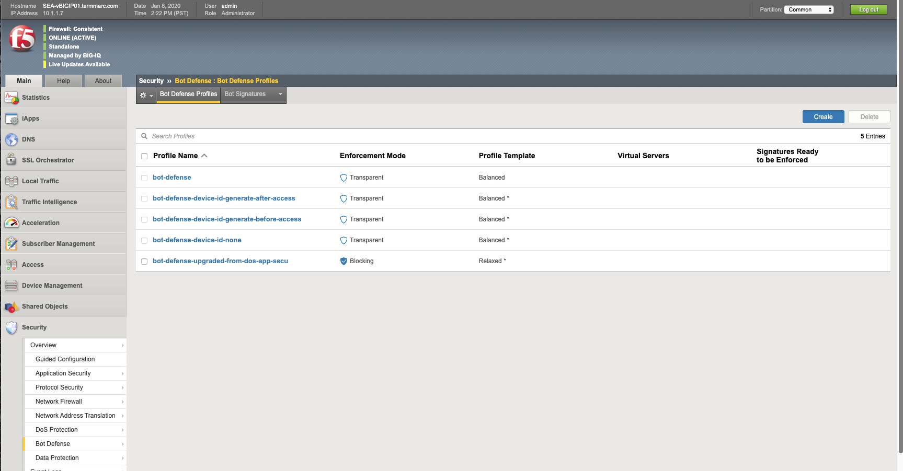

|

- Name: ``lab-bot-defense-profile``
- Enforcement Mode: ``Blocking``
- Enforcement Readiness Period: ``0`` (**lab only**)

.. image:: ../pictures/module1/img_module1_lab1_annex2.png
  :align: center
  :scale: 40%

|

- Untrusted Bot: ``Block``

.. image:: ../pictures/module1/img_module1_lab1_annex3.png
  :align: center
  :scale: 40%

|

3. Create a new BOT Logging profile. Navigate to Security > Event Logs > Logging Profiles. Click Create.

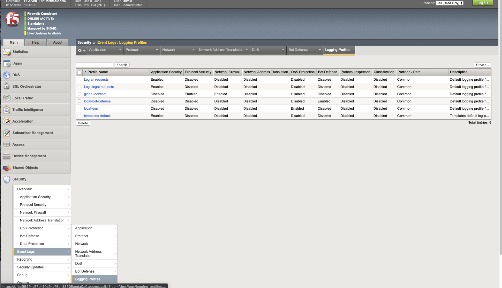

|

- Name: ``lab-bot-logging-profile``
- Properties: select ``Bot Defense``
- Remote Publisher: select previously Remote Publisher previously created either using the UI or API.
- Logs Requests: select all options (Human Users, Bots, etc...)]

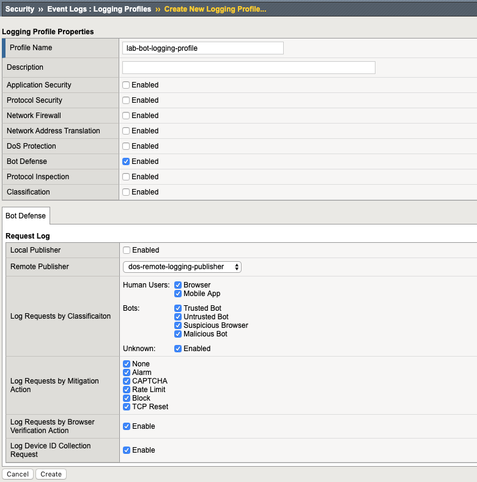

|

4. Navigate to Device tab and re-discover/re-import SEA-vBIGIP01.termmarc.com.

|

|
