Lab 1.2: Configuring L7 Behavioral DoS Protection (new 7.1)
-----------------------------------------------------------
A denial-of-service attack (DoS attack) or distributed denial-of-service attack (DDoS attack) makes 
a victim's resource unavailable to its intended users, or obstructs the communication media between 
the intended users and the victimized site so that they can no longer communicate adequately. 

Perpetrators of DoS attacks typically target sites or services, such as banks, credit card payment gateways,
and e-commerce web sites.

L7 Behavioral DoS (BaDOS) provides automatic protection against DDoS attacks by analyzing traffic behavior 
using machine learning and data analysis. Behavioral DoS examines traffic flowing between clients and 
application servers in data centers, automatically establishes the baseline traffic/flow, then 
dynamically builds signatures and implements various protections as needed based on the behavior 
of the application and the attackers, reducing false positives and providing quicker time to mitigation. 

BIG-IQ Centralized Management allows the centralized management of BaDOS profiles, providing enhanced reporting and event correlation. 

This lab will guide you through the configuration of BaDOS profiles using BIG-IQ CM User Interface.

Official documentation can be found on the `BIG-IQ Knowledge Center`_ and see `DevCentral`_ article on this subject.

.. _`BIG-IQ Knowledge Center`: https://techdocs.f5.com/en-us/bigiq-7-1-0/big-iq-security/managing-dos-profiles-in-shared-security.html

.. _`DevCentral`: https://devcentral.f5.com/s/articles/Configuring-L7-Behavioral-DoS-Protection-with-BIG-IQ-Centralized-Management

.. include:: /accesslab.rst

Workflow
^^^^^^^^

1. **David** creates the DoS Log Destinations and Publisher either using the UI or the API/AS3
2. **Larry** creates the L7 Behavioral DoS & Logging Profiles
3. **David** creates the AS3 template and reference L7 Behavioral DoS & Logging profile created by **Larry**
4. **David** creates the application service using the template created previously
5. **Larry** looks at the BIG-IQ dahsboards and monitor the DoS attacks

Prerequisites
^^^^^^^^^^^^^

1. Navigate to the Devices tab and complete Discovery & Import on **SJC-vBIGIP01.termmarc.com**. 
   Choose *Create Version* for default LTM profiles and *Set all BIG-IP* for other objects.

.. note:: It is recommended to use latest version of BIG-IP. In this lab SJC BIG-IP has 15.1 and will be used.

2. Once LTM module import is completed, Discover & Import **Shared Security (SSM)** and **Web Application Security (ASM)** modules.
   Choose *Set all BIG-IP* when conflict resolution open.

3. Check if the **DoS Protection** service is Active under System > BIG-IQ DATA COLLECTION > BIG-IQ Data Collection Devices.

DoS Log Destinations and Publisher creation using UI
^^^^^^^^^^^^^^^^^^^^^^^^^^^^^^^^^^^^^^^^^^^^^^^^^^^^

.. warning:: If you want to use API to create those objects, skip this part and go to the next one.

1. As **David**, create the DCD Pool and Log Destination. Navigate to Configuration Tab > LOCAL TRAFFIC > Pools, click Create.

- Name: ``dos-remote-dcd-pool``
- Device: ``SJC-vBIGIP01.termmarc.com``
- Health Monitors: ``tcp``
- Pool Member/Port: ``10.1.10.6:8020``

2. Navigate to Configuration Tab > LOCAL TRAFFIC > Logs > Log Destinations, click Create.

- Name Log Destination hslog: ``dos-remote-logging-destination-remote-hslog-8020``
- Type: ``Remote High-Speed Log``
- Device: ``SJC-vBIGIP01.termmarc.com``
- Pool: ``dos-remote-dcd-pool`` previously created

3. Navigate to Configuration Tab > LOCAL TRAFFIC > Logs > Log Destinations, click Create.

- Name Log Destination Splunk: ``dos-remote-logging-destination-splunk-8020``
- Type: ``Splunk``
- Forward To: ``Remote High Speed Log`` - ``dos-remote-logging-destination-remote-hslog-8020`` previously created

.. note:: This is to add the formatting supported by BIG-IQ

4. Create the Log Publisher. Navigate to Configuration Tab > LOCAL TRAFFIC > Logs > Log Publisher. click Create.

- Name: ``dos-remote-logging-publisher-8020``
- Log Destinations: ``dos-remote-logging-destination-splunk-8020`` previously created

5. Pin the new Log Publisher to the SJC-vBIGIP01.termmarc.com device. Navigate to Pinning Policies and 
   add the Log Publisher previously created to SJC-vBIGIP01.termmarc.com.

6. Deploy the Pool, Log Destinations, Log Publisher. Go to Deployment tab > EVALUATE & DEPLOY > Local Traffic & Network.

Create a Deployment to deploy the Remote Logging Changes on the SJC BIG-IP.

Make sure the deployment is successful.

.. note:: More information `Managing Logging Profiles in Shared Security`_.

.. _Managing Logging Profiles in Shared Security: https://techdocs.f5.com/en-us/bigiq-7-1-0/big-iq-security/managing-logging-profiles-in-shared-security.html

DoS Log Destinations and Publisher creation using API/AS3
^^^^^^^^^^^^^^^^^^^^^^^^^^^^^^^^^^^^^^^^^^^^^^^^^^^^^^^^^

1. From the lab environment, launch a remote desktop session to have access to the Ubuntu Desktop. 

Open Chrome and Postman.

For Postman, click right and click on execute (wait ~2 minutes).

.. note:: If Postman does not open, open a terminal, type ``postman`` to open postman.

.. image:: ../../pictures/postman.png
    :align: center
    :scale: 40%

|

Using the declarative AS3 API, let's send the following BIG-IP configuration through BIG-IQ:

Using Postman select ``BIG-IQ Token (david)`` available in the Collections.
Press Send. This, will save the token value as _f5_token. If your token expires, 
obtain a new token by re-sending the ``BIG-IQ Token``

.. note:: The token timeout is set to 5 min. If you get the 401 authorization error, request a new token.

2. Copy below AS3 declaration into the body of the **BIG-IQ AS3 Declaration** collection in order to create 
   the service on the BIG-IP through BIG-IQ:

  POST https\:\/\/10.1.1.4/mgmt/shared/appsvcs/declare?async=true

.. code-block:: yaml
   :linenos:
   :emphasize-lines: 9,20,22

      {
          "class": "AS3",
          "action": "deploy",
          "persist": true,
          "declaration": {
              "class": "ADC",
              "schemaVersion": "3.12.0",
              "target": {
                  "address": "10.1.1.11"
              },
              "dos": {
                  "class": "Tenant",
                  "security-log-profile": {
                      "class": "Application",
                      "template": "generic",
                      "dos-remote-dcd-pool": {
                          "class": "Pool",
                          "members": [
                              {
                                  "servicePort": 8020,
                                  "serverAddresses": [
                                      "10.1.10.6"
                                  ],
                                  "shareNodes": true
                              }
                          ]
                      },
                      "dos-remote-logging-destination-remote-hslog-8020": {
                          "class": "Log_Destination",
                          "type": "remote-high-speed-log",
                          "pool": {
                              "use": "dos-remote-dcd-pool"
                          }
                      },
                      "dos-remote-logging-destination-splunk-8020": {
                          "class": "Log_Destination",
                          "type": "splunk",
                          "forwardTo": {
                              "use": "dos-remote-logging-destination-remote-hslog-8020"
                          }
                      },
                      "dos-remote-logging-publisher-8020": {
                          "class": "Log_Publisher",
                          "destinations": [
                              {
                                  "use": "dos-remote-logging-destination-splunk-8020"
                              }
                          ]
                      }
                  }
              }
          }
      }

3. Navigate to Devices tab and re-discover/re-import SJC-vBIGIP01.termmarc.com.

DoS Logging Profile creation
^^^^^^^^^^^^^^^^^^^^^^^^^^^^

1. As **Larry**, create a new DoS Logging profile. Navigate to Configuration > SECURITY > Shared Security > Logging Profiles. Click Create.

- Name: ``lab-dos-logging-profile``

DOS PROTECTION:

- Dos Protection > Status: ``Enabled``
- DoS Application Protection > Remote Publisher: ``dos-remote-logging-publisher-8020``

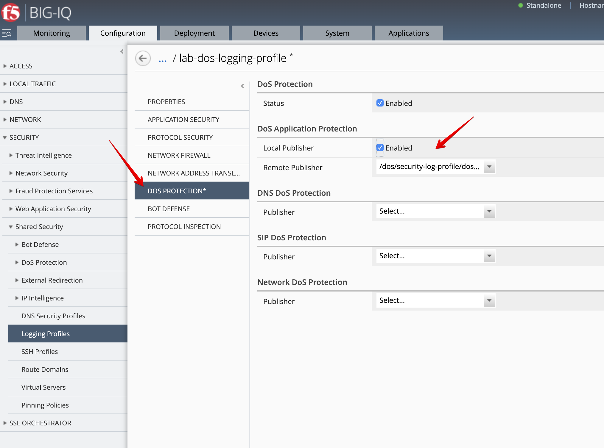

|

2. Pin the new DoS Logging profile to the SJC-vBIGIP01.termmarc.com device.
   Navigate to Pinning Policies and add it to SJC-vBIGIP01.termmarc.com.

.. image:: ../pictures/module1/img_module1_lab2_2.png
  :align: center
  :scale: 40%

|

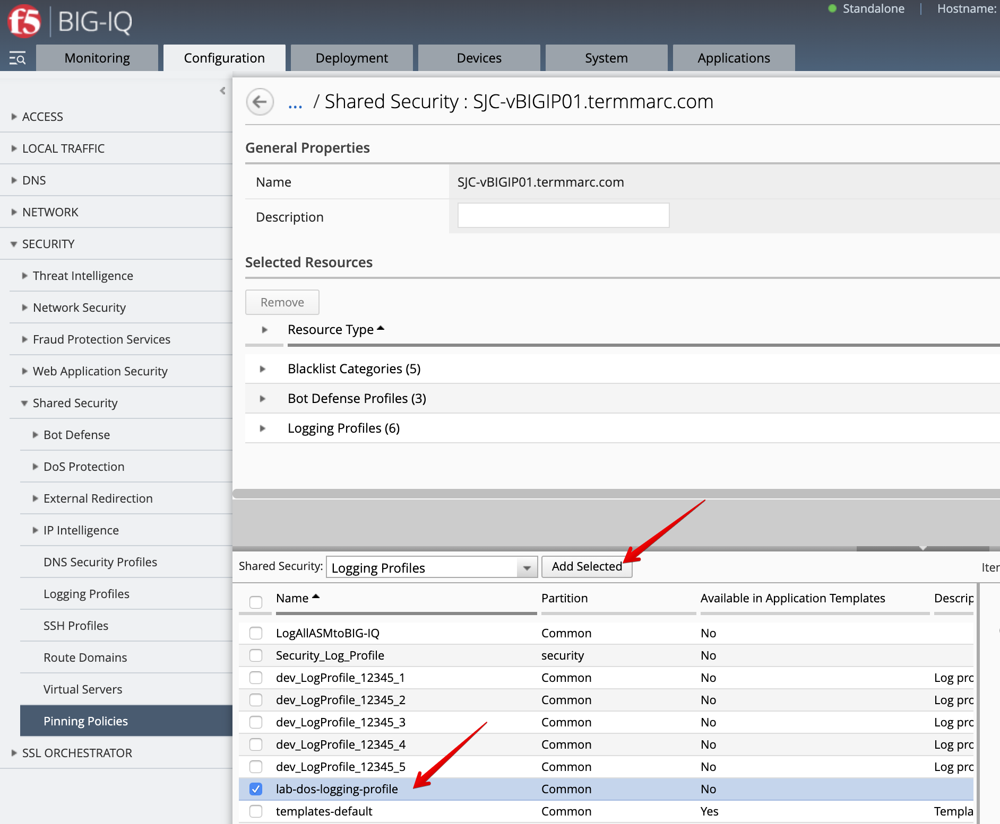

|

L7 Behavioral DoS Profile creation with Signature Detection
^^^^^^^^^^^^^^^^^^^^^^^^^^^^^^^^^^^^^^^^^^^^^^^^^^^^^^^^^^^

1. As **David**, go to Configuration > SECURITY > Shared Security > DoS Protection > DoS Profiles, click **Create** and configure Behavioral & Stress-based Detection:

- Name: ``lab-bados-profile``

Application Security:

- Application Security: ``Enabled``

Behavioral & Stress-based Detection:

- Operation Mode: ``Blocking``
- Thresholds Mode: ``Automatic``
- Signature Detection: ``Enable``
- Mitigation: ``Standard protection``

TPS-based Detection

- Operation Mode: ``Off``

.. image:: ../pictures/module1/img_module1_lab2_4.png
  :align: center
  :scale: 40%

|

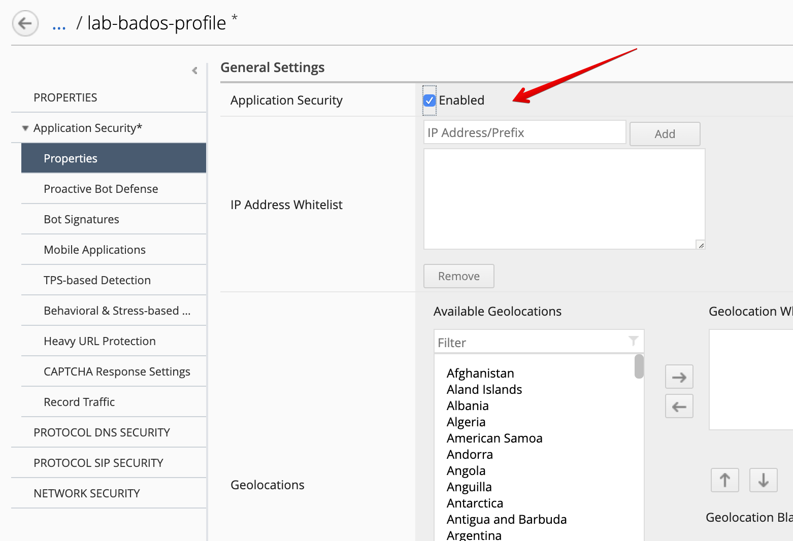

|

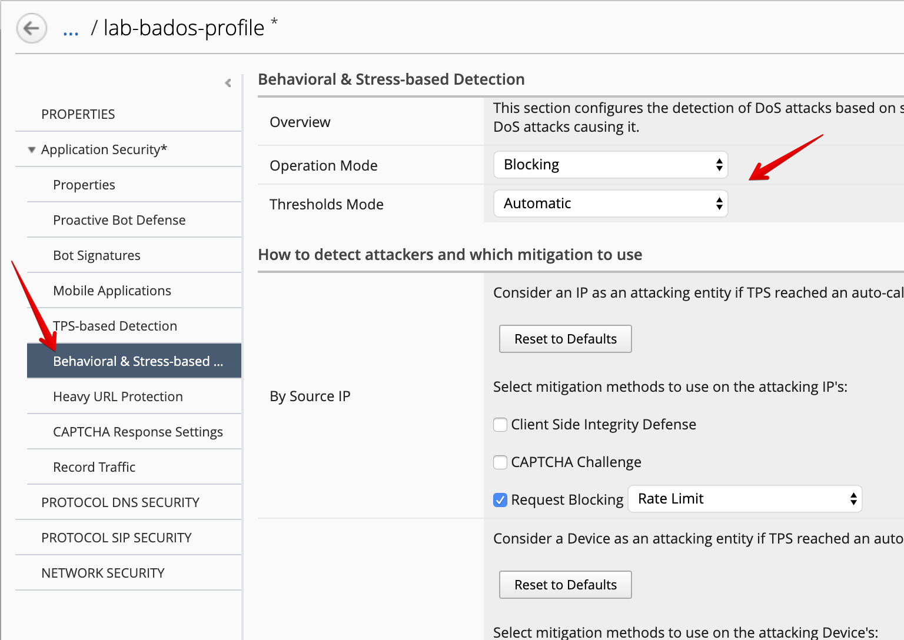

|

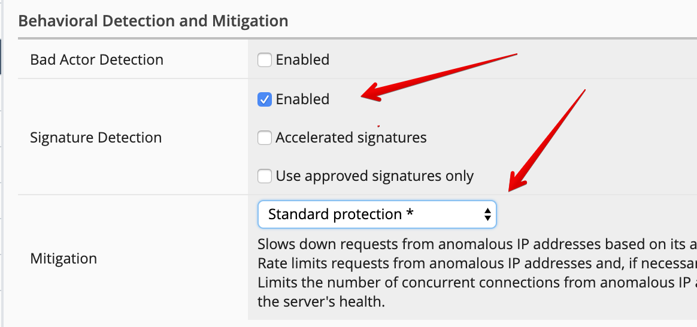

|

Make sure you disable **TPS-based Detection** in the DoS profile by setting Operation Mode: ``Off``.

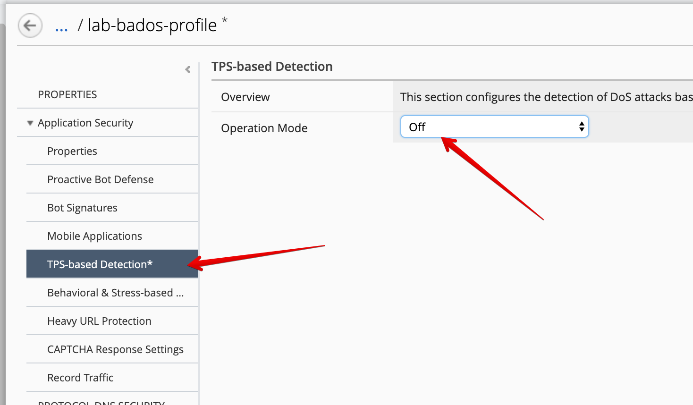

|

.. note:: More details in `BIG-IP ASM - Preventing DoS Attacks on Applications v15.1`_ ,          

.. _`BIG-IP ASM - Preventing DoS Attacks on Applications v15.1`: https://techdocs.f5.com/en-us/bigip-15-0-0/big-ip-asm-implementations/preventing-dos-attacks-on-applications.html

2. Pin the new DoS profile to the SJC-vBIGIP01.termmarc.com device.
   Navigate to Pinning Policies and add the DoS Profile previously created to SJC-vBIGIP01.termmarc.com.

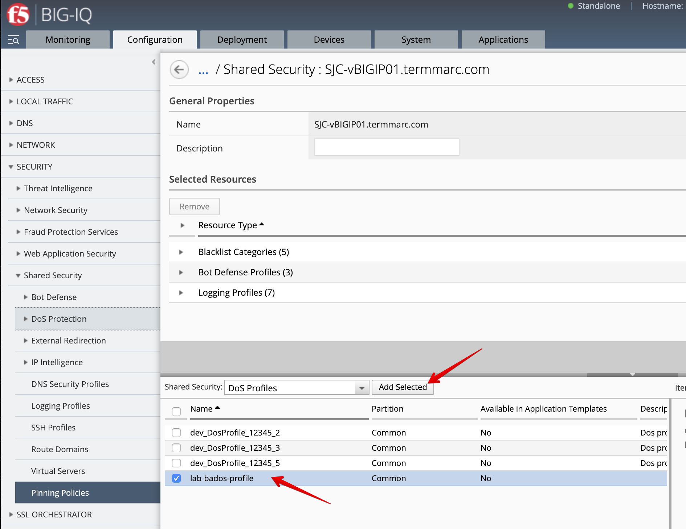

|

3. Deploy the DoS profile. 
   Go to Deployment tab > EVALUATE & DEPLOY > Shared Security.

Create a Deployment to deploy the DoS Profile & Remote Logging changes on the SJC BIG-IP.

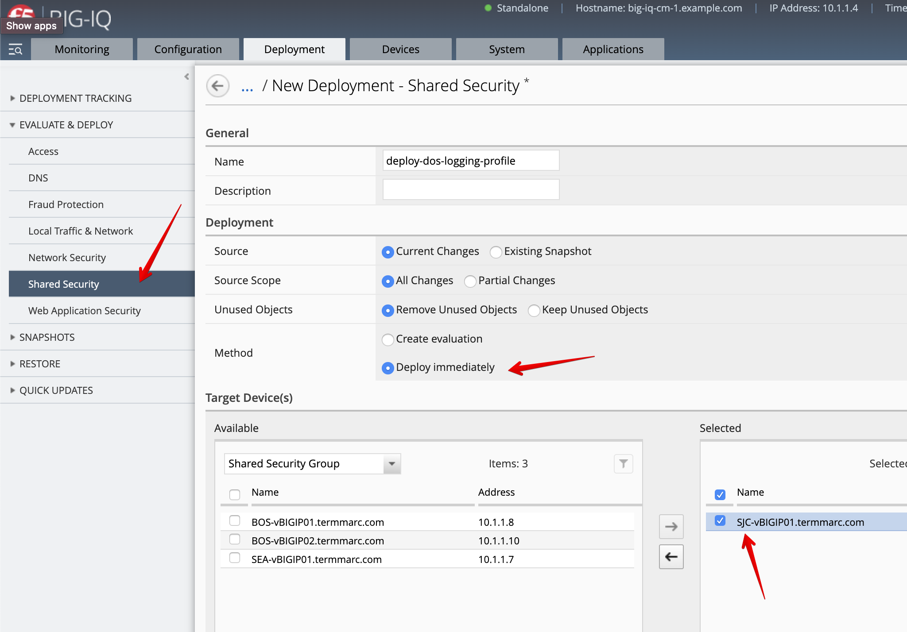

|

Make sure the deployment is successful.

AS3 BaDoS Template creation and application service deployment
^^^^^^^^^^^^^^^^^^^^^^^^^^^^^^^^^^^^^^^^^^^^^^^^^^^^^^^^^^^^^^

1. Navigate to the Applications tab > APPLICATION TEMPLATES.

Select the ``AS3-F5-HTTP-lb-template-big-iq-default-<version>`` AS3 Template and clone it.

Rename it ``LAB-HTTP-BaDOS``. 

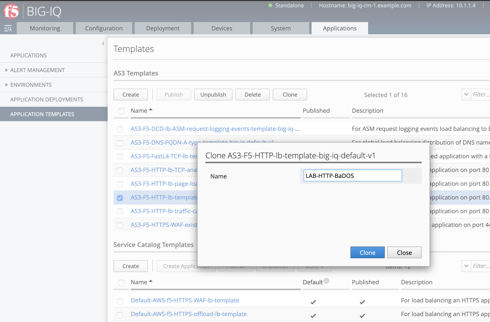

|

Edit the new cloned template and select the Service_HTTP class.

- Look for the attribute called ``profileDOS``, set it to ``/Common/lab-bados-profile``, and mark it as ``Editable``.

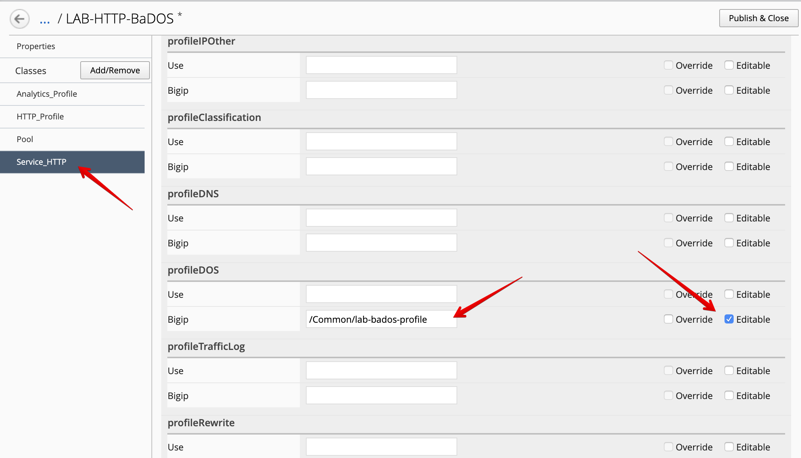

|

- Look for the attribute called ``Security Log Profiles``, set it to ``/Common/lab-dos-logging-profile``, and mark it as ``Editable``.

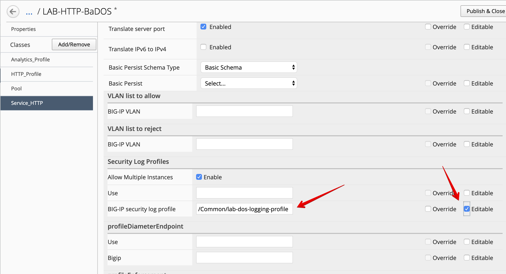

|

Then, select the HTTP_Profile class.

- Look for the attributes called ``Trust X-Forwarded-For``, set it to ``Enabled``, and mark it as ``Editable``.

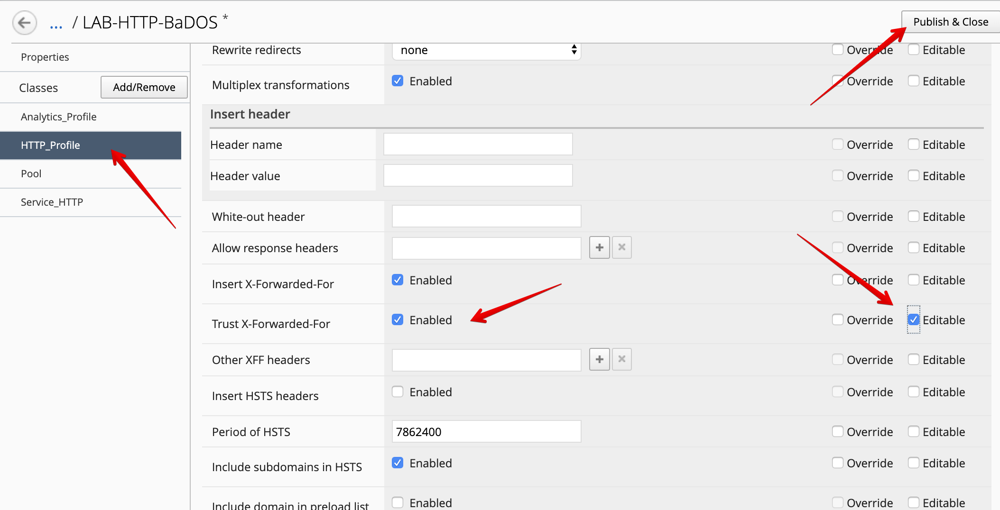

|

At the top right corner, click on **Publish and Close**

2. Navigate to the APPLICATION menu, click on **Create** 

Assign the Bot Defense Profile and the Log Profile previously created.

+---------------------------------------------------------------------------------------------------+
| Application properties:                                                                           |
+---------------------------------------------------------------------------------------------------+
| * Grouping = New Application                                                                      |
| * Application Name = ``LAB_BaDOS``                                                                |
| * Description = ``L7 Behavioral DoS Protection``                                                  |
| * Application Service Method = ``Using Templates``                                                |
+---------------------------------------------------------------------------------------------------+
| Select an Application Service Template:                                                           |
+---------------------------------------------------------------------------------------------------+
| * Template Type = Select ``LAB-HTTP-BaDOS [AS3]``                                                 |
+---------------------------------------------------------------------------------------------------+
| General Properties:                                                                               |
+---------------------------------------------------------------------------------------------------+
| * Application Service Name = ``BaDOS_service``                                                    |
| * Target = ``SJC-vBIGIP01.termmarc.com``                                                          |
| * Tenant = ``tenant5``                                                                            |
+---------------------------------------------------------------------------------------------------+
| Pool                                                                                              |
+---------------------------------------------------------------------------------------------------+
| * Members: ``10.1.20.123``                                                                        |
+---------------------------------------------------------------------------------------------------+
| HTTP_Profile. Keep default.                                                                       |
+---------------------------------------------------------------------------------------------------+
| Service_HTTP                                                                                      |
+---------------------------------------------------------------------------------------------------+
| * Virtual addresses: ``10.1.10.138``                                                              |
| * profileDOS: ``/Common/lab-bados-profile``                                                       |
| * securityLogProfiles: ``/Common/lab-dos-logging-profile``                                        |
+---------------------------------------------------------------------------------------------------+
| Analytics_Profile. Enable all options.                                                            |
+---------------------------------------------------------------------------------------------------+

.. note:: You are attaching the DoS and logging profiles to the VIP using AS3.

The application service called ``tenant5_BaDOS_service`` is now created on the BIG-IQ dashboard
under the application called ``LAB_BaDOS``.

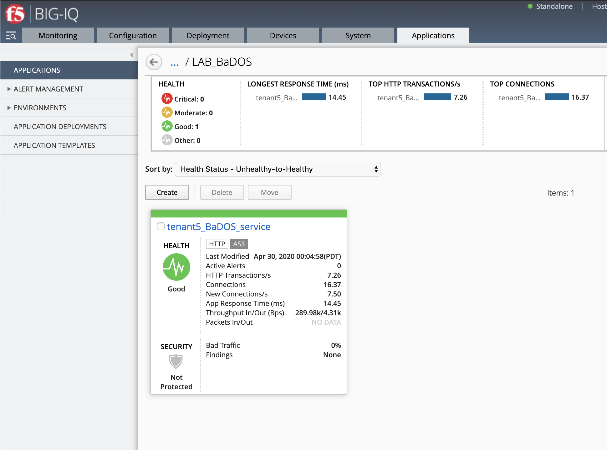

|

Generate baseline legitimate traffic and trigger the DoS attacks
^^^^^^^^^^^^^^^^^^^^^^^^^^^^^^^^^^^^^^^^^^^^^^^^^^^^^^^^^^^^^^^^

.. note:: Both legitimate and attack traffic will have XFF header inserted in the request to simulate geografically 
          distributed clients. The source IP is also updated on the Lamp server used to generate the traffic.

1. Generate baseline legitimate traffic. On Lamp server, generate HTTP traffic from a browser and CLI.

Connect via ``SSH`` to the system *Ubuntu Lamp Server* and run:

``/home/f5/traffic-scripts/behavioral-DoS/baseline_baddos.sh``

Choose ``1) increasing``.

2. Wait for the machine learning algorithm to learn traffic behavior. SSH to the **SJC-vBIGIP01.termmarc.com** device and run:

``admd -s vs./tenant5/BaDOS_service/serviceMain+/Common/lab-bados-profile.info.learning``

The output looks like that:

``vs./tenant5/BaDOS_service/serviceMain+/Common/lab-bados-profile.info.learning:[80.5464, 697, 26450, 100]``

- 80.5464 is the average approximation to the learned baselines (confidence in the machine learning algorithm, wait until this number reaches 95% before starting the attack traffic)
- 667 is the number of bins to be measured
- 26450 is the number if learned unique suggestions
- 100 is the number of good signatures dataset which are ready

3. Start the attack traffic, open a different SSH session on the lamp server and run:

``/home/f5/traffic-scripts/behavioral-DoS/attack_baddos.sh``

4. Now, have a look at the BIG-IQ DoS Dashboard available on BIG-IQ under **Monitoring > DASHBOARDS > DDoS > HTTP Analysis**.

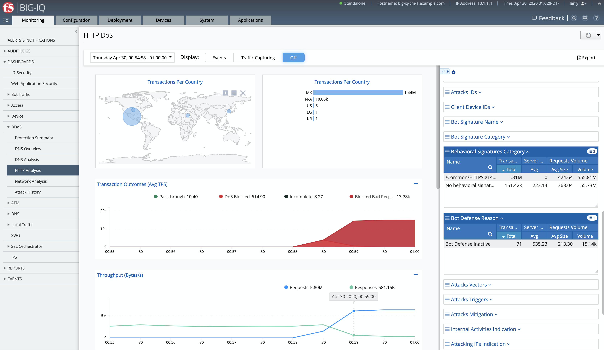

|

Open the **Monitoring > EVENTS > DoS > Application Events** and look at the event logs.

.. image:: ../pictures/module1/img_module1_lab2_16.png
  :align: center
  :scale: 40%

|

The behavior observed in this example is that at the beginning of a DoS attack, BaDoS first protects by blocking all DoS traffic, 
incrementing "DoS Blocked" counter.

Once the BaDoS dynamic signatures have been computed, BaDoS blocks only the traffic matching the dynamic signatures, 
incrementing the "Blocked Bad request" counter.

.. note:: In this lab, BaDoS is slowing down legitimate traffic, this is due to the fact we are using the same system to generate both good and bad traffic.

L7 Behavioral DoS Profile update with Bad Actor Detection
^^^^^^^^^^^^^^^^^^^^^^^^^^^^^^^^^^^^^^^^^^^^^^^^^^^^^^^^^

To observe the change in BaDoS profile behavior when individual bad actors are detected,
let's modify the BaDoS profile by enabling Bad Actor Detection under the Behavioral Detection and Mitigation.

1. Go to Configuration > SECURITY > Shared Security > DoS Protection > DoS Profiles and open ``lab-bados-profile``.

- Mitigation: ``Bad Actor Detection``

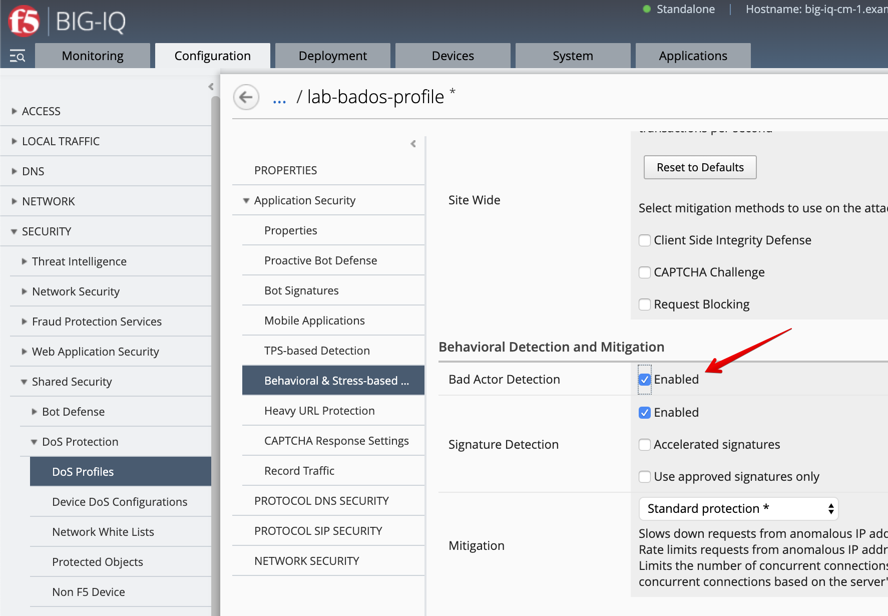

|

2. Deploy the updated DoS profile. Select the profile and click **Deploy**.

Create a Deployment to deploy the Remote Logging Changes on the SJC BIG-IP.

Make sure the deployment is successful.

3. Back on the BIG-IQ DoS Dashboard under **Monitoring > DASHBOARDS > DDoS > HTTP Analysis**.

On the HTTP Analysis DDoS Dashboard, you can observe the Blocked Bad Actor counter being incremented while Blocked 
Bad Requests stop incrementing as a result of bad actors being identified and being added to the grey list.

Expand the dimmensions to show *Transaction Outcomes* and *Client IPs*.

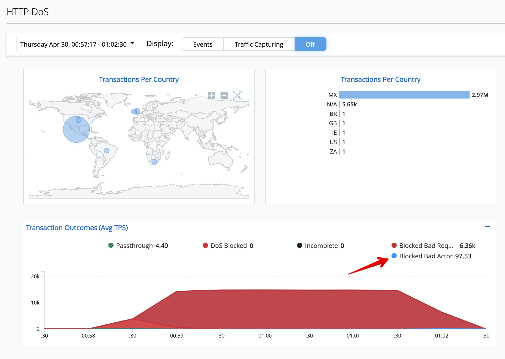

|

.. note:: Examine the list of detected bad actor IP addresses on the BIG-IP: ``ipidr -l /tenant5/BaDOS_service/serviceMain+/Common/lab-bados-profile``

4. Stop the attack traffic by stoping the ``attack_baddos.sh`` script with CTRL+C

5. BIG-IQ also offer other ook under **Monitoring > DASHBOARDS > DDoS > Protection Summary**.

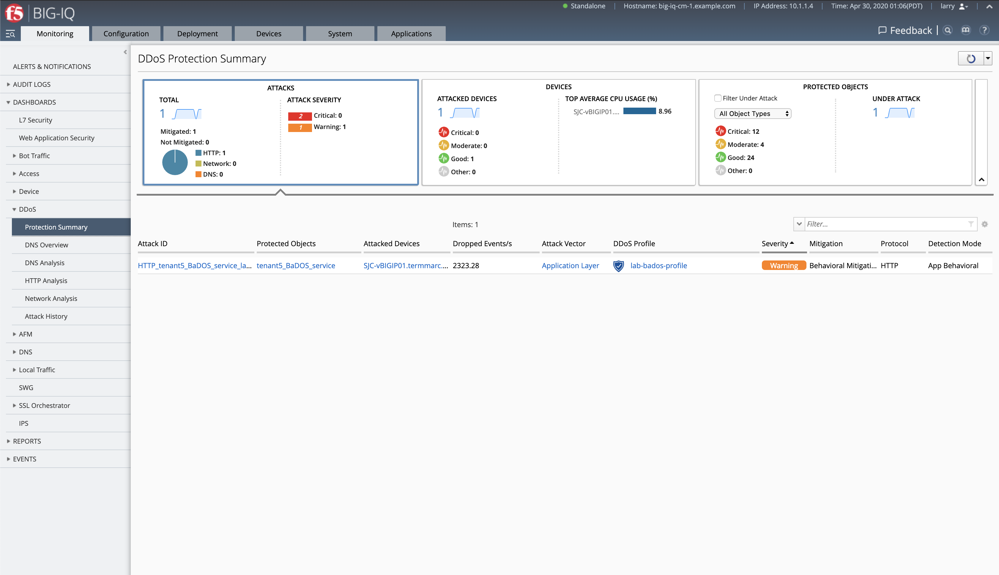

|

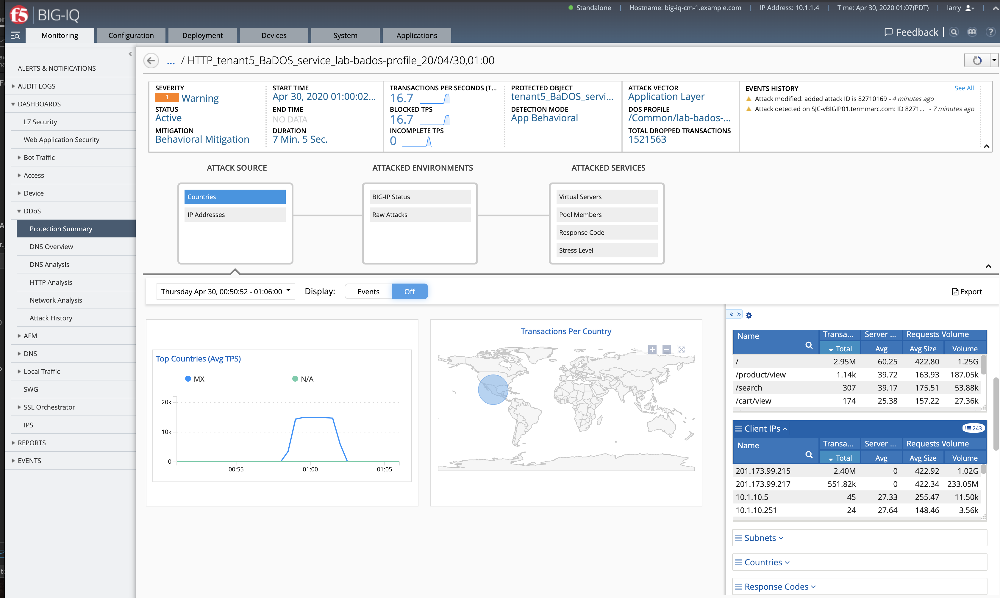

|

6. After some time, look under **Monitoring > DASHBOARDS > DDoS > Attack History**.

7. Navigate to the Applications tab > APPLICATION > LAB_BaDOS > tenant5_BaDOS_service. Can you see the Behavioral DoS attack?

Annex | Run the entire lab configuration part with 1 single API call using AS3
^^^^^^^^^^^^^^^^^^^^^^^^^^^^^^^^^^^^^^^^^^^^^^^^^^^^^^^^^^^^^^^^^^^^^^^^^^^^^^

1. From the lab environment, launch a remote desktop session to have access to the Ubuntu Desktop. 

Open Chrome and Postman.

For Postman, click right and click on execute (wait ~2 minutes).

.. note:: If Postman does not open, open a terminal, type ``postman`` to open postman.

.. image:: ../../pictures/postman.png
    :align: center
    :scale: 40%

|

Using the declarative AS3 API, let's send the following BIG-IP configuration through BIG-IQ:

Using Postman select ``BIG-IQ Token (david)`` available in the Collections.
Press Send. This, will save the token value as _f5_token. If your token expires, 
obtain a new token by re-sending the ``BIG-IQ Token``

.. note:: The token timeout is set to 5 min. If you get the 401 authorization error, request a new token.

2. Copy below AS3 declaration into the body of the **BIG-IQ AS3 Declaration** collection in order to create 
   the service on the BIG-IP through BIG-IQ:

  POST https\:\/\/10.1.1.4/mgmt/shared/appsvcs/declare?async=true

.. code-block:: yaml
   :linenos:
   :emphasize-lines: 9,20,27,34,57,78,119,121

        {
            "class": "AS3",
            "action": "deploy",
            "persist": true,
            "declaration": {
                "class": "ADC",
                "schemaVersion": "3.12.0",
                "target": {
                    "address": "10.1.1.11"
                },
                "tenant5": {
                    "class": "Tenant",
                    "BaDOS_service": {
                        "class": "Application",
                        "template": "http",
                        "serviceMain": {
                            "class": "Service_HTTP",
                            "virtualPort": 80,
                            "virtualAddresses": [
                                "10.1.10.138"
                            ],
                            "profileAnalytics": {
                                "use": "Analytics_Profile"
                            },
                            "pool": "Pool",
                            "profileDOS": {
                                "use": "lab-bados-profile"
                            },
                            "profileHTTP": {
                                "use": "HTTP_Profile"
                            },
                            "securityLogProfiles": [
                                {
                                    "use": "lab-dos-logging-profile"
                                }
                            ]
                        },
                        "HTTP_Profile": {
                            "class": "HTTP_Profile",
                            "xForwardedFor": true,
                            "trustXFF": true
                        },
                        "Analytics_Profile": {
                            "class": "Analytics_Profile",
                            "collectClientSideStatistics": true,
                            "collectOsAndBrowser": false,
                            "collectMethod": false,
                            "collectResponseCode": true,
                            "collectIp": true,
                            "collectGeo": true,
                            "collectUrl": true
                        },
                        "Pool": {
                            "members": [
                                {
                                    "serverAddresses": [
                                        "10.1.20.123"
                                    ],
                                    "servicePort": 80,
                                    "monitors": [
                                        "http"
                                    ],
                                    "adminState": "enable",
                                    "shareNodes": true
                                }
                            ],
                            "class": "Pool",
                            "monitors": [
                                "http"
                            ]
                        },
                        "dos-remote-dcd-pool": {
                            "class": "Pool",
                            "members": [
                                {
                                    "servicePort": 8020,
                                    "serverAddresses": [
                                        "10.1.10.6"
                                    ],
                                    "shareNodes": true
                                }
                            ]
                        },
                        "dos-remote-logging-destination-remote-hslog-8020": {
                            "class": "Log_Destination",
                            "type": "remote-high-speed-log",
                            "pool": {
                                "use": "dos-remote-dcd-pool"
                            }
                        },
                        "dos-remote-logging-destination-splunk-8020": {
                            "class": "Log_Destination",
                            "type": "splunk",
                            "forwardTo": {
                                "use": "dos-remote-logging-destination-remote-hslog-8020"
                            }
                        },
                        "dos-remote-logging-publisher-8020": {
                            "class": "Log_Publisher",
                            "destinations": [
                                {
                                    "use": "dos-remote-logging-destination-splunk-8020"
                                }
                            ]
                        },
                        "lab-dos-logging-profile": {
                            "class": "Security_Log_Profile",
                            "dosApplication": {
                                "remotePublisher": {
                                    "use": "dos-remote-logging-publisher-8020"
                                }
                            }
                        },
                        "lab-bados-profile": {
                            "class": "DOS_Profile",
                            "application": {
                                "stressBasedDetection": {
                                    "badActor": {
                                        "detectionEnabled": false,
                                        "mitigationMode": "standard",
                                        "signatureDetectionEnabled": true
                                    },
                                    "operationMode": "blocking",
                                    "thresholdsMode": "automatic",
                                    "sourceIP": {
                                        "rateLimitingEnabled": true,
                                        "rateLimitingMode": "rate-limit"
                                    },
                                    "url": {
                                        "rateLimitingEnabled": true
                                    }
                                }
                            }
                        }
                    }
                }
            }
        }

3. Navigate to Devices tab and re-discover/re-import SJC-vBIGIP01.termmarc.com.

4. Run section *Generate baseline legitimate traffic and trigger the DoS attacks*

Use following admd command to monitor the learning:

``admd -s vs./tenant5/BaDOS_service/serviceMain+/tenant5/BaDOS_service/lab-bados-profile.info.learning``

5. Run section *L7 Behavioral DoS Profile update with Bad Actor Detection*

Update AS3 declaration with ``"detectionEnabled": true``.
