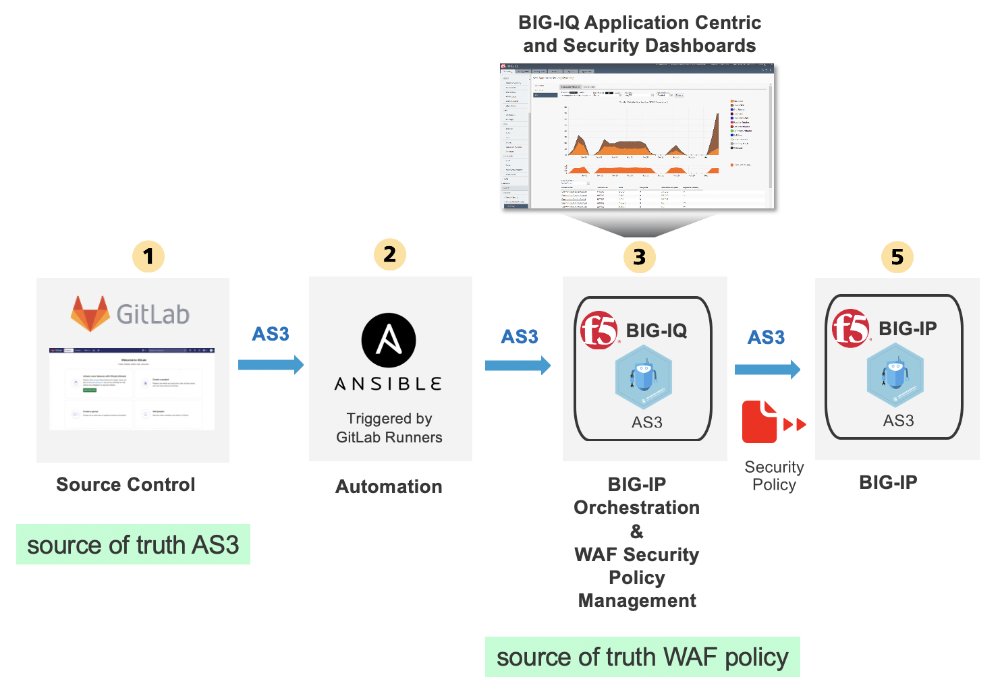
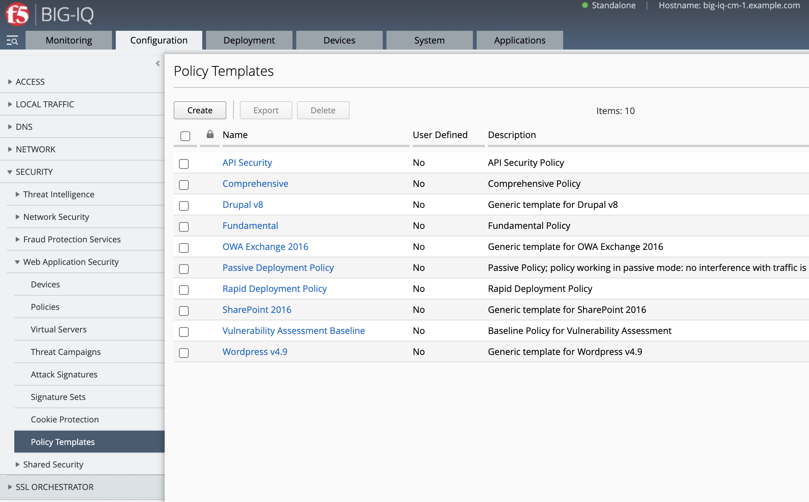
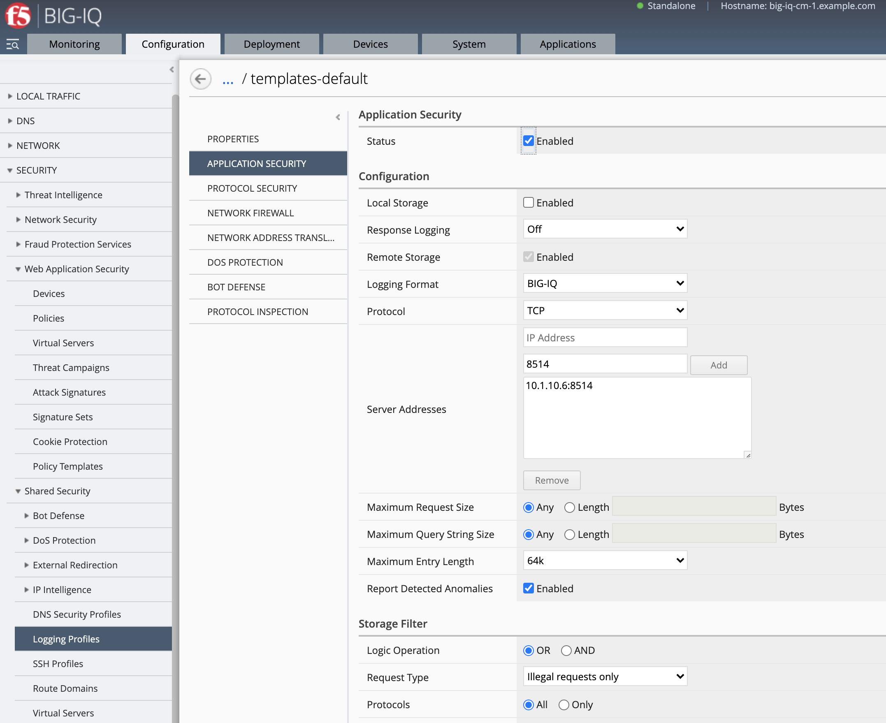
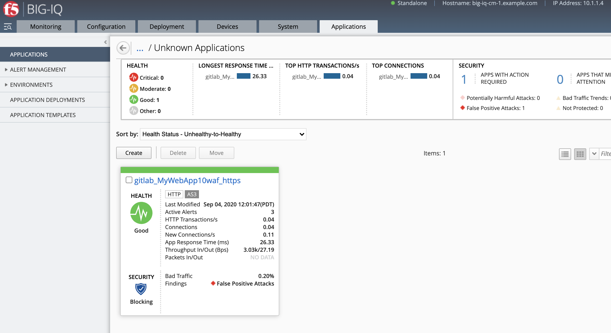
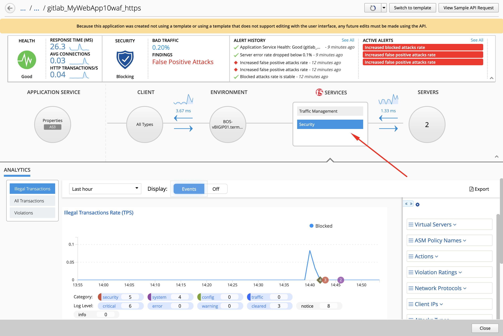
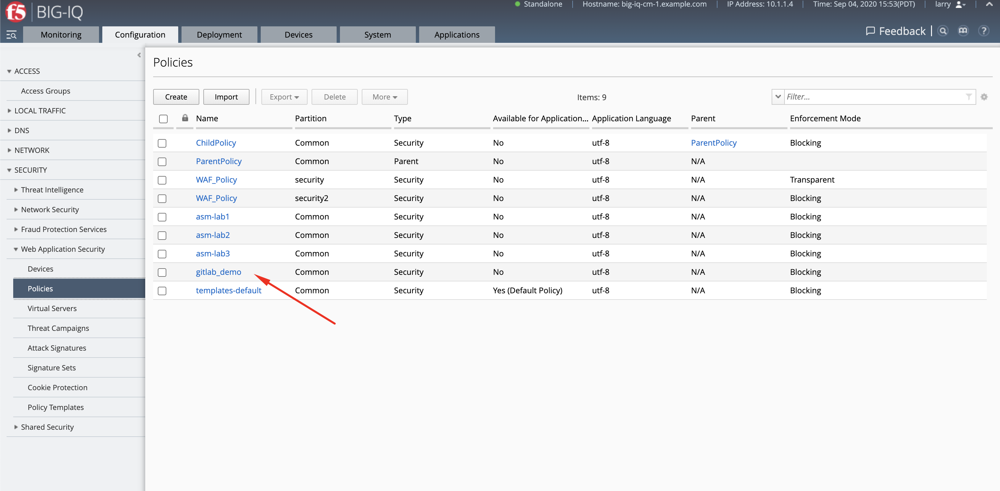
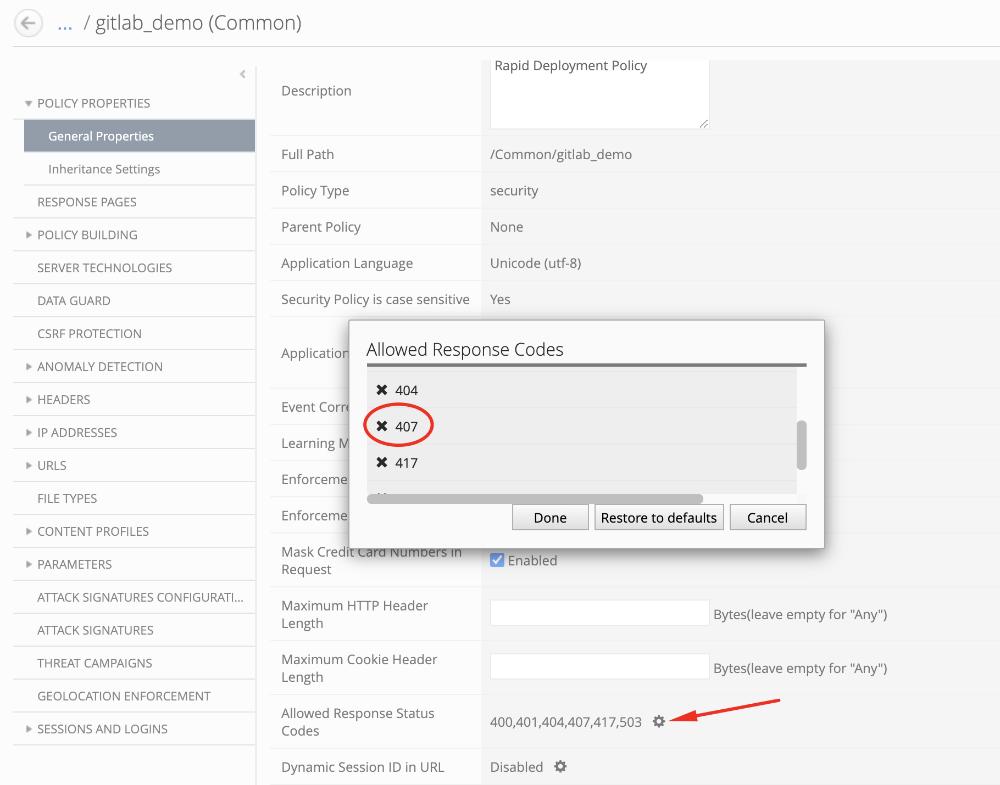
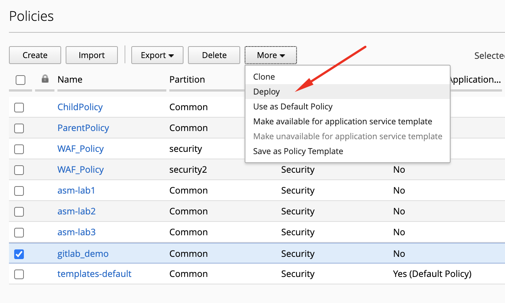
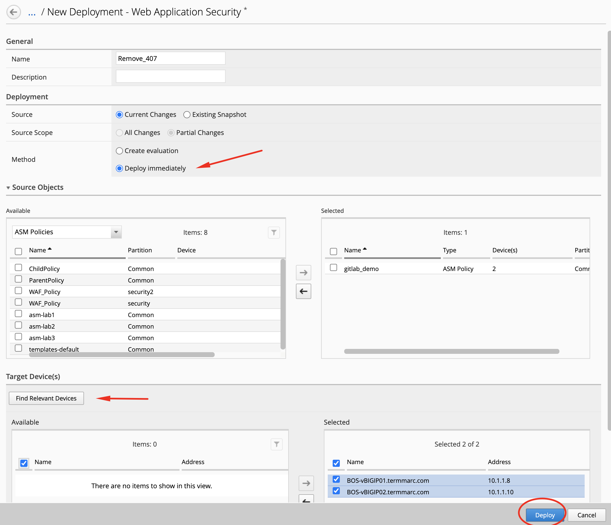
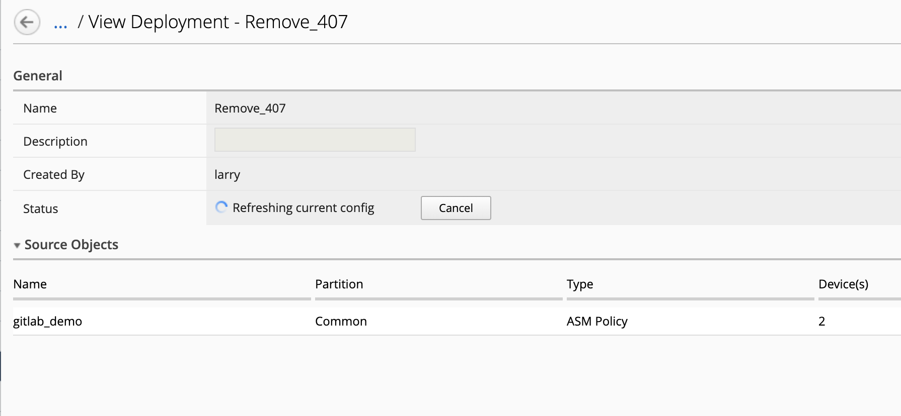

Lab 1.3: WAF Policy Management via GitLab CI/CD pipeline with default WAF template and AS3
------------------------------------------------------------------------------------------

.. note:: Estimated time to complete: **25 minutes**

In this lab, we are going to use GitLab to store the BIG-IP configuration (AS3 declaration) and deploy it through BIG-IQ to BIG-IP using Ansible.
The AS3 declaration will be referencing a WAF policy which will be created prior based of a WAF template available in BIG-IQ.

We are leveraging a **CI/CD pipeline** in GitLab in order to make changes on the BIG-IP device.

|gitlab-diagram-waf|

**Ansible** is an open-source software provisioning, configuration management, and application-deployment 
tool enabling infrastructure as code.

**GitLab** is a web-based DevOps lifecycle tool that provides a Git-repository manager providing wiki, 
issue-tracking and continuous integration and deployment pipeline features. 

GitLab will keep track of the changes and control **user access** to the application service configuration of the F5 BIG-IP.
We are using BIG-IQ to provide **visibility with enhanced analytics** (HTTP/TCP) to the DevOps/Application owner.

Once the Application Service will be deployed along with a new WAF policy, the security admin will be able to manage and update
the WAF policy from BIG-IQ independently from the VIP, pool and pool members.

This lab will be using the following F5 Ansible Galaxy roles:
    - `bigiq_pinning_deploy_objects`_ **ansible Role**: Pin objects (e.g. Cert & Key, WAF policy, Security Logging Profile) on BIG-IQ and deploy it to BIG-IP(s).
    - `atc_deploy`_  **ansible Role**: Allows AS3 declaration to be sent to `automation tool chain`_ service.
    - `bigiq_move_app_dashboard`_ **ansible Role**: Move Application Service(s) in BIG-IQ Application Dashboard.

.. _bigiq_pinning_deploy_objects: https://galaxy.ansible.com/f5devcentral/bigiq_pinning_deploy_objects
.. _bigiq_move_app_dashboard: https://galaxy.ansible.com/f5devcentral/bigiq_move_app_dashboard
.. _atc_deploy: https://galaxy.ansible.com/f5devcentral/atc_deploy
.. _automation tool chain: https://www.f5.com/products/automation-and-orchestration

.. include:: /accesslab.rst

Workflow
^^^^^^^^

1. Start GitLab and create new a project
2. Create WAF policy and security logging profile on BIG-IQ using the BIG-IQ UI
3. Clone gitlab project:

   - Deploy WAF policy and logging profile to BIG-IQ with API through Gitlab and Ansible
   - Deploy AS3 WAF HTTPS offload application service to a BIG-IP through Gitlab and Ansible

4. Update policy through BIG-IQ, deploy policy update using the BIG-IQ UI

Start GitLab and create new a project
^^^^^^^^^^^^^^^^^^^^^^^^^^^^^^^^^^^^^

1. Connect via ``SSH`` or ``Web Shell`` to the system *Ubuntu Lamp Server*. *(if you use the Web Shell, login as f5student first: su - f5student)*.

2. Execute the following commands::

    ./gitlab/start-gitlab.sh

3. Wait ~10 min to open GitLab web UI from the lab environment. Click on the *ACCESS* button of the **Ubuntu Lamp Server** system and click on
   *GitLab*. The login/password is ``root/purple123``. Or open ``http://localhost:7002`` from Google Chrome browser in the Jumphost.

.. note:: You can check GitLab status with ``docker exec gitlab_gitlab_1 gitlab-ctl status`` and GitLab logs with ``docker logs gitlab_gitlab_1``.

|lab-12-1|

4. Click on the *GitLab* button on the system *Ubuntu Lamp Server* in the lab environment. Create a new project and name it ``mywebapp``.

|lab-12-2|

Select *Initialize repository with a README*.

|lab-12-3|

5. Copy the Jumphost *Ubuntu Lamp Server* ssh public key::

    cat ~/.ssh/id_rsa.pub 

6. Back in GitLab, click on **Add SSH Key**.

|lab-12-4|

Paste the public key and click om **Add Key**.

|lab-12-5|

7. Let's now configure the gitlab runner with this project.
   This runner will be used to trigger pipelines when a commit is done on the project and allow us to automatically trigger a set of tasks.
   
First Let's open your project, click **Your Projects**.

|lab-12-6|

Click on ``mywebapp``.

|lab-12-7|

Navigate the CI/CD option copy the token value.

Click on Settings > CI/CD.

|lab-12-8|

Find and expand the **Runner** section.

|lab-12-9|

Finally copy the token value.

|lab-12-10|

8. Back in the Linux Jumphost, run the following command to register the gitlab runner using the token value::

    ./gitlab/gitlab-runner-register.sh <token>

9. In GitLab, confirm the GitLab runner is correctly attached to your project. Navigate to the same location where you copy the token.

|lab-12-11|

WAF policy template and security logging profile on BIG-IQ
^^^^^^^^^^^^^^^^^^^^^^^^^^^^^^^^^^^^^^^^^^^^^^^^^^^^^^^^^^

1. Login as **larry** and go to Configuration > Security > Web Application Security > Policy Templates.

See the list of WAF Policy Templates available in BIG-IQ.

|lab-3-1|

We are not going to create a custom policy template but use one of the default for this lab, ``Rapid Deployment Policy`` policy template.

2. In this lab, we are going to use one of the existing Security Logging Profile ``templates-default``.
   This profile will enable the ASM events to be sent to BIG-IQ DCD.

|lab-3-2|

3. Both WAF policy template and security logging profile will be use in the next task as variable in the Ansible Playbook.

.. code-block:: yaml
   :linenos:
   :emphasize-lines: 5, 6

    vars:
      target_device: "10.1.1.7"
      certificate: "default.crt"
      privateKey: "default.key"
      security_logging_profile: "templates-default"
      waf_policy_template: "Rapid Deployment Policy"
      waf_policy_name: "gitlab_demo"

.. note:: We are not automating this step as creating the policy template and logging profile with BIG-IQ is a one time operation.

Clone gitlab project and deploy AS3 WAF HTTPS offload application service to a BIG-IP through BIG-IQ
^^^^^^^^^^^^^^^^^^^^^^^^^^^^^^^^^^^^^^^^^^^^^^^^^^^^^^^^^^^^^^^^^^^^^^^^^^^^^^^^^^^^^^^^^^^^^^^^^^^^

1. From the Linux Jumphost, open a ssh session and clone the repository::

    git clone ssh://git@localhost:7022/root/mywebapp.git

2. Or order to be able to commit and push changes, we will need to configure the user email and name in git::

    git config --global user.email "admin@example.com"
    git config --global user.name "root"

3. Copy the lab files into the ``mywebapp`` repository::

    cd mywebapp
    cp -r ~/gitlab/lab2/* ~/gitlab/lab2/.gitlab-ci.yml .
    ls -la
    ls -l as3

This folder contains:
   - **.gitlab-ci.yml**: pipeline definition
   - **hosts**: ansible host file with BIG-IQ access information
   - **bigiq_waf_policy_and_as3_deploy.yml**: ansible playbook to deploy the WAF policy, Security Logging Profile and AS3 application services
   - **as3/my_waf_https_app_service1.j2**: AS3 declaration Jinja2 templates defining WAF HTTPS offload application service load balancer

The Ansible playbook will contain the various calls to create the WAF policy, deploy it to the BIG-IP, then create the Application Service with AS3.

We have defined at the top of the playbook some variable to use for this service. You can keep everything as is.

.. code-block:: yaml
   :linenos:

    vars:
      target_device: "10.1.1.7"
      certificate: "default.crt"
      privateKey: "default.key"
      security_logging_profile: "templates-default"
      waf_policy_template: "Rapid Deployment Policy"
      waf_policy_name: "gitlab_demo"

You can look at each file on the lab `GitHub repository`_.

.. _GitHub repository: https://github.com/f5devcentral/f5-big-iq-lab/tree/develop/lab/gitlab/lab2

4. Add and commit the new files to the ``mywebapp`` repository::

    git status
    git add .
    git status
    git commit -m "Add .gitlab-ci.yml, Ansible playbook, host file and AS3 declaration"
    git status

5. Push the changes to gitlab::

    git push origin master

6. Back in gitlab, navigate under jobs and click on the running jobs, display output.

|lab-12-12|

Follow the execution of the job and wait for it to end.

|lab-12-13|

7. Login on **BIG-IQ** as **david**, go to Applications tab, under``LAB_gitlab`` Application, check the application is there and analytics are showing.

|lab-3-3|

|

|lab-3-4|

.. warning:: Starting 7.0, BIG-IQ displays AS3 application services created using the AS3 Declare API as Unknown Applications.
             You can move those application services using the GUI, the `Move/Merge API`_, `bigiq_move_app_dashboard`_ F5 Ansible Galaxy role 
             or create it directly into Application in BIG-IQ using the `Deploy API`_ to define the BIG-IQ Application name.

.. _Move/Merge API: https://clouddocs.f5.com/products/big-iq/mgmt-api/latest/ApiReferences/bigiq_public_api_ref/r_as3_move_merge.html
.. _Deploy API: https://clouddocs.f5.com/products/big-iq/mgmt-api/latest/ApiReferences/bigiq_public_api_ref/r_as3_deploy.html
.. _bigiq_move_app_dashboard: https://galaxy.ansible.com/f5devcentral/bigiq_move_app_dashboard

Update policy through BIG-IQ, deploy policy update using the BIG-IQ UI
^^^^^^^^^^^^^^^^^^^^^^^^^^^^^^^^^^^^^^^^^^^^^^^^^^^^^^^^^^^^^^^^^^^^^^

1. Login as **larry** and go to Configuration > Security > Web Application Security > Policies.

See the policy ``gitlab_demo`` created through the automation in previous task.

|lab-3-5|

2. Select ``gitlab_demo``, under General Properties, edit the list of ``Allowed Response Codes`` and remove code ``407`` (*Proxy Authentication Required client error status*).

|lab-3-6|

Click on **Save & Close**.

3. Let's now deploy the changes to the BIG-IP. Select the ``gitlab_demo`` WAF policy, and click on **Deploy** from the menu.

|lab-3-7|

The deployment window opens. Type a name, select ``Deploy immediately`` for the Method.

Under the Target Device(s) section, click on ``Find Relevant Devices``
and select both **BOS-vBIGIP01.termmarc.com** and **BOS-vBIGIP02.termmarc.com** devices. Then, click on Deploy.

|lab-3-8|

Wait until the deployment completes.

|lab-3-9|

4. The policy is now updates. Larry, Security Manager, can update the WAF policy if needed in the future and the Application Owner
   or SuperNetops can update the Application Service via the automation pipeline (e.g. adding a pool member, see `Class 1 Module 2 Lab 1.12`_).

.. _Class 1 Module 2 Lab 1.12: ../../class1/module2/lab12.html

.. |lab-12-1| image:: /class1/pictures/module2/lab-12-1.png
   :scale: 40%

.. |lab-12-2| image:: /class1/pictures/module2/lab-12-2.png
   :scale: 40%

.. |lab-12-3| image:: /class1/pictures/module2/lab-12-3.png
   :scale: 40%

.. |lab-12-4| image:: /class1/pictures/module2/lab-12-4.png
   :scale: 40%

.. |lab-12-5| image:: /class1/pictures/module2/lab-12-5.png
   :scale: 40%

.. |lab-12-6| image:: /class1/pictures/module2/lab-12-6.png
   :scale: 40%

.. |lab-12-7| image:: /class1/pictures/module2/lab-12-7.png
   :scale: 40%

.. |lab-12-8| image:: /class1/pictures/module2/lab-12-8.png
   :scale: 40%

.. |lab-12-9| image:: /class1/pictures/module2/lab-12-9.png
   :scale: 40%

.. |lab-12-10| image:: /class1/pictures/module2/lab-12-10.png
   :scale: 40%

.. |lab-12-11| image:: /class1/pictures/module2/lab-12-11.png
   :scale: 40%

.. |lab-12-12| image:: /class1/pictures/module2/lab-12-12.png
   :scale: 40%

.. |lab-12-13| image:: /class1/pictures/module2/lab-12-13.png
   :scale: 40%

