Lab 2.1: Analyzing security policy status - ASM (new 8.0)
---------------------------------------------------------

.. note:: Estimated time to complete: **30 minutes**

Your Web Application Security policies secure applications from layer 7 web-based vulnerabilities. Application security policies can be implemented and 
later fine-tuned based on observed traffic patterns and repeated attacks. This allows you to customize your application's protection based on the security required and
the acceptable risk in your business environment. 

Security Policy Configuration Analyzer is a new feature getting introduced only for BigIQ. It generates an audit report containing Suggestions and
score for a given policy so that the SecOp Engineer will have a visibility about the policy's security level and suggestions to improve it.
The policy analyzer runs for both the type of policies, the one which is imported from a BigIP as well the policy which is created in BigIQ.

Generating a security audit of your security policy allows you to analyze the current application protection offered, in addition to recommendations for improvement.

Once you have generated a security policy audit, you can use the recommendations to perform	immediate policy tuning to improve application protection.
Any changes can be immediately assessed by the audit and then deployed.

Generate a security policy audit
^^^^^^^^^^^^^^^^^^^^^^^^^^^^^^^^

Analyze the protection status and application security provided by your Web Application Security policy.
Generate an audit that allows you to view the policy's overall protection capabilities and a list of system-provided recommendations for improvement. 

.. warning:: When analyzing a Web Application Security policy, ensure that it is a child policy.

1. First go to "Configuration > Security > Web Application Security > Policies".

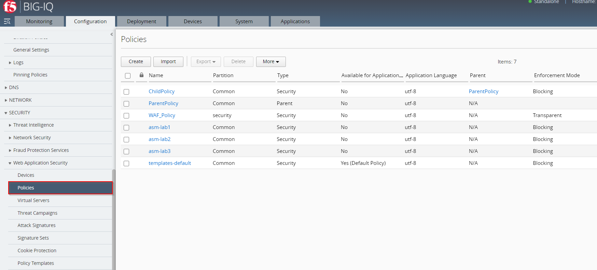

2. Click the check box next to the name of the security policy you would like to audit.
   Security Policy which has been choosen in this example is named: ``asm-lab3``

3. Click *More* and select *Policy Analyzer*

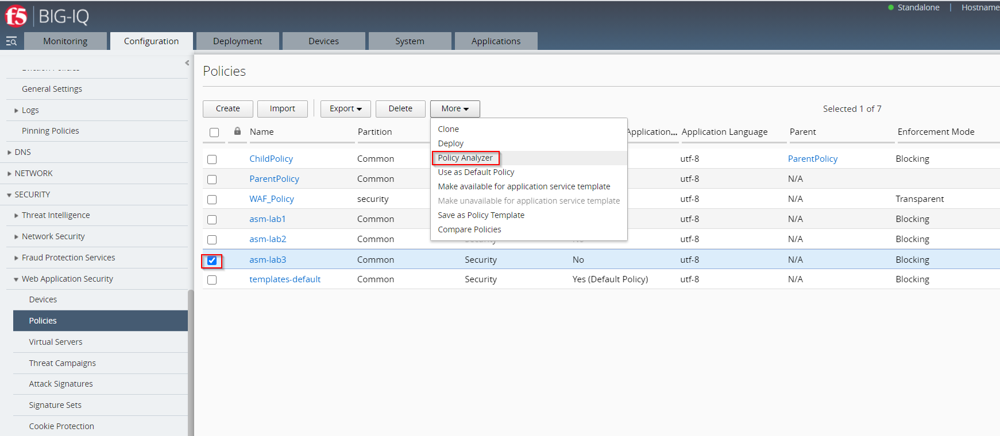

.. note:: You are not required to select a policy at this stage. 
If you have not yet selected a policy, or you would like to analyze a different policy,
select a security policy from ``Security Policy`` area in the upper left side of the screen.

You´ll get to the Policy Analyzer Section via "Configuration > Security > Web Application Security > Policies > More > Policy Analyzer".

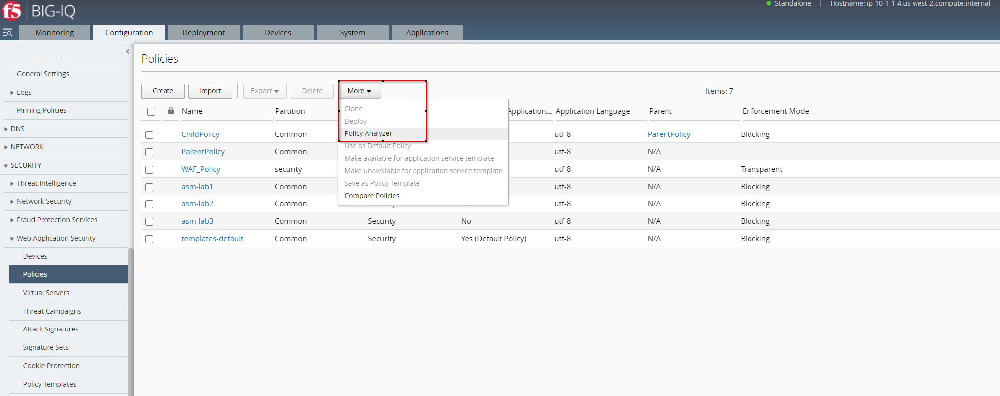

Once you select a policy, click	*Analyze*.

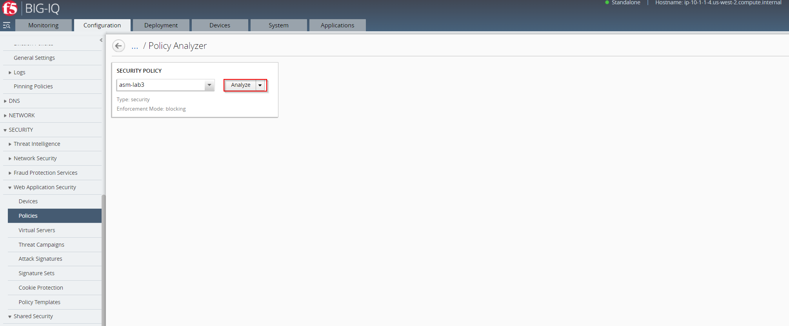

4. You have now generated a security policy audit, which will allow you to asses the current status of the policy's application protection capabilities.

5. If you want to save a local copy of the generated security policy audit file, click *Export* to download a CSV formated file containing the information of the audit.

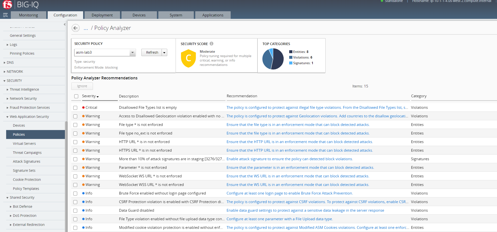

Overview of security policy audit
^^^^^^^^^^^^^^^^^^^^^^^^^^^^^^^^^

The security policy audit allows you to evaluate and edit a	security policy based on system-provided recommendation.
In addition, you can use the audit to analyze policy changes, deploy changes, ignore recommendations, and export the audit results.
The image below provides an overview of the information and available actions within the Policy Analyzer audit.
For more information about the system-provided recommendations, see section Security Policy Analyzer recommendations.

Policy Summary
^^^^^^^^^^^^^^

The policy analyzer audit provides a summary of pending recommendations. Application protection is evaluated based on the severity and number of pending recommendations.
As shown in the image below, the analyzed policy has a security score of ``C`` due to a number of recommendations from various categories. 
Use the audit to evaluate whether or not to edit your policy based on the system-provided recommendations.

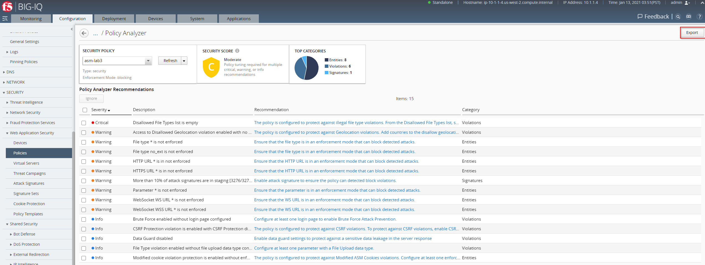

Edit Policy
^^^^^^^^^^^

Edit the policy based on the system-provided recommendations.
By clicking on the text	in the *Recommendation* column, you can go directly to the configuration area that will allow you to implement policy or system configuration changes. 

In the example the **Recommendation** called **Disallowed File Types list is empty** been selected:

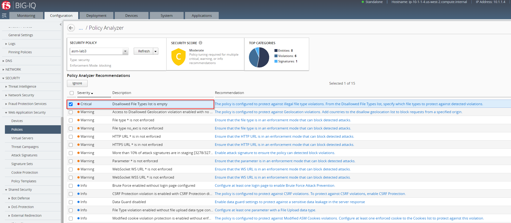

After clicking the text in the *Recommendation* you been navigated to Section and be able to adjust the settings.
In our case we could to a modification on **Disallowed File Types** by no allowing **png**.

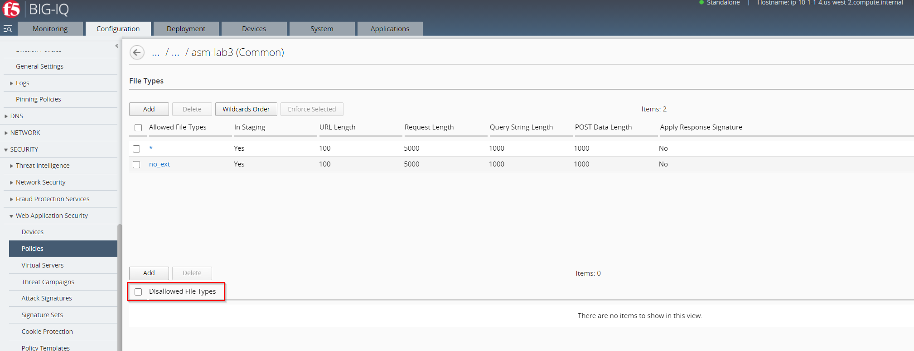

Type **png** in the File Type (Explicit only) box and click *Save & Close*.

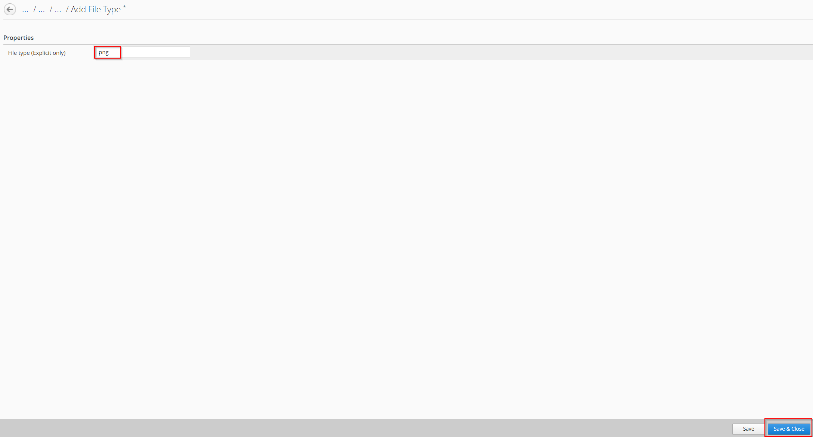

Ignore Recommendations
^^^^^^^^^^^^^^^^^^^^^^

If the system-provided policy recommendations do not meet your application's protection requirements, you can select the recommendation's row and click *Ignore*.
.. warning:: This action can change the system assessment of your overall security score, once you review or re-analyze the policy.

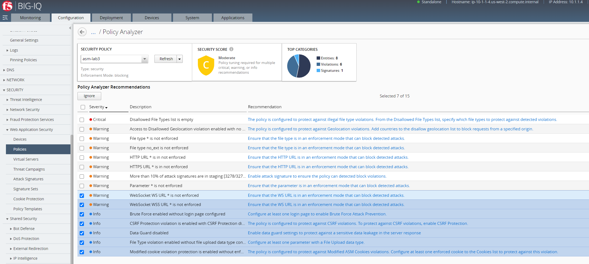

Review Policy Edits
^^^^^^^^^^^^^^^^^^^

If you have saved changes to the policy, or the objects configured to the policy, you can perform a new audit before you deploy changes.
To do so, select the *Refresh* option from the **SECURITY	POLICY** area in the summary screen. The summary bar and recommendations adjusts the policy analysis according to changes.

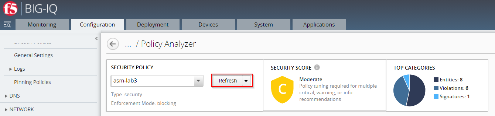

Deploy Policy Edits
^^^^^^^^^^^^^^^^^^^

If you would like to deploy policy changes, select the *Deploy* option from the **SECURITY POLICY** area in the summary screen.
This will immediately deploy changes to BIG-IP devices associated with the policy.

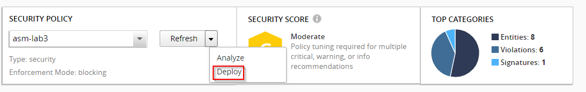

Policy Security Score
^^^^^^^^^^^^^^^^^^^^^

In the Security Analyzer screen, the policy's security score indicates the number of outstanding system recommendations to improve application protection.
Each score is based on the number of pending recommendations in each severity. 
If a policy surpasses the threshold for the number of outstanding recommendations of any severity, the system updates the security score.

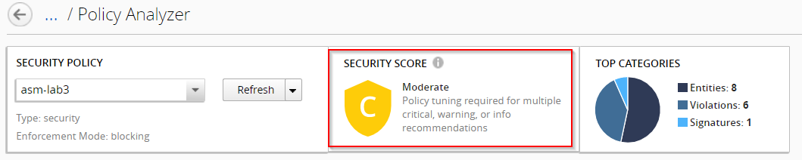

An overview on how the **Policy Security Score** been calculated is listed in the following Table:

+----------------+---------------+-----------------------------------------------------+
| Secuirty Score | Policy Status | Score Criteria (based on number of recommendations) |
+================+===============+=====================================================+
|                |               |                     0   Critical                    |
|                |               +-----------------------------------------------------+
|        A       |      Good     |                    0-2   Warning                    |
|                |               +-----------------------------------------------------+
|                |               |                     0-14   Info                     |
+----------------+---------------+-----------------------------------------------------+
|                |               |                    0-1   Critical                   |
|                |               +-----------------------------------------------------+
|        B       |    Moderate   |                    0-6   Warning                    |
|                |               +-----------------------------------------------------+
|                |               |                     0-29   Info                     |
+----------------+---------------+-----------------------------------------------------+
|                |               |                    0-4   Critical                   |
|                |               +-----------------------------------------------------+
|        C       |    Moderate   |                    0-14   Warning                   |
|                |               +-----------------------------------------------------+
|                |               |                     0-59   Info                     |
+----------------+---------------+-----------------------------------------------------+
|                |               |                    0-9   Critical                   |
|                |               +-----------------------------------------------------+
|        D       |  Moderate-Bad |                    0-24   Warning                   |
|                |               +-----------------------------------------------------+
|                |               |                     0-99   Info                     |
+----------------+---------------+-----------------------------------------------------+
|                |               |                   0-14   Critical                   |
|                |               +-----------------------------------------------------+
|        E       |  Bad-Moderate |                    0-44   Warning                   |
|                |               +-----------------------------------------------------+
|                |               |                     0-149   Info                    |
+----------------+---------------+-----------------------------------------------------+
|                |               |              0-15 (or more) Critical                |
|                |               +-----------------------------------------------------+
|        F       |      Bad      |               0-45 (or more) Warning                |
|                |               +-----------------------------------------------------+
|                |               |                0-150 (or more) Info                 |
+----------------+---------------+-----------------------------------------------------+

Security Policy Analyzer recommendations
^^^^^^^^^^^^^^^^^^^^^^^^^^^^^^^^^^^^^^^^

The following is a list of policy tuning recommendations to improve your Web Application Security policy's protection. 
These suggestions are based on rule violations detected by policy learning. Recommendations are based on current policy configuration and traffic analysis.
You can either approve or ignore these suggestions based on your application protection requirements. 

**General policy settings**

+-----------------------------------------------------------------------------------------+-------------------------------------------------------------------------------------------------------------------------------------------------------------------------------------------------------------------------------------------------------+----------+-----------------------------+
| Rule   Description                                                                      | Recommendation                                                                                                                                                                                                                                        | Severity | Sub Section                 |
+=========================================================================================+=======================================================================================================================================================================================================================================================+==========+=============================+
| Policy enforcement not set to block attacks                                             | The policys enforcement mode is not set to blocking mode, therefore the policy will not block detected attacks. To protect the application from attacks, change the policy enforcement mode to blocking.                                              | Critical | Enforcement   mode          |
+-----------------------------------------------------------------------------------------+-------------------------------------------------------------------------------------------------------------------------------------------------------------------------------------------------------------------------------------------------------+----------+-----------------------------+
| Policy application language not set                                                     | The application language setting controls how WAF interprets incoming requests. The application language should be set to a specific type so WAF can parse the data correctly and enable certain configuration functions that may be limited.         | Critical | Application   language mode |
+-----------------------------------------------------------------------------------------+-------------------------------------------------------------------------------------------------------------------------------------------------------------------------------------------------------------------------------------------------------+----------+-----------------------------+
| Attack signature update file on policy host device is more than 90 days old             | F5 offers updates on the attack signatures file every few weeks to keep up-to-date with threat enforcement. Regularly update the attack signature file to protect applications against the latest web application threats.                            | Warning  | Signature   Update          |
+-----------------------------------------------------------------------------------------+-------------------------------------------------------------------------------------------------------------------------------------------------------------------------------------------------------------------------------------------------------+----------+-----------------------------+
| Attack signature update file on policy host device is more than 180 days old            | F5 offers updates on the attack signatures file every few weeks to keep up-to-date with threat enforcement. Regularly update the attack signature file to protect applications against the latest web application threats.                            | Critical | Signature   Update          |
+-----------------------------------------------------------------------------------------+-------------------------------------------------------------------------------------------------------------------------------------------------------------------------------------------------------------------------------------------------------+----------+-----------------------------+
| Policy is not attached to a VS/Application                                              | Unused policies (not including parent policies) become unnecessary configuration objects in BIG-IQ. F5 recommends to regularly review whether unused policies should be discarded.                                                                    | Info     | Unused   Policy             |
+-----------------------------------------------------------------------------------------+-------------------------------------------------------------------------------------------------------------------------------------------------------------------------------------------------------------------------------------------------------+----------+-----------------------------+
| Mask Credit Card Numbers in request log set to disabled                                 | Enable Mask Credit Card Number setting to avoid sensitive data leakage from logs.                                                                                                                                                                     | Info     | Geo   Location              |
+-----------------------------------------------------------------------------------------+-------------------------------------------------------------------------------------------------------------------------------------------------------------------------------------------------------------------------------------------------------+----------+-----------------------------+
| Installed geolocation file timestamp on policy host device is more than 6 months old    | F5 offers updates on the geolocation file. Regularly update the geolocation file to keep the system settings up to date.                                                                                                                              | Warning  | Geo   Location              |
+-----------------------------------------------------------------------------------------+-------------------------------------------------------------------------------------------------------------------------------------------------------------------------------------------------------------------------------------------------------+----------+-----------------------------+

**Signature policy settings**

+----------------------------------------------------+------------------------------------------------------------------------------------------------------------------------------------------------------------------------------------------------------------------------------------------------------------------------------------------------------------------------------------------------------------+----------+-----------------------------------------+
| Rule   Description                                 | Recommendation                                                                                                                                                                                                                                                                                                                                             | Severity | Sub Section                             |
+====================================================+============================================================================================================================================================================================================================================================================================================================================================+==========+=========================================+
| Policy does not include a signature set            | There are no signature sets attached to your policy. A signature set is a group of related attack signatures attached to a policy. The application signature set is used by the policy to detect, log, and (if applicable) block known attack signatures to your application.                                                                              | Critical | Signature set Assignment                |
+----------------------------------------------------+------------------------------------------------------------------------------------------------------------------------------------------------------------------------------------------------------------------------------------------------------------------------------------------------------------------------------------------------------------+----------+-----------------------------------------+
| Policy includes more than 15 signature sets        | Ensure that all signature sets attached to your policy are required. Multiple signature sets may lead to a higher rate of false positives against valid traffic. While some signature sets can be overlapped, as signatures are can be shared across signature sets,                                                                                       |          |                                         | 
|                                                    | high numbers of signature sets suggest that some unnecessary signatures are enabled.                                                                                                                                                                                                                                                                       | Warning  | Signature set large list                | 
+----------------------------------------------------+------------------------------------------------------------------------------------------------------------------------------------------------------------------------------------------------------------------------------------------------------------------------------------------------------------------------------------------------------------+----------+-----------------------------------------+
| Policy signature set is not in blocking mode       | Ensure that the signature sets default actions are set to block detected signatures. A signature set that is not set to block will not protect applications against attack signatures detected by the policy. To block traffic, policy enforcement mode must also be set to blocking.                                                                      | Critical | Signature set enforcement mode          |
+----------------------------------------------------+------------------------------------------------------------------------------------------------------------------------------------------------------------------------------------------------------------------------------------------------------------------------------------------------------------------------------------------------------------+----------+-----------------------------------------+
| Policy signature set is not in learning mode       | Ensure that the signature sets default actions are set to learn detected signatures. A signature set that is attached to a policy, but is not set to learn, will not perform an analysis on the requests that match attack signatures included in the signature set.                                                                                       | Warning  | Attack signature-set learn mode         |
+----------------------------------------------------+------------------------------------------------------------------------------------------------------------------------------------------------------------------------------------------------------------------------------------------------------------------------------------------------------------------------------------------------------------+----------+-----------------------------------------+
| Policy signature set is not in alarm mode          | Ensure that the signature sets default actions are set to alarm when requests match detected signatures. A signature set that is attached to a policy, but is not set to alarm, will not log detected signatures from this signature set in the security events log.                                                                                       | Warning  | Attack signature-set alarm mode         |
+----------------------------------------------------+------------------------------------------------------------------------------------------------------------------------------------------------------------------------------------------------------------------------------------------------------------------------------------------------------------------------------------------------------------+----------+-----------------------------------------+
| More than 10% of attack signatures are disabled    | Ensure that all disabled signatures are still required in your signature sets. A high percent of disabled attack signatures might lead to an increase false negatives.                                                                                                                                                                                     | Warning  | Attack signatures are in disabled state |
+----------------------------------------------------+------------------------------------------------------------------------------------------------------------------------------------------------------------------------------------------------------------------------------------------------------------------------------------------------------------------------------------------------------------+----------+-----------------------------------------+
| More than 10% of attack signatures are in staging  | Enable attack signature to ensure the policy can detected block violations.                                                                                                                                                                                                                                                                                | Warning  | Attack signature in staging state       |
+----------------------------------------------------+------------------------------------------------------------------------------------------------------------------------------------------------------------------------------------------------------------------------------------------------------------------------------------------------------------------------------------------------------------+----------+-----------------------------------------+

**Entities policy settings**

+---------------------------------------------------------------------------------------+------------------------------------------------------------------------------------------------------------------------------------------------------------------------------------------------------------------------------+----------+--------------------------------+
| Rule   Description                                                                    | Recommendation                                                                                                                                                                                                               | Severity | Sub Section                    |
+=======================================================================================+==============================================================================================================================================================================================================================+==========+================================+
| Policy Parameters are ready to be enforced                                            | There are Parameters in the policy that are ready to be enforced.                                                                                                                                                            | Warning  | Entities status                |
+---------------------------------------------------------------------------------------+------------------------------------------------------------------------------------------------------------------------------------------------------------------------------------------------------------------------------+----------+--------------------------------+
| Policy File Types are ready to be enforced                                            | There are File Types in the policy that are ready to be enforced.                                                                                                                                                            | Warning  | Entities status                |
+---------------------------------------------------------------------------------------+------------------------------------------------------------------------------------------------------------------------------------------------------------------------------------------------------------------------------+----------+--------------------------------+
| Policy HTTP/S URLs are ready to be enforced                                           | There are HTTP/S URLs in the policy that are ready to be enforced.                                                                                                                                                           | Warning  | Entities status                |
+---------------------------------------------------------------------------------------+------------------------------------------------------------------------------------------------------------------------------------------------------------------------------------------------------------------------------+----------+--------------------------------+
| Policy Web Socket WS/S URLs are ready to be enforced                                  | There are Web Socket WS/S URLs in the policy that are ready to be enforced.                                                                                                                                                  | Warning  | Entities status                |
+---------------------------------------------------------------------------------------+------------------------------------------------------------------------------------------------------------------------------------------------------------------------------------------------------------------------------+----------+--------------------------------+
| Policy Cookies are ready to be enforced                                               | There are Cookies in the policy that are ready to be enforced.                                                                                                                                                               | Warning  | Entities status                |
+---------------------------------------------------------------------------------------+------------------------------------------------------------------------------------------------------------------------------------------------------------------------------------------------------------------------------+----------+--------------------------------+
| Policy Signatures are ready to be enforced                                            | There are Signatures in the policy that are ready to be enforced.                                                                                                                                                            | Warning  | Entities status                |
+---------------------------------------------------------------------------------------+------------------------------------------------------------------------------------------------------------------------------------------------------------------------------------------------------------------------------+----------+--------------------------------+
| Policy contains more than 100 parameters                                              | Consider revising the number of entities required in your policy. Maintaining a large list of entities may require heavy operational overhead.                                                                               | Info     | Parameter list size            |
+---------------------------------------------------------------------------------------+------------------------------------------------------------------------------------------------------------------------------------------------------------------------------------------------------------------------------+----------+--------------------------------+
| Policy contains more than 100 URLs                                                    | Consider revising the number of entities required in your policy. Maintaining a large list of entities may require heavy operational overhead.                                                                               | Info     | URL list size                  |
+---------------------------------------------------------------------------------------+------------------------------------------------------------------------------------------------------------------------------------------------------------------------------------------------------------------------------+----------+--------------------------------+
| Policy contains more than 100 allowed file types                                      | Consider revising the number of entities required in your policy. Maintaining a large list of entities may require heavy operational overhead.                                                                               | Warning  | file type list size            |
+---------------------------------------------------------------------------------------+------------------------------------------------------------------------------------------------------------------------------------------------------------------------------------------------------------------------------+----------+--------------------------------+
| Parameter is not enforced                                                             | Ensure that the parameter is in an enforcement mode that can block detected attacks.                                                                                                                                         | Warning  | staging mode - parameter       |
+---------------------------------------------------------------------------------------+------------------------------------------------------------------------------------------------------------------------------------------------------------------------------------------------------------------------------+----------+--------------------------------+
| File type is not enforced                                                             | Ensure that the file type is in an enforcement mode that can block detected attacks.                                                                                                                                         | Warning  | staging mode - file type       |
+---------------------------------------------------------------------------------------+------------------------------------------------------------------------------------------------------------------------------------------------------------------------------------------------------------------------------+----------+--------------------------------+
| URL is in not enforced                                                                | Ensure that the URL is in an enforcement mode that can block detected attacks.                                                                                                                                               | Warning  | staging mode - URL             |
+---------------------------------------------------------------------------------------+------------------------------------------------------------------------------------------------------------------------------------------------------------------------------------------------------------------------------+----------+--------------------------------+
| WebSocket URL is not enforced                                                         | Ensure that the URL is in an enforcement mode that can block detected attacks.                                                                                                                                               | Warning  | staging mode - WebSocket URL   |
+---------------------------------------------------------------------------------------+------------------------------------------------------------------------------------------------------------------------------------------------------------------------------------------------------------------------------+----------+--------------------------------+
| Cookie is not enforced                                                                | Ensure that the cookie is in an enforcement mode that can block detected attacks.                                                                                                                                            | Warning  | staging mode - Cookie          |
+---------------------------------------------------------------------------------------+------------------------------------------------------------------------------------------------------------------------------------------------------------------------------------------------------------------------------+----------+--------------------------------+
| File Types learning mode set to "Always"                                              | Consider changing the learning mode for file types. Learning mode "Always" creates a large list of entities. Maintaining a large list of entities requires a heavy operation overhead and is prone to false positives.       | Warning  | file type learn mode           |
+---------------------------------------------------------------------------------------+------------------------------------------------------------------------------------------------------------------------------------------------------------------------------------------------------------------------------+----------+--------------------------------+
| Parameters learning mode set to "Always"                                              | Consider changing the learning mode for parameters. Learning mode "Always" creates a large list of entities. Maintaining a large list of entities requires a heavy operation overhead and is prone to false positives.       | Warning  | parameters learn mode          |
+---------------------------------------------------------------------------------------+------------------------------------------------------------------------------------------------------------------------------------------------------------------------------------------------------------------------------+----------+--------------------------------+
| URLs learning mode set to  "Always"                                                   | Consider changing the learning mode for URLs. Learning mode "Always" creates a large list of entities. Maintaining a large list of entities requires a heavy operation overhead and is prone to false positives.             | Warning  | URLs learn mode                |
+---------------------------------------------------------------------------------------+------------------------------------------------------------------------------------------------------------------------------------------------------------------------------------------------------------------------------+----------+--------------------------------+
| HTTP/S URL does not check attack signatures                                           | Enable attack signature enforcement for this URL to enforce protection against detected signatures.                                                                                                                          | Warning  | URL check signatures status    |
+---------------------------------------------------------------------------------------+------------------------------------------------------------------------------------------------------------------------------------------------------------------------------------------------------------------------------+----------+--------------------------------+
| Header does not check attack signatures                                               | Enable attack signature enforcement for this header to enforce protection against detected signatures.                                                                                                                       | Warning  | Header check signatures status |
+---------------------------------------------------------------------------------------+------------------------------------------------------------------------------------------------------------------------------------------------------------------------------------------------------------------------------+----------+--------------------------------+
| Cookie does not check attack signatures                                               | Enable attack signature enforcement for this cookie to enforce protection against detected signatures.                                                                                                                       | Warning  | Cookie check signatures status |
+---------------------------------------------------------------------------------------+------------------------------------------------------------------------------------------------------------------------------------------------------------------------------------------------------------------------------+----------+--------------------------------+
| Policy tuning suggestion score is 100%                                                | Review policy builder suggestions and ensure to tune the policy suggestions once they reach a score of 100%.                                                                                                                 | Warning  | Check suggestions score        |
+---------------------------------------------------------------------------------------+------------------------------------------------------------------------------------------------------------------------------------------------------------------------------------------------------------------------------+----------+--------------------------------+
| HTTP DELETE method is allowed                                                         | F5 recommends not to allow HTTP DELETE method, if possible. Remove DELETE from the Methods list, unless the method is required by application users.                                                                         | Warning  | HTTP Methods                   |
+---------------------------------------------------------------------------------------+------------------------------------------------------------------------------------------------------------------------------------------------------------------------------------------------------------------------------+----------+--------------------------------+
| Modified cookie violation protection is enabled without enforced cookie configured    | The policy is configured to protect against Modified ASM Cookies violations. Configure at least one enforced cookie to the Cookies list to protect against this violation.                                                   | Info     | Modified Cookies               |
+---------------------------------------------------------------------------------------+------------------------------------------------------------------------------------------------------------------------------------------------------------------------------------------------------------------------------+----------+--------------------------------+

**Violations policy settings**

+-------------------------------------------------------------------------------------------------------------------------------------------------------------------+---------------------------------------------------------------------------------------------------------------------------------------------------------------------------------+----------+-----------------------------------------+
| Rule Description                                                                                                                                                  | Recommendation                                                                                                                                                                  | Severity | Sub Section                             |
+===================================================================================================================================================================+=================================================================================================================================================================================+==========+=========================================+
| Data Guard disabled                                                                                                                                               | Enable data guard settings to protect against a sensitive data leakage in the server response                                                                                   | Info     | Data Guard status                       |
+-------------------------------------------------------------------------------------------------------------------------------------------------------------------+---------------------------------------------------------------------------------------------------------------------------------------------------------------------------------+----------+-----------------------------------------+
| Default request content profile not specified                                                                                                                     | Each allowed HTTP URL's settings should contain at least one content profile to process the request based on the traffic type. Consider using default content profiles.         | Critical | File Type Header Based Content Profiles |
+-------------------------------------------------------------------------------------------------------------------------------------------------------------------+---------------------------------------------------------------------------------------------------------------------------------------------------------------------------------+----------+-----------------------------------------+
| CSRF Protection violation is enabled with CSRF Protection disabled                                                                                                | The policy is configured to protect against illegal file type violations. From the Disallowed File Types list, specify which file types to protect against detected violations. | Critical | Empty Disallow File Type List           |
+-------------------------------------------------------------------------------------------------------------------------------------------------------------------+---------------------------------------------------------------------------------------------------------------------------------------------------------------------------------+----------+-----------------------------------------+
| CSRF Protection violation is enabled with CSRF Protection disabled                                                                                                | Enable the Sensitive Parameter setting to avoid sensitive data leakage from logs.                                                                                               | Info     | Sensitive Parameters                    |
+-------------------------------------------------------------------------------------------------------------------------------------------------------------------+---------------------------------------------------------------------------------------------------------------------------------------------------------------------------------+----------+-----------------------------------------+
| Access to Disallowed Geolocation violation enabled with no countries selected                                                                                     | The policy is configured to protect against Geolocation violations. Add countries to the disallow geolocation list to block requests from a specified origin.                   | Warning  | Access from disallowed Geolocation      |
+-------------------------------------------------------------------------------------------------------------------------------------------------------------------+---------------------------------------------------------------------------------------------------------------------------------------------------------------------------------+----------+-----------------------------------------+
| Brute Force enabled without login page configured                                                                                                                 | Configure at least one login page to enable Brute Force Attack Prevention.                                                                                                      | Info     | Brute Force                             |
+-------------------------------------------------------------------------------------------------------------------------------------------------------------------+---------------------------------------------------------------------------------------------------------------------------------------------------------------------------------+----------+-----------------------------------------+
| CSRF Protection violation is enabled with CSRF Protection disabled                                                                                                | The policy is configured to protect against CSRF violations. To protect against CSRF violations, enable CSRF Protection.                                                        | Info     | CSRF enforcement                        |
+-------------------------------------------------------------------------------------------------------------------------------------------------------------------+---------------------------------------------------------------------------------------------------------------------------------------------------------------------------------+----------+-----------------------------------------+
| Disallowed File Upload Content Detected violation enabled without File Upload data type parameter configured                                                      | Configure at least one parameter with a File Upload data type.                                                                                                                  | Info     | File Upload                             |
+-------------------------------------------------------------------------------------------------------------------------------------------------------------------+---------------------------------------------------------------------------------------------------------------------------------------------------------------------------------+----------+-----------------------------------------+
| Disallowed File Upload Content Detected violation enabled with File Upload data type parameter. Disallow File upload of Executables is disabled on the parameter. | F5 recommends enabling (Disallow) the setting Disallow File upload of Executables on the parameter to improve the security level.                                               | Info     | File Upload                             |
+-------------------------------------------------------------------------------------------------------------------------------------------------------------------+---------------------------------------------------------------------------------------------------------------------------------------------------------------------------------+----------+-----------------------------------------+

BIG-IQ ASM Policy Analyzer API Documentation
^^^^^^^^^^^^^^^^^^^^^^^^^^^^^^^^^^^^^^^^^^^^

Beside the Policy Analyzer usage via WebUI, an API is available in case you want to collect the result of the Policy analysation in a JSON Format.
The API documentation is available on `F5 BIG-IQ API`_.

.. _`F5 BIG-IQ API`: https://clouddocs.f5.com/products/big-iq/mgmt-api/latest/

Some API examples to interact with the BIG-IQ ASM Policy Analyzer API been listed below.

1. The following API call is used to retrieve an overview of historic initiated policy analyzer tasks. The method and URL used will be: ``GET "https://10.1.1.4/mgmt/cm/asm/tasks/policy-analyzer"``

The outcome of the request within the body:

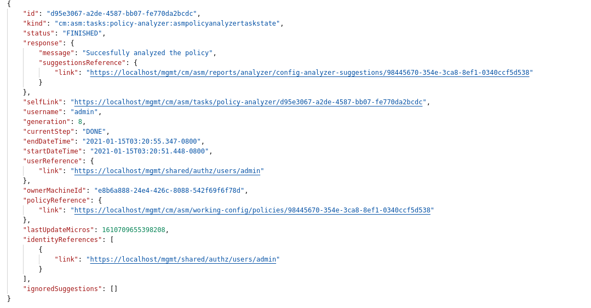

2. In case you want to gather a list of categories of your policy configuration analyses, the method and URL to collect these information will be ``GET "https://10.1.1.4/mgmt/cm/asm/reports/analyzer/config-analyzer-suggestions/<TASK-ID>``

.. note:: Taken the result from outcome of Step 1 the **<TASK-ID>** would be **98445670-354e-3ca8-8ef1-0340ccf5d538**.

The outcome of the request within the body will be similar to:

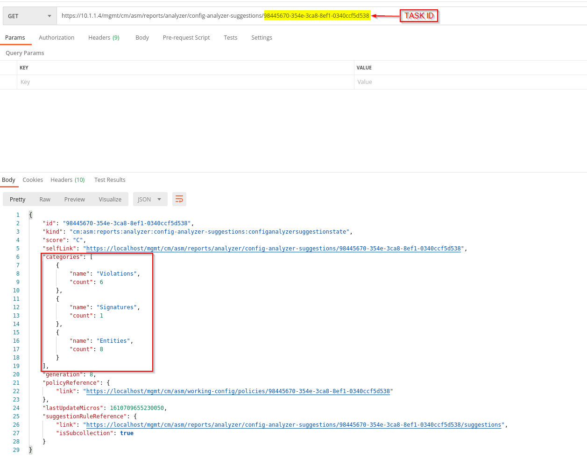

.. note:: In the example we got 15 recommendations in thre categories: Violations, Signatures, Entities.

3. While you collected the categories in Step 2 you may be more intrested to retrieve suggestions generated by the policy analyzer.
   The method and URL to collect these information will be ``GET "https://10.1.1.4/mgmt/cm/asm/reports/analyzer/config-analyzer-suggestions/<Policy-ID>/suggestions"``

.. note:: The outcome will be a detailed list of recommandations on the policy configuration analyses like the UI provide.

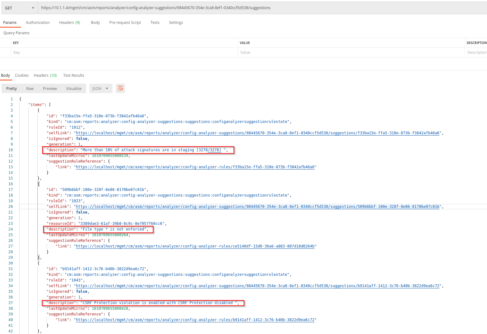

A JSON formated detailed list of recommandations:

.. code-block:: JSON
   :linenos:
   :emphasize-lines: 9,23,36

    "items": [
        {
            "id": "f33ba15e-ffa5-310e-873b-f3842afb46a6",
            "kind": "cm:asm:reports:analyzer:config-analyzer-suggestions:suggestions:configanalyzersuggestionrulestate",
            "ruleId": "1012",
            "selfLink": "https://localhost/mgmt/cm/asm/reports/analyzer/config-analyzer-suggestions/98445670-354e-3ca8-8ef1-0340ccf5d538/suggestions/f33ba15e-ffa5-310e-873b-f3842afb46a6",
            "isIgnored": false,
            "generation": 1,
            "description": "More than 10% of attack signatures are in staging [3278/3278] ",
            "lastUpdateMicros": 1610709655008539,
            "suggestionRuleReference": {
                "link": "https://localhost/mgmt/cm/asm/reports/analyzer/config-analyzer-rules/f33ba15e-ffa5-310e-873b-f3842afb46a6"
            }
        },
        {
            "id": "509b6bbf-180e-328f-8e86-8170be07c01b",
            "kind": "cm:asm:reports:analyzer:config-analyzer-suggestions:suggestions:configanalyzersuggestionrulestate",
            "ruleId": "1023",
            "selfLink": "https://localhost/mgmt/cm/asm/reports/analyzer/config-analyzer-suggestions/98445670-354e-3ca8-8ef1-0340ccf5d538/suggestions/509b6bbf-180e-328f-8e86-8170be07c01b",
            "isIgnored": false,
            "generation": 1,
            "resourceId": "3389dae3-61af-39b0-8c9c-8e7057f60cc6",
            "description": "File type * is not enforced",
            "lastUpdateMicros": 1610709655008264,
            "suggestionRuleReference": {
                "link": "https://localhost/mgmt/cm/asm/reports/analyzer/config-analyzer-rules/ce5140df-15d0-36a6-a883-807d18d0264b"
            }
        },
        {
            "id": "b9141aff-1412-3c76-b40b-3822d9ea6c72",
            "kind": "cm:asm:reports:analyzer:config-analyzer-suggestions:suggestions:configanalyzersuggestionrulestate",
            "ruleId": "1043",
            "selfLink": "https://localhost/mgmt/cm/asm/reports/analyzer/config-analyzer-suggestions/98445670-354e-3ca8-8ef1-0340ccf5d538/suggestions/b9141aff-1412-3c76-b40b-3822d9ea6c72",
            "isIgnored": false,
            "generation": 1,
            "description": "CSRF Protection violation is enabled with CSRF Protection disabled ",
            "lastUpdateMicros": 1610709655008428,
            "suggestionRuleReference": {
                "link": "https://localhost/mgmt/cm/asm/reports/analyzer/config-analyzer-rules/b9141aff-1412-3c76-b40b-3822d9ea6c72"
            }
        },
        {
            "id": "e777c1d5-9584-3437-801b-060e86560822",
            "kind": "cm:asm:reports:analyzer:config-analyzer-suggestions:suggestions:configanalyzersuggestionrulestate",
            "ruleId": "1024",
            "selfLink": "https://localhost/mgmt/cm/asm/reports/analyzer/config-analyzer-suggestions/98445670-354e-3ca8-8ef1-0340ccf5d538/suggestions/e777c1d5-9584-3437-801b-060e86560822",
            "isIgnored": false,
            "generation": 1,
            "resourceId": "4a8d15b7-2a7c-3d36-abd0-954605fa2837",
            "description": "HTTPS URL * is in not enforced",
            "lastUpdateMicros": 1610709655008411,
            "suggestionRuleReference": {
                "link": "https://localhost/mgmt/cm/asm/reports/analyzer/config-analyzer-rules/021bbc7e-e20b-3113-8d53-e20206bd6feb"
            }
        },
        {
            "id": "537d9b6c-9272-33c7-96ca-c288cced29df",
            "kind": "cm:asm:reports:analyzer:config-analyzer-suggestions:suggestions:configanalyzersuggestionrulestate",
            "ruleId": "1040",
            "selfLink": "https://localhost/mgmt/cm/asm/reports/analyzer/config-analyzer-suggestions/98445670-354e-3ca8-8ef1-0340ccf5d538/suggestions/537d9b6c-9272-33c7-96ca-c288cced29df",
            "isIgnored": false,
            "generation": 1,
            "description": "Brute Force enabled without login page configured",
            "lastUpdateMicros": 1610709655008494,
            "suggestionRuleReference": {
                "link": "https://localhost/mgmt/cm/asm/reports/analyzer/config-analyzer-rules/537d9b6c-9272-33c7-96ca-c288cced29df"
            }
        },
        {
            "id": "92bff68d-7275-360f-a9d4-c2c42673dcda",
            "kind": "cm:asm:reports:analyzer:config-analyzer-suggestions:suggestions:configanalyzersuggestionrulestate",
            "ruleId": "1024",
            "selfLink": "https://localhost/mgmt/cm/asm/reports/analyzer/config-analyzer-suggestions/98445670-354e-3ca8-8ef1-0340ccf5d538/suggestions/92bff68d-7275-360f-a9d4-c2c42673dcda",
            "isIgnored": false,
            "generation": 1,
            "resourceId": "96009cdc-01c5-37bd-a5d1-1189937a16a0",
            "description": "HTTP URL * is in not enforced",
            "lastUpdateMicros": 1610709655008324,
            "suggestionRuleReference": {
                "link": "https://localhost/mgmt/cm/asm/reports/analyzer/config-analyzer-rules/021bbc7e-e20b-3113-8d53-e20206bd6feb"
            }
        },
        {
            "id": "8dbffcac-d725-30e9-829c-13dd9dbaedfa",
            "kind": "cm:asm:reports:analyzer:config-analyzer-suggestions:suggestions:configanalyzersuggestionrulestate",
            "ruleId": "1025",
            "selfLink": "https://localhost/mgmt/cm/asm/reports/analyzer/config-analyzer-suggestions/98445670-354e-3ca8-8ef1-0340ccf5d538/suggestions/8dbffcac-d725-30e9-829c-13dd9dbaedfa",
            "isIgnored": false,
            "generation": 1,
            "resourceId": "0e0e8049-14e9-3263-992e-dd75ffb55310",
            "description": "WebSocket WS URL * is not enforced",
            "lastUpdateMicros": 1610709655008211,
            "suggestionRuleReference": {
                "link": "https://localhost/mgmt/cm/asm/reports/analyzer/config-analyzer-rules/82b8a343-4904-311a-9fdc-43ca87cee70c"
            }
        },
        {
            "id": "83fa5a43-2ae5-3c25-bd0e-60dbfa716723",
            "kind": "cm:asm:reports:analyzer:config-analyzer-suggestions:suggestions:configanalyzersuggestionrulestate",
            "ruleId": "1036",
            "selfLink": "https://localhost/mgmt/cm/asm/reports/analyzer/config-analyzer-suggestions/98445670-354e-3ca8-8ef1-0340ccf5d538/suggestions/83fa5a43-2ae5-3c25-bd0e-60dbfa716723",
            "isIgnored": false,
            "generation": 1,
            "description": "Disallowed File Types list is empty",
            "lastUpdateMicros": 1610709655008502,
            "suggestionRuleReference": {
                "link": "https://localhost/mgmt/cm/asm/reports/analyzer/config-analyzer-rules/83fa5a43-2ae5-3c25-bd0e-60dbfa716723"
            }
        },
        {
            "id": "d760662c-ddf1-3c3b-9e4b-4a200c95d730",
            "kind": "cm:asm:reports:analyzer:config-analyzer-suggestions:suggestions:configanalyzersuggestionrulestate",
            "ruleId": "1025",
            "selfLink": "https://localhost/mgmt/cm/asm/reports/analyzer/config-analyzer-suggestions/98445670-354e-3ca8-8ef1-0340ccf5d538/suggestions/d760662c-ddf1-3c3b-9e4b-4a200c95d730",
            "isIgnored": false,
            "generation": 1,
            "resourceId": "019898a2-370f-367a-992e-babd13717b74",
            "description": "WebSocket WSS URL * is not enforced",
            "lastUpdateMicros": 1610709655008213,
            "suggestionRuleReference": {
                "link": "https://localhost/mgmt/cm/asm/reports/analyzer/config-analyzer-rules/82b8a343-4904-311a-9fdc-43ca87cee70c"
            }
        },
        {
            "id": "229c5b33-7391-3634-8ff8-10e9a8f61593",
            "kind": "cm:asm:reports:analyzer:config-analyzer-suggestions:suggestions:configanalyzersuggestionrulestate",
            "ruleId": "1022",
            "selfLink": "https://localhost/mgmt/cm/asm/reports/analyzer/config-analyzer-suggestions/98445670-354e-3ca8-8ef1-0340ccf5d538/suggestions/229c5b33-7391-3634-8ff8-10e9a8f61593",
            "isIgnored": false,
            "generation": 1,
            "resourceId": "138afd59-dc95-373f-8b73-03a871dd863f",
            "description": "Parameter * is not enforced",
            "lastUpdateMicros": 1610709655008226,
            "suggestionRuleReference": {
                "link": "https://localhost/mgmt/cm/asm/reports/analyzer/config-analyzer-rules/93d65641-ff3f-3586-a14c-f2c1ad240b6c"
            }
        },
        {
            "id": "9ac403da-7947-3183-884c-18a67d3aa8de",
            "kind": "cm:asm:reports:analyzer:config-analyzer-suggestions:suggestions:configanalyzersuggestionrulestate",
            "ruleId": "1042",
            "selfLink": "https://localhost/mgmt/cm/asm/reports/analyzer/config-analyzer-suggestions/98445670-354e-3ca8-8ef1-0340ccf5d538/suggestions/9ac403da-7947-3183-884c-18a67d3aa8de",
            "isIgnored": false,
            "generation": 1,
            "description": "Modified cookie violation protection is enabled without enforced cookie configured ",
            "lastUpdateMicros": 1610709655008430,
            "suggestionRuleReference": {
                "link": "https://localhost/mgmt/cm/asm/reports/analyzer/config-analyzer-rules/9ac403da-7947-3183-884c-18a67d3aa8de"
            }
        },
        {
            "id": "0b2ba8c8-b755-38ee-9aa4-bc3704a4ede2",
            "kind": "cm:asm:reports:analyzer:config-analyzer-suggestions:suggestions:configanalyzersuggestionrulestate",
            "ruleId": "1023",
            "selfLink": "https://localhost/mgmt/cm/asm/reports/analyzer/config-analyzer-suggestions/98445670-354e-3ca8-8ef1-0340ccf5d538/suggestions/0b2ba8c8-b755-38ee-9aa4-bc3704a4ede2",
            "isIgnored": false,
            "generation": 1,
            "resourceId": "570cb2d0-8602-3f96-bbcd-4b72436bb33e",
            "description": "File type no_ext is not enforced",
            "lastUpdateMicros": 1610709655008310,
            "suggestionRuleReference": {
                "link": "https://localhost/mgmt/cm/asm/reports/analyzer/config-analyzer-rules/ce5140df-15d0-36a6-a883-807d18d0264b"
            }
        },
        {
            "id": "bdb106a0-560c-3e46-8cc4-88ef010af787",
            "kind": "cm:asm:reports:analyzer:config-analyzer-suggestions:suggestions:configanalyzersuggestionrulestate",
            "ruleId": "1034",
            "selfLink": "https://localhost/mgmt/cm/asm/reports/analyzer/config-analyzer-suggestions/98445670-354e-3ca8-8ef1-0340ccf5d538/suggestions/bdb106a0-560c-3e46-8cc4-88ef010af787",
            "isIgnored": false,
            "generation": 1,
            "description": "Data Guard disabled",
            "lastUpdateMicros": 1610709655008414,
            "suggestionRuleReference": {
                "link": "https://localhost/mgmt/cm/asm/reports/analyzer/config-analyzer-rules/bdb106a0-560c-3e46-8cc4-88ef010af787"
            }
        },
        {
            "id": "27ed0fb9-50b8-36b0-ae12-73989422e7d3",
            "kind": "cm:asm:reports:analyzer:config-analyzer-suggestions:suggestions:configanalyzersuggestionrulestate",
            "ruleId": "1039",
            "selfLink": "https://localhost/mgmt/cm/asm/reports/analyzer/config-analyzer-suggestions/98445670-354e-3ca8-8ef1-0340ccf5d538/suggestions/27ed0fb9-50b8-36b0-ae12-73989422e7d3",
            "isIgnored": false,
            "generation": 1,
            "description": "Access to Disallowed Geolocation violation enabled with no countries selected",
            "lastUpdateMicros": 1610709655008432,
            "suggestionRuleReference": {
                "link": "https://localhost/mgmt/cm/asm/reports/analyzer/config-analyzer-rules/27ed0fb9-50b8-36b0-ae12-73989422e7d3"
            }
        },
        {
            "id": "a0e2a2c5-63d5-3df2-b213-ede1ac4ac780",
            "kind": "cm:asm:reports:analyzer:config-analyzer-suggestions:suggestions:configanalyzersuggestionrulestate",
            "ruleId": "1045",
            "selfLink": "https://localhost/mgmt/cm/asm/reports/analyzer/config-analyzer-suggestions/98445670-354e-3ca8-8ef1-0340ccf5d538/suggestions/a0e2a2c5-63d5-3df2-b213-ede1ac4ac780",
            "isIgnored": false,
            "generation": 1,
            "description": "File Type violation enabled without file upload data type configured",
            "lastUpdateMicros": 1610709655008442,
            "suggestionRuleReference": {
                "link": "https://localhost/mgmt/cm/asm/reports/analyzer/config-analyzer-rules/a0e2a2c5-63d5-3df2-b213-ede1ac4ac780"
            }
        }
    ],
    "generation": 61,
    "kind": "cm:asm:reports:analyzer:config-analyzer-suggestions:suggestions:configanalyzersuggestionrulecollectionstate",
    "lastUpdateMicros": 1610709655171240,
    "selfLink": "https://localhost/mgmt/cm/asm/reports/analyzer/config-analyzer-suggestions/98445670-354e-3ca8-8ef1-0340ccf5d538/suggestions"
