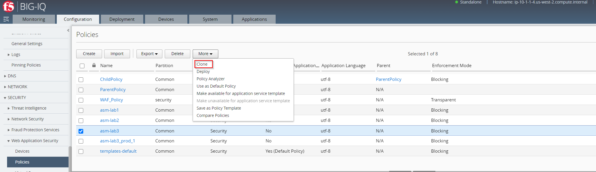
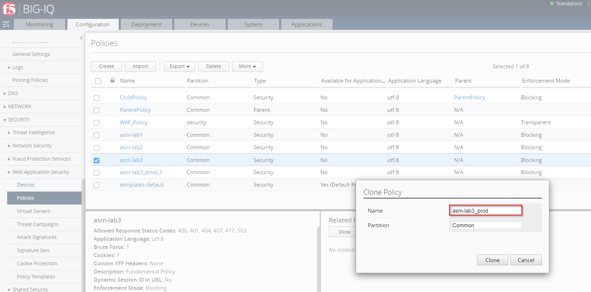
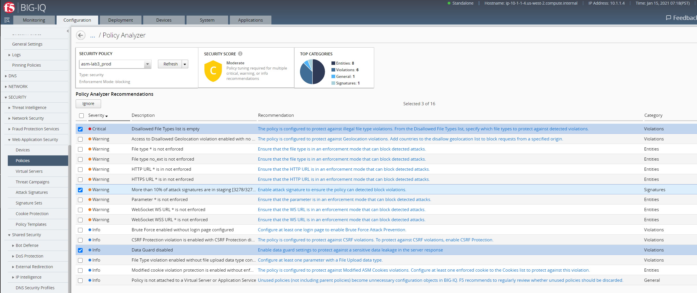
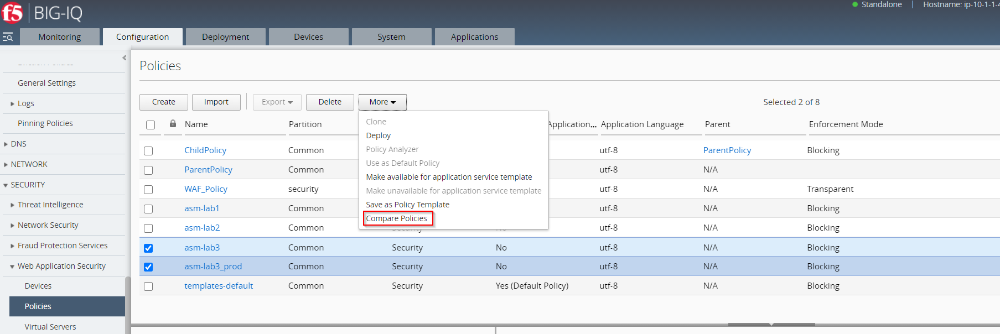
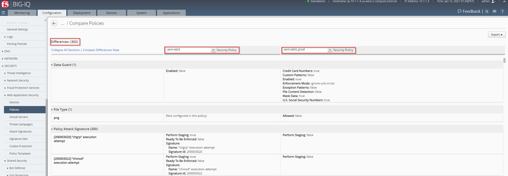
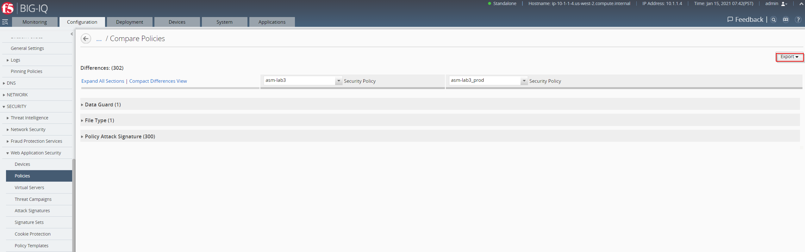

Lab 2.2: Security Policy compare - ASM (new 8.0)
------------------------------------------------

.. note:: Estimated time to complete: **15 minutes**

To eveluate the differences of two Security Policies, Application Security Manager already is offering a way to compare those two Security Policies and view differences between them.
Comparing Security Policies is now supported in BIG-IQ 8.0.

You can use the comparison for auditing purposes, to make two policies act similarly, or to simply view the differences	between two security policies.
This is particularly useful for comparing a security policy in staging and a production version.

You can compare any imported or configured security policies including:

- Active security policies (with or without Policy Builder)
- Child PoliciesParent Policies
- Inactive security policies
- Policies not yet deployed to BIG-IP 

Comparing Security Policies
^^^^^^^^^^^^^^^^^^^^^^^^^^^

Create a Web Application Security Policy comparison	audit to identify the security setting differences among your policies.
You can use this comparison to adjust security settings, specially those that are currently in staging or monitoring.

.. note:: To compare policies, you need to have a user role of Administrator or Web Application Security built-in role, or a custom Web Application Security role that allows access to Web Application Security resources.

Flow:

In our example we build a use case where will have an initial Security Policy called **asm-lab3**. 
A clone of this Security Policy will be generated and named **asm-lab3_prod**. 
To be able to see differences between **asm-lab3** and **asm-lab3_prod** we will analyzing the Security Policy **asm-lab3_prod** with help of **Policy Analyzer** and do some modification 
on **asm-lab3_prod**. After those modofication have been saved to **asm-lab3_prod**, Security Policy **asm-lab3** will be compared with **asm-lab3_prod**.

1. Start with creating a clone of Security Policy named **asm-lab3**.

- To do go to "Configuration > Security > Web Application Security > Policies".
- Check Secuirty Policy named **asm-lab3**.
- Out of the drop-down menu called **More** select *Clone*

Name the Clone Policy **asm-lab3_prod**. No change needed on the Partition.

2. Generate a security policy audit of Security Policy **asm-lab3_prod**.

.. note:: The procedure of generating a security policy audit is documented in Lab 2.1: Analyzing security policy status. 

3. To introduce changes in Security Policy **asm-lab3_prod**:

- Enable **Data Guard** 
- Remove **Attack signatures** from Staging
- Configure a **Disallowed File Type** named **png**.

.. note:: The procedure of generating a security policy audit is documented in Lab 2.1: Edit Policy  

4. Compare Security Policy **asm-lab3** and **asm-lab3_prod**

To compare the two Security Policy **asm-lab3** and **asm-lab3_prod**

-   Go to "Configuration > Security > Web Application Security > Policies"
-   Select  Security Policy **asm-lab3** and **asm-lab3_prod**
-   Navigate to the drop-down Menu called **More** and select *Compare Policies*

5. As a result you will get an overview of the changes between Security Policy **asm-lab3** and **asm-lab3_prod**.

6. To get an brief overview on the differences between Security Policy **asm-lab3** and **asm-lab3_prod** select *Collapse All Sections*.

7. To export the results of the audit to PDF, click *Export* and select *Print Prieview*.
   The system will prompt you to confirm your selection. To proceed, click *ok*.
   

8. To run a comparison for another policy, or pair of policies, select a policy from the list at the table header and click.

.. note:: Finally you can now use the results of the policy comparison audit to adjust your security policies, as required.