Lab 2.3: Restrict access to logs and dashboards data based on ownership​ (new 8.0)
----------------------------------------------------------------------------------

.. note:: Estimated time to complete: **15 minutes**

In this lab, we will create a user which will only have access to the Web Application Security Analytics and Events logs related to a specific WAF policy.

.. include:: /accesslab.rst

Resource Group and Role Creation (david)
^^^^^^^^^^^^^^^^^^^^^^^^^^^^^^^^^^^^^^^^

Let's first deploy the default Advance WAF policy and Security Logging Profile available in **BIG-IQ** to **SEA-vBIGIP01.termmarc.com**.

1. Login to BIG-IQ as **david**.

2. Go to **Configuration > Security > Web Application Security > Policies**. For this lab, we are going to use WAF policy called ``asm-lab1``. 
   Note this policy is in use by the Application Service **mail_site40htts**.

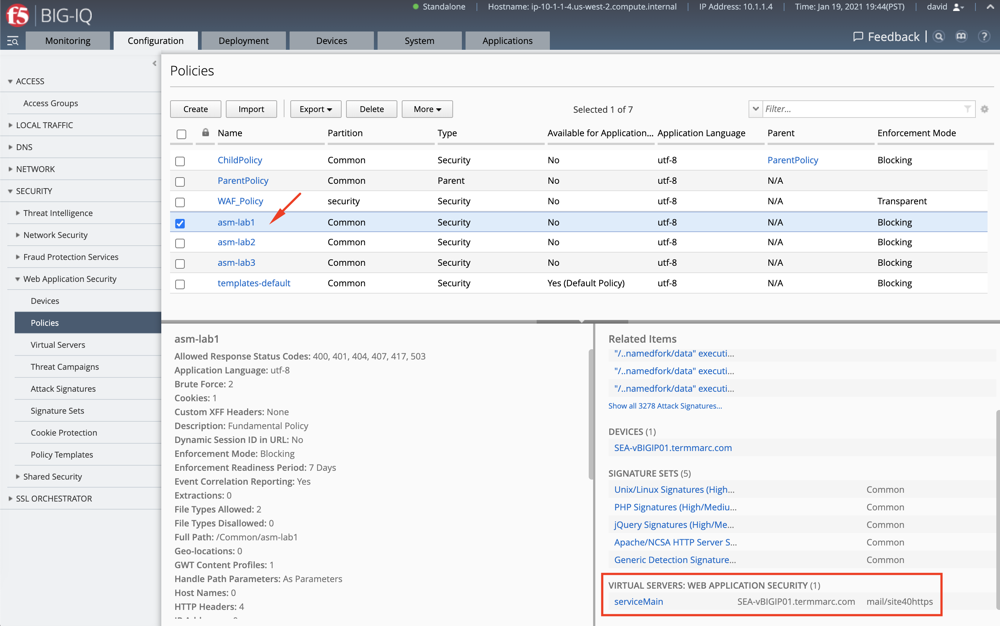

3. First, we need to create a resource group and include the ``asm-lab1`` policy. 

Navigate under **System > Role Management > Resource Groups** and click to **Create**.

Select in the first drop down menu **Web Application Security Manager** (role type), **Web Application Security (ASM)** (service), 
then **Policies** (object type). Select ``asm-lab1`` policy and add it to the resource group.

Name the resource group ``asm-lab1-rg`` and click on **Save & Close**.

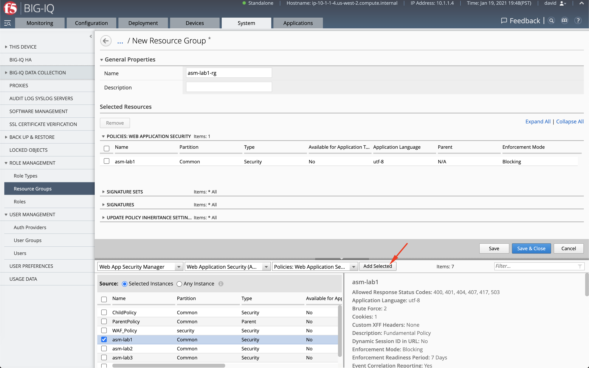

3. Let's now create custom service role. Navigate under **System > Role Management > Roles**, under **Custom Roles > Service Roles**, click to **Add**.

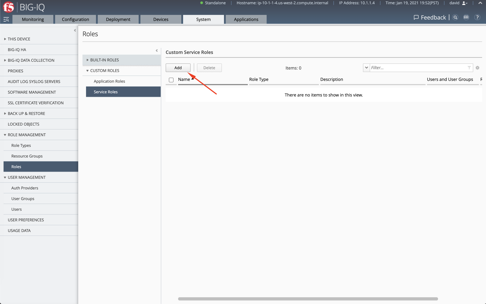

4. Assign the resource group previously created ``asm-lab1-rg`` along with the predefined resource group called ``Resource Group Deployer`` used to allow the user to deploy changes to the policy.

Assign the user **chris**, and name the this custom role ``asm-lab1-role``.

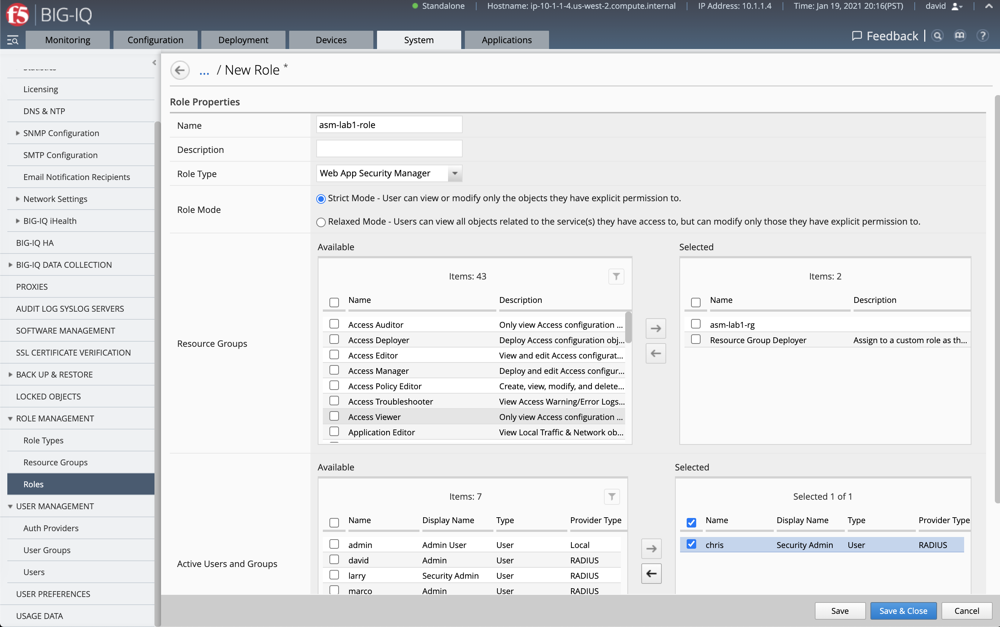

5. You can view the permissions by scrolling down and click on the **Previous** button.

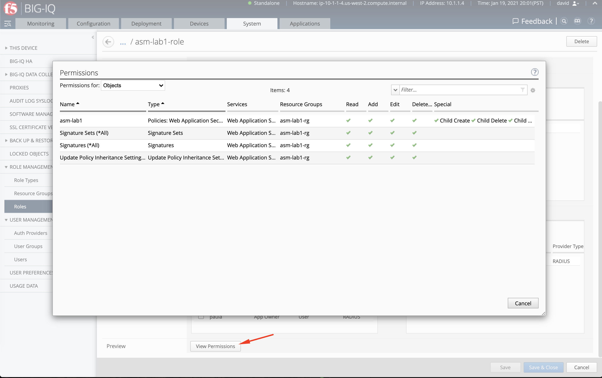

Display all Analytics and Events logs (david)
^^^^^^^^^^^^^^^^^^^^^^^^^^^^^^^^^^^^^^^^^^^^^

1. Login to BIG-IQ as **david** and navigate under the **Monitoring** tab under **Dashboards > Web Application Security**.

David having full admin right to the BIG-IQ can see analytics for all the policies managed by BIG-IQ.

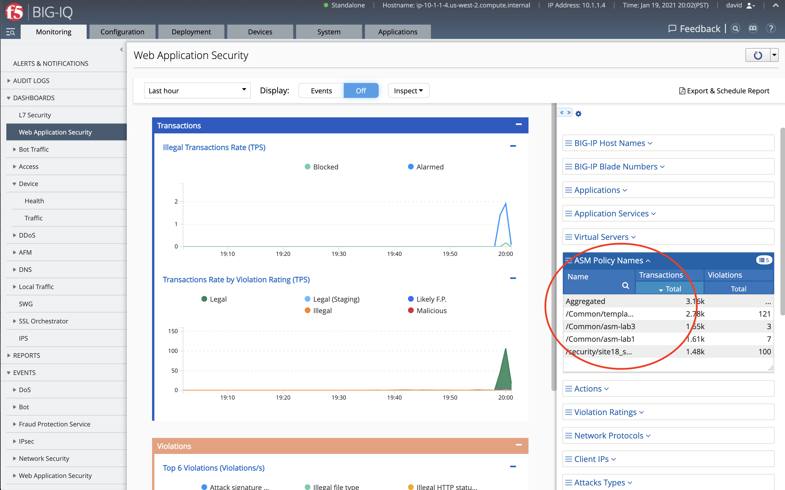

2. Using the finder menu at the top right below the F5 logo, let's now navigate to the WAF event logs.

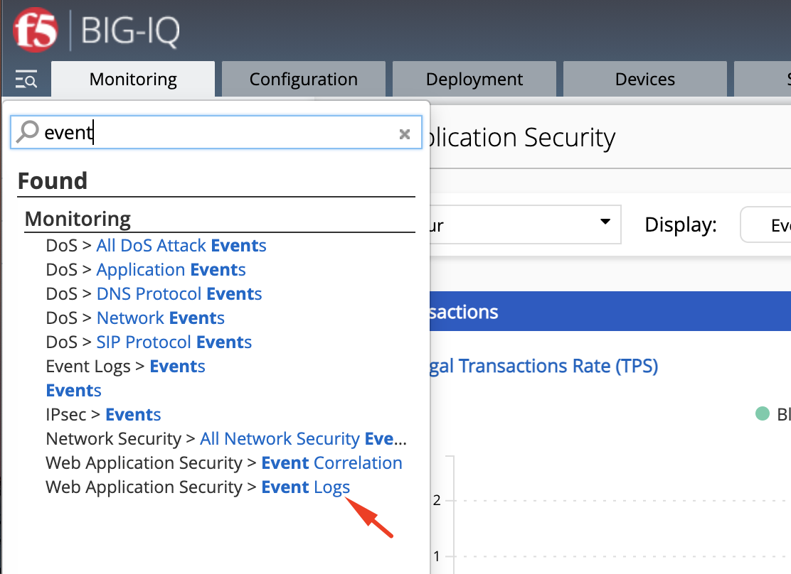

We notice the system has over 14k WAF events.

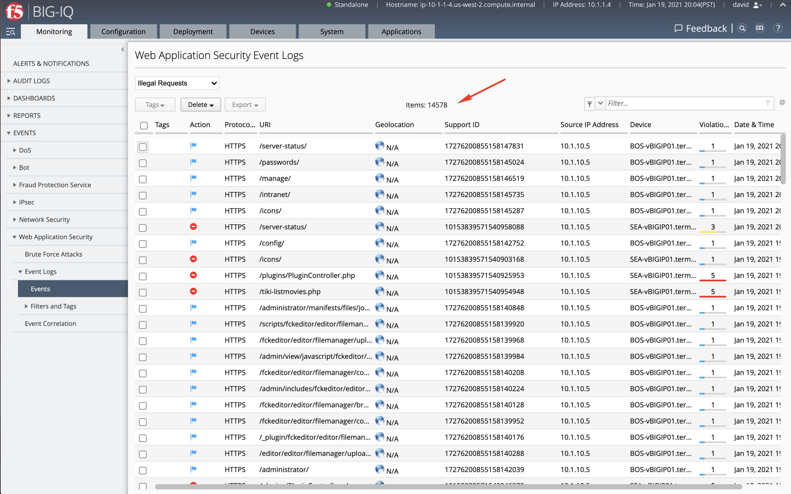

Display user privilege-based Analytics and Events logs (chris)
^^^^^^^^^^^^^^^^^^^^^^^^^^^^^^^^^^^^^^^^^^^^^^^^^^^^^^^^^^^^^^

1. Login to BIG-IQ as **chris**.

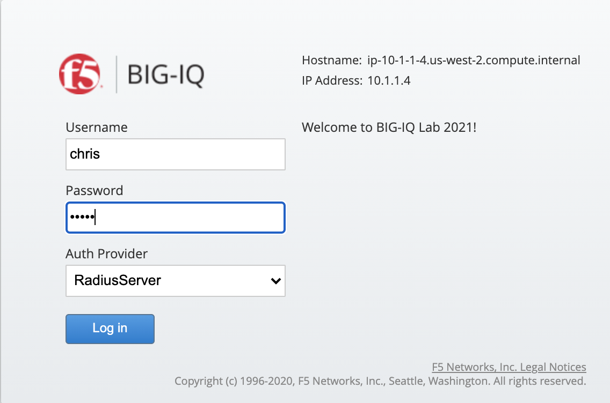

2. Navigate under **Monitoring** tab under **Dashboards > Web Application Security**. Notice this time, **chris** is able 
   to see only security analytics related to its policy assigned through the custom role.

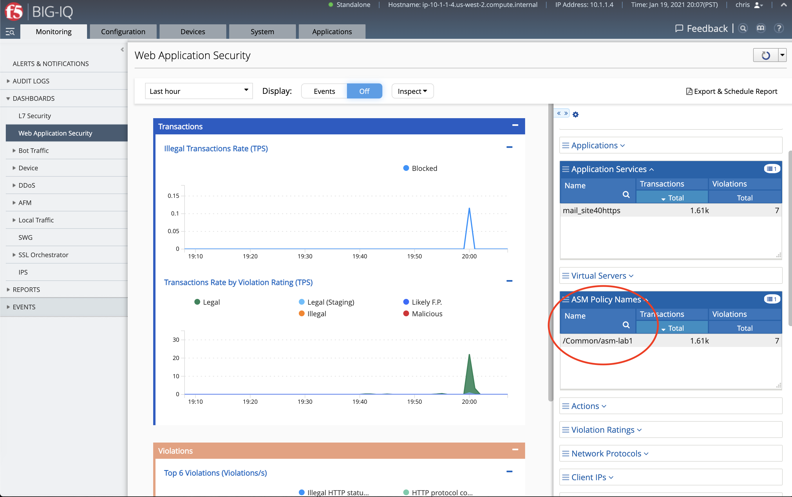

3. You can navigate to the WAF events from this page by clicking on **Inspect**, then **Events logs**.

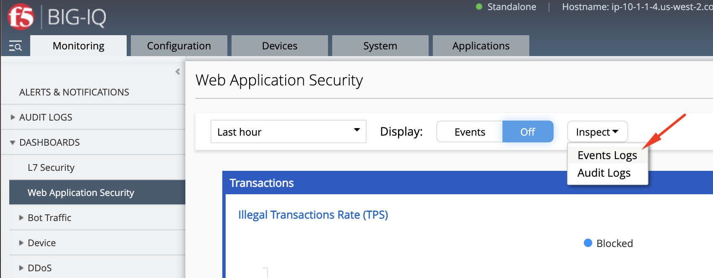

4. We can confirm user **chris** is only able to see WAF events related to his policy ``asm-lab1``.

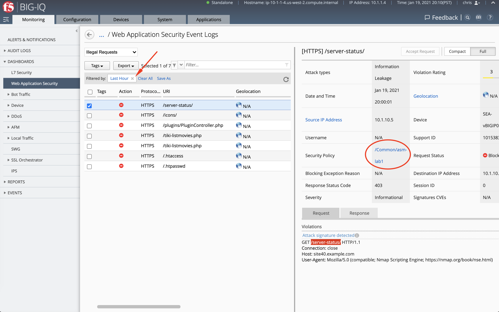

5. Let's now remove the time filter and see how many events is showing. Compare this value to the previous value when connected as **david**.

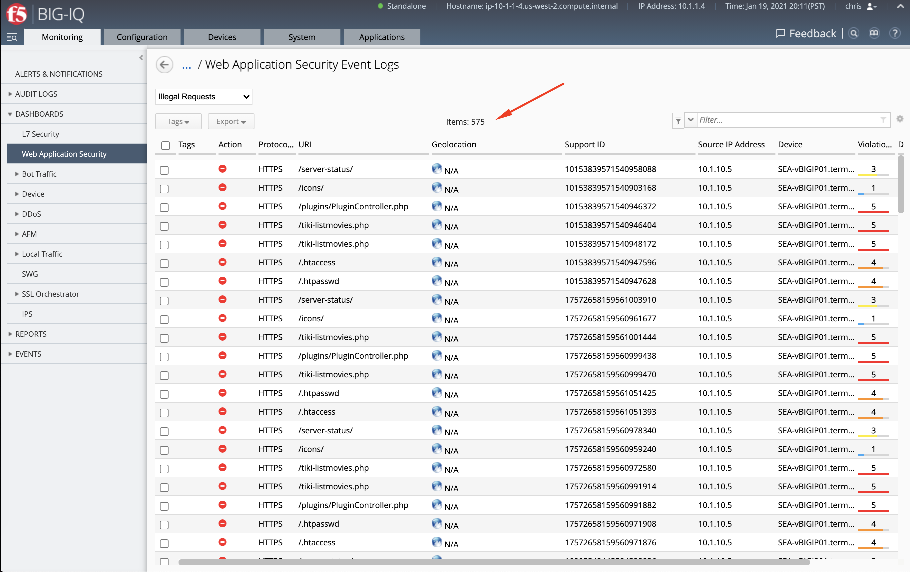

6. Know that **chris** can also make changes to his policy and deploy those changes to the BIG-IP.

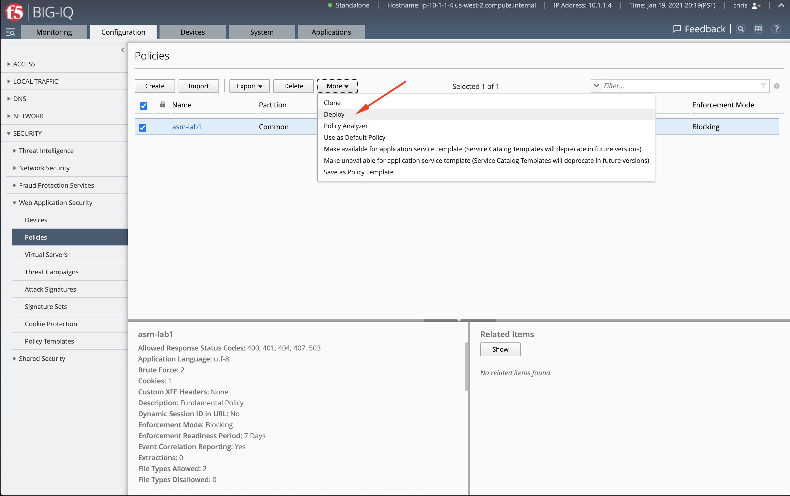