Lab 1.1: Simple APM Configuration via BIG-IQ (secure website with basic authentication)
---------------------------------------------------------------------------------------

1. First make sure your device has APM module discovered and imported 
for **BOS-vBIGIP01.termmarc.com** and **BOS-vBIGIP02.termmarc.com** under Devices > BIG-IP DEVICES.

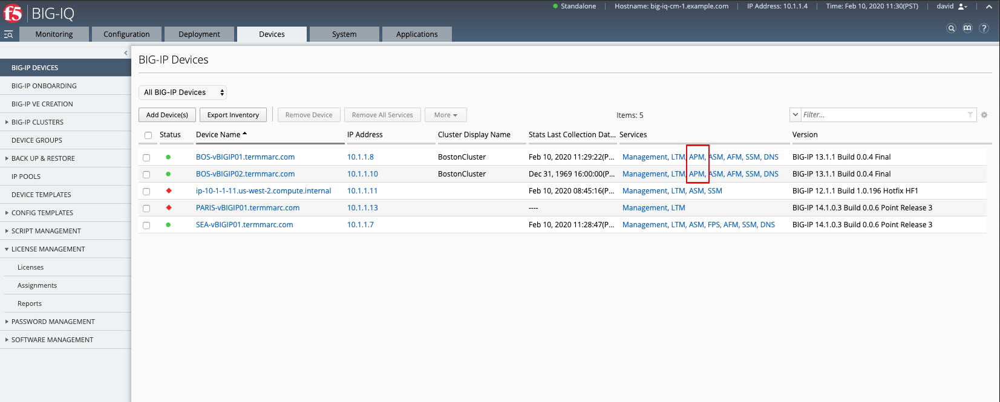

2. Check if the **Access** service is Active  
under System > BIOG-IQ DATA COLLECTION > BIG-IQ Data Collection Devices.

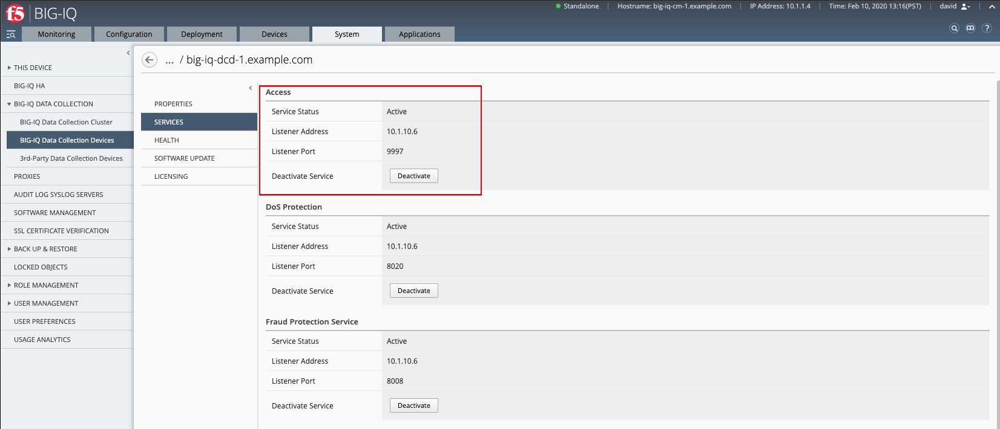

3. Configure remote logging for the device.

Monitoring > DASHBOARD > Access > Remote Logging configuration
Select both BIG-IPs and click on Configure. Wait until Stats shows **Enabled**.

.. image:: ../pictures/module1/lab-1-3.png
  :scale: 60%
  :align: center

4. Create a simple HTTP Access Policy.

4.1 Configuration > ACCESS > Acess Groups, select Boston, then go under AUTHENTICATION section, 
select RADIUS and create a Radius Shared object.

Click Create.

Name: ``RadiusLab``
Server: ``10.1.1.5``
Password: ``default``

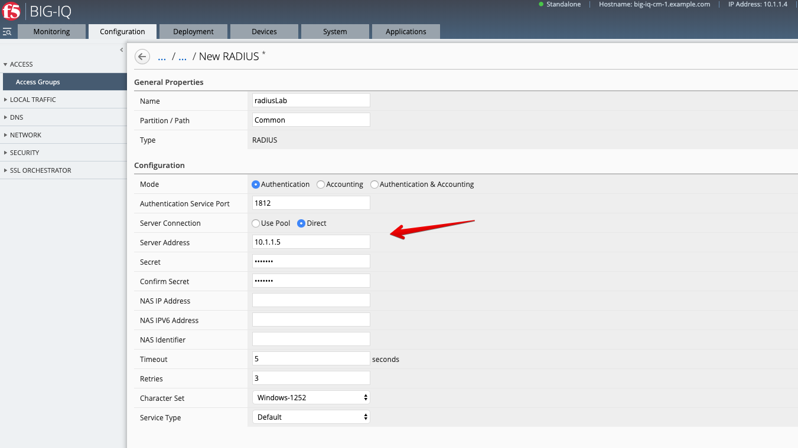

4.2 Configuration > ACCESS > Acess Groups, navigate under ACCESS POLICIES > Per-Session Policies.

Click Create.

General = ``Advanced``

Name: ``labSimpleHttpsAccess``
Languages: ``English``
Log Settings: ``/Common/default-log-setting``

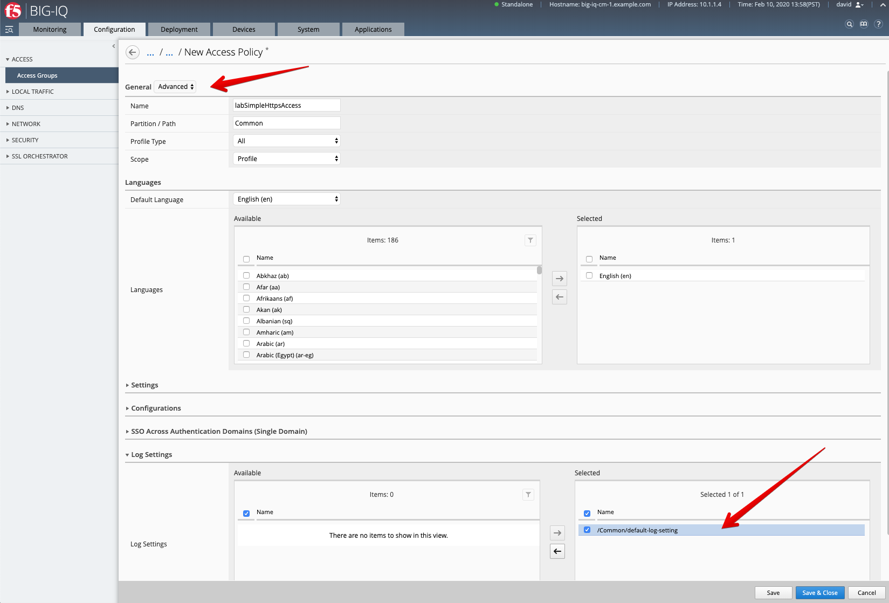

Save & Close

4.3 The Visual Policy Editor (VPE) should open automatically.

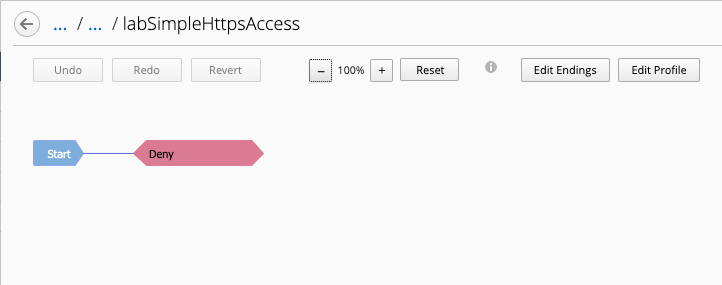

Click on the line between Start and Deny, and add a Logon Page.

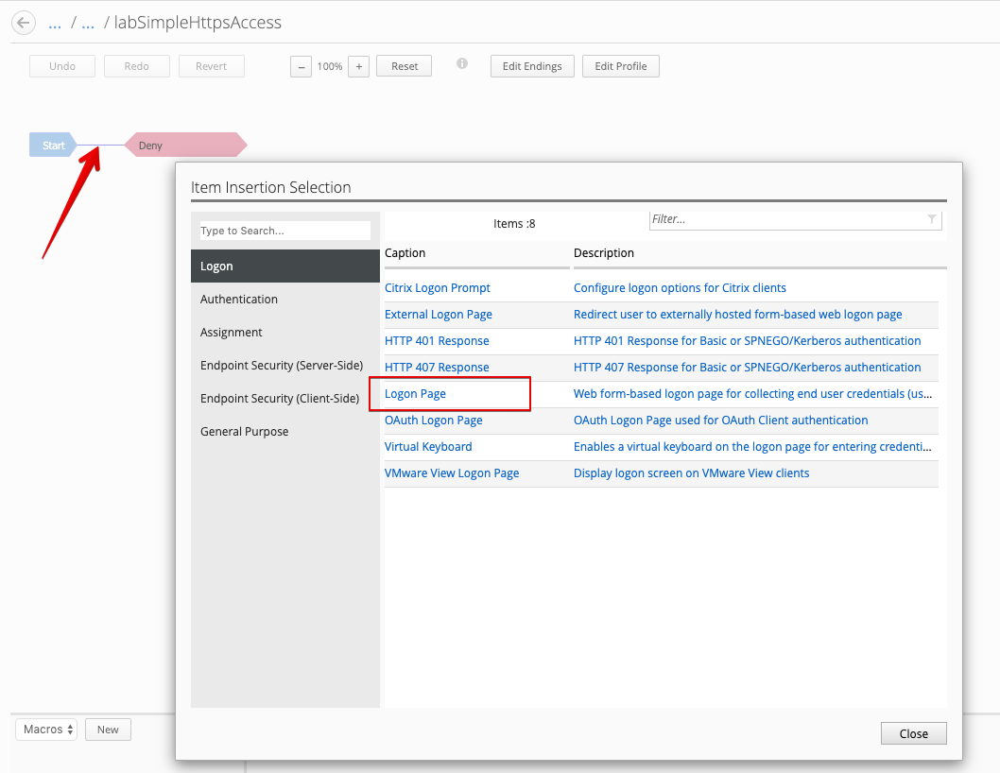

Click on the line between Logon Page and Deny, and add a RADIUS Auth.

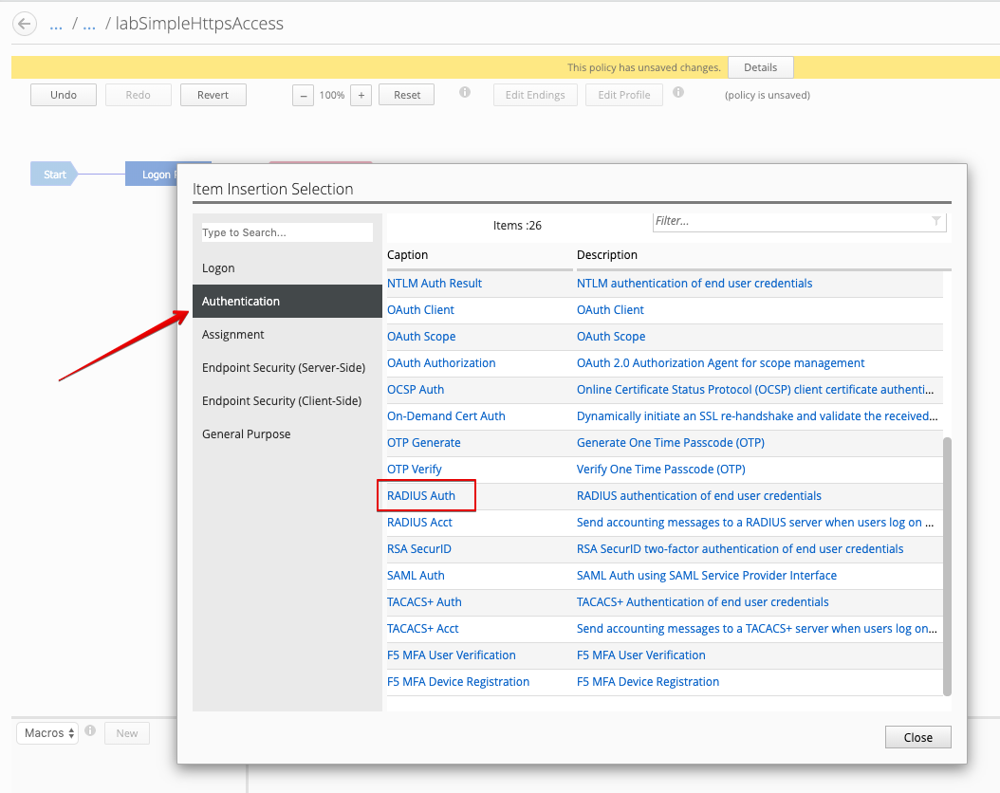

Set AAA Server to previously created ``RadiusLab`` Radius Server object.

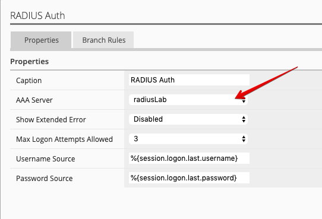

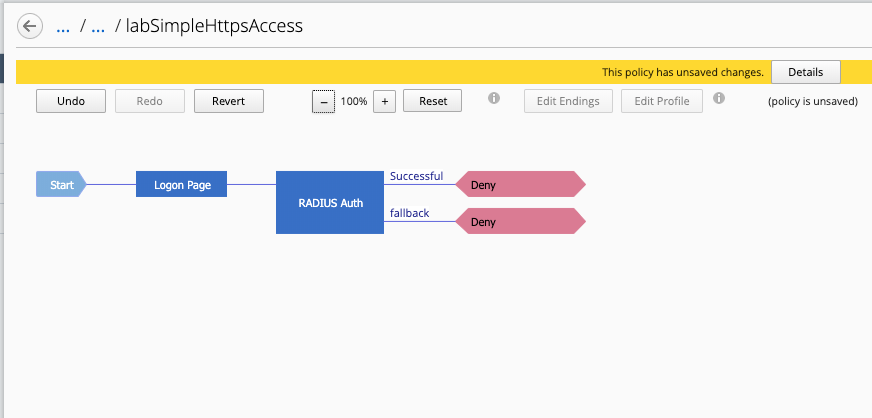

After the Successful outcome, change Deny to Allow.

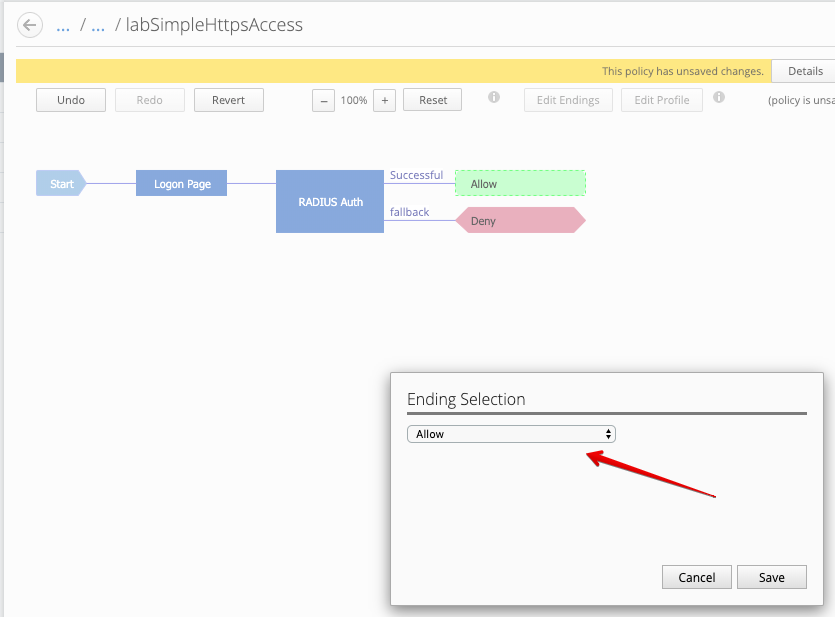

4.4 Deploy the Access Policy to the device.

Deployment tab > EVALUATE & DEPLOY > Access

Name: ``new-access-policy`
Method: ``Deploy immediately``
Target Device(s): select both BOS BIG-IPs

.. image:: ../pictures/module1/lab-1-13.png
  :scale: 60%
  :align: center

Click Create.

5. Navigate to the Applications tab > APPLICATION TEMPLATES.

Select the ``AS3-F5-HTTPS-offload-lb-existing-cert-template-big-iq-default-v1`` AS3 Template and clone it.

Rename it ``LAB-HTTPS-with-Authentication``. 

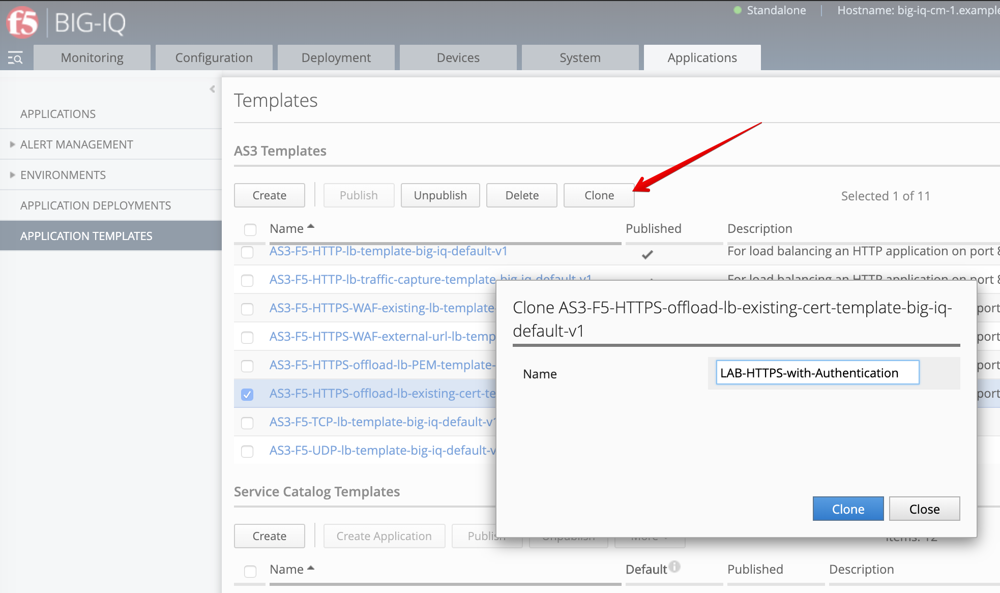

Edit the new cloned template and select the Service_HTTPS class.
Look for the attribute called ``BIG-IP IAM policy`` and set it to ``/Common/labSimpleHttpsAccess``.

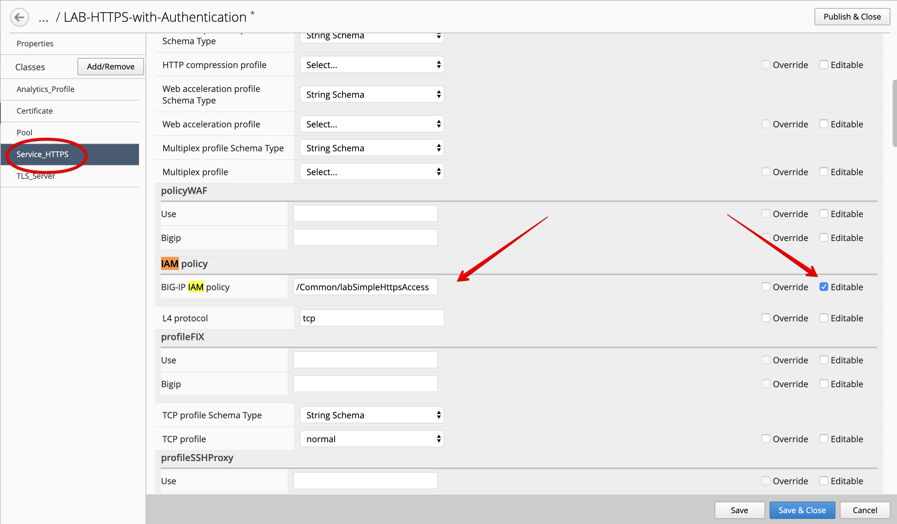

At the top right corner, click on **Publish and Close**

6. Navigate to the APPLICATION menu, click on **Create** 

+---------------------------------------------------------------------------------------------------+
| Application properties:                                                                           |
+---------------------------------------------------------------------------------------------------+
| * Grouping = New Application                                                                      |
| * Application Name = ``LAB_Access``                                                               |
| * Description = ``Secure website with basic authentication``                                      |
+---------------------------------------------------------------------------------------------------+
| Select an Application Service Template:                                                           |
+---------------------------------------------------------------------------------------------------+
| * Template Type = Select ``LAB-HTTPS-with-Authentication [AS3]``                                  |
+---------------------------------------------------------------------------------------------------+
| General Properties:                                                                               |
+---------------------------------------------------------------------------------------------------+
| * Application Service Name = ``https_auth_service``                                               |
| * Target = ``BOS-vBIGIP01.termmarc.com``                                                          |
| * Tenant = ``tenant3``                                                                            |
+---------------------------------------------------------------------------------------------------+
| Analytics_Profile. Keep default                                                                   |
+---------------------------------------------------------------------------------------------------+
| Pool                                                                                              |
+---------------------------------------------------------------------------------------------------+
| * Members: ``10.1.20.123``                                                                        |
+---------------------------------------------------------------------------------------------------+
| Service_HTTPS                                                                                     |
+---------------------------------------------------------------------------------------------------+
| * Virtual addresses: ``10.1.10.119``                                                              |
| * IAM policy: ``/Common/labSimpleHttpsAccess``                                                    |
+---------------------------------------------------------------------------------------------------+
| Certificate. Keep default                                                                         |
+---------------------------------------------------------------------------------------------------+
| TLS_Server. Keep default                                                                          |
+---------------------------------------------------------------------------------------------------+

The application service called ``tenant3_https_auth_service`` is now created on the BIG-IQ dashboard
under the application called ``LAB_Access``.

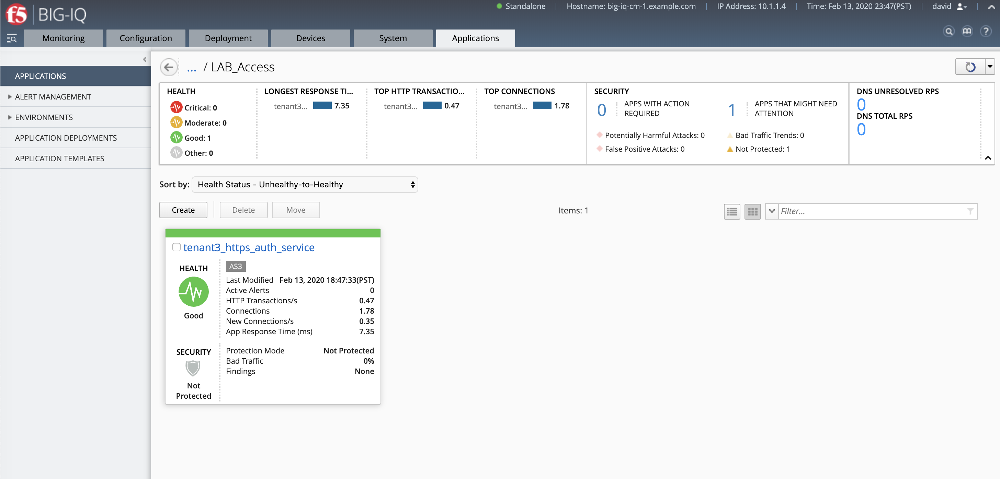

7. From the lab environment, launch a xRDP/noVNC session to have access to the Ubuntu Desktop. 
To do this, in your lab environment, click on the *Access* button
of the *Ubuntu Lamp Server* system and select *noVNC* or *xRDP*.

.. note:: Modern laptops with higher resolutions you might want to use 1440x900 and once XRDP is launched Zoom to 200%.

.. image:: ../../pictures/udf_ubuntu.png
    :align: left
    :scale: 60%

|

Open Chrome and navigate to the following URL: ``https\:\/\/10.1.10.119`` and 
login with username: paula, password: paula

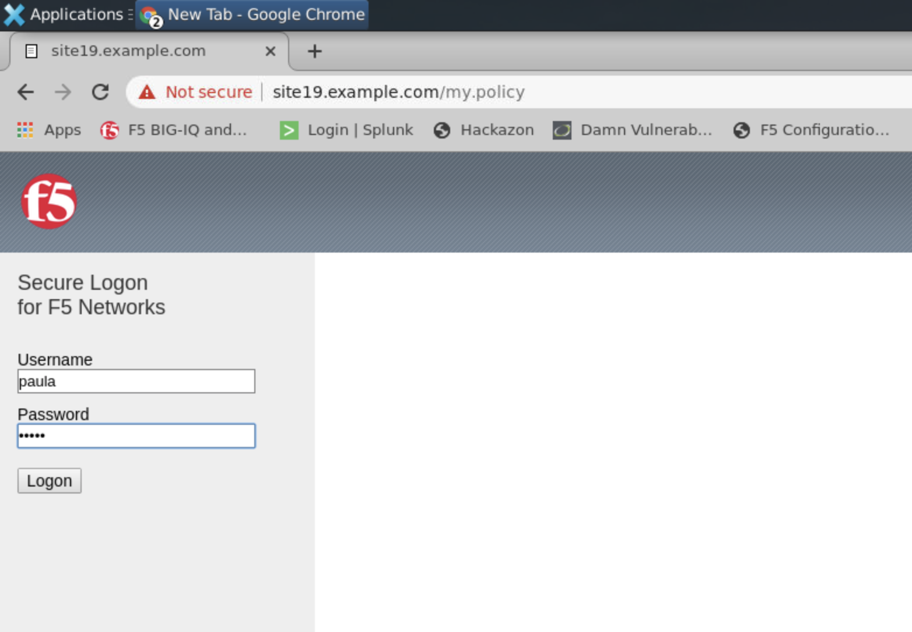

Authentication succeed, **Paula** is able to authenticate to the website thanks to the Access policy attached to
the Virtual Server delivering the service.

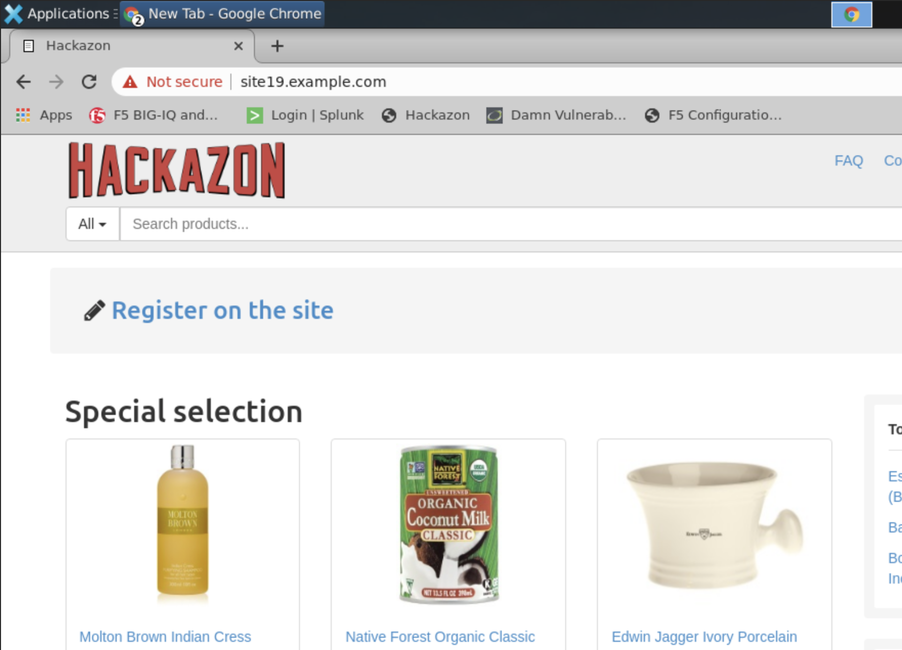

8. From BIG-IQ navigate to the Monitoring tab > Access > Access Summary.

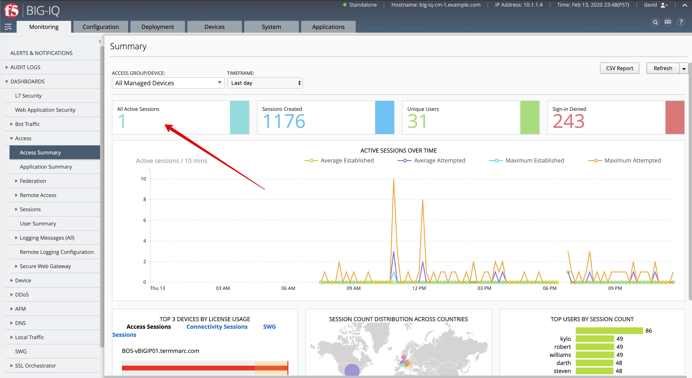

Click on the Active Session to get details about the session.

.. image:: ../pictures/module1/lab-1-22.png
  :scale: 60%
  :align: center

9. Now, let's navigate to the Access > Sessions > Active to kill the active Sessions.

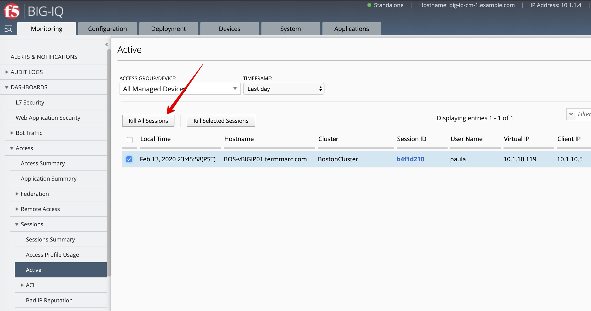

After the sessions is killed, go back to the Lamp server and try refresh the page showing Hackazon website.
The login and password prompts should be displayed as the user session has been terminated.