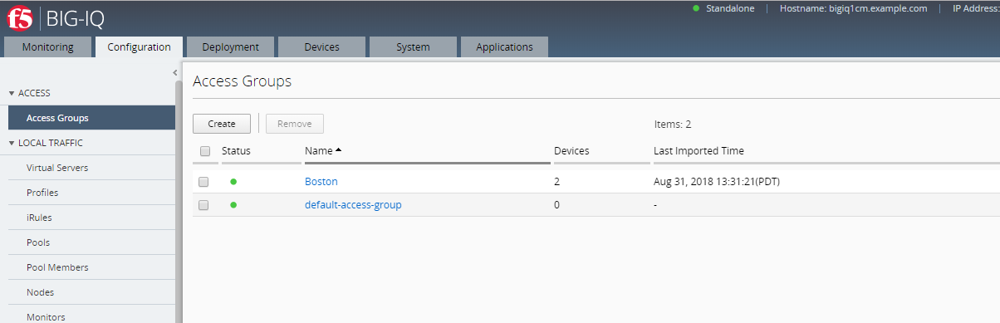
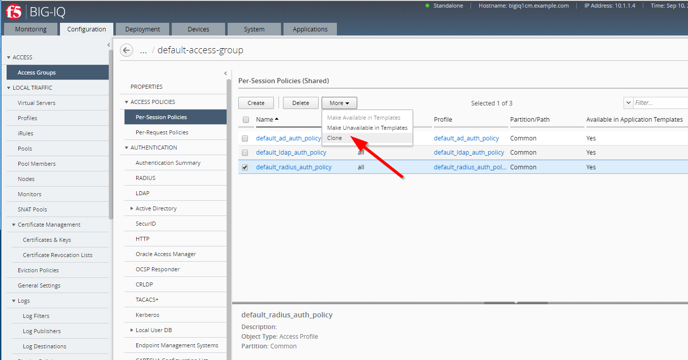
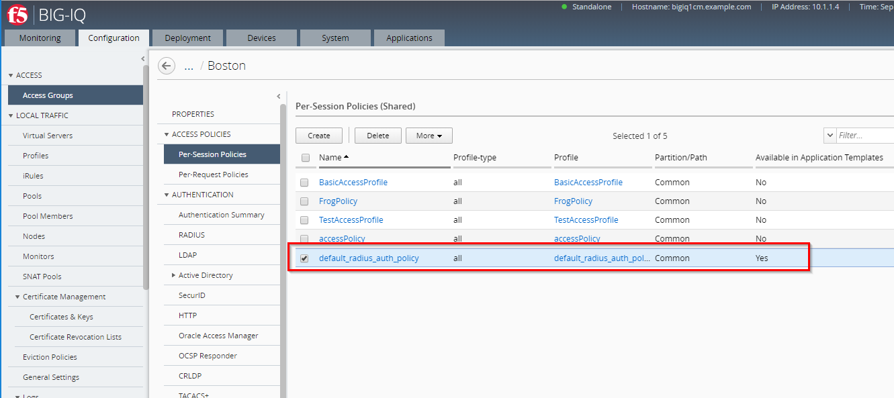
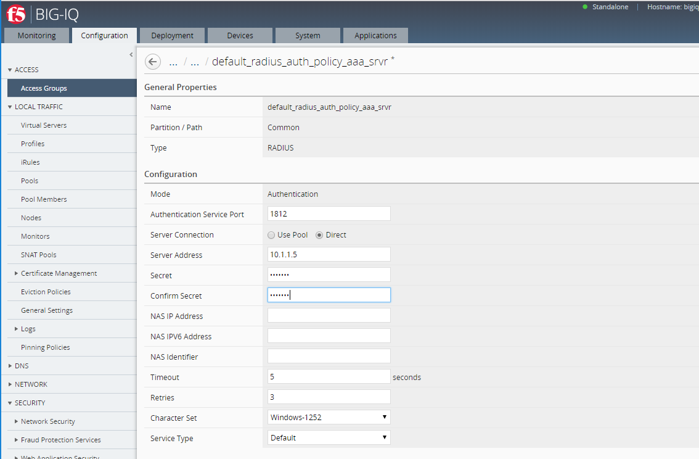
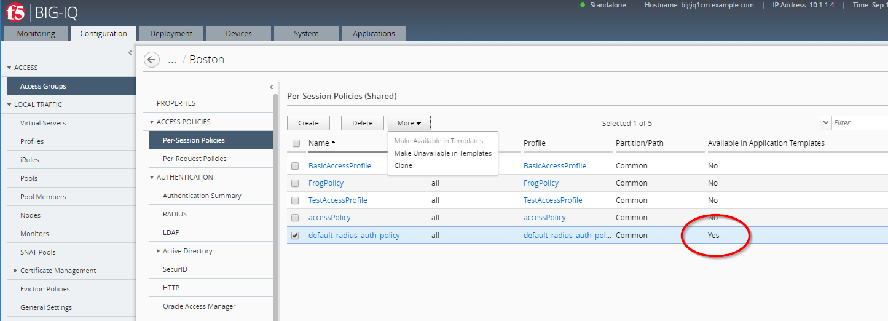
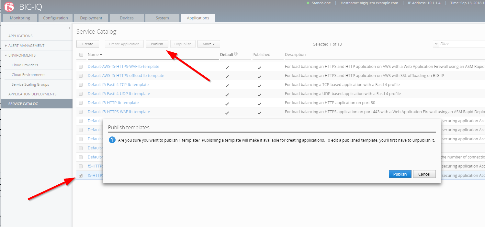
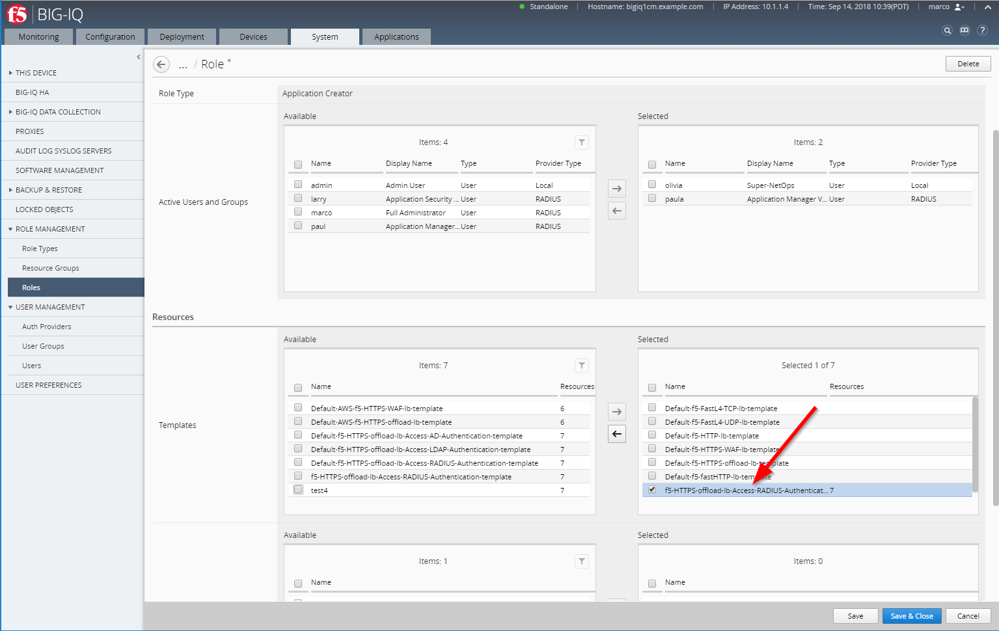

Lab 1.2: Create custom security policies & Application Service Template
-----------------------------------------------------------------------
Connect as **larry**

1. Clone an access policy from the default-access-group. Go to *Configuration* > *ACCESS* > *Access Groups* > *default-access-group*.

Before you can clone policies, you must have an Access group configured for your Service Scaling Group.
Important: Do not edit access policies or configurations in the default Access group.
You clone a default access policy to create a starting point for defining access policies for an Access group.

.. note:: Do not edit default access policy templates. Clone a policy, then make any required edits in the cloned policy.

- Click Configuration > ACCESS > Access Groups. The Access Groups screen opens.

- Click default-access-group. The default-access-group General Properties screen opens.
- On the left, click Per-Session Policies. The Per-Session Policies (Shared) screen opens.
- Select the check box next to an access policy to clone, and click More > Clone .

- In the Clone Policy dialog box that opens, select the target Access group, and select whether to reuse existing objects from the target Access group, then click Clone.

.. image:: ../pictures/module1/img_module1_lab2_3.png
   :align: center
   :scale: 50%

- Check the target Access group to see that the target policy has been cloned.

.. image:: ../pictures/module1/img_module1_lab2_4.png
   :align: center
   :scale: 50%

|

Now you can edit the access policy, and the related objects created to support it on the target access group.

2. Review and edit resources associated with an access policy

When you clone an access policy, the associated resources are also cloned. You can review and edit these resources, if necessary, on the target Access group.

- Under ACCESS POLICIES > Per-Session Policies, click on ``default_radius_auth_policy``.

.. image:: ../pictures/module1/img_module1_lab2_6.png
   :align: center
   :scale: 50%

- Under AUTHENTICATION > RADIUS, click on ``default_radius_auth_policy_aaa_srvr``.

  Set the Radius IP address and passphrase:

  - Server Address: ``10.1.1.5``
  - Secret: ``default``

3. Make an access policy available in templates

You can make an access policy available in templates, so that you can select it in a service template, and apply the settings from that policy to devices in a Service Scaling Group.
At the top of the screen, select Configuration, then on the left side of the screen, click ACCESS > Access Groups .

Under ACCESS POLICIES > Per-Session Policies, click on ``default_radius_auth_policy`` and confirm the policy is Available in Application Templates (set to Yes).

If set to No, click on More, and click select *Make Available in Templates*.

4. Clone the service template

Click Applications SERVICE CATALOG, select Default-f5-HTTPS-offload-lb-Access-RADIUS-Authentication-template, click More > Clone .

.. image:: ../pictures/module1/img_module1_lab2_9.png
   :align: center
   :scale: 50%

In the dialog box that opens, type the name for the cloned service template, ``f5-HTTPS-offload-lb-Access-RADIUS-Authentication-template-custom1`` then click Clone.

The Edit Template screen opens. 

.. image:: ../pictures/module1/img_module1_lab2_10.png
   :align: center
   :scale: 50%

On the left, click SECURITY POLICIES. Scroll down to Access, select the Access Group from which you want to use access policies. 
Select the Access group to which you cloned default access policies.
In the Virtual Server area, for the virtual server providing the access service, from the Type list select Access Profile.
From the APM Policy/Profile list select the access policy you created.

.. image:: ../pictures/module1/img_module1_lab2_11.png
   :align: center
   :scale: 50%

.. note:: Do not associate an APM policy or profile with the redirect virtual server.

Click Save & Close.

The Service Catalog screen opens.

Select the check box next to the service template you created, and click Publish.

You can now use the published template to create applications.

5. In order to allow **Paula** to use the custom application template, go to : *System* > *Role Management* > *Roles*
and select *CUSTOM ROLES* > *Application Roles* > *Application Creator VMware* role (already assigned to Paula). Select the Template *f5-HTTPS-offload-lb-Access-RADIUS-Authentication-template-custom1*, drag it to the right.

|

Click on *Save & Close*
