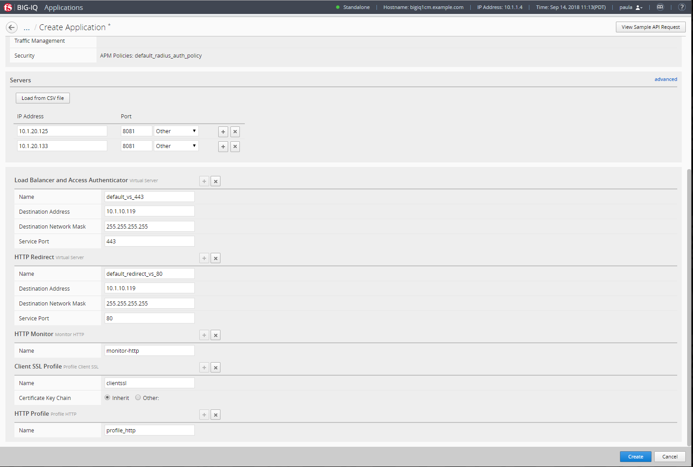
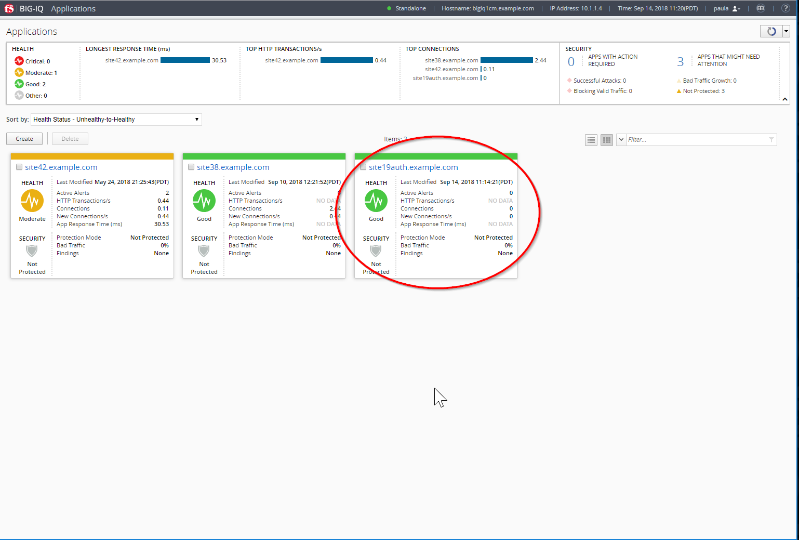
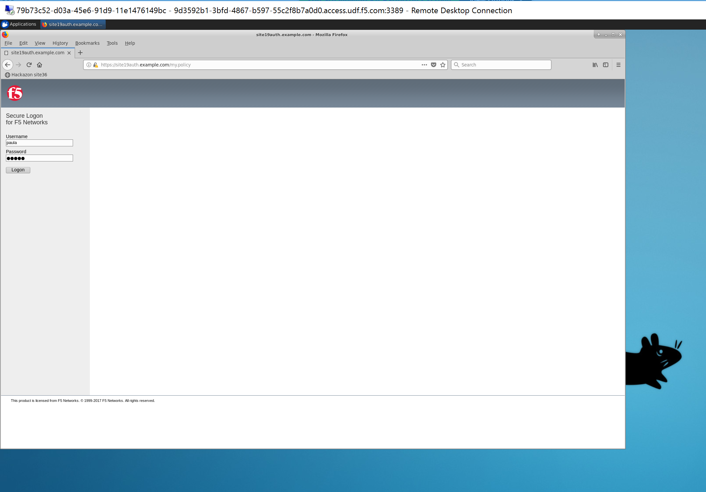
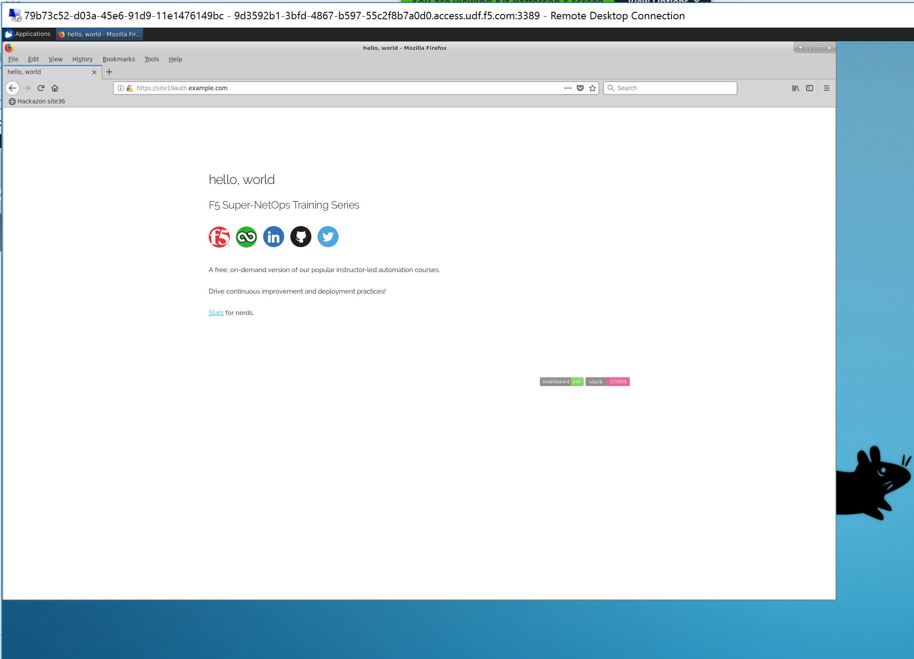
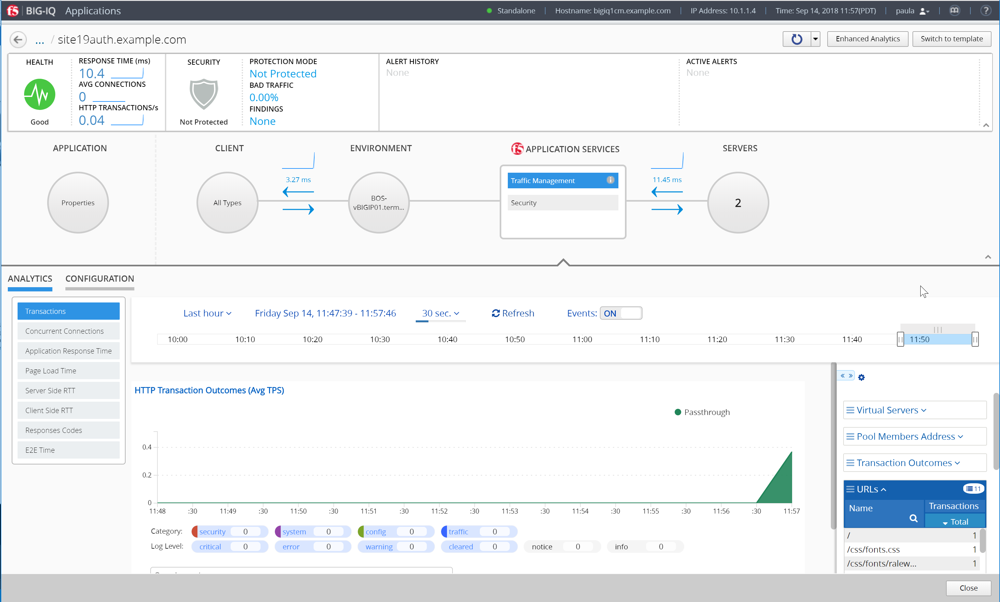

Lab 1.3: Create Application
---------------------------
Connect as **paula** to create a new application, and click on *Create*, select the template previously created ``f5-HTTPS-offload-lb-Access-RADIUS-Authentication-template-custom1``.

Type in a Name for the application you are creating.

- Application Name: ``site19auth.example.com``

To help identify this application when you want to use it later, in the Description field, type in a brief description for the application you are creating.

- Description: ``My Application on F5 Cloud Edition with authentication``

Type  the domain of your application (then the ASM policy will always be transparent for this domain)

- Domain Names: ``site19auth.example.com``

For Device, select the name of the device you want to deploy this application to. (if the HTTP statistics are not enabled, they can be enabled later on after the application is deployed)

- BIG-IP: Select ``BOS-vBIGIP01.termmarc.com`` and check ``Collect HTTP Statistics``

.. image:: ../pictures/module1/img_module1_lab3_1.png
   :align: center
   :scale: 50%

|

Determine the objects that you want to deploy in this application.
To omit any of the objects defined in this template, click the  (X) icon that corresponds to that object.
To create additional copies of any of the objects defined in this template, click the  (+) icon that corresponds to that object.

In the example, fill out the Server's IP addresses/ports (nodes) and virtual servers names, IPs and ports.

- Servers (Pool Member): ``10.1.20.125`` and ``10.1.20.133``
- Service Port: ``8081``

LB (Virtual Server):

- Destination Address: ``10.1.10.119``
- Destination Network Mask: ``255.255.255.255``
- Service Port: ``443``

HTTP Redirect (Virtual Server):

- Destination Address: ``10.1.10.119``
- Destination Network Mask: ``255.255.255.255``
- Service Port: ``80``

It is good practice to type the Prefix that you want the system to use to make certain that all of the objects created when you deploy an application are uniquely named.

|

Then Click on Create (bottom right of the window).
The Application is deployed.

.. image:: ../pictures/module1/img_module1_lab3_3.png
   :align: center
   :scale: 50%

|

.. note:: In case the Application fails, connect as **Marco** and go to Applications > Application Deployments to have more details on the failure. You try retry in case of failure.

.. note:: You can tail the logs: /var/log/restjavad.0.log

In Paula's Dashboard, she can see her Application.

|

Launch a RDP session to have access to the Ubuntu Desktop. To do this, in your UDF deployment, click on the *Access* button
of the *Ubuntu Lamp Server* system and select *XRDP*

|

Open Chrome and navigate on the website (https) site19auth.example.com. 

|

Fill in user/password to authenticate to the application: ``paula``/``paula``

|

Back on BIG-IQ, click on the Application and check the Analytics coming in.

|

.. note:: The timeout on the access policy were updated for the purpose of this lab:

  - Inactivity Timeout: ``120 seconds``
  - Access Policy Timeout:	``60 seconds``
  - Maximum Session Timeout:	``180 seconds``