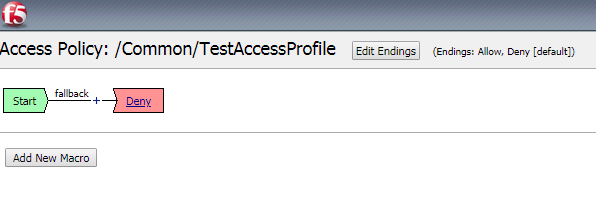
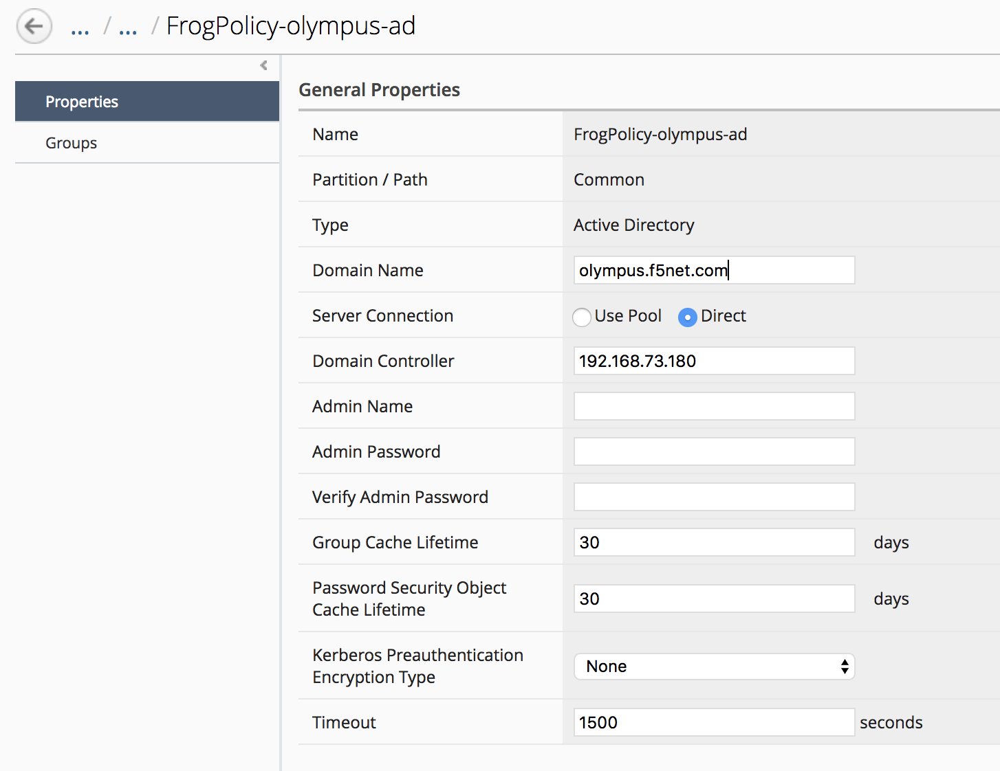
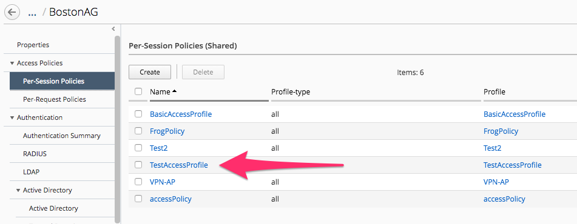

Lab 1.1: Modifying an existing APM access policy using VPE
----------------------------------------------------------

Access Policy Review
~~~~~~~~~~~~~~~~~~~~

Navigate to Configuration Access Access Groups BostonAG Access Policies
Per-Session Policies TestAccessProfile

|image5|

The access policy will be displayed in a new screen as shown below.
Compare the Access policy in BIG IQ with the policy in BIG IP source
device and ensure that they are exactly same. Open the browser shortcut
for the BIG-IP01 in a new tab from Chrome.

|image6| |image7|

Location Specific Object Modification
~~~~~~~~~~~~~~~~~~~~~~~~~~~~~~~~~~~~~

-  Navigate to Configuration Access Access Groups BostonAG
   Authentication Active Directory Active Directory

    |image8|

    LSO or Location Specific Objects are objects within an access
    profile/policy that relate to more specific geographic areas
    normally and are not shared between all devices by default to
    prevent misconfigurations. As an example, AAA servers are located in
    all office/data centers globally however if an end user is accessing
    a policy on an APM in Europe we wouldn’t want their authentication
    requests to be sent over a WAN link to some Domain Controller in
    another country and cause a tremendous delay for that user.

-  Click the check box for the FrogPolicy-olympus-ad for the BIGIP02
   device.

-  Click the Mark Shared button and accept the warning

    |image9|

    This will move the object from the device specific location to the
    Shared resources location.

-  Click on the AAA object to edit the properties

-  Change the Timeout value from 15 to 1500

-  Click Save & Close

    |image10|

    BIG IQ provides the ability to transition LSO objects to Shared
    Objects and vice versa. When an LSO object is made Shared it will
    have the same configuration across all the BIG IPs after deployment.

Modifying an existing APM access policy using VPE
~~~~~~~~~~~~~~~~~~~~~~~~~~~~~~~~~~~~~~~~~~~~~~~~~

-  Navigate to ConfigurationAccessAccess Groups

-  Select BostonAG

|image11|

Click on Access Policies -> Per Session Policies:

Select TestAccessProfile and add the following objects:

-  Logon page (accept default settings)

-  AD Auth using FrogPolicy-Olympus-AD

-  If AD Auth successful, your allowed access

|image12|

Start by hovering the mouse over the blue line in the policy flow
between the Start and Ending points and clicking the Green Plus sign.

|image13|

Now select the “Logon Page” object on the right side of the pop up
window. Then click “Save” on the next pop up window.

|image14|

The result should look like the picture below.

|image15|

Now repeat the steps by hovering the mouse on the blue line between the
Logon Page object and the Ending Deny and click the Green plus sign to
add the Authentication object of AD Auth.

|image16|

Now click the Server drop down to select FrogPolicy-olympus-ad and then
click “Save”.

|image17|

Change the Ending DENY to ALLOW.

Notice the Yellow Banner warning that there are un-saved changes. Click
the Save button at the bottom of the profile page. Click OK on the
Policy Save Conformation pop up window.

|image18|

After modifying the access profile, go to “Deployment tab- > Evaluate &
Deploy -> Access”

Click on Create in Evaluation section. Enter a name in the Name Field
then click the Checkbox in the Available section of Target Devices and
Click the arrow to the right to move both BOS BIGIP deivces to the
Selected area and then click the Create button at the bottom.

|image19|

The BIG-IQ will now start evaluating the configurations on the BIG-IP
devices and provide a comparison of the changes between the stored
configuration within the BIG-IQ versus the current running
configurations on the BIG-IP systems. When the evaluation completes you
will see a screen like the one below. Click the “VIEW” link under the
Access column.

|image20|

In the evaluation section, you will be able to view the added/changed
items. After reviewing click the Cancel button at the bottom of the pop
up window.

|image21|

Now click the Deploy button in the Evaluations section and wait for the
Deployment tast to complete.

|image22|

You can verify on BigIP that the access profile changes were pushed:

|image23|

.. |image5| image:: media/image6.png
   :width: 5.63056in
   :height: 2.99033in
.. |image6| image:: media/image7.png
   :width: 2.47222in
   :height: 2.09016in

.. |image8| image:: media/image9.png
   :width: 6.50000in
   :height: 3.60625in
.. |image9| image:: media/image10.png
   :width: 6.50000in
   :height: 1.68889in

.. |image11| image:: media/image12.png
   :width: 4.32020in
   :height: 2.10656in

.. |image13| image:: media/image7.png
   :width: 2.47222in
   :height: 2.09016in
.. |image14| image:: media/image14.png
   :width: 4.78697in
   :height: 2.31967in
.. |image15| image:: media/image15.png
   :width: 3.07377in
   :height: 1.79768in
.. |image16| image:: media/image16.png
   :width: 4.77869in
   :height: 2.19636in
.. |image17| image:: media/image17.png
   :width: 3.31246in
   :height: 2.75083in
.. |image18| image:: media/image18.png
   :width: 4.09836in
   :height: 1.84640in
.. |image19| image:: media/image19.png
   :width: 6.27138in
   :height: 3.25000in
.. |image20| image:: media/image20.png
   :width: 6.50000in
   :height: 1.39028in
.. |image21| image:: media/image21.png
   :width: 5.69672in
   :height: 2.82593in
.. |image22| image:: media/image22.png
   :width: 3.99163in
   :height: 1.47222in
.. |image23| image:: media/image23.png
   :width: 6.49097in
   :height: 2.34236in

