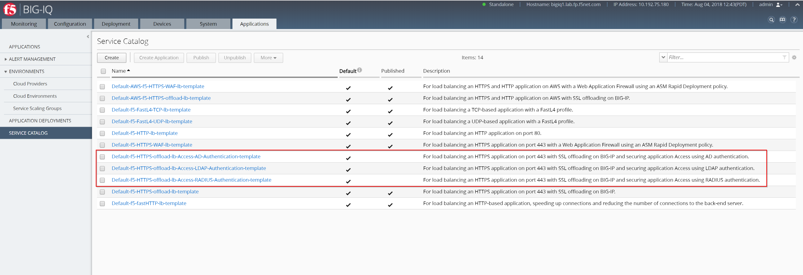

Lab 1.1: Access Built-in templates
----------------------------------
**[New 6.0.1]** The BIG-IQ system ships with a set of Access-specific default service templates that you can use as starting points to allow 
authentication and access control for web applications behind local traffic virtual servers. 
You can clone these service templates and edit the cloned templates to add access security to your applications.

- ``Default-f5-HTTPS-offload-lb-Access-AD-Authentication-template``: For load balancing an HTTPS application on port 443 with SSL offloading on BIG-IP and securing application Access using AD authentication.
- ``Default-f5-HTTPS-offload-lb-Access-LDAP-Authentication-template``: For load balancing an HTTPS application on port 443 with SSL offloading on BIG-IP and securing application Access using LDAP authentication.
- ``Default-f5-HTTPS-offload-lb-Access-RADIUS-Authentication-template``: For load balancing an HTTPS application on port 443 with SSL offloading on BIG-IP and securing application Access using RADIUS authentication.

.. warning:: You currently cannot deploy access service templates with Amazon Web Services (AWS) SSG but only on VMware SSG and cluster/standalone BIG-IP

Connect as **david** (or **marco**), go to *Applications* > *SERVICE CATALOG*:

Look through the different default templates.

|

As a prerequisite for working with these service templates, you must have an Access group configured to manage the Service Scaling Group devices.
Follow these tasks to create a new service template using a default service template for access.

1. Clone an access policy from the default-access-group to the Access group associated with the Service Scaling Group.
2. Edit the resources associated with the cloned access policy.
3. Make the cloned policy available in templates.
4. In the Service Catalog, clone the default associated service template.
5. Associate the cloned Access Policy with the cloned service template and publish the service template.
6. Deploy the application using the customized cloned template.
7. To enable Access statistics, enable the remote logging configuration at Monitoring > Dashboard > Access > Remote Logging .

.. note:: The timeout on the access policy were updated for the purpose of this lab:

  - Inactivity Timeout: ``120 seconds``
  - Access Policy Timeout:	``60 seconds``
  - Maximum Session Timeout:	``180 seconds``