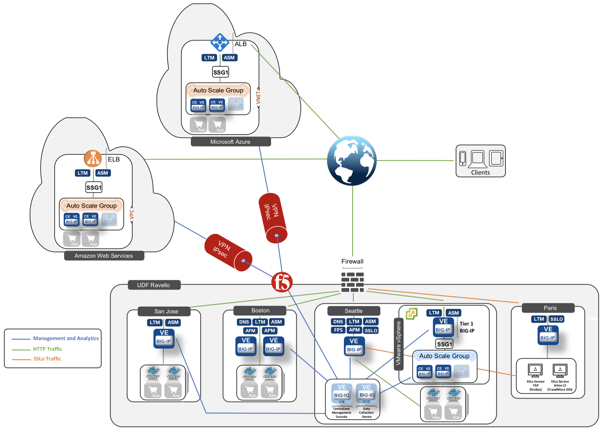

Getting Started
===============

Starting the Lab
----------------

Once you connect to the UDF course portal, you will land on the **Documentation** tab where you can find the link to the lab guide.

Once you have the lab guide open, click on the **Deployment** tab to access the various systems in the lab.

|udf|

.. |udf| image:: /pictures/udf.png
   :scale: 20%

In order to complete this lab, you will find 2 ways to access the different systems in this lab.

1. Going directly to the BIG-IQ CM or BIG-IP TMUI or WEB SHELL/SSH (**RECOMMENDED**).

   To access the BIG-IQ directly, click on the *ACCESS* button under **BIG-IQ CM**
   and select *TMUI*. The credentials to access the BIG-IQ TMUI are ``david/david`` and ``paula/paula`` as directed in the labs.

   |udf_bigiq_tmui|

   To ssh into a system, you can click on *WEB SHELL* or *SSH* (you will need your ssh keys setup in the lab environment for SSH).

   You can also click on *DETAILS* on each component to see the credentials (login/password).

2. From the lab embeded Google Chrome browser.

   In your lab deployment, click on the *ACCESS* button of the **Ubuntu Lamp Server** system and click on
   *Google Chrome*.

   You can also use *XRDP* as an alternative, click on the resolution that works for your laptop. 
   When the RDP session launches showing *Session: Xorg*, simply click *OK*, no credentials are needed.
   Modern laptops with higher resolutions you might want to use 1440x900 and once XRDP is launched Zoom to 200%.

   |
   
   |udf_ubuntu_rdp_vnc|

.. |udf_ubuntu_rdp_vnc| image:: /pictures/udf_ubuntu_rdp_vnc.png
   :scale: 40%

.. |udf_bigiq_tmui| image:: /pictures/udf_bigiq_tmui.png
   :scale: 40%

BIG-IQ User Interface
---------------------

Once you connect to BIG-IQ, you can navigate in the following tabs:

- **Applications** - Application Management (Legacy, AS3) and Cloud Environment
- **System** - Manage all aspects for BIG-IQ and DCDs.
- **Devices** - Discover, Import, Create, Onboard (DO) and Manage BIG-IP devices.
- **Deployment** - Manage evaluation task and deployment for Configuration Management (none AS3)
- **Configuration** - ADC and Security Object Management (ASM, AFM, APM, DDOS, SSLo config/monitoring)
- **Monitoring** - Event collection per device, statistics monitoring, iHealth reporting integration, alerting, and audit logging.

|welcomebigiq|

.. |welcomebigiq| image:: /pictures/welcomebigiq.png
   :scale: 40%

Manage SSH Keys
---------------

.. note:: You can also use the **Web Shell** to get to the system's terminals of this lab *(if you use the Web Shell, login as f5student first: su - f5student)*

1. Generate Key pair

If you do not have an existing key pair that you wish to use for access to UDF components, you'll need to generate a new public / private key pair. 
On OSX or Linux, this can be done using the ssh-keygen utility:

``ssh-keygen -t rsa -b 4096``

Follow the prompts to specify the location where the public and private keys will be stored, and to specify a passphrase (if desired).

2. Configure SSH Client

Configure your SSH client to use your private key to authenticate when connecting to the UDF SSH endpoint. 
How to configure this will differ based on which client you use. Please refer to your client's documentation for detail.

3. Add Public Key to UDF

Log in to the UDF, under **Tools**, click on the link **Manage SSH Keys**.

Enter your public SSH key (typically generated with a .pub extension) and a name for it, then select Save.

4. Connect via SSH

You'll find the URL and port on your component's Access Methods tab. It should look similar to this:

|udfssh|

.. |udfssh| image:: /pictures/udf_ssh.png
   :scale: 40%

- If using OSX or Linux, you can paste this command directly into your terminal.
- If using Windows, you'll use the noted URL and port to configure a PuTTY session.

.. note:: Depending on your SSH configuration, you may additionally need to specify which public key to send. The UDF SSH handler only attempts to validate the first key sent.

SCP is similar to the above. The example below is from OSX. Note that the default SCP version on OSX uses -P instead of -p to specify port:

``scp -P 47000 ubuntu-16.04.2-server-amd64.iso 2ac1868c-8e44-46af-bc66-af5f8e58c282.access.udf.f5.com:/shared/images``

API Rest Client in Visual Studio Code
-------------------------------------

In case you need to use an API Rest Client for this lab, follow |location_link_vscode_restclient| to use the **REST Client for Visual Studio Code**.

.. |location_link_vscode_restclient| raw:: html

   <a href="/training/community/big-iq-cloud-edition/html/vscode_restclient.html" target="_blank">instructions</a>

Lab Diagram
-----------

List of instances & Credentials
-------------------------------

The following table lists the virtual appliances in the lab along with their credentials to use.

+-------------------------+---------+----------------------------------------------------------------------------------------------+---------------------------------+
| System                  | Version | Description                                                                                  | Credentials                     |
+=========================+=========+==============================================================================================+=================================+
| BIG-IQ CM               | 8.1.0.1 | Using BIG-IQ, you can centrally manage your BIG-IP devices,                                  | - admin/purple123 *(local)*     |
| 10.1.1.4                |         | performing operations such as backups, licensing, monitoring,                                | - david/david *(RadiusServer)*  |
|                         |         | and configuration management.                                                                | - paula/paula *(RadiusServer)*  |
|                         |         |                                                                                              | - paul/paul *(RadiusServer)*    |
|                         |         |                                                                                              | - olivia/olivia *(RadiusServer)*|
|                         |         |                                                                                              | - larry/larry *(RadiusServer)*  |
+-------------------------+---------+----------------------------------------------------------------------------------------------+---------------------------------+
| BIG-IQ DCD              | 8.1.0.1 | A data collection device (**DCD**) is a specially provisioned                                | admin/purple123                 |
| 10.1.1.6                |         | BIG-IQ system that you use to manage and store alerts, events,                               |                                 |
|                         |         | and statistical data from one or more BIG-IP systems.                                        |                                 |
+-------------------------+---------+----------------------------------------------------------------------------------------------+---------------------------------+
| BIG-IP Boston           | 16.1    | HA Pair                                                                                      | admin/purple123                 |
| 10.1.1.8/10.1.1.10      |         |                                                                                              |                                 |
+-------------------------+---------+----------------------------------------------------------------------------------------------+---------------------------------+
| BIG-IP Seattle          | 14.1    | Standalone                                                                                   | admin/purple123                 |
| 10.1.1.7                |         |                                                                                              |                                 |
+-------------------------+---------+----------------------------------------------------------------------------------------------+---------------------------------+
| BIG-IP Paris            | 14.1    | Standalone                                                                                   | admin/purple123                 |
| 10.1.1.13               |         |                                                                                              |                                 |
+-------------------------+---------+----------------------------------------------------------------------------------------------+---------------------------------+
| BIG-IP San Jose         | 15.1    | Standalone                                                                                   | admin/purple123                 |
| 10.1.1.11               |         |                                                                                              |                                 |
+-------------------------+---------+----------------------------------------------------------------------------------------------+---------------------------------+
| SSLo Service TAP and L3 |         | Maximize infrastructure investments, efficiencies,                                           | ubuntu/purple123                |
| 10.1.1.14/10.1.1.16     |         | and security with dynamic, policy-based decryption,                                          |                                 |
|                         |         | encryption, and traffic steering through multiple inspection devices.                        |                                 |
+-------------------------+---------+----------------------------------------------------------------------------------------------+---------------------------------+
| Venafi Trust Protection | 20.1    | Manages, secures and protects keys and certificates, delivering an enterprise-grade platform | venafi/Purple123\@123           |
| 10.1.1.17               |         | that provides enterprise-wide security, operational efficiency and                           |                                 |
|                         |         | organizational compliance.                                                                   |                                 |
+-------------------------+---------+----------------------------------------------------------------------------------------------+---------------------------------+
| LAMP Server             | 19.04   | - Radius, LDAP, TACAx (auth)                                                                 | f5student/purple123             |
| 10.1.1.5                |         | - xRDP/Google Chrome direct access for User Remote Desktop                                   |                                 |
|                         |         | - AWX/Ansible Tower                                                                          |                                 |
|                         |         | - GitLab                                                                                     |                                 |
|                         |         | - Splunk                                                                                     |                                 |
|                         |         | - Application Servers (Hackazon, dvmw, f5 demo app, arcadia, juice shop)                     |                                 |
|                         |         | - Traffic Generator (HTTP, Access, DNS, Security)                                            |                                 |
|                         |         | - Visual Studio Code                                                                         |                                 |
|                         |         | - Samba                                                                                      |                                 |
+-------------------------+---------+----------------------------------------------------------------------------------------------+---------------------------------+

Networks
--------

- 10.1.1.0/24 Management Network
- 10.1.10.0/24 External Network
- 10.1.20.0/24 Internal Network
- 10.1.30.0/24 SSLo Inline L3 IN Network
- 10.1.40.0/24 SSLo Inline L3 OUT Network
- 10.1.50.0/24 SSLo TAP Network
- 172.17.0.0/16 Docker Internal Network
- 172.100.0.0/16 AWS Internal Network
- 172.200.0.0/16 Azure Internal Network

Application Services already deployed in this lab
-------------------------------------------------

+------------------+-------------------------------------+-------------------------------------------------------------+----------------------+--------------+-------------+
| Applications     | Application Services                | BIG-IQ Template used                                        | IP/WideIP            | Location     | User Access |
+==================+=====================================+=============================================================+======================+==============+=============+
| airport_security | security_site18_seattle             | AS3-F5-HTTPS-WAF-external-url-lb-template-big-iq-default-v2 | 10.1.10.118          | Seattle      | Paula       |
|                  +-------------------------------------+-------------------------------------------------------------+----------------------+--------------+             |
|                  | security_site16_boston              | AS3-F5-HTTP-lb-traffic-capture-template-big-iq-default-v1   | 10.1.10.116          | Boston       |             |
|                  +-------------------------------------+-------------------------------------------------------------+----------------------+--------------+             |
|                  | security_fqdn                       | AS3-F5-DNS-FADING-A-type-template-big-iq-default-v1         | airports.example.com | Boston       |             |
+------------------+-------------------------------------+-------------------------------------------------------------+----------------------+--------------+-------------+
| IT_apps          | backend_site24tcp                   | AS3-F5-TCP-lb-built-in-profile-template-big-iq-v1           | 10.1.10.124          | Seattle      | Paula       |
|                  +-------------------------------------+-------------------------------------------------------------+----------------------+--------------+             |
|                  | site36.example.com                  | Legacy App Service (no template used)                       | 10.1.10.136          | Boston       |             |
|                  +-------------------------------------+-------------------------------------------------------------+----------------------+--------------+             |
|                  | media.site42.example.com            | Legacy App Service (no template used)                       | 10.1.10.142          | Seattle      |             |
+------------------+-------------------------------------+-------------------------------------------------------------+----------------------+--------------+-------------+
| finance_apps     | conference_site41https              | without AS3 template using API                              | 10.1.10.141 (https)  | Seattle      | Paul        |
|                  | conference_site41ftp                |                                                             | 10.1.10.141 (ftp)    |              |             |
|                  +-------------------------------------+-------------------------------------------------------------+----------------------+--------------+             |
|                  | mail_site40https                    | without AS3 template using API                              | 10.1.10.140 (https)  | Seattle      |             |
|                  +-------------------------------------+-------------------------------------------------------------+----------------------+--------------+             |
|                  | tax_site17access                    | without AS3 template using API                              | 10.1.10.117 (https)  | Seattle      |             |
+------------------+-------------------------------------+-------------------------------------------------------------+----------------------+--------------+-------------+
        
User Roles
----------

+----------------------------+---------------------------------------------------------------+-----------------+--------+
| Role Name                  | AS3 Templates allowed                                         | Devices allowed | Users  |
+============================+===============================================================+=================+========+
| Administrator Role         | All                                                           | All             | david  |
|                            |                                                               |                 | marco  |
+----------------------------+---------------------------------------------------------------+-----------------+--------+
| Security Manager           | All                                                           | All             | larry  |
|                            |                                                               |                 | chris  |
+----------------------------+---------------------------------------------------------------+-----------------+--------+
| Application Creator AS3    | Allow using AS3 without Template                              | All             | olivia |
+----------------------------+---------------------------------------------------------------+-----------------+--------+
| Application Creator Cloud  | - AS3-F5-HTTP-lb-template-big-iq-default-v1                   | All             | paul   |
|                            | - AS3-F5-TCP-lb-template-big-iq-default-v2                    |                 |        |
|                            | - AS3-F5-HTTPS-WAF-existing-lb-template-big-iq-default-v1     |                 |        |
+----------------------------+---------------------------------------------------------------+-----------------+--------+
| Application Creator VMware | - AS3-F5-DNS-FQDN-A-type-template-big-iq-default-v1           | Boston BIG-IPs  | paula  |
|                            | - AS3-F5-HTTP-lb-template-big-iq-default-v1                   | Seattle BIG-IP  |        |
|                            | - AS3-F5-HTTP-lb-traffic-capture-template-big-iq-default-v1   |                 |        |
|                            | - AS3-F5-HTTPS-WAF-external-url-lb-template-big-iq-default-v2 |                 |        |
|                            | - AS3-F5-FastL4-TCP-lb-template-default-v2                    |                 |        |
|                            | - AS3-F5-TCP-lb-built-in-profile-template-big-iq-v1           |                 |        |
+----------------------------+---------------------------------------------------------------+-----------------+--------+

Traffic Generation
------------------

The Ubuntu Jumphost in the lab environment has multiple cron jobs (run ``crontab -l`` to see all scripts used) that are generating traffic that populates the Monitoring tab 
and Application dashboard in BIG-IQ. Note you can also use `locust.io`_  to generate HTTP traffic toward a specific virtual IP address.

.. _locust.io: ./class3/module1/module1.html#traffic-generation-with-locus-io

Below table shows the list of **Virtual Servers** and *Backend *Web Applications Servers** where various type of traffic
is being sent (check ``crontab`` config for more details).

.. warning:: Make sure the IP address on the external network 10.1.10.0/24 is defined in lab environment on 
             the BIG-IP external interface where you are deploying the application service or VIP.

+---------------------------------------------------------------------------------------------+
| Virtual IP addresses where the traffic generator send traffic to                            |
+================================+============================================================+
| HTTP clean traffic every 5 min | 10.1.10.110-116, 10.1.10.118, 10.1.10.120, 10.1.10.123-142 |
+--------------------------------+------------------------------------------------------------+
| HTTP bad traffic every 3 hours | 10.1.10.110-116, 10.1.10.118, 10.1.10.120, 10.1.10.123-142 |
+--------------------------------+------------------------------------------------------------+
| Access traffic (class 9)       | 10.1.10.117, 10.1.10.119, 10.1.10.121, 10.1.10.222         |
+--------------------------------+------------------------------------------------------------+
| DNS traffic (class 10)         | 10.1.10.203, 10.1.10.204                                   |
+--------------------------------+------------------------------------------------------------+

.. note:: IPs from ``10.1.10.110`` to ``10.1.10.142`` have a corresponding FQDN named from ``site10.example.com`` to ``site42.example.com``.

+-----------------------------------------------------------------------+
| Backend Web Applications Servers                                      |
+=======================================================================+
| 10.1.20.110-123                                                       |
|                                                                       |
| - Port ``21``: ftp-server (ftpuser/ftpuser) on ``10.1.20.110``        |
| - Port ``80``: `hackazon`_ application (test_user/123456)             |
| - Port ``8080``: `web-dvwa`_ application (admin/password)             |
| - Port ``8081``: f5-hello-world application                           |
| - Port ``8082``: f5-demo-httpd application                            |
| - Port ``8083``: nginx application (delay 300ms loss 30% corrupt 30%) |
| - Port ``8084``: `arcadia finance`_ (admin/iloveblue)                 |
| - Port ``8085``: `juice-shop`_ (admin@juice-sh.op/admin123)           |
+-----------------------------------------------------------------------+

.. _hackazon: https://github.com/rapid7/hackazon
.. _web-dvwa: https://hub.docker.com/r/vulnerables/web-dvwa
.. _arcadia finance: https://gitlab.com/MattDierick/arcadia-finance
.. _juice-shop: https://owasp.org/www-project-juice-shop/

Miscellaneous
-------------

To run `Kali Linux`_ Docker Image: ``docker run -t -i kalilinux/kali-rolling /bin/bash`` (run ``apt-get update && apt-get install metasploit-framework -y`` after starting Kali Linux).

.. _Kali Linux: https://en.wikipedia.org/wiki/Kali_Linux

To connect to a docker instance: ``docker exec -i -t <container id or name> /bin/sh``

**3rd party authentication provider available on the Lamp Server:**

+--------+------------------------------------------------------------------------------------------------------------------------------+
| Radius | - ip:port: ``10.1.1.5:1812``                                                                                                 |
|        | - secret: ``default``                                                                                                        |
|        | - Users: https://github.com/f5devcentral/f5-big-iq-lab/tree/develop/lab/radius                                               |
+--------+------------------------------------------------------------------------------------------------------------------------------+
| LDAP   | - ip:port: ``ldap.forumsys.com:389``                                                                                         |
|        | - SSL: ``Disabled``                                                                                                          |
|        | - Bind User Distinguished Name: ``cn=read-only-admin,dc=example,dc=com``                                                     |
|        | - Bind User Password: ``password``                                                                                           |
|        | - User Bind Template: ``uid={username},dc=example,dc=com``                                                                   |
|        | - Root Distinguished Name: ``dc=example,dc=com``                                                                             |
|        | - Group Search Filter: ``(&(objectClass=groupOfUniqueNames)(cn={searchterm}))``                                              |
|        | - Group Membership Filter: ``(&(objectClass=groupOfUniqueNames)(uniqueMember=uid={username},dc=example,dc=com))``            |
|        | - Users: https://www.forumsys.com/tutorials/integration-how-to/ldap/online-ldap-test-server                                  |
+--------+------------------------------------------------------------------------------------------------------------------------------+
| Tacac+ | - ip:port: ``10.1.1.5:49``                                                                                                   |
|        | - secret: ``ciscotacacskey``                                                                                                 |
|        | - Primary Service: ``shell``                                                                                                 |
|        | - Encrypt: ``yes``                                                                                                           |
|        | - Users: iosadmin/cisco, nxosadmin/cisco                                                                                     |
+--------+------------------------------------------------------------------------------------------------------------------------------+

**Other services available on the Lamp Server:**

+---------------------------+------------------------------------------+
| Google Chrome             | - ip:port 10.1.1.5:6080 https            |
+---------------------------+------------------------------------------+
| XRDP                      | - ip:port 10.1.1.5:3389                  |
+---------------------------+------------------------------------------+
| `Visual Studio Code`_     | - ip:port 10.1.1.5:7001 http             |
+---------------------------+------------------------------------------+
| `AWX (Ansible Tower)`_    | - ip:port 10.1.1.5:9001 http             |
+---------------------------+------------------------------------------+
| `GitLab`_                 | - ip:port 10.1.1.5:7002 http  7022 ssh   |
|                           | - to be started manually following       |
|                           |   instructions in the lab                |
+---------------------------+------------------------------------------+
| `Splunk`_                 | - ip:port 10.1.1.5:8000 https            |
|                           | - HTTP Event Data Collector port 8088    |
+---------------------------+------------------------------------------+
| `Locust`_                 | - ip:port 10.1.1.5:7089 http             |
+---------------------------+------------------------------------------+
| `OWASP Zap Attack Proxy`_ | - ip:port 10.1.1.5:7090/zap http         |
+---------------------------+------------------------------------------+
| Samba                     | - ip:port 10.1.1.5:445                   |
|                           | - User: f5student/purple123              |
|                           | - Domain: ``WORKGROUP``                  |
|                           | - Storage Path: ``//10.1.1.5/dcdbackup`` |
+---------------------------+------------------------------------------+

.. _AWX (Ansible Tower): https://www.ansible.com/products/awx-project/faq
.. _Splunk: https://www.splunk.com
.. _Visual Studio Code: https://github.com/cdr/code-server
.. _GitLab: https://gitlab.com
.. _Locust: https://locust.io
.. _OWASP Zap Attack Proxy: https://www.zaproxy.org/docs/docker/webswing/

Once you are ready to start your BIG-IQ journey, go back to the `BIG-IQ Test Drive Labs`_ and start with the first Hands-On Lab.

If you are not following the BIG-IQ Test Drive labs, there are more labs to look at under `BIG-IQ All Labs`_.

.. _BIG-IQ Test Drive Labs: ./bigiqtestdrive.html#hands-on-labs
.. _BIG-IQ All Labs: ./balllabs.html#hands-on-labs
